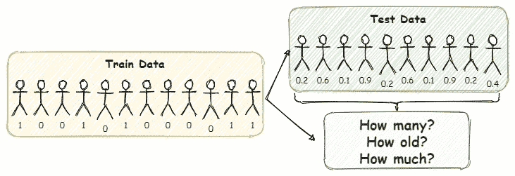
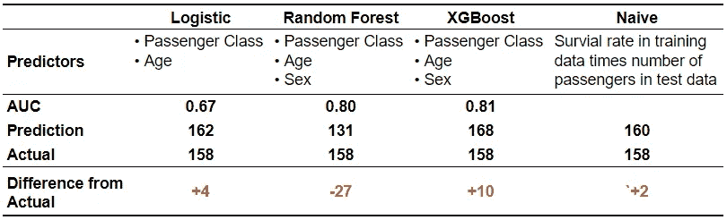
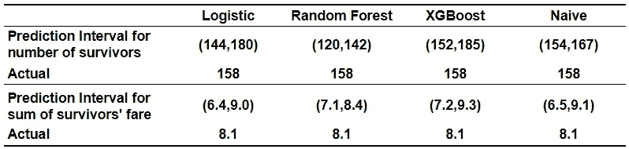
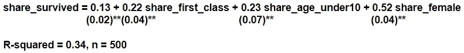

# 我们应该如何聚集分类预测？

> 原文：<https://towardsdatascience.com/how-should-we-aggregate-classification-predictions-2f204e64ede9?source=collection_archive---------29----------------------->

## 如果你必须预测有多少乘客会在泰坦尼克号沉船事故中幸存下来呢？为分类而优化的方法仍然合适吗？

如果你正在读这篇文章，那么你可能正在试图预测谁将在泰坦尼克号沉船事故中幸存。这场 Kaggle 竞赛是机器学习的典型例子，也是任何有抱负的数据科学家的通行权。如果不用预测*谁*会活下来，你只需要预测*会活下来多少*会怎么样？或者，如果你不得不预测幸存者的平均年龄，或者幸存者支付的车费总和会怎么样？

我们应该如何聚集分类预测？

在许多应用中，需要对分类预测进行汇总。例如，客户流失模型可能会生成客户流失的概率，但企业可能会对预计有多少客户流失感兴趣，或者对预计会损失多少收入感兴趣。同样，一个模型可能会给出一个航班延误的概率，但是我们可能想知道有多少航班会延误，或者有多少乘客会受到影响。[洪(2013)](https://www.sciencedirect.com/science/article/abs/pii/S0167947312003568) 列举了从精算评估到保修索赔的多个其他例子。

大多数二元分类算法估计样本属于正类的概率。如果我们将这些概率视为已知值(而不是估计值)，那么阳性病例的数量就是一个具有泊松二项式概率分布的随机变量。(如果概率都相同，分布将是二项式的。)类似地，两个值的随机变量之和(其中一个值为零，另一个值为其他数字，如年龄、收入)分布为广义泊松二项式。在这些假设下，我们可以报告平均值以及预测区间。总之，如果我们有了真实的分类概率，那么我们就可以构建任何总体结果的概率分布(幸存者人数、年龄、收入等)。).

当然，我们从机器学习模型中获得的分类概率只是估计值。因此，将概率视为已知值可能不合适。(本质上，我们在估算这些概率时会忽略抽样误差。)然而，如果我们只对幸存者的总体特征感兴趣，也许我们应该专注于估计描述这些总体特征的概率分布的参数。换句话说，我们应该认识到我们有一个*数值预测*的问题，而不是一个*分类*的问题。

我比较了两种获得泰坦尼克号幸存者总体特征的方法。首先是*分类，然后汇总*。我估计了三种流行的分类模型，然后合计了所得的概率。第二种方法是*一种回归模型*来估计一群乘客的总体特征如何影响幸存的份额。我使用测试和训练数据的许多随机分割来评估每种方法。结论是，当分类概率被聚集时，许多分类模型表现不佳。

## 1.分类和汇总方法

让我们用泰坦尼克号的数据来估计三个不同的分类器。逻辑模型将仅使用年龄和乘客等级作为预测值；随机森林和 XGBoost 也会用性。我在 Kaggle 的训练数据中的 891 名乘客上训练模型。我评估了测试数据中对 418 的预测。(我获得了测试集的标签，以便能够评估我的模型。)

分类算法在总量预测中的性能。

只有年龄和乘客级别作为预测因子的逻辑模型的 AUC 为 0.67。同样使用性别的 Random Forest 和 XGBoost 达到了非常可观的 0.8 左右的 AUC。然而，我们的任务是预测有多少乘客能够生还。我们可以通过合计一名乘客生还的概率来估计这一点。有趣的是，在三个分类器中，尽管 AUC 最低，但 logistic 模型最接近实际存活人数。同样值得注意的是，基于训练数据中幸存者比例的天真估计做得最好。

给定测试集中每个乘客的幸存概率，幸存乘客的数量是一个随机变量分布泊松二项式。这个随机变量的平均值是各个概率的总和。该分布的百分位数可使用由 [Hong (2013)](https://www.sciencedirect.com/science/article/abs/pii/S0167947312003568)) 开发的‘poi bin’R 软件包获得。一个类似的针对 Python 的[包正在开发中。百分位数也可以通过对测试集中的 418 名乘客模拟 10，000 组不同的结果来获得。百分位数可以解释为预测区间，告诉我们幸存者的实际人数将在 95%的概率范围内。](https://github.com/tsakim/poibin)

使用泊松二项式和广义泊松二项式百分位数的预测区间。

基于随机森林概率的时间间隔与幸存者的实际人数相差甚远。值得注意的是，区间的宽度不一定基于个体概率的准确性。相反，它取决于那些个体概率离 0.5 有多远。概率接近 0.9 或 0.1，而不是 0.5，这意味着有多少乘客将幸存下来的不确定性要小得多。这里有一个关于预测可靠性和清晰度的很好的讨论[。](https://agupubs.onlinelibrary.wiley.com/doi/pdf/10.1002/2014WR016617)

虽然幸存者的数量是零/一个随机变量的总和(伯努利试验)，但我们也可能对预测幸存者的其他总体特征感兴趣，例如幸存者支付的总费用。该度量是两个值随机变量的和，其中一个值为零(乘客没有幸存)，另一个值是乘客支付的票价。[张，洪，Balakrishnan (2018)](https://www.tandfonline.com/doi/abs/10.1080/00949655.2018.1440294) 称此和的概率分布为广义泊松二项式。与泊松二项式一样，洪与人合写了一个 R 包，，使得计算概率分布变得简单明了。同样，模拟分布是使用包来计算百分位数的一种替代方法。

## 2.总体回归方法

如果我们只关心幸存者的聚合特征，那么我们真的有一个*数值预测*的问题。对测试集中存活者份额的最简单估计是训练集中存活者的份额——这是上一节中的天真估计。如果测试组和训练组中乘客的特征相同，这种估计可能是无偏的和有效的。如果不是，那么我们需要根据乘客的特征来估计幸存者的比例。

问题是，我们没有数据来估计一群乘客的总体特征如何影响幸存的份额。毕竟泰坦尼克号只撞过一次冰山。也许在客户流失等其他应用中，我们可能每个月都会有新的数据。

在 Titanic 案例中，我通过重新采样原始训练数据集来模拟许多不同的训练数据集。我计算每个模拟数据集的平均特征，以估计这些特征如何影响幸存的份额。然后，我取测试集中乘客的平均特征，并预测有多少人会在测试集中存活下来。有许多不同的方法可以总结总体特征。我用头等舱乘客份额，10 岁以下乘客份额，女性乘客份额。毫不奇怪，有更多妇女、儿童和头等舱乘客的乘客样本有更高的幸存者比例。

使用 500 个模拟训练集对总体乘客特征的幸存份额进行回归的结果。

应用上面的等式来聚合测试数据的特征，我预测 **162** 幸存者相对于实际的 158，预测区间为 151 到 173。因此，回归方法非常有效。

## 3.这两种方法相比如何？

到目前为止，我们只使用一个测试集来评估这两种方法。为了更系统地比较这两种方法，我从原始训练和测试数据集的联合中重新采样，以创建 500 个新的训练和测试数据集。然后，我将这两种方法应用了 500 次，并计算了这 500 个样本中每种方法的均方误差。下图显示了每种方法的相对性能。

使用 500 个随机训练和测试分割对各种聚集预测方法的评估。

在分类模型中，逻辑模型做得最好(具有最低的 MSE)。XGBoost 是比较接近的第二名。兰登森林差远了。总体预测的准确性主要取决于估计概率的准确性。逻辑回归直接估计生存概率。类似地，XGBoost 优化了逻辑损失函数。因此，两者都提供了对概率的合理估计。相比之下，随机森林将概率估计为将示例分类为成功的树的份额。正如 [Olson 和 Wyner (2018)](http://www-stat.wharton.upenn.edu/~maolson/docs/olson.pdf) 所指出的，将该示例归类为成功的树的份额与该示例成功的概率无关。(出于同样的原因，随机森林的校准图往往很差。)虽然随机森林可以提供较高的 AUC，但估计的概率不适合聚合。

在所有方法中，聚合回归模型的 MSE 最低，甚至超过了分类逻辑模型。天真的预测在这个评估中是有缺陷的，因为在测试数据中幸存者的份额并不独立于在训练数据中幸存者的份额。如果我们刚好火车里有很多幸存者，那么测试中的幸存者自然会少一些。即使有这个障碍，天真的预测还是轻松击败了 XGBoost 和 Random Forest。

## 4.结论

如果我们只需要聚集特征，估计和聚集个体分类概率似乎比需要的更麻烦。在许多情况下，训练集中幸存者的比例是测试集中幸存者比例的一个很好的估计。这个月的客户流失率可能是下个月流失率的一个很好的估计。如果我们想*理解*是什么驱动生存或流失，更复杂的模型是值得建立的。当我们的训练数据与测试数据具有非常不同的特征时，以及当这些特征影响生存或流失时，也值得建立更复杂的模型。然而，即使在这些情况下，很明显，当需要数值预测时，使用针对单个分类优化的方法可能不如针对数值预测优化的方法。

你可以在这里找到这张纸条[背后的 R 代码。](https://dvorakt.github.io/business_analytics/aggregating-classification-predictions-v2.html)