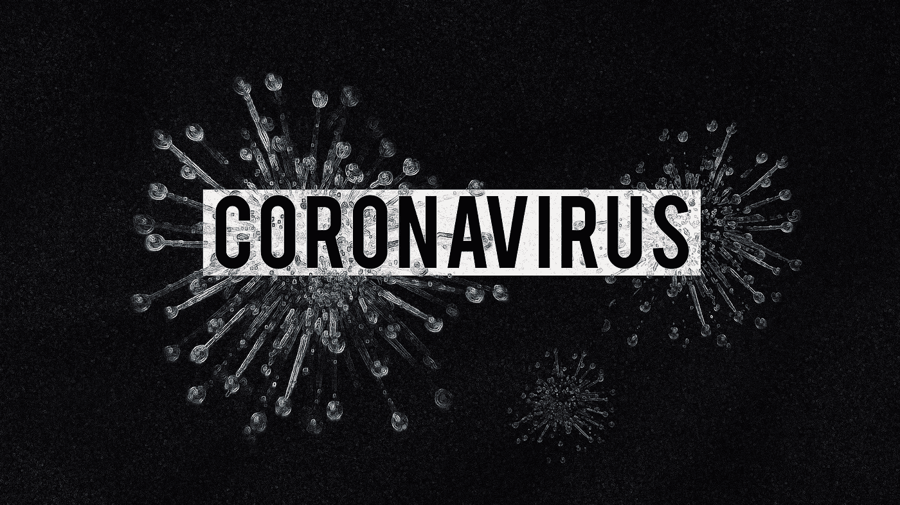
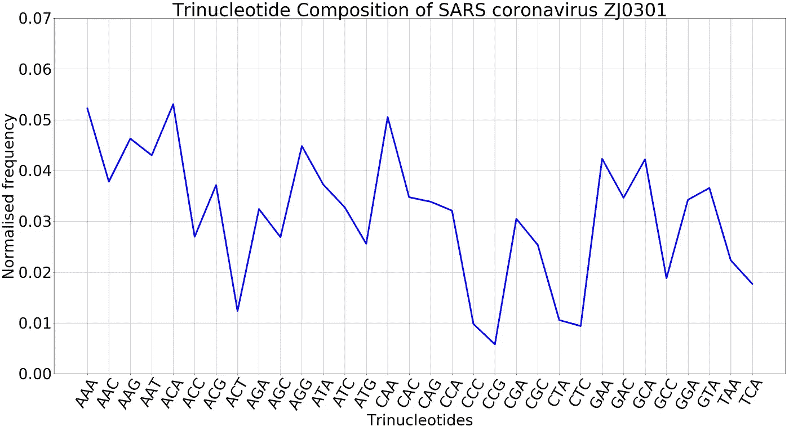
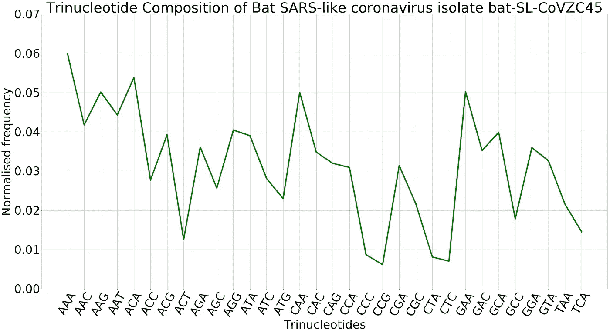
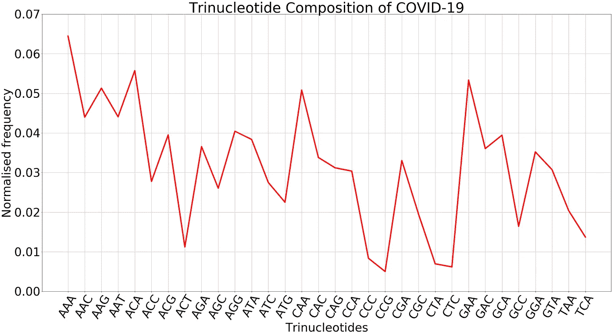
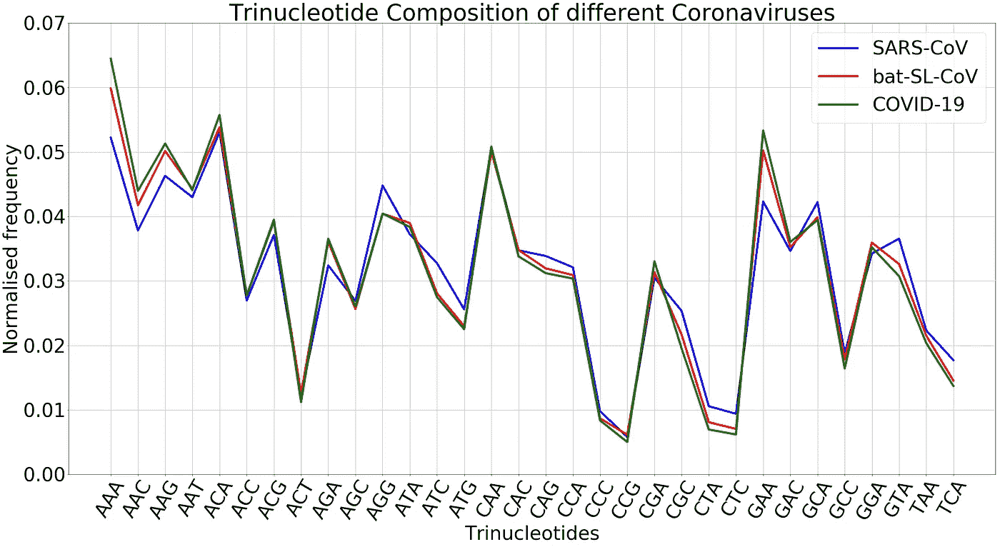
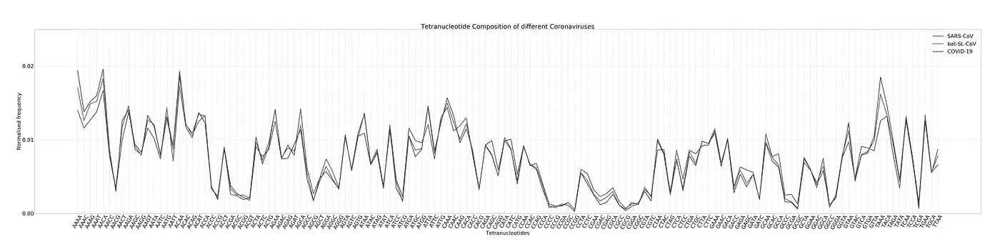
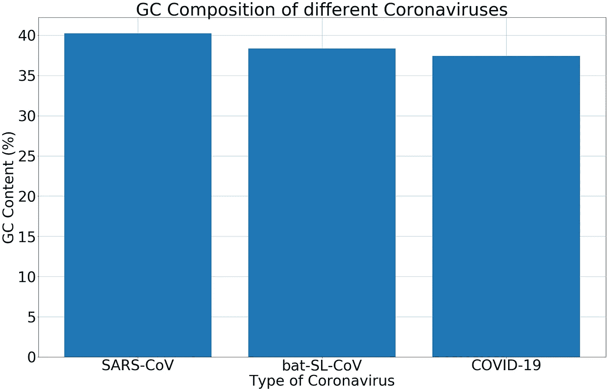
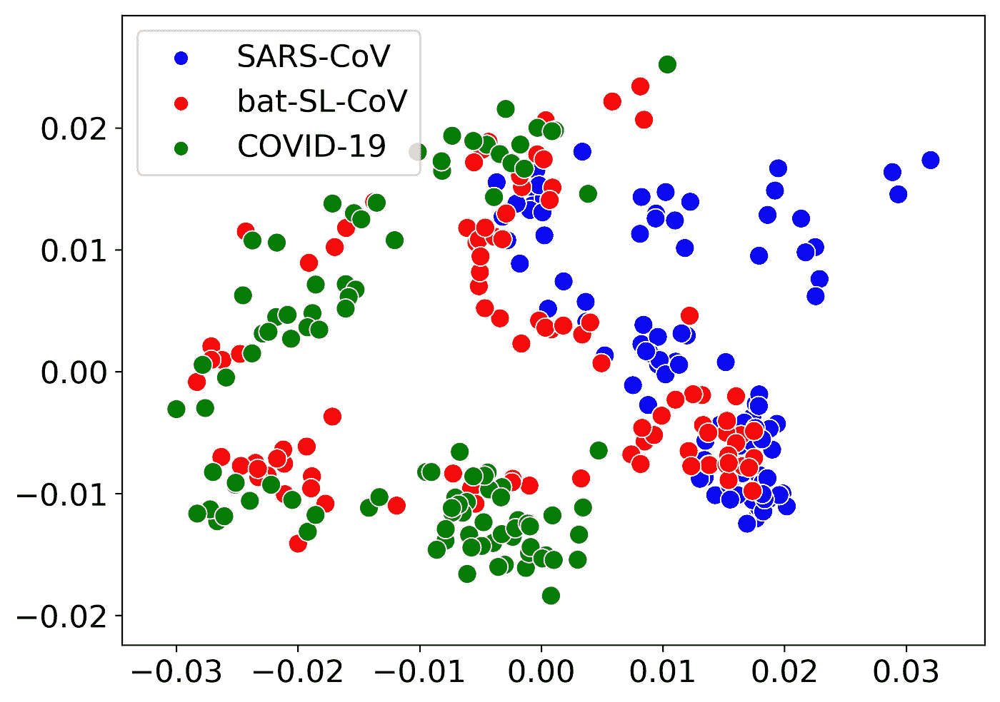
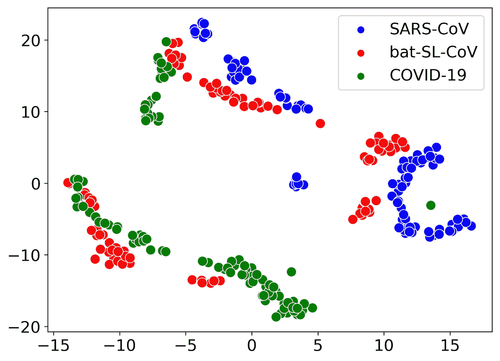

# 新冠肺炎与之前发现的冠状病毒有多相似

> 原文：<https://towardsdatascience.com/how-similar-is-covid-19-to-previously-discovered-coronaviruses-c3d9f25840f7?source=collection_archive---------18----------------------->

## 不同冠状病毒基因组组成谱的简单比较

随着新冠肺炎的基因组数据在国家生物技术信息中心( [NCBI](https://www.ncbi.nlm.nih.gov/) )公开，我想看看 2019 年的新型冠状病毒与其他冠状病毒相比有多相似。在这篇文章中，我将比较新冠肺炎的参考基因组和以前发现的两种不同冠状病毒的参考基因组；一种人类冠状病毒和一种蝙蝠冠状病毒。

***免责声明*** : *本文基于我对 NCBI 上可获得的参考基因组的分析，旨在适应、学习和理解宏基因组组成的概念。这不是任何官方研究的一部分，研究结果也不适合任何形式的决策。*

对于这种分析，我考虑了以下三种冠状病毒基因组。

1.  [SARS 冠状病毒 ZJ0301](https://www.ncbi.nlm.nih.gov/nuccore/DQ182595.1)
2.  [蝙蝠 SARS 样冠状病毒分离株 bat-SL-CoVZC45](https://www.ncbi.nlm.nih.gov/nuccore/MG772933.1)
3.  [新冠肺炎(新型冠状病毒)](https://www.ncbi.nlm.nih.gov/nuccore/1798174254)



图片来自 [Pixabay](https://pixabay.com/?utm_source=link-attribution&utm_medium=referral&utm_campaign=image&utm_content=4923544) 的 [Olga Lionart](https://pixabay.com/users/olgalionart-15570763/?utm_source=link-attribution&utm_medium=referral&utm_campaign=image&utm_content=4923544)

# 考虑的标准

我考虑了一些标准来比较所选冠状病毒的组成。

1.  寡核苷酸组成
2.  GC 含量

## 寡核苷酸组成

**寡核苷酸**被认为是少量核苷酸的连续串。在计算术语中，我们将寡核苷酸定义为 ***k-mers*** (大小为 *k* 的单词)。在这个比较中，我考虑了**三聚体**(又称*三核苷酸*的*三聚体*)及其组成(三核苷酸组成)。有 32 (4 /2)个不同的三聚体。我们通过计算三核苷酸出现的次数并除以三核苷酸的总数来获得每种不同三核苷酸的标准化频率。我们将这些计数标准化，以避免由于序列长度不同而导致的任何不均匀性。

```
Normalised freqeuncy of kᵢ
= Number of occurrences of kᵢ / total number of k-mers
(where kᵢ is the iᵗʰ k-mer)
```

寡核苷酸组成被认为在微生物物种中是保守的，并且在物种之间是变化的[1][2]。

## GC 含量

**GC 含量**(或**鸟嘌呤-胞嘧啶含量**)是序列中不是鸟嘌呤就是胞嘧啶的核苷酸的百分比。

```
GC content = (G + C) / (A + G + C + T) * 100
```

GC 含量也因物种不同而不同[2]。

# 冠状病毒基因组的个体分析

让我们首先单独分析冠状病毒基因组。

## 1.SARS 冠状病毒 ZJ0301



图一。SARS 冠状病毒 ZJ0301 的三核苷酸组成

这是 2003 年发表的中国报道的 SARS 冠状病毒 ZJ0301 的参考基因组[3]。

**出版** : [严重急性呼吸综合征相关冠状病毒基因型及其表征](https://www.ncbi.nlm.nih.gov/pubmed/14527350)和[严重急性呼吸综合征相关冠状病毒基因分型和系统发育的分子生物学分析](https://www.ncbi.nlm.nih.gov/pubmed/14733771)

图 1 显示了 SARS 冠状病毒 ZJ0301 的三核苷酸组成。

## 2.蝙蝠 SARS 样冠状病毒分离株 bat-SL-CoVZC45



图二。蝙蝠 SARS 样冠状病毒分离株 bat-SL-CoVZC45 的三核苷酸组成

这是蝙蝠 SARS 样冠状病毒[4]的参考基因组，该病毒被认为与新冠肺炎病毒非常接近[5]。

**出版物** : [一种新型 SARS 样冠状病毒的基因组特征及其在中国蝙蝠体内的传染性](https://www.tandfonline.com/doi/full/10.1038/s41426-018-0155-5)

图 2 表示蝙蝠 SARS 样冠状病毒的三核苷酸组成。

## 3.新冠肺炎(新型冠状病毒)



图三。新冠肺炎的三核苷酸组成

这是 NCBI 公布的 2019 年新型冠状病毒的最新参考基因组[5]。

*   **生物项目编号** : [PRJNA603194](https://www.ncbi.nlm.nih.gov/bioproject/?term=PRJNA603194)
*   **SRA 数据** : [SRX7636886](https://www.ncbi.nlm.nih.gov/sra/SRX7636886[accn])
*   **出版** : [中国一种与人类呼吸道疾病有关的新型冠状病毒](https://www.nature.com/articles/s41586-020-2008-3)

图 3 显示了新冠肺炎的三核苷酸组成。

# 不同冠状病毒的比较

## 三核苷酸组成

图 1、图 2 和图 3 似乎显示了确切的模式，并且在相同的范围内有所不同，但是如果我们如图 4 所示将它们绘制在一起，我们可以看到一些差异。我们可以观察到，与 SARS-CoV 相比，新冠肺炎和 bat-SL-CoV 显示出非常相似的三核苷酸组成模式(特别是对于三聚体，如 AGG、ATC、ATG、CTA、CTC、GAA 和 GTA)。



图 4。不同冠状病毒的三核苷酸组成

## 四核苷酸组合物

图 5 显示了不同冠状病毒基因组的四核苷酸(四聚体或四聚体)组成模式。可以看到类似于三聚体的趋势(尤其是 ACAA、AGAA、ATAA、CTAA 和 CATC 等四聚体)。



图五。不同冠状病毒的四核苷酸组成

## GC 成分

```
GC content of SARS-CoV:       40.23%
GC content of bat-SL-CoVZC45: 38.35%
GC content of COVID-19:       37.44%
```

根据上面列出的 GC 含量值，我们可以说 bat-SL-CoVZC45 和新冠肺炎的 GC 含量非常相似，约为 37-38%。



图六。不同冠状病毒的 GC 组成

## 主成分分析和 t-SNE 分析

图 7 和图 8 显示了三种冠状病毒基因组中每一种的 100 个长度为 5000 bp 的模拟读数的三核苷酸组成载体的二维 PCA 图和 TSNE 图。您可以看到，在图中，与新冠肺炎(绿点)和 bat-SL-CoV(红点)相对应的一些点比它们与 SARS-CoV(蓝点)的距离更近。



图 7。三种冠状病毒基因组中每一种的 100 个长度为 5000 bp 的读数的三核苷酸组成载体的 PCA 图



图 8。三种冠状病毒基因组中每一种的 100 个长度为 5000 bp 的读数的三核苷酸组成载体的 TSNE 图

# 最后的想法

这篇文章中的发现支持了最近发表的题为[一种与中国人类呼吸系统疾病相关的新型冠状病毒](https://doi.org/10.1038/s41586-020-2008-3)的论文中的说法，作者在论文中表示，他们组装的基因组与蝙蝠 SARS 样冠状病毒分离株**蝙蝠 SL-CoVZC45** 非常接近。自从 2003 年 SARS-CoV 被发现以来，这种新的毒株确实发生了变化。

我添加了一个 jupyter 笔记本，其中包含了本文使用的代码，您可以通过下面的链接随意试用。

为了方便起见，我在笔记本中直接添加了标准化的 3-mer 和 4-mer 计数。如果你想自己算数，可以用一个软件，比如[高棉](https://khmer.readthedocs.io/en/v2.1.1/index.html)或者 [DSK](https://github.com/GATB/dsk) 。

你可以从我以前的文章中读到更多关于人们对新冠肺炎、基因组组装和宏基因组学的看法。

[](/2019-novel-coronavirus-peoples-thoughts-8c06c3caf20e) [## 2019 小说《冠状病毒:人们的想法》

### 使用 Twitter 对 2019 年新型冠状病毒爆发进行简单的情感分析

towardsdatascience.com](/2019-novel-coronavirus-peoples-thoughts-8c06c3caf20e) [](/genome-assembly-the-holy-grail-of-genome-analysis-fae8fc9ef09c) [## 基因组组装——基因组分析的圣杯

### 组装 2019 新型冠状病毒基因组

towardsdatascience.com](/genome-assembly-the-holy-grail-of-genome-analysis-fae8fc9ef09c) [](/metagenomics-who-is-there-and-what-are-they-doing-9f204342eed9) [## 宏基因组学——谁在那里，他们在做什么？

### 深入了解微生物群落的数据

towardsdatascience.com](/metagenomics-who-is-there-and-what-are-they-doing-9f204342eed9) 

我希望你觉得这篇文章很有趣。我很想听听你的想法。

感谢您的阅读！

干杯，大家注意安全！

***编者按:*** [*走向数据科学*](http://towardsdatascience.com/) *是一份以数据科学和机器学习研究为主的中型刊物。我们不是健康专家或流行病学家，本文的观点不应被解释为专业建议。想了解更多关于疫情冠状病毒的信息，可以点击* [*这里*](https://www.who.int/emergencies/diseases/novel-coronavirus-2019/situation-reports) *。*

# 参考

[1]卡林，S. *等*。细菌基因组的组成偏差和进化含义。细菌学杂志，179(12)，3899–3913(1997)。

[2] Dick，G. J. *等*微生物基因组序列签名的社区范围分析。*基因组生物学*，10(8)，R85 (2009)。

[3] L .李等*等*严重急性呼吸综合征相关冠状病毒基因型及其表征。中国医学杂志。116(9):1288–92 (2003).

[4] D. Hu *等*一种新型 SARS 样冠状病毒的基因组特征及其对中国蝙蝠的感染性。*新兴微生物&感染*。第 7 卷第 1 期(2018 年)

[5]吴，赵，俞*等*一种在中国发现的与人类呼吸系统疾病相关的新型冠状病毒。*性质* (2020)。