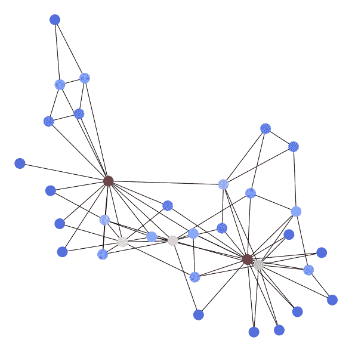
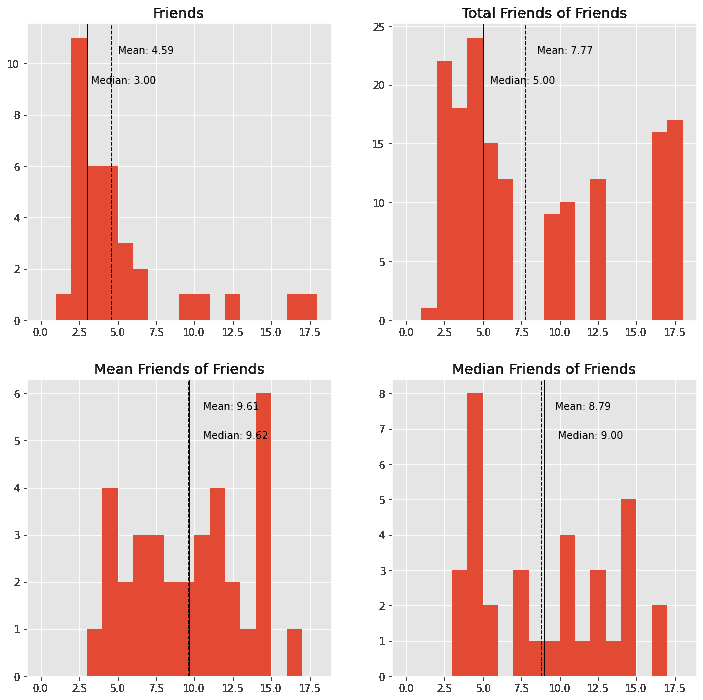
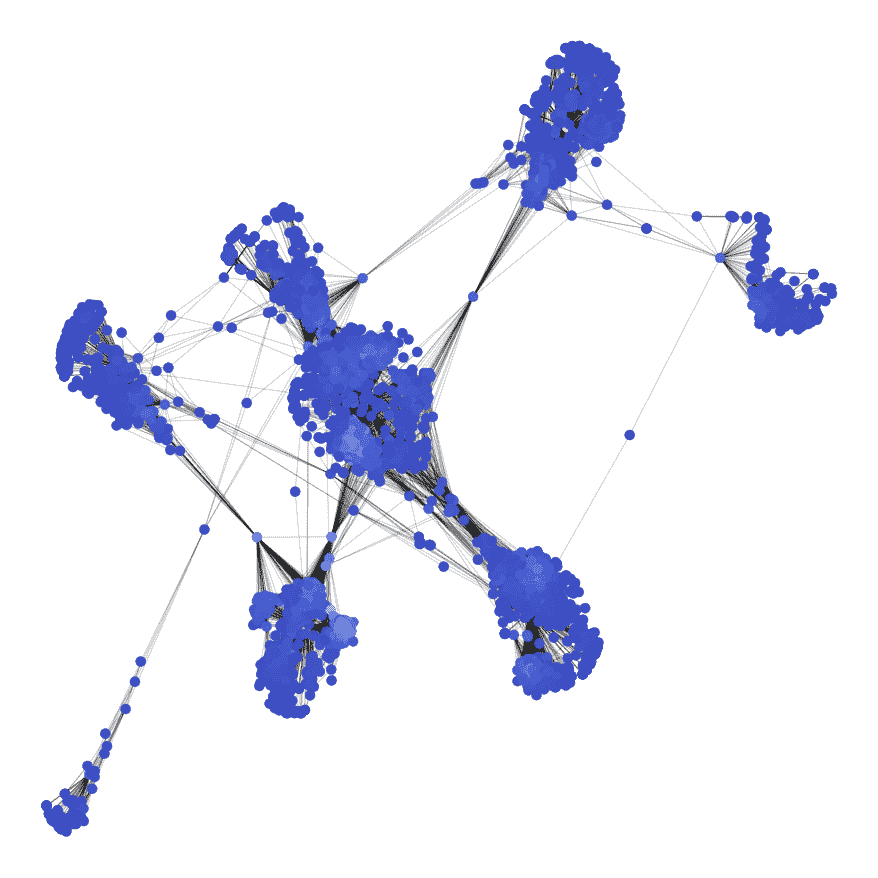
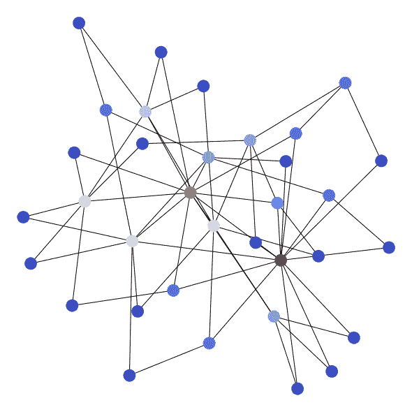
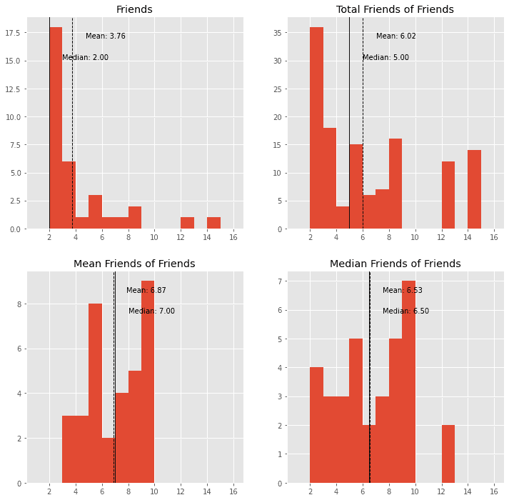
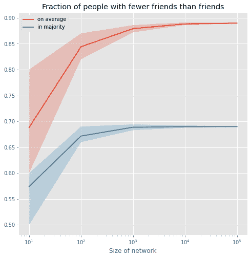
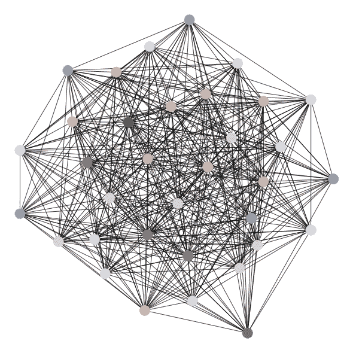
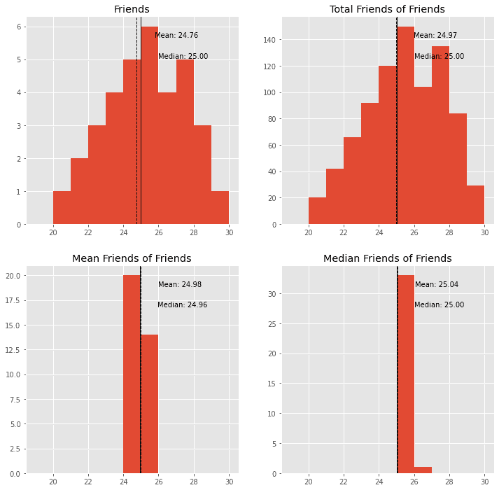

# 模拟社交网络揭示了为什么我没有朋友，也没有空闲时间

> 原文：<https://towardsdatascience.com/how-simulating-social-networks-revealed-why-i-have-no-friends-and-also-no-free-time-a61dec4d677a?source=collection_archive---------50----------------------->

## 友情悖论什么时候真的是悖论？


艾莉娜·格鲁布尼亚克在 [Unsplash](https://unsplash.com?utm_source=medium&utm_medium=referral) 上的照片

[友谊悖论](https://en.wikipedia.org/wiki/Friendship_paradox)是一个观察到的社会现象，平均而言，大多数人的朋友比他们的朋友少。有时人们更强烈地表示，大多数人的朋友比他们的大多数朋友少。从有关该话题的热门文章中，不清楚后一种说法是否普遍属实。我们来调查一下！

我本以为这很难确定，也许这就是为什么直到 1991 年才有人发现它。在斯科特·费尔德的原始论文《为什么你的朋友比你拥有更多的朋友》中，他提出这可能是不满足感的一个来源。但是，我的意思是，它不像人们保持他们的朋友的每个朋友的记录，更不用说他们自己的朋友的列表，不是吗？这在 1991 年可能是真的，但现在在脸书时代，我们可以轻松做到这一点——可能很多人都这样做。

# 我的书里有多少张脸

事实上，为什么不呢，我要试一试。我在脸书有 374 个朋友。我不确定为什么。不管怎样，让我们随机抽取 10 个朋友，然后数一数他们有多少个朋友。统计如下:

```
Friend 1 - 522
Friend 2 - 451 
Friend 3 - 735
Friend 4 - 397
Friend 5 - 2074
Friend 6 - 534
Friend 7 - 3607
Friend 8 - 237
Friend 9 - 1171
Friend 10 - 690
```

这些朋友的平均好友数量是 **1042** 。所以平均来说，我的朋友比我的朋友少。此外，在这 10 个朋友中，我的朋友比其他人都少，除了其中一个——第 8 个可怜的朋友。

好吧，但这不是一个悖论——尤其是如果你了解我的话。我们看看我网络中的其他人怎么样，比如朋友 2。朋友 2 有 451 个朋友，因为脸书是一个非常安全的网站，自然会保护用户的隐私，所以我们可以点击朋友 2 的朋友的个人资料，看看他们有多少朋友。朋友 2 的 10 个随机好友拥有的好友数量为: **790** 、 **928** 、 **383** 、 **73** 、 **827** 、 **1633** 、 **202** 、 **457** 、 **860** 和**121**朋友 2 的朋友平均有 627 个好友，比 451 个多。此外，这些朋友中的六个有超过 451 个朋友，所以朋友 2 的朋友也比他们的大多数朋友少。如果我们对我所有的朋友重复这个练习，我们仍然会发现大多数人的朋友比他们的朋友少，尽管大多数人已经比我有更多的朋友了！****

你可能有一种直觉，这是自相矛盾的。我对为什么感觉矛盾的直觉来自下面的类比。考虑你的身高。也许你比一般人矮。也许你有一些朋友也比一般人矮。但是，你期望发现至少一半的人实际上比平均水平高。那毕竟是一种“平均”的直觉。那么，为什么朋友之间不是这样呢？也就是说，尽管我和朋友 2 的朋友比我们的朋友少，但是那些有很多朋友的人的朋友肯定比他们的朋友多。这是真的，但是这些受欢迎的人极其罕见，那就是比如好友数和身高的区别。

在一个典型的社交网络中，有很多朋友很少的人，也有少数朋友很多的人。很红的人，在很多人的朋友圈都算。而且，冷门的人在很多朋友圈都不算。再以我的脸书友谊为例。显然，我没有几个脸书朋友。所以，看起来很多人比我有更多的朋友。但是——这里是最重要的一点——那些人不太可能把我和我为数不多的朋友算在他们的朋友圈里。朋友 2 和我只有 2 个共同的朋友就证明了这一点。所以朋友 2 的所有朋友，当他们去数他们自己朋友的朋友数量时，不会让我和我的低朋友数使分布偏向他们。

# 这就是“空手道小子”如此不合群的原因吗？

让我们看一些更小的例子，在这些例子中，我们可以计算网络中的每个人和他们的朋友。最著名的社交网络(至少对网络理论家来说)是扎卡里的空手道俱乐部。看起来是这样的。



*扎卡里的空手道俱乐部。节点颜色引导视线，并根据每个人的朋友数量进行标记。*图片作者| [来源](https://gist.github.com/csferrie/7171dd427ce6ec141a6f8e5c09813e7e)。

这张照片展示了一个空手道俱乐部中的 34 个人(大约 1970 年)以及他们在课外与谁互动。颜色只是引导眼睛去判断每个成员有多少朋友。你可以看到一个人只有一个朋友，而另一个人却有 17 个！这个图已经太大了，无法手工计算，但是计算机可以遍历网络中的每个节点，计算朋友和朋友的朋友。在扎卡里的空手道俱乐部，我们有，

```
*The fraction of people with fewer friends than their friends have* ***on average*** *is 85.29%.**The fraction of people with fewer friends than* ***most*** *of their friends is 70.59%.*
```



*扎卡里空手道俱乐部的朋友和朋友的朋友直方图。通过查看网络中每个人的每个朋友的朋友来收集数据。那些朋友的分布可以用均值和中位数来概括。对于每个人的每个朋友，这些数字被列表并绘制在下一行。*图片作者| [来源](https://gist.github.com/csferrie/7171dd427ce6ec141a6f8e5c09813e7e)。

上面的直方图详细显示了数据。你可以再次看到有很多朋友的少数人的关键特征。显然，那些少数人会比他们的朋友拥有更多的朋友。但这就是重点——这样的人很少！一旦我们查看“朋友的朋友”的完整分布，我们会发现它明显变平，并且更有可能找到大量的朋友。下面的两个直方图显示了网络中每个人的朋友数量的平均值和中间值。请注意，在这两种情况下，每个人都有大约 9 个朋友。这比网络中的绝大多数人多得多！事实上，34 个人中只有 4 个人有 9 个以上的朋友。

# 去大还是去…实际上我们去多大似乎并不重要

现在让我们回到脸书。这一次，我们将使用从 10 个人那里收集的数据，这些数据将被匿名化并公开。它包括大约 4000 人，这些人在不同的社会圈子里与这 10 个人有联系。社交网络是这样的。



*脸书自我图，显示围绕受欢迎的个人的社区结构和聚类。*图片作者| [来源](https://gist.github.com/csferrie/7171dd427ce6ec141a6f8e5c09813e7e)。

我们也可以计算这个网络的朋友和朋友的朋友。细节是这样的。


*脸书自我图中朋友和朋友的朋友的直方图。通过查看网络中每个人的每个朋友的朋友来收集数据。那些朋友的分布可以用均值和中位数来概括。对于每个人的每个朋友，这些数字被列表并绘制在下一行。*图片作者| [来源](https://gist.github.com/csferrie/7171dd427ce6ec141a6f8e5c09813e7e)。

总之，我们发现，

```
*The fraction of people with fewer friends than their friends have* ***on average*** *is 87.47%.**The fraction of people with fewer friends than* ***most*** *of their friends is 71.92%.*
```

很像！但也许这只是一个巧合。毕竟只是两个数据点。我们如何为任何社交网络*测试这个想法？模拟！*

# 假装直到你成功

模拟是通过研究事物的比例模型来理解事物的一种工具。风洞中的飞机机翼模型就是一个典型的例子。今天，许多模拟完全是在计算机上完成的。在社交网络的背景下，有许多模型，但出于纯粹的懒惰，我们将选择所谓的[barabási–Albert 模型](https://en.wikipedia.org/wiki/Barab%C3%A1si%E2%80%93Albert_model)，因为它已经在我正在使用的计算机包 [NetworkX](https://networkx.github.io/documentation/stable/reference/generated/networkx.generators.random_graphs.barabasi_albert_graph.html#) 中实现。如果我们创建一个 34 人的模拟社交网络(与空手道俱乐部的人数相同)，它看起来会像这样。



*[*的一个实例巴拉巴希-艾伯特模型*](https://en.wikipedia.org/wiki/Barab%C3%A1si%E2%80%93Albert_model) *上有 34 个节点。它是逐节点构建的，将每个新节点连接到两个先前的节点，并优先选择高度连接的节点。这是一个社交网络的例子。*图片作者| [来源](https://gist.github.com/csferrie/7171dd427ce6ec141a6f8e5c09813e7e)。*

*它看起来和空手道俱乐部没什么不同，是吗？数字数据也很相似。*

**

**上例 barabási–Albert 模型图中朋友和朋友的朋友的直方图。通过查看网络中每个人的每个朋友的朋友来收集数据。那些朋友的分布可以用均值和中位数来概括。对于每个人的每个朋友，这些数字被列表并绘制在下一行。*图片作者| [来源](https://gist.github.com/csferrie/7171dd427ce6ec141a6f8e5c09813e7e)。*

*在这个例子中，感兴趣的数字是，*

```
**The fraction of people with fewer friends than their friends have* ***on average*** *is 79.41%.**The fraction of people with fewer friends than* ***most*** *of their friends is 70.59%.**
```

*这很好，但是模拟的真正魅力在于快速测试多个例子的能力。以上只是一个模拟的社交网络。为了对我们的结论有充分的信心(当然是相对于模型的假设)，我们需要在随机生成的社会网络上进行许多模拟。*

# *模拟所有的图形！*

*如果我们在 34 个人的 10，000 个随机社交网络上重复上述练习，我们发现，*

```
**The fraction of people with fewer friends than their friends have* ***on average*** *is 79.31%.**The fraction of people with fewer friends than* ***most*** *of their friends is 65.31%.**
```

*因此，现在我们可以有把握地说，朋友悖论在任何社交网络中都存在——至少有一个社交网络与有 34 个人的 barabási-Albert 模型具有相同的特征。另一件我们很容易做的事情是改变网络中的人数，看看这种趋势是否会在大型网络中继续。的确，如果我们增加人口，情况会变得更糟。随着社交网络中的人数增加，朋友数量少于朋友数量的人的比例(大多数或平均)也增加了。*

**

**《友谊悖论》展示了 100 多个随机选择的社交网络，它们是用* [*巴拉巴希-阿尔伯特模型*](https://en.wikipedia.org/wiki/Barab%C3%A1si%E2%80%93Albert_model) *创建的，用于增加网络规模。*图片作者| [来源](https://gist.github.com/csferrie/7171dd427ce6ec141a6f8e5c09813e7e)。*

# *酷，酷。有什么不那么令人沮丧的事情要告诉我们吗？*

*[已经表明](https://slate.com/business/2014/01/friendship-paradox-why-are-my-friends-better-off-than-me.html)这种矛盾也不仅限于朋友。当你和你的朋友比较时，你也可能在收入、推特粉丝和你的快乐程度方面有所欠缺——这个事实可能没有帮助。但是，好吧，废话说够了——我们现在都感觉很糟糕！我们肯定能从这一切中收集到一些积极的东西，对吗？是啊！*

*因为你的朋友比你接触的人多，他们很可能会比你先感染病毒——或者通过社区传播的任何东西。事实上，研究人员表明，与其跟踪随机选择的人来判断疾病的传播，不如让这些随机选择的人说出一个朋友的名字，然后跟踪那个朋友，这样效率会高得多！在[研究](https://www.cidrap.umn.edu/news-perspective/2010/09/study-friend-sentinels-provide-early-flu-warning)中，这组朋友比最初选择的人平均提前两周生病。可能还有很多其他的应用等待着被发现来解释友谊悖论。*

*在我们结束之前，我想问最后一个问题:友谊悖论一定会发生在任何社交网络中吗？这个问题的答案是肯定的，也是否定的。对于使用平均值的悖论陈述，答案是肯定的，这可以从数学上得到证明。也就是说，平均而言，人们的朋友数量少于或等于他们朋友的朋友数量的说法对于你能想到的任何社交网络都是成立的。对于使用多数(你的大多数朋友比你有更多的朋友)的说法，答案是否定的。关键因素是受欢迎的个人的存在或不存在。我们甚至可以创建完全随机的社会网络，这种悖论并不成立。考虑以下网络，同样超过 34 人。*

**

**这个网络(来自*[*erdős–rényi 模型*](https://en.wikipedia.org/wiki/Erd%C5%91s%E2%80%93R%C3%A9nyi_model) *)是通过考虑每个人都是其他每个人的朋友而构建的，具有某种固定的概率(在这种情况下为 75%)。*图片作者| [来源](https://gist.github.com/csferrie/7171dd427ce6ec141a6f8e5c09813e7e)。*

*对于我们拥有的这个社交网络，*

```
**The fraction of people with fewer friends than their friends have* ***on average*** *is 44.12%.**The fraction of people with fewer friends than* ***most of*** *their friends is 44.12%.**
```

*从好友的详细分布可以更清楚的看出区别。朋友的数量是平均分布的。这和看人的身高差不多。所以，大约一半人的朋友比他们的朋友少，另一半人的朋友比他们的朋友多，剩下的人的朋友数量和他们朋友的平均数量完全一样。*

**

**上例 erdős–rényi 模型图中的朋友和朋友的朋友的直方图。通过查看网络中每个人的每个朋友的朋友来收集数据。那些朋友的分布可以用均值和中位数来概括。对于每个人的每个朋友，这些数字被列表并绘制在下一行。*图片作者| [来源](https://gist.github.com/csferrie/7171dd427ce6ec141a6f8e5c09813e7e)。*

# *结论*

*当然，有一点应该是显而易见的，如果每个人都有完全相同数量的朋友，那么他们也会有和他们的朋友一样多的朋友！但当朋友的分布更加均匀时，情况也是如此。这说明了什么？我想这让平等主义团体的主张更加可信。但事实似乎是，更多的等级网络(无论是友谊、公司、Twitter 追随者等等。)自然增长，以适应维护大量连接所带来的复杂性。但这是另一篇博文的主题。与此同时，*

****请勿分享这个。而是告诉一个朋友来分享。****

*(本文的所有模拟和数据都可以在下面的 GitHub 上找到。)*