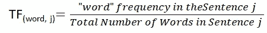
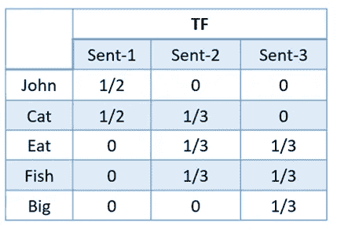

# “Sklearn 的 TF-IDF”与“标准 TF-IDF”

> 原文：<https://towardsdatascience.com/how-sklearns-tf-idf-is-different-from-the-standard-tf-idf-275fa582e73d?source=collection_archive---------14----------------------->

## 让我们来看看与传统的 TF-IDF 相比，Sklearn 的 TF-IDF 的计算方法有何不同，并一步一步地进行分析。

亚历克斯·钱伯斯在 Unsplash 上的照片

这篇文章是在我试图使用标准公式手工计算 TF-IDF 矩阵时受到启发的，在首先计算 TF 和 IDF，然后将两者相乘之后，我意识到，与我在我的样本语料库上用 Scikit-learn 获得的结果相比，有一些不同，在那里我意识到 Scikit-learn 版本与大多数标准和传统版本之间的差异。事不宜迟，我们来了解一下区别。

# TF-IDF 的标准定义是什么？

TF-IDF 定义:*“词频-逆文档频率”，是一种数字统计，旨在反映一个词对集合或语料库中的文档有多重要。*[*【2】*](https://en.wikipedia.org/wiki/Tf%E2%80%93idf)

**目的:**使用 TF-IDF 而不是给定文档中记号出现的原始频率的目的是按比例缩小记号的影响，这些记号在给定语料库中非常频繁地出现，因此在经验上比在一小部分训练语料库中出现的特征信息少。[【1】](https://scikit-learn.org/stable/modules/generated/sklearn.feature_extraction.text.TfidfTransformer.html#sklearn.feature_extraction.text.TfidfTransformer)

**如何计算到它？**

它只是两个重量的乘积，TF 和 IDF 重量:

*   **TF: Term Frequency** 衡量一个术语在一个文档中出现的频率，因为每个文档的长度不同，所以一个术语在长文档中出现的次数可能比短文档多得多。因此，TF 为:

*   **IDF:逆文档频率**衡量一个术语的重要性。在 TF 中，所有术语都被认为是同等重要的。因此，我们需要通过计算以下各项来降低常用术语的权重，同时提高稀有术语的权重:

> 注意:在 Scikit-learn 中，log 不是以 10 为底的，尽管它是**自然对数**(它有一个底 e，e 是一个无理数和超越数，大约等于 2.718)，

这里，有一个 IDF 实际含义的小例子:这个例子有 4 个术语:(a，船，移动和 mobilegeddon)。

来源:Moz 作者[埃里克·恩格](https://moz.com/community/users/18040)

可以看到，IDF 最高的是最稀有的词(Mobilegeddon)，而词的频率越低，IDF 值就越小。

# Scikit-learn TF-IDF

*现在，Scikit-learn 的* `[***TfidfTransformer***](https://scikit-learn.org/stable/modules/generated/sklearn.feature_extraction.text.TfidfTransformer.html#sklearn.feature_extraction.text.TfidfTransformer)` *和* `[***TfidfVectorizer***](https://scikit-learn.org/stable/modules/generated/sklearn.feature_extraction.text.TfidfVectorizer.html#sklearn.feature_extraction.text.TfidfVectorizer)` *中计算出的 TF-IDF 与标准教科书符号有何细微差别？*

**不同之处**如下:TF 保持不变，而 IDF 不同:IDF 的分子和分母中添加了“某个常数 1”，就好像看到一个额外的文档恰好包含集合中的每个术语一次，这防止了零除法“这是一种更具经验性的方法，而大多数教科书中的标准符号没有常数 1。

现在，让我们尝试将 Scikit learn TF-IDF 一步步应用到下面三个句子组成的语料库中，看看结果:

在文本语料库中，一些单词(例如，英语中的“some”、“a”、“h as”等)如果直接输入到分类器，这些非常频繁的术语将掩盖更罕见但更有趣的术语的频率。因此，使用停用字词删除来删除它们是最好且有效的方法，因为它们携带的关于文档实际内容的信息非常少。

形成来自语料库的所有独特单词的词汇将由这 5 个单词组成:“John”、“Cat”、“Eat”、“Fish”和“Big”。

词汇频率计数

# 术语频率(TF)

让我们从计算 Tf('John '，句子 1)开始

*   **分子:**“约翰”在句子 1 中只出现一次
*   **分母:**句子 1 中的总字数为:{John，cat}=2

TF('约翰'，句子 1) = 1/2

类似地，整个词汇表的 TF 值如下表所示:

结果 TF 表

# 反向文档频率(IDF)

如上所述，IDF 是一个衡量术语重要性的指标。IDF 值是必不可少的，因为仅计算 TF 本身不足以理解单词的重要性。

让我们来计算 IDF(“约翰”):

*   **分子:**句子总数=3
*   **分母:**包含“John”的句子数=1

IDF(' John ')= log((3+1)/(1+1))+1 = 1.69

同样，整个词汇表的 IDF 值如下表所示:

生成的 IDF 表

# 应用(TF X IDF)产品

为第一个向量句子计算的标准化示例

最终的 Tf-IDF 向量表

相同语料库的 Sklearn_TF-IDF 输出

## 标准化步骤

在 Scikit-Learn 中，产生的 TF-IDF 向量然后通过欧几里德范数归一化。这最初是为信息检索(作为搜索引擎结果的排序函数)开发的术语加权方案，在文档分类和聚类中也有很好的用途。[1]

# 摘要

传统的 TF-IDF 和 Scikit-learn 的 TF-IDF 之间的主要区别在于分母和分子中存在酉常数。

标准与 Sklearn TF-idf 结果矩阵

总的来说，这不会改变 TF-IDF 矩阵的向量表示，与标准的相比，词汇将由更高的权重来表示，而在标准的 TF-IDF 表中，相应的值反而被设置得更小。

然而，TF-IDF 的核心原则将保持不变: ***TF-IDF 为不太频繁的词给出更大的值，并且当 IDF 和 TF 值都高时为高*** ，正如我们可以在 cor 中为我们的不太频繁的词确认的那样:{John 和 Big}:对于它们两者，TF-IDF 实现了比 TF-IDF 表中剩余的更高频率的词更大的值。

总的来说，直到 2015 年，与同等重视每个单词的传统单词包方法相比，TF-IDF 一直是为表示文档相关性的单词分配权重的传统方法。t 仍然被积极用于有效地解决 NLP 问题。下面是 Sklearn 实现的代码。

# 参考

[[1]https://sci kit-learn . org/stable/modules/feature _ extraction . html # text-feature-extraction](https://scikit-learn.org/stable/modules/feature_extraction.html#text-feature-extraction)

[2][https://en.wikipedia.org/wiki/Tf%E2%80%93idf](https://en.wikipedia.org/wiki/Tf%E2%80%93idf)

[3]墨子。2020.*逆文档频率和唯一性的重要性*。[在线]可从以下网址获得:https://moz . com/blog/inverse-document-frequency-and-the-importance-of-unique