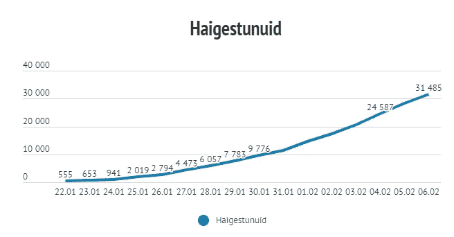
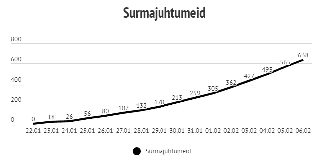
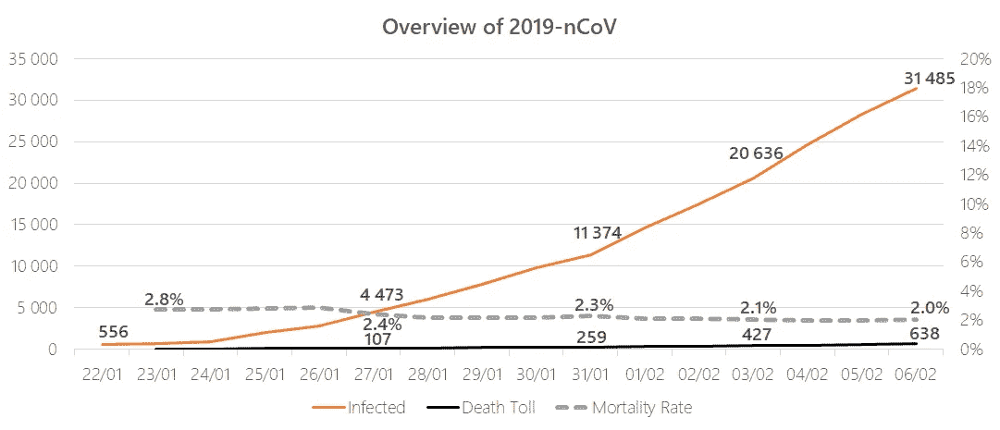

# 小小的修改可以改变故事的视角

> 原文：<https://towardsdatascience.com/how-small-modifications-can-change-the-perspective-of-a-story-eee81723103d?source=collection_archive---------32----------------------->

## 保持图表和图形的简单性对于向更广泛的受众提供正确的视角至关重要。

艾萨克·斯密特在 T2 的照片

我想以一个简短的介绍开始这篇文章，因为这是我在 Medium 上的第一篇文章。我叫 Renee，从事数据工作已超过 11 年。我的主要精力一直放在讲故事和可视化数据上，所以如果我看到一些不能让故事发生的东西，我会忽略它或改进它。正如我们所知，数据是强大的，如果你歪曲了它，你可以创造一个全新的故事，而不是正确的故事。

昨天我在读一篇文章，这篇文章可视化了关于冠状病毒 2019-nCoV 的新闻数据。吸引我眼球的是文章中的以下两张图表:

**图表 1** —全球感染(累计)

来自 Delfi Forte 的图表和数据

**图表 2** —死亡人数(累计)

来自 Delfi Forte 的图表和数据

从本质上来说，它们看起来还不错。他们倾向于讲述不正确的故事。首先是安讯士的。在*图 1* 上，轴从 0–40000 运行，而在*图 2* 上，轴从 0–800 运行。这是一个 50 倍的差异。因此，如果我们比较这样的数字，我们应该总是使用相同的轴值。

为了让这张图表发挥作用，并向读者提供更多信息，我们可以做哪些改进或改变？本质上，有多种方法可以解决这个问题。

**选项 1** —对两个图表使用相同的轴值

**选项 2** —将这些图表合并成一个。你不会浪费宝贵的空间，而且你会对实际发生的事情有更好的了解。

**方案三** — **死亡率**。虽然病毒感染的传播及其死亡人数是有价值的，但它们的比率有更高的影响。这显示了威胁是增加还是减少，以及其行为是否确实发生了变化。在这种情况下，传播信息最有力的图表将包含 3 个指标:感染人数、死亡人数&死亡率。

所以让我们创建**选项 3** 。请注意，我使用的数据与创建上述图表时使用的数据相同，数据截止到 2 月 6 日。

# 我们取得了什么成就？

如果我们看看这个故事，它并不像记者最初在图表中展示的那样糟糕。虽然我们确实看到感染人数增加，特别是自 2 月 1 日以来，死亡率实际上自跟踪开始以来有所下降，从 **2.8%** 下降到 **2.0%** 。像往常一样，我们必须对这些数字持保留态度，因为数字会继续增加，事情会随着时间的推移而改变。作为参考，2019 年非传染性非典型肺炎死亡率低于非典或中东呼吸综合征死亡率(非典**9.6%**；MERS **34.5%** )。

虽然分析部分确实发挥了作用，但本文的主要焦点是视觉视角。我从记者的角度出发，制作了一个图表，展示了更多的信息，每个人都可以根据这些信息做出自己的假设。以前，如果你没有注意到轴的，你会得到一个完全不同的故事，你错过了一个关键组成部分——**死亡率**。

因此，我们清理了图表和数据，添加了额外的信息，只用一张图表来讲述完整的故事。

亲爱的记者们，当你们向更广泛的公众传达信息时，请仔细阅读和使用你们的数据。这些图表可能看起来很酷，但是这些图表很容易误导你的读者，而且不是所有的读者都懂数据。

## 来源:

**数据&图形**—Delfi Forte—https://Forte . Delfi . ee/news/varia/uuenev-kaart-ja-graa fik-米兔-haigusjuhtu-lah tub-uuest-murettekitavast-allikast？id=88770709

**非典**—https://www.who.int/csr/sars/country/table2004_04_21/en/世界卫生组织(世卫组织)

**MERS** —世界卫生组织(世卫组织)—http://applications . emro . who . int/docs/EMROPub-MERS-SEP-2019-en . pdf？ua=1 & ua=1