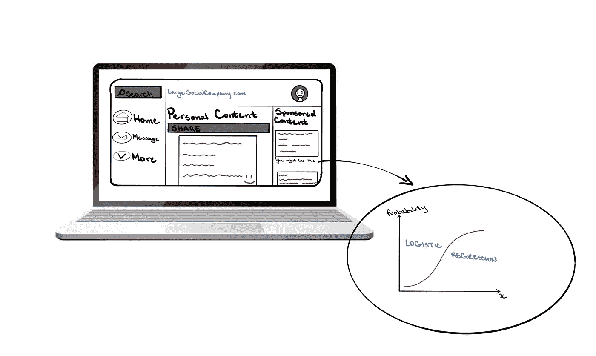
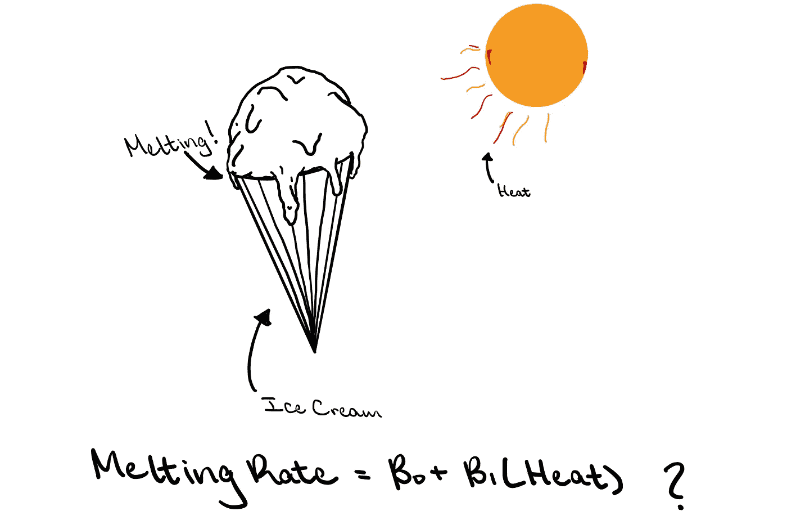
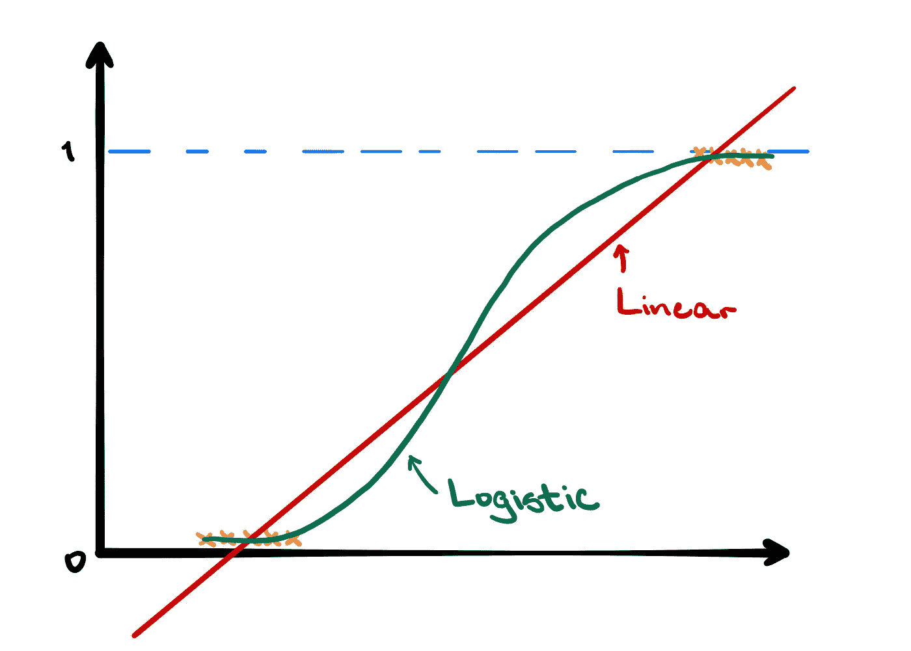

# 社交媒体公司如何知道向你展示什么:你好，逻辑回归！

> 原文：<https://towardsdatascience.com/how-social-media-companies-know-what-to-show-you-hello-logistic-regressions-6f8cf19eaf17?source=collection_archive---------32----------------------->

## 检验为什么逻辑回归比线性回归更适合分类问题

图片作者:特里斯特·约瑟夫

数据科学是否已经接管了世界，这已经不再是一个问题。数据已经成为世界上最有价值的资源之一，以至于大公司内部几乎每一个决策都是由数据严格驱动的。这种对数据的极端使用在有广告和推荐的社交媒体公司或大型平台中尤为明显。这是有道理的，因为该平台的转换率是其业务的支柱。因此，用户看到的每一条内容都应该进行优化，以实现其最大潜力。

例如，当浏览 Instagram 时，有非常强大的机器学习算法在后台运行，以确定用户是否会对某个内容感兴趣。这些算法可以接受各种输入来确定兴趣，这些输入可以包括用户的年龄、用户通常与之交互的内容，甚至用户在 Instagram 上活跃的频率等特征。机器学习算法能够预测这一点的原因是因为这些算法可以找到模式并将其应用于大型数据集。因此，基于在平台庞大的用户群中检测到的各种模式，可以对各种用户子集进行预测。

图片作者:特里斯特·约瑟夫

现在，这种确定用户是否对内容感兴趣的行为被称为分类问题。分类问题指的是根据模型开发的标准将观察值分组到离散的类别中。更广泛地说，这个场景可以被认为是一个回归分析。这是一种寻找因变量与一个或多个自变量之间关系的技术。例如，人们可能会注意到天气越热，冰淇淋融化得越快。在这种情况下，温度是独立变量，冰淇淋融化的速度是因变量。除了温度之外，还有其他因素影响冰淇淋的融化速度。也许由于温度的剧烈变化，冰淇淋最初会融化得更快，但随着一切的液化，最终会融化得更慢。在这种情况下，吃冰淇淋的时间也是一个独立变量。

可以进行不同类型的回归分析，第一种是线性回归。顾名思义，它决定了因变量和自变量之间存在线性关系的程度。如果将线性回归应用于冰淇淋的例子，它将被称为多元线性回归，因为有一个以上的独立变量预测冰淇淋的融化速度。线性回归是一个强大的工具，公司可以使用它来确定用户是否对推广的内容感兴趣。这里，回归的工作是预测用户对内容感兴趣的概率，例如，如果概率超过 70%，则判定规则是用户感兴趣。

图片作者:特里斯特·约瑟夫

然而，使用线性回归来预测这种概率有一个很大的潜在问题。事件的概率是对事件发生的可能性的一种度量，这种度量被限制在 0 和 1 之间(或 0%和 100%)。这意味着，即使整个世界完全确定某个事件将会发生，它现在也不会将该事件的概率增加到 112%。同样，负概率也不存在。但在线性回归下，情况并非如此。由于线性回归的性质，如果使用线性回归，它可能会预测出超出概率范围的值。此外，由于线性回归将“最佳拟合”线应用于数据，大得多(和小得多)的观察值将改变线的斜率；因此，当给定固定的决策规则时，改变分类。

正因为如此，逻辑回归更合适。这是一种回归，其中输出变量是具有两个或更多互斥级别的分类变量。也就是说，输出可以是“感兴趣”对“不感兴趣”，或者“类型 A”对“类型 B”对“类型 C”(其中 A 和 B 与作为基本类型的 C 进行比较)。逻辑回归预测概率，并根据适当的决策规则集分配分类。与线性回归相比，逻辑回归的优势在于其概率输出在概率范围内。这是因为逻辑回归遵循逻辑增长的数学概念。让我们回到冰淇淋问题上来，以便更好地理解这个概念。假设冰淇淋从冰箱里拿出来，放在一个更暖和、温度稳定的环境里。由于温度升高，冰淇淋开始迅速融化，但冰淇淋不会永远融化。相反，它会融化，直到所有的东西都液化，融化的速度将为零(因为它已经停止融化)。根据线性回归，即使冰淇淋已经停止融化，也可能预测到负融化率。

图片作者:特里斯特·约瑟夫

逻辑回归使用连续和离散测量来提供概率和分类观察值的能力使其成为机器学习中非常流行的方法。正如可以预期的，逻辑回归不仅可用于确定用户是否对特定内容感兴趣，也可用于模拟冰淇淋的融化速度。该方法在金融行业用于确定信用卡欺诈，在医疗领域用于识别恶性和良性肿瘤，甚至被电子邮件服务用于检测垃圾邮件。必须注意的是，由于逻辑回归的数学结构，变量的系数不能像线性回归那样直观地解释，它不能直接输出概率。相反，它输出一个事件的对数概率，这个输出可以通过数学变换转换成概率。

回归分析是强大的，但是考虑到手头的问题，利用最合适的分析类型是最重要的。逻辑回归最适用于因变量为二分变量或分类变量的分类问题。所以，下次你在 Instagram 上看到一些推广内容时，想想是什么变量让 Instagram 算法认为你更有可能对它感兴趣，这将是一件有趣的事情。

**参考文献:**

[machinelingmastery . com/logistic-regression-for-machine-learning](https://machinelearningmastery.com/logistic-regression-for-machine-learning/)

[career foundry . com/en/blog/data-analytics/what-is-logistic-regression](https://careerfoundry.com/en/blog/data-analytics/what-is-logistic-regression/)

[towards data science . com/regression-or-class ification-linear-or-logistic-f093e 8757 b9c](/regression-or-classification-linear-or-logistic-f093e8757b9c)

[statistically significant consulting . com/regression analysis . htm](https://www.statisticallysignificantconsulting.com/RegressionAnalysis.htm)

**其他有用的素材:**

[towards data science . com/why-linear-regression-is-not-fitted-for-binary-class ification-c 64457 be 8 e 28](/why-linear-regression-is-not-suitable-for-binary-classification-c64457be8e28)

[saedsayad.com/logistic_regression.htm](https://www.saedsayad.com/logistic_regression.htm)

[stats.idre.ucla.edu/stata/dae/logistic-regression/](https://stats.idre.ucla.edu/stata/dae/logistic-regression/)

[machine learning plus . com/machine-learning/logistic-regression-tutorial-examples-r/](https://www.machinelearningplus.com/machine-learning/logistic-regression-tutorial-examples-r/)