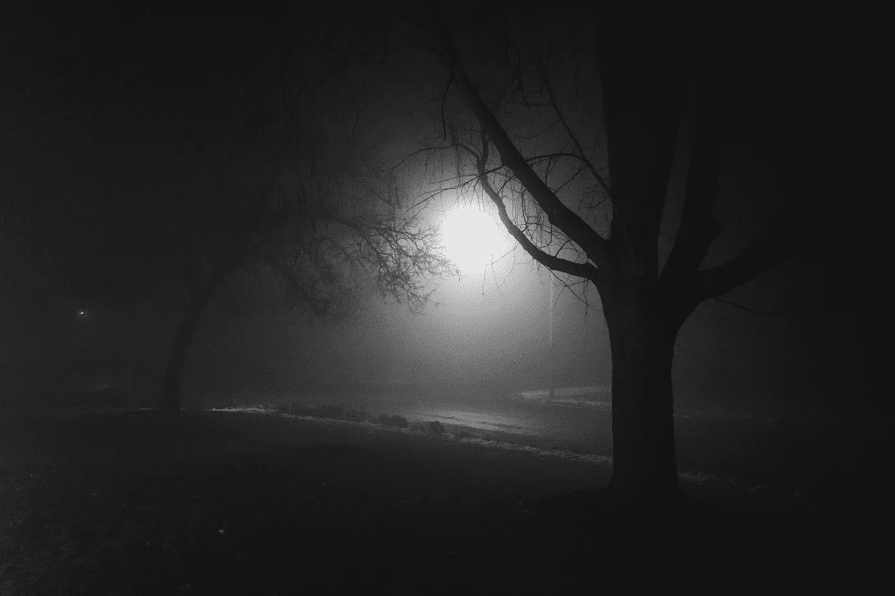
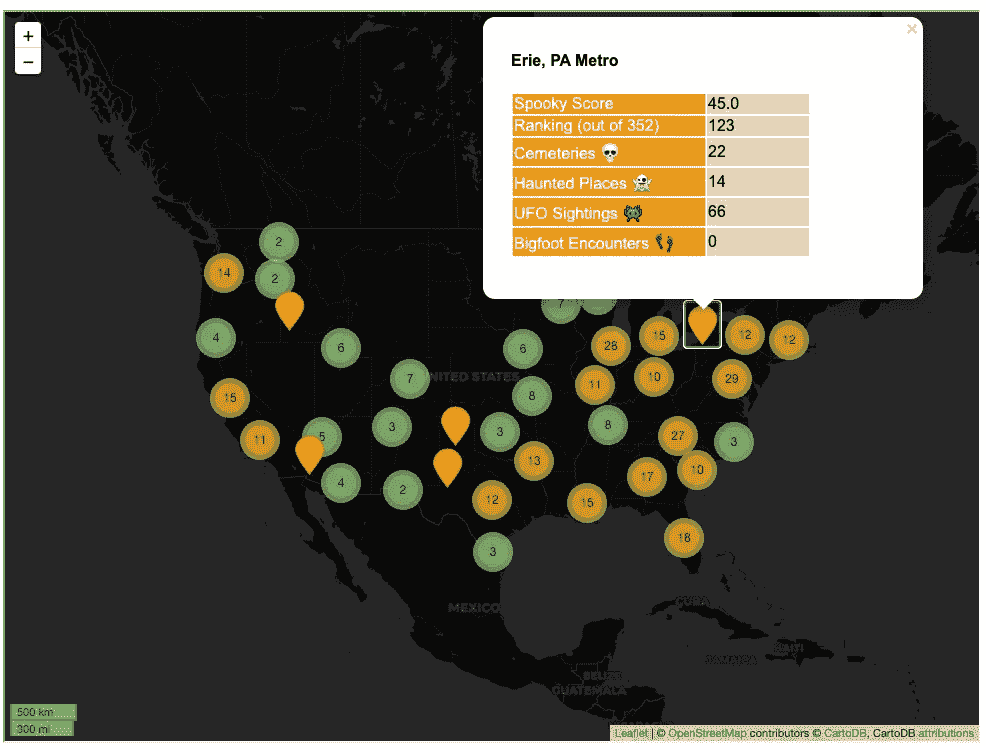
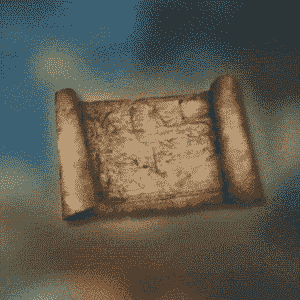
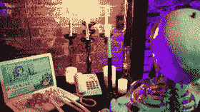
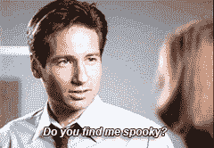
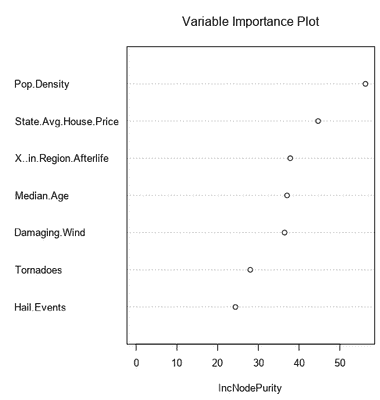
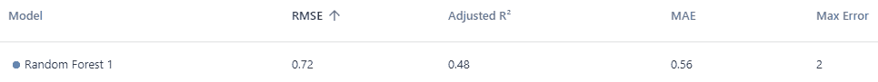
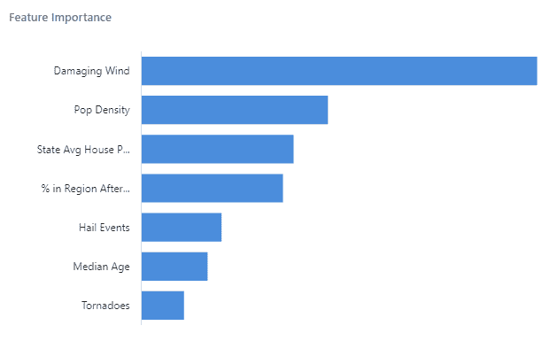

# 你的城市有多恐怖？绘制和预测可怕的东西

> 原文：<https://towardsdatascience.com/how-spooky-is-your-city-mapping-and-predicting-scary-stuff-26b7dea892bd?source=collection_archive---------41----------------------->

## 互动地图和令人毛骨悚然的现象预测建模…为什么不呢？让我们享受一下数据科学的万圣节乐趣。

照片*由* [*加里·穆利曼*](https://unsplash.com/@anakin1814?utm_source=unsplash&utm_medium=referral&utm_content=creditCopyText) *上* [*下*](https://unsplash.com/s/photos/spooky?utm_source=unsplash&utm_medium=referral&utm_content=creditCopyText) *。*

不管你是不是那种寻找幽灵的人，你猜怎么着:你可能住在一些令人毛骨悚然的东西附近。

为了纪念这个季节，我们认为做一些可怕的地图和怪异现象的石化预测会很有趣。数据科学不一定只是针对严肃的学科！我将向您展示我是如何使用 Alteryx Designer、Python 和映射包 follow 来分析和映射这些数据的。

# 美国最诡异的地方(也是最不诡异的地方)

为了了解美国大都市地区有多恐怖，我根据每个大都市地区的墓地和闹鬼地点的密度，以及人均 UFO 目击事件和大脚怪遭遇，为每个地区创建了一个(愚蠢的)恐怖评分。(更多关于下面的数据来源。)

下面的地图显示了 352 个都会区，并在弹出窗口中显示了每个都会区的数据点。(互动版请[访问本网站](https://community.alteryx.com/t5/Data-Science/How-Spooky-is-Your-City-Mapping-and-Predicting-Scary-Stuff/ba-p/657900)。)下面我就告诉你我是怎么用叶子搭建的。

作者图片

> 探索地图，找到你的城市！[点击发微博](https://ctt.ac/X3Nf5)你的小镇有多恐怖。

你的城市进入前 10 名了吗？

## 🏆十大最恐怖的都会区🏆

1.  马萨诸塞州伍斯特
2.  马萨诸塞州普罗维登斯-沃里克
3.  华盛顿-阿灵顿-亚历山大，DC-弗吉尼亚州-马里兰州-西弗吉尼亚州
4.  马萨诸塞州波士顿-剑桥-牛顿
5.  宾夕法尼亚州费城-卡姆登-威尔明顿
6.  纽约-纽瓦克-泽西城，纽约州-新泽西州-宾夕法尼亚州
7.  马萨诸塞州巴恩斯特布尔镇
8.  金斯波特-布里斯托尔-布里斯托尔，田纳西州-弗吉尼亚州
9.  宾夕法尼亚州阿伦敦-伯利恒-伊斯顿
10.  俄亥俄州辛辛那提市

作为一名西海岸居民，看到前 10 名名单明显集中在东部，我有点失望！(俄勒冈州所有的大脚怪目击事件肯定都有意义吧？！)但当你深入研究数据时，这些排名是有意义的。排名前十的地方往往有大量的墓地分布在小的地理区域内。他们有悠久的历史和许多闹鬼的地方，他们有许多 UFO 目击事件(尤其是纽约)。

你有没有从地图上发现你正处于一个可怕的超自然活动的温床？想远离食尸鬼、外星人、大脚怪和幽灵吗？让我们看看在美国什么地方你可以远离令人毛骨悚然的爬行动物。下面的热图——也是用 lyum 构建的——是基于所有怪异的东西的纬度/经度:墓地、闹鬼的地方、大脚怪遭遇和 UFO 目击——所以热图上更强烈的区域有更多这些东西。(互动版请[访问本网站](https://community.alteryx.com/t5/Data-Science/How-Spooky-is-Your-City-Mapping-and-Predicting-Scary-Stuff/ba-p/657900)。)

作者图片

虽然热图最初可能会让你觉得到处都是不祥之兆，但放大后，你会发现一个和平宁静的绿洲供你逃离！

> 你会选择地图上的哪个安静的地方来躲避幽灵、妖精和其他可怕的生物？[点击发布推文](https://ctt.ac/9PS2f)并分享您的目的地。

# 寻找可怕的地方来绘制地图

首先，当然，我需要找到令人毛骨悚然的东西:墓地的位置和细节、[闹鬼的地方](https://data.world/timothyrenner/haunted-places)、 [UFO 目击事件](https://data.world/timothyrenner/ufo-sightings)和[全国各地的大脚遭遇](https://data.world/timothyrenner/bfro-sightings-data)。令人惊讶的是，后三者，包括纬度/经度数据，都是由数据科学家 Timothy Renner 汇编并公开共享的。然而，墓地的位置有点难以找到。我用这些美国人口普查文件[中每个州的著名地标](https://www2.census.gov/geo/tiger/TIGER2019/AREALM/)进行过滤，只识别出墓地，并提取出它们的纬度和经度。

在 Alteryx Designer 中组合这些数据后，我使用其空间工具为每个“鬼地方”创建带纬度/经度的点，包括所有四类令人毛骨悚然的东西。Designer 的 Allocate Input 工具为美国主要大都市地区引入了有用的人口和地理信息，包括表示每个城市物理区域的空间对象。

最终，我想把每个怪异的地方分配到正确的大都市区域。将幽灵点和大都市地区的空间对象插入 Designer 的空间匹配工具，为我完成了所有的工作，并使人口数据加入到这些地方成为可能。

图片来自 [GIPHY](https://gph.is/g/EqX1O6w)

# 构建地图

我使用 Alteryx Designer 中的 Python 工具和包[follow](https://python-visualization.github.io/folium/)构建了这些地图，这是一种将每个城市区域的纬度/经度点放置到地图上并生成热图的超级简单的方法。follow 使用[leafle . js](https://leafletjs.com/)进行交互，但是所有的 JavaScript 都在幕后进行。各种各样的定制选项都是可能的，包括八种不同的免费背景地图，让你的地图有些风格，以及使用工具提示，小地图和表情符号标记的选项。

follow 还允许您使用 HTML 为您的标记制作格式良好的弹出窗口，在这里使用非常有趣。[这个例子](https://www.kaggle.com/dabaker/fancy-folium)展示了一种格式化 HTML 的方法，你可以在下面看到我是如何使用这个选项的。

然后，我将地图设置为从特定位置(美国大陆的中心)开始，使用深色主题，并包含地图比例。此外，因为地图上的 352 个标记会让浏览者不知所措，所以我决定将这些标记聚集起来；当用户放大时，每个聚类扩展成单独的标记。for 循环遍历 dataframe 并生成地图上的点，在我提供的 HTML 中格式化，并将它们添加到要放置在地图上的标记簇中。

我在一个单独的数据文件中也有所有幽灵遭遇和地点的纬度和经度，这就是我用来生成上面的热图的。使用“叶子”创建热图甚至比制作上述基于标记的地图更简单:

您完成的地图可以保存到您指定的文件路径的 HTML 文件中。在 Alteryx Designer 中，我只是将我创建的两个文件路径保存到一个 dataframe 中，并为了方便起见将其写出 Python 工具。无论你用什么方法，只要在浏览器中打开文件就可以享受你的创作了。

根据我在这一点上收集的信息，制作地图既简单又有趣。但是，除了找出美国哪里出现了幽灵，我还想知道:我们能否预测什么会让某个特定的大都市地区变得更加幽灵？

图片来自 [GIPHY](https://gph.is/2yAbItw)

# 添加令人恐惧的功能

还有什么能让一个地区变得更加阴森恐怖？我想到了一些可以在合理的时间内找到公开可用数据的可能因素:

*   可能与超自然“活动”感知有关的恶劣天气现象
*   当地人对超自然现象的看法(如果更多的人相信，也许会有更多的事情发生)？)
*   人口密度(幽灵般的遭遇倾向于发生在人们或多或少分散的区域吗？)
*   当地人的年龄(也许年长或年轻的人口更倾向于看到/报告超自然现象？)
*   房价(也许在或多或少富裕的州，人们倾向于经历更怪异的事情？)

对于恶劣天气数据，我从 NOAA 获取了龙卷风、冰雹和破坏性大风事件的 2018 年[记录](https://www.spc.noaa.gov/wcm/#data)，并在将它们与我更大的数据集匹配之前按州进行了汇编(尽管如果有更多的时间，我可以用 Alteryx Designer 的空间匹配工具将它们都匹配到特定的地铁区域)。

关于美国人对超自然现象的信念的公开数据更难找到；肯定有可用的数据，但大多数需要购买。我最后用了 2018 年的社会综合调查，其中[包含了问题](https://gssdataexplorer.norc.org/variables/300/vshow):“你相信人死后还有生命吗？”在公开的数据中，参与者的回答只标记了九个地理区域中的一个，而不是他们的具体位置，但我至少能够将每个灵异事件与该区域相信来世的人的百分比联系起来。

使用我之前引入的人口普查数据，人口密度很容易计算并作为一个新变量添加进来。该数据还包括大都市地区的平均年龄。对于房价，我使用了 Zillow 公开的[单户住宅销售价格中值数据](https://www.zillow.com/research/data/)，并计算了每个州的平均值。

我没有找到每一个都很理想的数据，但是当然，用不太理想的数据前进是正常的。因此，我们将看看我们是否真的可以用这些数据做任何关于惊吓的预测。

图片来自 [GIPHY](http://gph.is/1nL3DK1)

# 塑造恐怖

诚然，这不是数据科学任务中最“科学”的。但是让我们看看我们能想出什么，只是为了它的愚蠢的惊吓。

预测模型的目标是预测大都市地区的幽灵分数。我选择使用大都会地区的人口密度、该地区对来世的信仰、平均房价、所有单独的天气变量以及大都会地区人口的中位年龄作为预测指标。总的来说，令人毛骨悚然的分数与任何单一变量都没有很强的相关性；与种群密度的最高相关系数为 0.37。

我还在探索性分析中注意到，在幽灵分数中存在强烈的右偏，因此在继续建模之前，我对幽灵分数进行了[对数转换](https://medium.com/@ODSC/transforming-skewed-data-for-machine-learning-90e6cc364b0)，以实现分数的更正态分布。利用 Alteryx 社区上[@ DavidM](https://community.alteryx.com/t5/user/viewprofilepage/user-id/10894)的提示，我还[标准化了](https://towardsai.net/p/data-science/how-when-and-why-should-you-normalize-standardize-rescale-your-data-3f083def38ff)其他预测因子，因为它们的范围变化很大。

我尝试了线性回归、样条和随机森林模型。使用 80/20 训练/测试分割和[模型比较](https://help.alteryx.com/current/designer/model-comparison-tool)工具，我发现随机森林模型表现最好，解释了分数中 58%的差异。该模型提供了 0.56 的 RMSE，以及其预测和实际怪异分数之间 0.79 的相关性。下图显示了模型中特征的相对重要性。

作者图片

我还让 Alteryx Designer 的智能套件的[辅助建模](https://community.alteryx.com/t5/Analytics/One-Click-Modeling-With-Alteryx-Intelligence-Suite/ba-p/614316)功能尝试预测怪异的分数。它使用相同的训练/测试数据，表现最好的模型也是随机森林回归器，RMSE 为 0.72，其预测和实际幽灵得分之间的相关性约为 0.78。但是辅助建模也通知我[调整后的 R 平方](https://www.statisticshowto.com/adjusted-r2/)为 0.48；调整后的 R 平方是另一种相关性度量，它考虑了模型中使用的变量数量，对包含更多变量的模型进行惩罚。

以上三张图片由作者提供

为了加强这种分析，我很想获得更多关于超自然信仰的城市地区级数据，我会花更多时间微调天气和房价数据，而不是使用州汇总。此外，包含以下数据会很酷:1)一个城市建立的年份，以解决随着时间积累的墓地数量(正如在[这篇博客文章/可视化](https://www.joshuastevens.net/blog/graveyards-of-the-contiguous-usa/)中所讨论的)；以及 2)到最近的军事基地和/或机场的距离，以帮助解释 UFO 目击事件(或者会吗？！👽 👽 👽).

因此，这两个建模结果都不是很壮观，但考虑到我们正在建模的内容和数据的不精确程度——嗯，它们还不错，想想这些模型告诉我们关于幽灵的事情很有趣。人口密度较高的地区今天有更多的人，但他们所有的墓地里也有更多的尸体。恶劣的天气事件似乎与灵异事件没有很强的联系(我认为某种天气至少会与 UFO 目击事件相关联，但是没有！).

也许幽灵般的东西终究不是那么容易预测的…它们只是幽灵般的，这就是它们有趣和迷人的地方。神秘继续！👻

*原载于* [*Alteryx 社区*](https://community.alteryx.com/t5/Data-Science/How-Spooky-is-Your-City-Mapping-and-Predicting-Scary-Stuff/ba-p/657900) *并精选于* [*Alteryx 数据科学门户*](http://alteryx.com/data-science) *。*