# Spotify 如何理解您的音乐多样性

> 原文：<https://towardsdatascience.com/how-spotify-understands-your-music-diversity-d3bed2cc3767?source=collection_archive---------34----------------------->

## 推荐系统

## 在 Spotify 测量用户消费多样性，以量化推荐系统的影响

照片由[斯潘塞·因布罗克](https://unsplash.com/@spencerimbrockphoto?utm_source=unsplash&utm_medium=referral&utm_content=creditCopyText)在 [Unsplash](https://unsplash.com/s/photos/music?utm_source=unsplash&utm_medium=referral&utm_content=creditCopyText) 上拍摄

T4:如今，几乎所有的软件产品都缺乏某种形式的个性化。众所周知，这些都是由引擎盖下的推荐算法驱动的，像[网飞](https://research.netflix.com/research-area/recommendations)和 [YouTube](https://static.googleusercontent.com/media/research.google.com/en//pubs/archive/45530.pdf) 这样的服务每年都投入大量资金来优化这些系统。一些应用程序，如[抖音将推荐系统放在中心位置](https://fortune.com/longform/tiktok-app-artificial-intelligence-addictive-bytedance-china/)，以推动应用程序的浏览量和病毒式传播。

Spotify 也不例外。

Spotify 于 2006 年由丹尼尔·埃克(Daniel Ek)和马丁·洛伦佐(Martin Lorentzon)在瑞典创立，目标是创建一个合法的数字音乐平台。目前，Spotify 拥有超过 5000 万首歌曲，来自 1500 多个流派。除此之外，每天还有大约 40，000 首歌曲添加到它的平台上！

截至 2020 年 3 月 31 日，Spotify 每月有 2 . 86 亿活跃用户，其中 1 . 3 亿是全球 79 个市场的付费用户。事实上，Spotify 预计，到 2020 年底，每月活跃用户数量将达到 3.28 亿至 3.48 亿。

鉴于大量的内容和庞大的用户群，Spotify 依靠推荐算法向其用户群推广内容并不奇怪。[推荐算法推动了他们的顶级功能之一，每周发现](https://qz.com/571007/the-magic-that-makes-spotifys-discover-weekly-playlists-so-damn-good/)，它允许用户通过找到与其他用户播放列表的相似性来尝试与他们喜欢的音乐类型相似的音乐。该公司目前正在测试一个[赞助推荐](https://newsroom.spotify.com/2019-10-24/brand-new-music-for-you/)功能，让艺术家团队通过推荐付费来赞助他们的内容。

显然，推荐系统在 Spotify 的内容消费中扮演着非常重要的角色。

然而，这篇文章并不是为 Spotify 唱赞歌。

相反，鉴于大量的内容和用户群，预计用户会有不同的口味。所以问题是:

> Spotify 如何衡量其用户群中的内容多样性？

我们在这篇文章中回答了这个问题！这篇文章中的代码是在[这里](https://github.com/ptuls/movielens-diversity-metric)找到的。

# 什么是用户消费多样性？

如果你是 Spotify 用户，你可以通过 [spotify.me](https://spotify.me/) 找到你音乐消费的一些有趣趋势。例如，你一天中最活跃的收听时间是什么，最喜欢的音乐类型和平均音乐节奏。或者你是否有一个烹饪爱好者的播放列表。

有趣的是，有一个横幅展示了你听过的音乐的多样性。

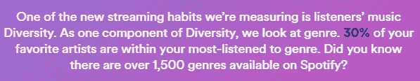

来源:作者的 [spotify.me](https://spotify.me/)

当然，收集流行度和使用统计数据是非常简单的，这些数据可以作为推荐系统的数据。然而，假设我们想要确保给用户的推荐是多样化的。如何衡量多样性？

衡量多样性的两个标准指标是*基尼系数*和*香农熵*。

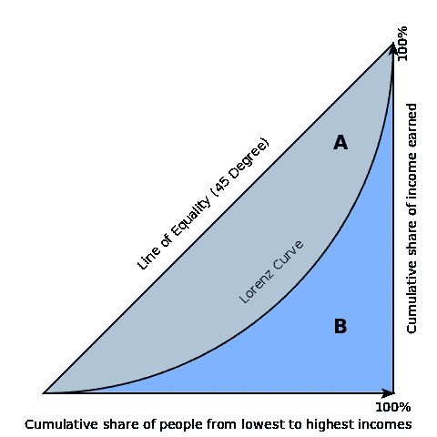

基尼系数图解(来源:[维基百科](https://commons.wikimedia.org/wiki/File:Economics_Gini_coefficient2.svg))

基尼系数源于对社会不平等的经济衡量。通常参照[洛伦兹曲线](https://en.wikipedia.org/wiki/Lorenz_curve)来定义。从图中可以看出，洛伦兹曲线绘制了人口总收入的比例( *y-* 轴)，该比例是由人口中最底层的 *x* 累积所得。45 度线表示收入完全平等。从图中可以看出，基尼系数等于*A*/(*A*+*B*)。由于轴在 0 和 1(包括两端)之间测量，系数也等于 2 *A* 或 1–2*B*，因为等式 *A* + *B* = 0.5(三角形的总面积)成立。在上图中，对于推荐系统，我们可以用“人”来交换用户，用“收入”来交换点击量或其他可取的指标。

香农熵测度是以信息论之父克劳德·香农命名的经典测度。它在 1948 年的开创性论文《沟通的数学理论》中首次提出。它被定义为

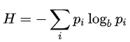

其中 *pᵢ* 是随机变量 *X* 实现 *xᵢ* 的概率。注意，它是为离散随机变量定义的。对数底数通常设置为 *b* =2，以*位*为度量单位。熵将最大化当且仅当每个项目的流行度是独立的，并且按照均匀分布同分布。

这两种方法都有一个主要缺点:**它们没有考虑项目之间的相似性**。

任何做过销售的人都会告诉你，在任何一个系列中，只有一小部分商品是受欢迎的。一个典型的受欢迎程度排名会产生一个类似 Zipfian 的分布，有一个短头、一个长尾和一个远尾。

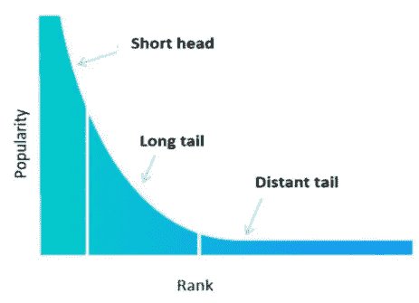

推荐系统面临的项目流行度的典型分布(来源:[论文](https://arxiv.org/pdf/2002.01077.pdf)

大多数数据集中的项目不是独立的，正如这些度量所假设的那样。相反，一个项目和另一个项目之间往往存在关系，因为它们可能属于同一种音乐类型，就像 Spotify 的情况一样。

# 有什么更好的办法？

Spotify 衡量多样性的方法来自于通过使用歌曲嵌入来考虑歌曲之间的相似性。

Spotify 使用 [Word2Vec](https://papers.nips.cc/paper/5021-distributed-representations-of-words-and-phrases-and-their-compositionality.pdf) ，这是一个众所周知的语言模型，它从语料库中学习单词的分布式表示。特别是，Word2Vec 应用于用户播放列表(超过 40 亿个！)来学习用户口味，帮助用户发现适合自己口味的音乐。

还有一些其他优秀的[文章](/using-word2vec-for-music-recommendations-bb9649ac2484)，以及使用 Word2Vec 进行[播放列表](https://github.com/mattdennewitz/playlist-to-vec) [推荐](https://github.com/SimoAntikainen/word2vec-music-recommendation)的实现。下面是使用 [t-SNE](https://lvdmaaten.github.io/tsne/) 将 Spotify 收藏的 10 万首歌曲投影到二维空间时，从 Word2Vec 获得的嵌入图。聚类的存在表明各组歌曲之间存在相似性，主要是由于**音乐流派**的存在。

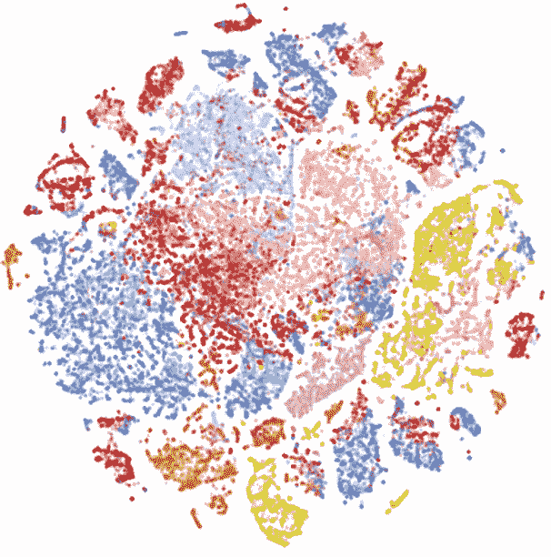

为 Spotify 收藏中的 10 万首歌曲嵌入 t-SNE(来源:[图 1](https://dl.acm.org/doi/abs/10.1145/3366423.3380281)

我们的参考来自一篇研究 Spotify 推荐系统对内容消费的影响的论文。他们将用户 *uᵢ* 在预定义时间段 *T* 内的**多面手-专家(GS)得分**定义为

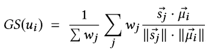

加权中心在哪里

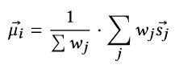

权重 *wⱼ* 是用户在时间段 *T.* 内收听歌曲 *j* 的次数

直觉上，如果用户听非常相似的歌曲，gs 分数将倾向于 1，因为选择更接近加权中心。相反，如果用户是多面手，那么根据余弦相似性的性质，分数将趋向于-1。

# MovieLens 数据集上的多样性

让我们将 GS 分数应用于实际数据集。

我们使用 [Movielens 数据集](https://grouplens.org/datasets/movielens/)，这是一个公开可用的数据集，通常用作推荐系统的基准。这是 Jupyter 笔记本的链接。运行时，笔记本应该下载数据集。

计算 GS 分数的步骤如下:

1.  在用户-电影评级对的预定义时间段上训练 Word2Vec 模型，以获得一组电影嵌入。
2.  对于每个用户，计算中心电影嵌入。
3.  最后，对于用户在该时间段内看过并评级的每部电影，计算用户的多面手-专家得分。

## 关于电影镜头的 Word2Vec 培训

我们首先在 MovieLens 数据集中的所有用户-电影交互上训练我们的 Word2Vec 模型。MovieLens 数据集具有从 1995 年到 2018 年的评级。它拥有 283，228 个独立用户。由于数据集只有少量唯一用户，我们将使用整个数据集。因此，时间段 *T* 从 1995 年跨越到 2018 年。

现在，Word2Vec 是一个**半监督语言模型**，因此定量确定项目(单词)向量的质量可能很困难。通常，Word2Vec 的输出用于另一个任务，比如分类任务，在这个任务中可以很容易地量化模型的质量。在 Spotify 的情况下，这可以通过模型测量推荐歌曲的点击量来实现。度量模型的 [*困惑度*](http://www.cs.columbia.edu/~mcollins/lm-spring2013.pdf) 是量化模型质量的常用方式，但也有其局限性。

注意，我们没有试图优化 Word2Vec 模型的许多超参数。

因为我们的目标是测量多样性，粗略地看一下有助于理解结果。在这里，我们展示了与经典喜剧[窈窕奶爸](https://www.imdb.com/title/tt0107614/)最相似和最不相似的 5 部电影，结果来自训练过的模型。

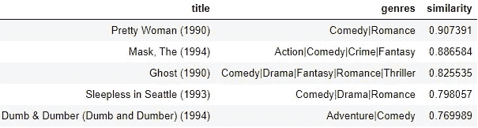

与窈窕奶爸最相似的五部电影

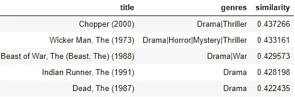

与窈窕奶爸最不相似的五部电影

有趣的是，即使没有向 Word2Vec 提供类型信息，我们也可以看到《窈窕奶爸》与其他喜剧相似，而与戏剧不同。其他电影可以类似地评分，这表明该模型正在**隐含地学习电影类型的概念**。

我们可以在 [Tensorboard](https://www.tensorflow.org/tensorboard) 中使用 t-SNE 来可视化模型中的电影嵌入。我们可以看到电影组，尽管它们不像 Spotify 例子中的歌曲那样紧密聚集。

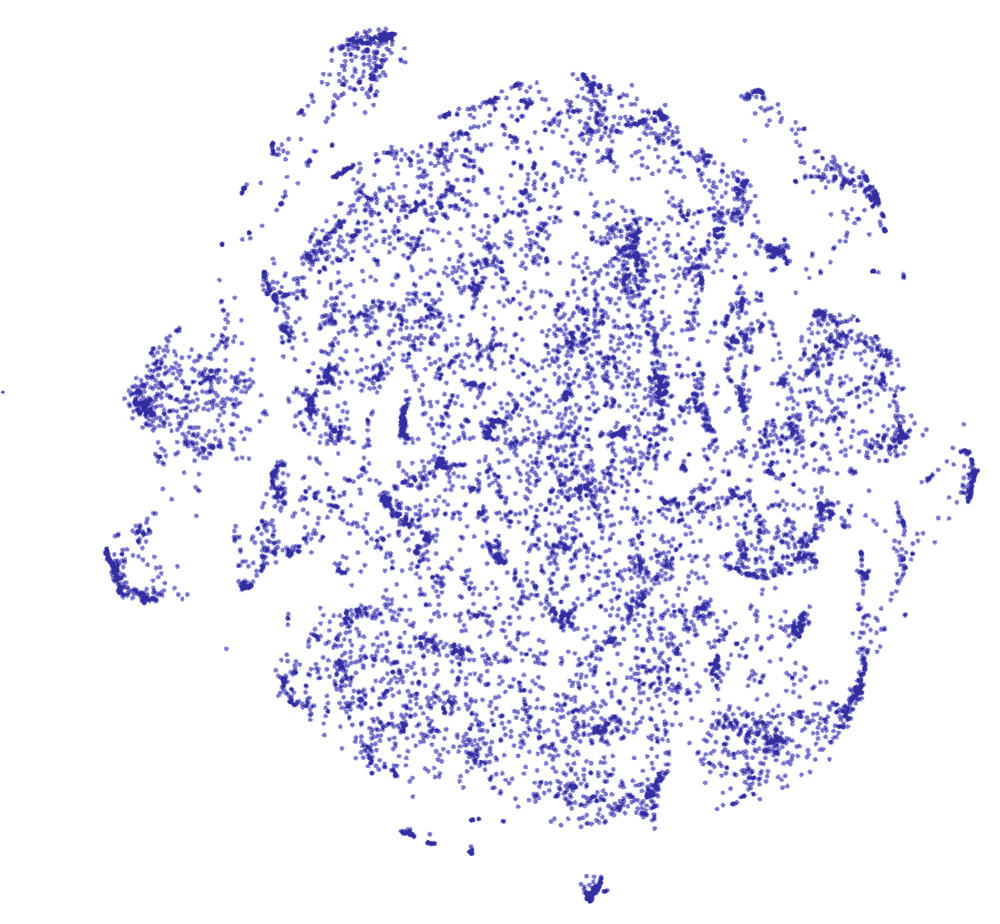

来自训练的 Word2Vec 模型的电影嵌入的 t-SNE

有了训练好的模型，我们进入下一阶段。

## 计算通才-专家分数

在数据集中，每个用户对一部电影的评价值在 1 到 5 之间。所以在我们对 GS 评分的定义中，我们把每个用户对每部电影的**评分**作为权重；这与 Spotify 最初定义中用户听一首歌的次数形成对比。

我们计算 MovieLens 数据集中所有用户的 GS 分数。为了比较，我们还计算了香农熵(使用基数为 2)。

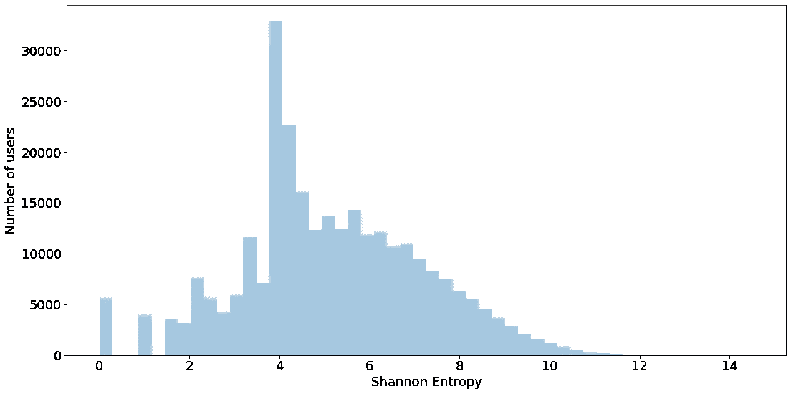

MovieLens 数据集中所有用户的 Shannon 熵

香农熵衡量多样性，但更难解释它的意义。我们可以直截了当地说，有一些用户的熵为零，这意味着他们根本没有多样性，这些用户主要是只观看和评价了一部电影的用户。有许多用户如何观看和评价各种电影，但除此之外没有太多可说的。

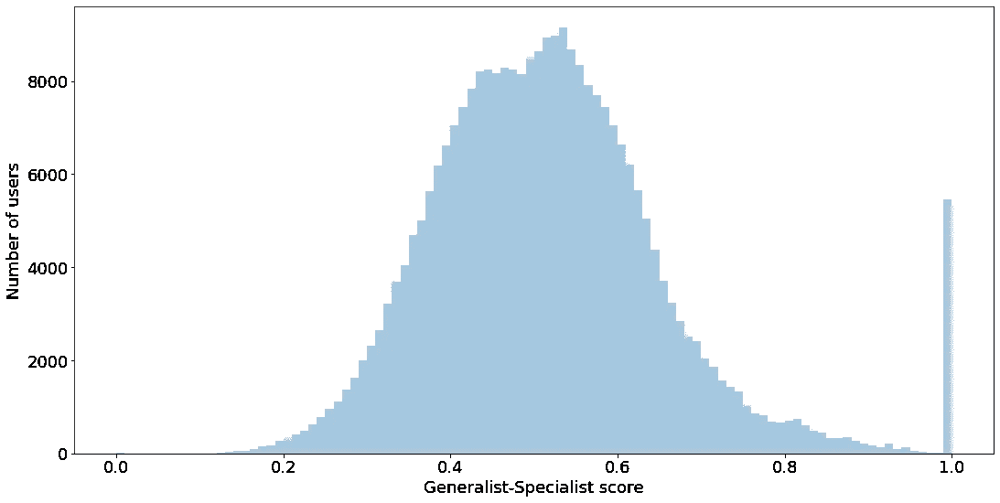

MovieLens 数据集中所有用户的通才-专家分数

这里显示了整个 MovieLens 数据集的 GS 分数。从上面的直方图来看，大多数用户观看和评级的电影范围很广。1.0 bin 的峰值主要是由于只观看和评价了一部电影的**用户。使用我们训练的 Word2Vec 模型，有 857 个用户观看并评价了一部以上 GS 得分在 0.90 以上的电影。**

这两种方法有明显的不同。数据集中的一个例子是一个观看并评价了 140 部电影的用户。用户的香农熵和 GS 分数分别是 7.13 比特和 0.49。这种差异来自于香农熵平等地对待所有电影，而 GS 分数考虑了电影的相似性。它隐含地说明了**电影类型**，因为一个典型的用户只观看少数类型。

在该论文中，随着活动水平的增加，GS 分数趋向于以 0.5 为中心的稳定分布。有趣的是，对于 MovieLens，似乎有来自两个分布的两组用户，导致了图中所示的双峰分布。对此的调查将取决于未来的工作。

# 把一切都绑起来

所有这些背后都有一个简单的原则:

> 项目通常彼此具有相似性。

这是一个基本的假设，如果推荐系统首先要工作的话，这个假设必须成立。Spotify 衡量多样性的方法旨在利用学习模型来挖掘推荐项目本身之间的潜在关系。

如果我们从实施上退一步，步骤是清楚的:

1.  对项目之间的关系建模，以及
2.  将这些关系包括在你的多元化评估中。

通过归纳这些概念，我们可以看到，没有必要使用 Word2Vec 来学习项目之间的关系。Spotify 使用 Word2Vec 的原因是该公司一直在为其推荐系统部署该模型。可以使用替代的无监督语言模型，例如 [GloVe](https://nlp.stanford.edu/projects/glove/) 和 [WordRank](https://www.aclweb.org/anthology/D16-1063.pdf) 。通常最好使用具有较少超参数的模型，因为 Word2Vec 有许多超参数需要优化。

此外，*“*相似性”将由数据科学家根据应用和产品自行决定。例如，如果项目之间存在潜在的图结构关系，那么无论如何，都要使用图模型。如果矩阵分解模型被用于推荐，那么度量可以是从项目子空间获得的向量之间的余弦相似性。

这里一个微妙的假设是，Word2Vec 模型假设用户消费的**顺序**很重要。这对 Spotify 来说当然很重要，因为播放列表是根据用户的心情和一天中的时间来组织的。在您的应用中可能是也可能不是，因此假设数据集的**排列不变性** *即*顺序并不重要的模型反而更合适。

# 最后

我们以一个更哲学的注解结束:

> 推荐系统会将我们的媒体消费从[“点击率的世界转移到利基的世界”](https://www.amazon.com/Long-Tail-Future-Business-Selling/dp/1401309666)吗，或者是一个点击率变得更高的世界吗？

我们希望多样性的措施将有助于我们开发系统，为我们所有人提供更丰富、更新奇的体验。

此作品与[黄楚欣](https://medium.com/u/c24e60cd1bf2?source=post_page-----d3bed2cc3767--------------------------------)合著。你可以点击查看她的[个人主页！](http://chuxinhuang.com/)

[1]双关。

[2] Ashton Anderson，Lucas Maystre，Risabh Mehrota，Ian Anderson，Mounia Lalmas，“算法对 Spotify 上消费多样性的影响”，WWW '20，2020 年 4 月 20-24 日，台湾台北，第 2155-2165 页。