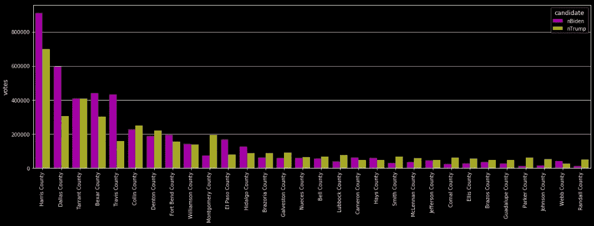

# 德州到底有多容易摇摆？

> 原文：<https://towardsdatascience.com/how-swing-able-is-texas-anyways-83623f0911f3?source=collection_archive---------53----------------------->

## 从统计学上来说，你的投票很重要

在对过去的选举进行了大量的统计反思后，我努力思考“我的选票真的重要吗”这个概念，我想我并不孤单。

图片来源:亚当·托马斯[1]

我知道我不是唯一一个惊讶地看到德克萨斯州被列为谷歌宏中的“摇摆州”的人。怎么可能呢？某种错误？我在德克萨斯上学，让我告诉你，那个地方是一个红色的州。至少感觉是红色的…

然而，我们看到佐治亚州今年摇摆不定，这确实引出了一个问题:还有哪些州会摇摆不定？

让我们以德克萨斯州为例，我希望证明为什么，事实上，你的投票真的很重要，你应该认真对待它(不管我们的政治倾向)。

# 选举到底是什么？

当我写关于弗吉尼亚州的 T2 和宾夕法尼亚州的 T4 时，我指出新闻报道是来自有偏见的样本。现在，当我说“有偏见”时，我并不是说他们错了或者故意误导。我的意思是，由于收集结果的方式(例如，“亲自”投票自然计数更快)，它给出了潜在人口(所有选票的总和)所讲述的故事的不完整画面。

此外，自从我开始写这个小系列以来，我一直在考虑将每个州的[选票作为我统计分析的“目标”。从统计学的角度来说，我把“所有的选票”当作“总体”,我们可以从中“取样”来推断最终的结果。](/calling-elections-early-fake-news-or-statistics-dd2e8cc196c5)

这在数学上是合理的……除了当你提到选票本身实际上是该州人民代表的有偏见的样本。

# 选票计数可能是一种有偏差的抽样技术

民主运作的方式是，我们不假设我们知道人民的意愿是什么。我们问他们。大多数人的意见是我们(某种程度上)赞同的。所以我们建立了整个过程，你可以去投票，告诉政府应该通过什么法律，哪些官员应该任职。但事实是:

> 不是所有人都投票！！！

投票是一个有偏见的抽样过程，因为不是每个人都参与。我们不能假设，既然 75%的民主党人选择不投票，那么正好 75%的共和党人也会这样做。有时一个群体的更多人会出现在投票站。那么这对选举(和民主)会有什么影响呢？

# 德克萨斯摇摆舞？

在本文撰写期间，德克萨斯州已经统计了 98%的选票，唐纳德·特朗普以 60 万张选票的优势赢得了该州(52%对拜登的 46%)。但我很好奇，人们对他们想象中的必然结果的感知会不会真的表现出这种结果？我的意思是:假设这个州在 2020 年计票后会变成红色，这在它最终的“红色”中起了作用吗？

> 有没有一个宇宙存在于德克萨斯实际上转向了…民主党？让我们来看看…

# 按县划分

让我们做一个类似的分析，我们对弗吉尼亚州进行了分析，我们将该州按县进行了划分，以了解德克萨斯在空间上是如何分布的(即[每个县是如何投票的？](https://www.politico.com/2020-election/results/texas/))。首先，我们再次看到，大约 50%的选票来自最大的 5 个县。

作者图片

在弗吉尼亚州，这种分布确保了拜登的胜利(尽管他一度落后 20%)。然而，我们可以看到，最大的县哈里斯不像弗吉尼亚州的费尔法克斯县那样不平衡(支持拜登)。我想知道…

> 拜登的支持者在这些大城市出现的人数不像在弗吉尼亚那样多，是因为他们认为这是一个注定失败的事业吗？德克萨斯州真的会是一个“蓝色州”吗？

# 德克萨斯会是一个蓝色的州吗？

正如我们在伊利诺伊州[的例子中看到的，我们真的不需要超过 1 万张选票就能了解潜在人口的行为。让我们假设人们在这些县的投票方式反映了潜在人口对该县每个候选人的情绪(即哈里斯县倾向于 55%的蓝色)。然后，让我们以实际人口为例，假设 75%的人处于投票年龄(](/calling-elections-early-fake-news-or-statistics-dd2e8cc196c5)[2016 年的一个相当不错的猜测](https://www.pewresearch.org/fact-tank/2020/11/03/in-past-elections-u-s-trailed-most-developed-countries-in-voter-turnout/))。

我们可以利用这两条信息来推断，如果每个达到投票年龄的人都去投票，结果会是怎样。更大的“蓝色”城市人口会像他们在弗吉尼亚做的那样吗？

不幸的是，结果并不像我希望的那样戏剧性。拜登从 46%降至 47%，特朗普从 52%降至 51%。德克萨斯州真的是一个红色州。(也就是说，如果这次选举显示的比例具有代表性，那么很难从这些数据中得知)。

但是我不满意。我想知道**德克萨斯的摇摆程度** …不仅仅是它是红色还是蓝色。首先说一下我之前做的一个假设。

# 创纪录的投票率？

我们都在庆祝这次选举 66%的投票率，因为它打破了几十年来的记录。但是，这仍然意味着 33%的人没有投票。实际上，有 33%的人登记投票后选择不投票。

有多少人有资格投票，只是没有登记？因为我有[的人口数据](https://www.texas-demographics.com/counties_by_population)，我选择通过这个镜头而不是“注册选民”的镜头来看这些数字。结果是，如果你假设 [75%的人到了投票年龄](https://www.pewresearch.org/fact-tank/2020/11/03/in-past-elections-u-s-trailed-most-developed-countries-in-voter-turnout/)，这个数字会下降到 51%的投票率。现在，当然，有些差异是由移民或其他没有资格投票的成年人造成的…但我只想指出，66%这个数字已经被夸大了，总的来说，不足以成为“破纪录”。

# 德克萨斯州的民主党人会让我们所有人感到惊讶吗？

好的，回到德克萨斯……我们已经伪确立了(我意识到我们在这里做了很多手势)德克萨斯是一个红色的州。但是请记住，投票是一种有偏差的抽样机制。

> 是否存在一个有更多民主党人出现在投票站的世界？

我们记得蓝军需要弥补的赤字是 60 万英镑。占德州人口的百分之几？结果只有 3%左右。

好吧，但我们已经确定大多数德州人是共和党人。那么还有多少百分比的民主党人会出现。嗯，从上面玩具模型的数字来看，如果今年有 6.3%的民主党人参加投票，德克萨斯州就会转向蓝色。这将意味着 57%的德克萨斯州民主党人可能会在投票中让 52%的德克萨斯州共和党人(假设他们的人数没有变化)感到惊讶，德克萨斯州会人为地将其选举人团的全部 38 张选举人票给拜登。我们现在甚至不会谈论宾夕法尼亚州…

# 你的投票很重要

好吧，这只是一个玩具例子，但我觉得它说明了一点:选民投票率有很大的增长空间，如果一个群体在另一个群体之前发现了这一点，即使他们不是大多数，他们也可以真正改变政策的制定。

当然，如果有一个人没有去投票，可能只会稍微改变最终计票结果显示的投票比例。但是，如果它以一种不平衡的方式发生，它仍然会使我们的样本产生偏差。

考虑群体思维的概念。漫不经心或听天由命的态度可能会导致你周围的人也有同样的态度，反过来，这种态度会进一步传播给他们的朋友。如果可以假设人们会像他们的朋友或至少是身边的人一样投票，那么你的网络中的一大群人不投票可能会导致选举日的样本有偏差。想象一下，如果类似的事情发生在弗吉尼亚州费尔法克斯县的民主党人身上会怎样？由于有偏见的抽样调查，这可能会不自然地将拜登可预测的压倒性胜利变成势均力敌的胜利。德州也是如此(嗯，事实上正好相反)。

避免这种情况的最好方法就是养成投票的习惯。一定要让你的朋友和家人知道这有多重要。

> 这是你的权利。这是件大事。

## 如果你喜欢这篇文章

> 考虑鼓掌(或者 10？)所以 TDS 会更容易与他人分享

看看我关于选举的其他案例研究:

*   [伊利诺伊州](/calling-elections-early-fake-news-or-statistics-dd2e8cc196c5)(需要多少票才能举行选举)
*   [弗吉尼亚州](/what-in-the-world-happened-in-virginia-tuesday-night-117d13cd318b)(统计学家怎么知道拜登赢了，即使他输了 20%)
*   [宾州](/what-took-so-long-in-the-swing-states-c7ee8d4eb778)(摇摆州戏剧统计解读)

形象

[1]托马斯。[https://unsplash.com/photos/lobgrHEL1GU](https://unsplash.com/photos/lobgrHEL1GU)