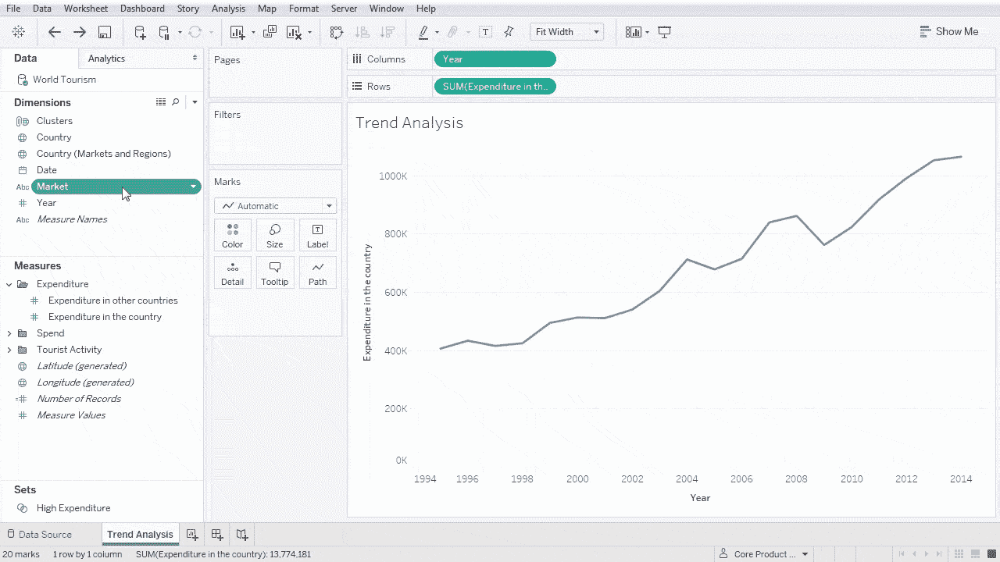
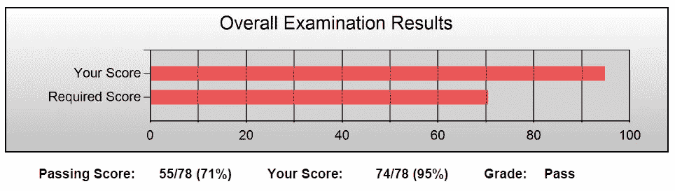
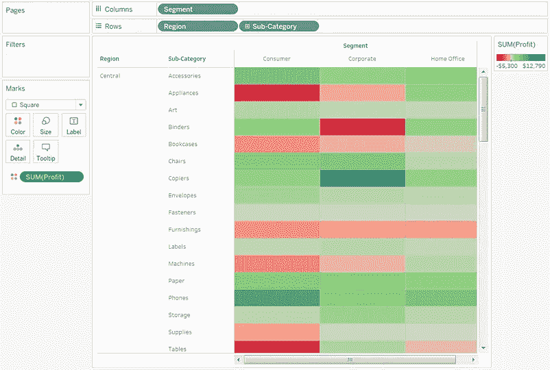
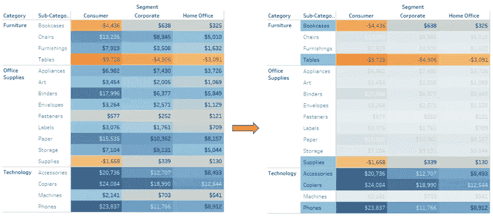

# Tableau 如何帮助我获得数据分析专业的研究生工作

> 原文：<https://towardsdatascience.com/how-tableau-helped-me-get-a-graduate-job-in-data-analytics-76dc448e2ad4?source=collection_archive---------43----------------------->

## 使用 Tableau 实现更有用、更吸引人的数据可视化

[活动发起人](https://unsplash.com/@campaign_creators?utm_source=medium&utm_medium=referral)在 [Unsplash](https://unsplash.com?utm_source=medium&utm_medium=referral) 上的照片

## 背景

从大学毕业却找不到工作可能会令人生畏。当你找不到实习机会的时候更是如此。
这是我在 2019 年完成统计学学士学位时发生的事情，从数据分析和数据科学的入门级工作和研究生项目的无数工作申请中没有成功。毕业后继续申请更多的工作并收到更多的拒绝，尤其是在全球疫情期间，可能会让大多数人失去动力，然而每个人都必须具备的一项重要技能是应变能力。

工作面试和评估中心完全数字化，公司减少招聘或推迟研究生课程的日期，工作变得更具竞争力，这些都是在这些时期更难获得研究生工作的部分原因。

我自豪、欣慰和感激地宣布，我终于收到了加入分析和数据科学研究生项目的工作邀请。这是一个超过 1 年的漫长而艰难的旅程，申请研究生角色和项目，最终获得一份工作。

那么，在我没有完成求职申请的时候，我都做了些什么呢？另一个重要的技能是热情，想不断学习。在此期间，我完成了许多与数据科学和分析相关的在线学习计划、认证和竞赛。
一些显著的成绩是 Tableau 桌面、SAS 基础编程、微软 Azure/Power 平台和 IBM 数据科学专业证书的认证。通过在线学习和证书获得成就感可以提高你的动力，让自己忙起来。
我强烈建议学生和学习者查看 [Coursera](https://www.coursera.org/) 、 [DataCamp](https://www.datacamp.com/) 、 [Udemy](https://www.udemy.com/) 和 [LinkedIn Learning](https://www.linkedin.com/learning/) 来发展数据科学技能，也可以改善你的简历，因为你可以展示你对学习的渴望(大多数大学免费提供 LinkedIn Learning，Udemy 对课程有定期折扣)。对于学生来说，在知名公司进行跨领域的虚拟实习也是很好的选择。

## 我如何利用 Tableau 获得竞争优势

Tableau 是一个数据可视化工具，用于以仪表板和工作表的形式创建可视化效果。它使用简单的拖放功能进行快速数据分析和更具吸引力的交互式数据可视化。

来源: [Tableau](https://www.tableau.com/learn/articles/data-visualization)

以前，Tableau 提供 90 天免费的电子学习课程，包括 Tableau 桌面高级技能的基础知识。他们还在 6 月 30 日之前提供他们的 [Tableau 桌面专家](https://www.tableau.com/learn/certification/desktop-specialist)认证半价(50 美元)。
当然，我借此机会完成了他们的网络课程和认证，以 95%的成绩通过。

我的 Tableau 桌面专家考试成绩和[徽章](https://www.youracclaim.com/badges/aed48261-00ac-44ab-bf64-de27cd352813)

数据分析工作应用程序中的一个常见阶段是“**分析和演示**任务。虽然这些阶段可能有所不同，但这是一个可以带回家的任务，因此申请人可以准备和创建一个 PowerPoint 演示文稿，以提交给招聘人员。他们给你一个场景和数据，供你分析，并提供见解和建议。

当我不得不从给定的数据中计算新的统计数据时，Excel 非常有用，在这种情况下，您可以使用简单的公式和函数，如 AVERAGE 和 SUM。然而，Excel 可以制作的图形可能非常简单，需要更多的努力才能在视觉上吸引人，这就是我使用 Tableau 的原因。

通过简单地将我的 Excel 电子表格导入 Tableau，我能够轻松地开始创建我的数字，以便在我的演示中使用。Tableau 允许连接到文本、JSON、PDF、Microsoft Access 等文件以及包括 Microsoft SQL Server、Oracle 和 MySQL 在内的服务器。

我创建的主要数据可视化是柱形图和高亮表，它允许你用颜色比较分类数据。下面显示了一个不带标签的突出显示表格示例:

来源:[从 Tableau 构建一个高亮显示的表](https://help.tableau.com/current/pro/desktop/en-us/buildexamples_highlight.htm)

Tableau 的一个优点是数据可视化是交互式的。我以此为契机，选择我想展示的重要栏目，然后对我的数字进行截图。在 PowerPoint 中叠加我的图像并创建动画后，我能够使演示看起来更具互动性，并专注于关键的见解。当然，你可以用 Excel 通过改变颜色来做同样的事情，但是这需要更多的时间。
类似的过程有两个截图，如下所示。

突出显示带有示例超市数据集的表格截图

在收到我的评估中心的反馈后，我发现在数百个演示中，我是少数几个使用 Tableau 进行数据可视化的人之一，大多数申请人都使用 Excel 和 PowerPoint 的内置数据可视化工具。这给招聘团队留下了深刻的印象，使我脱颖而出。我在评估中心的演示部分获得了高分，迎接我的是一个激动人心的消息:在完成安全检查后，我将获得一个职位。

原来如此！

如果您发现 Excel 中的图形和图表还不够，我强烈建议您查看 Tableau，以创建更具视觉吸引力、更有用和更具交互性的数据可视化。
(注: [Tableau Desktop](https://www.tableau.com/academic/students) 向学术机构的学生免费提供一年许可证，否则你必须购买，而 [Tableau Public](https://public.tableau.com/en-us/s/) 对所有用户免费)

感谢阅读关于我职业旅程的开始！

我很高兴开始并进入数据分析和数据科学的世界。
欢迎在 [LinkedIn](https://www.linkedin.com/in/harryngo19/) 上联系我，或者在 [Medium](https://medium.com/@harryngo) 上关注我。随着我即将开始这个新角色，我希望在未来发布更多关于我的数据科学经历！