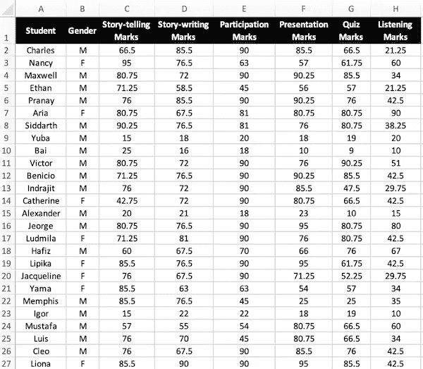
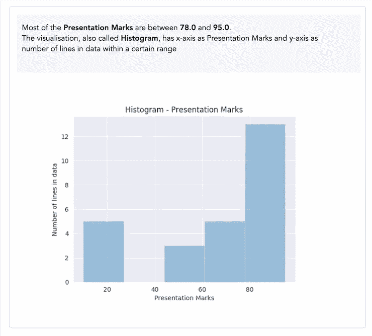
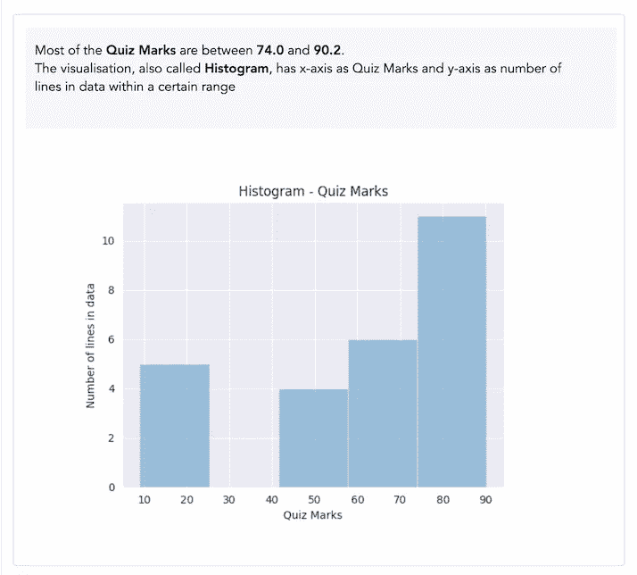
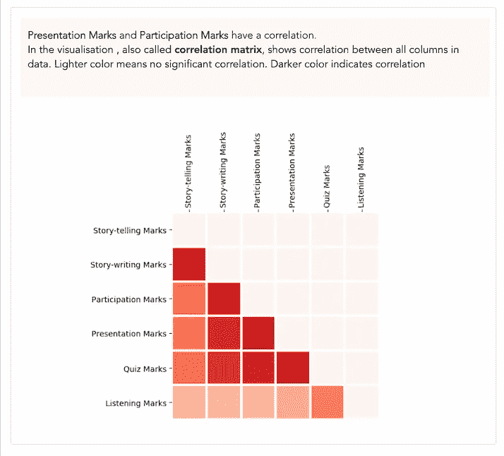
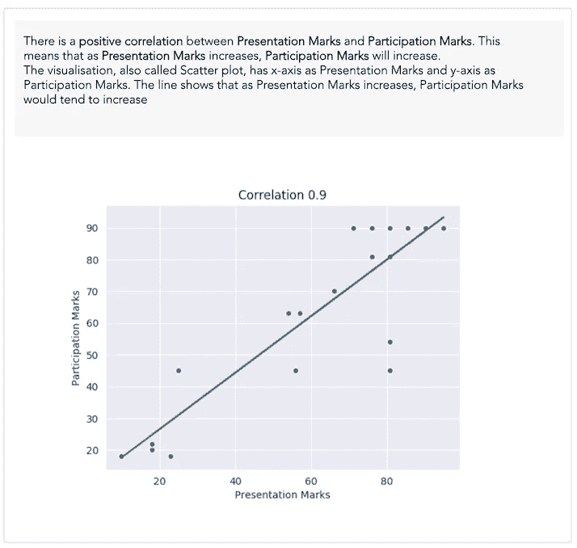
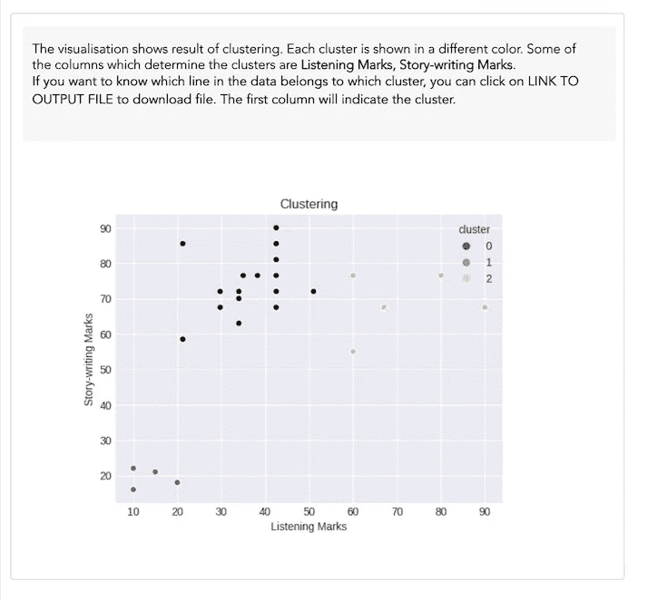
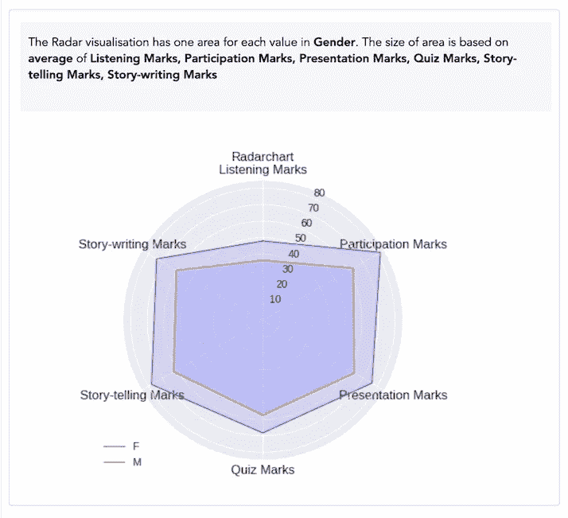
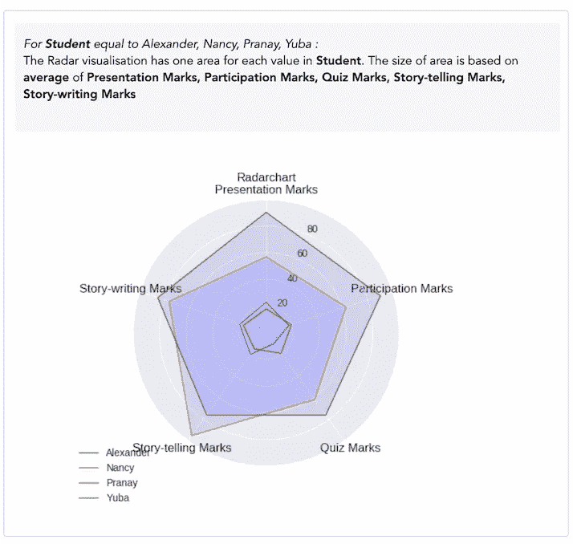

# 教师如何利用数据科学分析学生成绩

> 原文：<https://towardsdatascience.com/how-teachers-can-use-data-science-to-analyse-students-scores-26d0b2ec5694?source=collection_archive---------33----------------------->

## 教师更好地了解学生分数的无代码方式

Unsplash 上的科学高清照片

教师和教育机构处理大量与学生成绩相关的数据。在这个故事中，他们如何使用数据科学和高级分析来深入了解学生成绩数据。

# 语境

对于本教程，我们假设一个有 26 名学生的英语教师想要

*   更好地了解学生成绩
*   看看一个科目的表现是否会影响其他科目
*   按性别比较分数
*   按学生比较分数

# **获取数据**

第一步是获取数据。老师在 excel 中收集所有学生的分数。分数分为以下几类:讲故事、写故事、参与、陈述、测验、听力

这是 excel 的样子

关于学生成绩的数据

尽管这是一个 26 人的小班，但你突然会觉得光是看数据就不知所措。现在让我们看看可以从这些数据中获得什么样的见解

# **最常见标志范围**

以下是一些见解，有助于更好地理解学生的分数。

调查显示，大多数演示分数在 78 到 95 之间，而大多数测验分数在 74 到 92 之间。

了解学生分数最常见的范围可以让老师更好更快地理解学生的分数

演示标记的最常见范围

测验分数最常见的范围

# **相关性——看看一个科目的表现是否会影响其他科目**

了解一个主题是否会影响其他主题是非常有用的。这有助于了解应该关注哪个科目来提高学生的成绩。这种见解可以通过关联获得

从数据中可以看出一个相关矩阵。您可以观察到演示分数和参与分数之间存在相关性。这意味着如果学生被要求做更多的陈述，也可以提高他们的参与分数

相关矩阵

展示分数与参与分数的相关性

# **聚类——根据数据对学生进行分组**

根据数据对学生进行分组非常有用，因为这有助于管理和决定特定群体的具体行动。分组也称为集群。以下是基于学生分数的聚类结果

观察集群编号，您会看到

*聚类 0——除了一个科目之外总体分数良好的学生*

*聚类 1 —总体得分较低的学生*

*聚类 2——总体得分高的学生*

使聚集

# **学生比较**

根据各种标准比较学生总是有用的。在这里，您将使用性别进行比较，然后在学生级别进行比较

如你所见，在这个例子中，女生比男生成绩好。此外，你对学生层次的低水平和高水平有一个概念

性别比较

学生明智的比较

# 额外资源

# 网站(全球资讯网的主机站)

你可以访问我的网站进行零编码分析。[https://experiencedatascience.com](https://experiencedatascience.com)

请**订阅**每当我发布一个新的故事时，请及时通知我。

 [## 每当 Pranay Dave 发表文章时，您都会收到电子邮件。

### 每当 Pranay Dave 发表文章时，您都会收到电子邮件。通过注册，您将创建一个中型帐户，如果您还没有…

pranay-dave9.medium.com](https://pranay-dave9.medium.com/subscribe) 

你也可以通过我的推荐链接加入 Medium。

 [## 通过我的推荐链接加入 Medium—Pranay Dave

### 作为一个媒体会员，你的会员费的一部分会给你阅读的作家，你可以完全接触到每一个故事…

pranay-dave9.medium.com](https://pranay-dave9.medium.com/membership) 

https://www.youtube.com/c/DataScienceDemonstrated 的 YouTube 频道
这里是我的 Youtube 频道
[的链接](https://www.youtube.com/c/DataScienceDemonstrated)