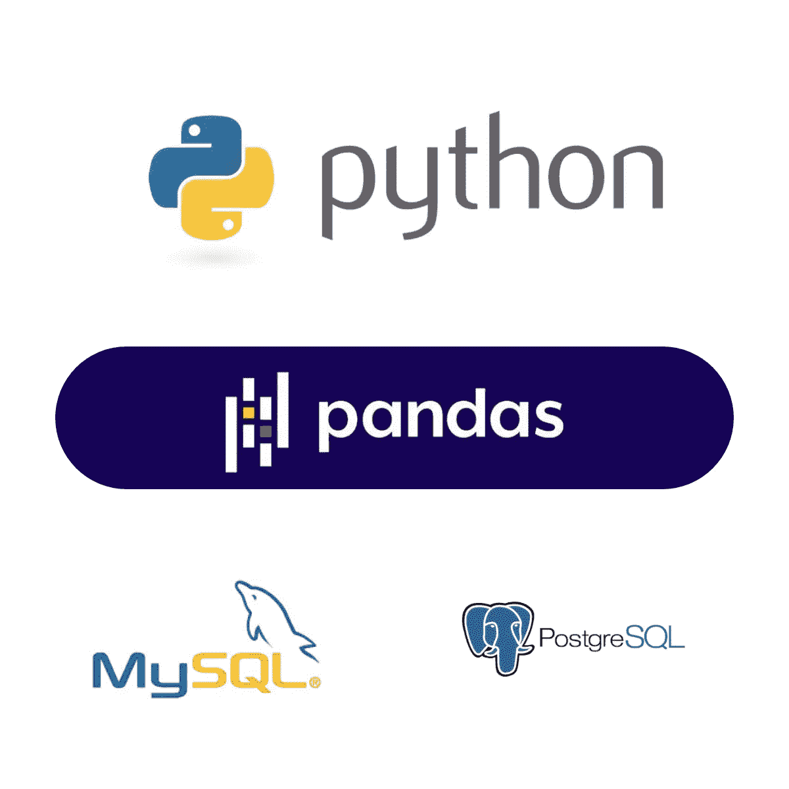

# 80/20 法则如何帮助决定在数据科学领域开始职业生涯所需的技能

> 原文：<https://towardsdatascience.com/how-the-80-20-rule-can-help-decide-which-skills-you-need-to-start-a-career-in-data-science-fd60766eba05?source=collection_archive---------5----------------------->

## 使用帕累托原则增强你作为数据科学家的信心

在 [Unsplash](https://unsplash.com?utm_source=medium&utm_medium=referral) 上由 [Austin Distel](https://unsplash.com/@austindistel?utm_source=medium&utm_medium=referral) 拍摄的照片

# 1.学习数据科学的艰巨任务

数据科学是一个令人兴奋的领域，对熟练和有经验的专业人员的需求不断增加。传统的数据科学家拥有计算机科学、数学、工程或物理相关领域的背景。但我们也发现其他专业人士来自广泛的领域，不具备强大的数学背景，如语言学和基因组学，仅举几例。

但不管你的背景如何，当人们对数据科学产生兴趣时，我们都会问的问题是:

> “要成为一名数据科学家，我需要具备哪些技能/知识？”。

许多作者都写过这个话题，基本技能的清单通常是铺天盖地的。一般来说，它涵盖以下主题:

1.  **数学(线性代数与微积分)**
2.  **统计数据**
3.  **编程(Python、R、Julia、Scala 等)**
4.  **SQL**
5.  **数据角力和预处理**
6.  **数据可视化**
7.  **监督学习**
8.  **无监督学习**
9.  **深度学习**
10.  **大数据平台(Spark 或 Hadoop)**
11.  **云计算**
12.  **沟通技巧**

在滚动列表后，你通常会发现你没有掌握大多数被定义为“必不可少”的技能。你感到沮丧，你的冒名顶替综合症开始发作，你意识到你需要数千小时的学习，仅仅是为了覆盖成为初级数据科学家的基础知识。

嗯，坏消息是:

> “你可能需要数千小时的学习和努力，才能掌握成为一名有经验的数据科学家所需的所有技能”。

但是**好消息是:**

> “你可以开始你的职业生涯，专注于学习一些对任何数据科学项目都至关重要的技能”。

为了使用这种实用的方法，我们首先需要了解一个重要的概念，以帮助我们在成为数据科学家的过程中确定我们的优先事项。

# 2.进入帕累托原理

维尔弗雷多·帕累托是十九世纪的意大利工程师、社会学家、经济学家、政治学家和哲学家，他首先描述了现在被称为 80/20 法则或帕累托法则的东西。

> 帕累托原理背后的思想是，一些可观察的现象遵循不均匀的分布，80%的结果(或效果)来自 20%的原因。

这一原则在不同的领域都可以观察到，如经济学、流行病、计算、体育、工程等等，有时会取 90%/10%、95%/5%甚至 99%/1%这样的极端值。

这个想法是在 Richards Kock 的伟大著作《80/20 原则:少花钱多办事的秘密》中综合出来的，作者在书中描述了许多使用这个原则的策略，以优化我们的生活，把时间和精力花在真正重要的事情上。

因此，将这个想法带回我们的数据科学学习路径，如果我们可以确定一个遵循帕累托分布的模式，也许我们可以利用它来为我们造福。

# 3.那么，数据科学家的传统日常工作由什么组成呢？

你可能已经从至少有一点数据科学经验的人那里听说过，**你至少有四分之三(有时超过 80%)的时间花在收集、争论和预处理数据上**。换句话说，你必须花费大量的时间来组织你的数据集。我知道一些数据科学家可能很幸运地在一个数据被很好地编目和管理的环境中工作，这意味着他们可以花更多的时间在数据可视化和生成模型上，而不是在上述的初始步骤上，但这通常是一个例外。

在大多数公司中，数据存储在不同的数据库中，您通常必须使用 SQL 查询来组合表，或者使用 API 从不同的源获取数据。然后使用 Pandas(或 R)来组织和探索数据。在此阶段，您将处理缺失值、异常值并生成可用于后续分析步骤(数据可视化和模型训练)的数据集。如果您确切地知道数据库和 API 请求的结构，并且如果您的所有数据都是一致的，没有丢失值或异常值，那么这将是一个完美的场景。

事实上，这一过程比你预期的要长得多，因为你要反复多次地收集数据和争论，直到你最终准备好你的数据集。

# 4.将帕累托原则应用于您的数据科学学习之旅

基于数据科学家 80%的时间都花在数据收集和组织数据集上，**我对你开始职业生涯的建议是，不管你的背景如何，都要专注于掌握编程、数据争论和数据提取的技能。**

> 如果你学习 Python、Pandas 和 SQL，你可能至少可以完成一名数据科学家 80%的日常工作。

回到我们最初列出的成为数据科学家所需的技能，在总共 12 项技能中，你首先需要关注其中的 3 项:编程、SQL 和数据争论/预处理。如果考虑到所需的其他技术和软技能，这个列表还可以进一步扩展，80/20 法则也可以用来描述数据科学家的一天。

在开始数据科学学习之路时，你需要关注的三个主要技能是:Python、Pandas 和 SQL。

关于为什么应该选择 Python 而不是 R、Julia 或 Scala 等其他语言，我有一个简单的看法。我提到 Python 的原因是因为它是当今数据科学最流行的语言，也是任何试图学习如何编程的人的第一语言，因为它的学习曲线可能是最容易的之一。

# 5.逐渐增加你的信心

大多数关于机器学习的入门课程都向你展示了回归和分类(监督学习)或聚类(非监督学习)的可用算法。试图理解和掌握这些方法中的每一种，以及何时使用它们可能会很累，而且没有真正的回报。放心吧！知道存在哪些方法以及每种方法的主要应用是很好的，但是只有当您开始在自己的项目中使用它时，您才能完全理解每种方法。

随着您收集和预处理数据的技能的提高，您可以更加自信地执行以下步骤(可视化和模型选择)。从实践的角度来看，你可能会从一个与你的公司或研究项目相关的特定问题开始工作。随着你深入数据集并定义你的假设，你将有时间研究可以为你提供最佳解决方案的方法和机器学习算法。这是关于为什么你应该首先关注学习收集和组织数据所需的技能的又一个论点。

# 6.作为一名数据科学家，从更广阔的角度看待你的整体

我想重申的是，这篇文章的目的不是向你推销你只需要上述 3 种技能就可以从事数据科学的想法。

> 如果你先集中精力学习 Python、Pandas 和 SQL，你可以更快地看到实际效果，甚至执行通常由数据工程师和数据分析师执行的任务。

由于你已经看到了你所学知识的实际效果，你可以继续学习清单上的其他技能。

从经典的**“数据科学需求层次”(图 2)** 中可以看出，金字塔的底部由数据收集组成，接下来是移动/存储和探索/转换数据。这些技能通常与数据工程师工作相关，显示了该职位在当前数据科学项目中的重要性。

图二。数据科学需求层次( [Monica Rogati — Hackernoon](https://hackernoon.com/the-ai-hierarchy-of-needs-18f111fcc007) )

因此，如果没有扎实的数据处理和辩论相关技能的基础知识，您(和您的团队)可能无法成功地执行数据科学项目。

# 6.结束语

正如文章标题中提到的，我的主要目标是帮助你决定在开始学习数据科学时需要优先考虑哪些技能。我知道这个话题可能会有争议，因为我们观察到许多成为数据科学家的不同途径。从我个人的经验来看，你肯定有一个漫长的旅程，优化你的学习可以更快地为你提供工作机会。我相信，文章中提到的技能的坚实基础以及相对的自律和奉献精神会比你预期的更快给你带来不可思议的结果。

# 非常感谢你阅读我的文章！

*   你可以在我的[个人资料页面](https://medium.com/@gabrielsgoncalves) **找到我的其他文章🔬**
*   如果你喜欢它并且**想成为中级会员**你可以使用我的 [**推荐链接**](https://medium.com/@gabrielsgoncalves/membership) 来支持我👍

# 资源

 [## 没有量化学位能成为数据科学家吗？

### 一个故事和一些见解

towardsdatascience.com](/can-you-become-a-data-scientist-without-a-quantitative-degree-8046e254fa48)  [## 数据科学最低要求:开始从事数据科学时你需要知道的 10 项基本技能

### 入门级数据科学职位所需的 10 个要素

towardsdatascience.com](/data-science-minimum-10-essential-skills-you-need-to-know-to-start-doing-data-science-e5a5a9be5991)  [## 成为 3.0 级数据科学家

### 想成为大三，大四，还是首席数据科学家？了解您需要做些什么来驾驭数据科学…

towardsdatascience.com](/becoming-a-level-3-0-data-scientist-52641ff73cb3)  [## 成为一名成功的数据科学家需要知道什么？

### 备注:这是我非常主观的观点，是作为一名成功的数据科学家你需要知道的。所有…

tech.olx.com](https://tech.olx.com/what-do-you-need-to-know-to-be-a-successful-data-scientist-78823200899c)  [## 使用帕累托原则来简化你的生活

### 并非所有的任务都是平等的。

medium.com](https://medium.com/swlh/use-the-pareto-principle-to-simplify-your-life-b9da4c49f3e9)  [## 数据科学家的一天

### 您对数据科学家一天的工作感兴趣吗？每个数据科学角色可能不同，但是…

www.kdnuggets.com](https://www.kdnuggets.com/2017/11/day-life-data-scientist.html)  [## 人工智能的需求层次

### 正如快速发展的技术通常的情况一样，人工智能激发了大规模的 FOMO，FUD 和世仇。有些是…

hackernoon.com](https://hackernoon.com/the-ai-hierarchy-of-needs-18f111fcc007)