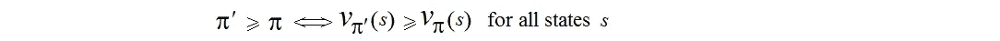
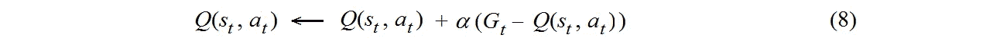

# 贝尔曼方程在深度 RL 中是如何工作的？

> 原文：<https://towardsdatascience.com/how-the-bellman-equation-works-in-deep-reinforcement-learning-5301fe41b25a?source=collection_archive---------11----------------------->

## 贝尔曼方程和神经网络之间的联系，有公式、例子和 Python 代码


资料来源:123rf.com

在*贝尔曼方程*中，价值函数*φ*(*t*)取决于价值函数*φ*(*t*+1)。尽管如此，在状态达到时间 *t* +1 之前，还是可以得到*φ*(*t*)的值。我们可以通过*神经网络*、**T21、**来实现，因为**、*、*、**它们可以在任何时间近似函数*φ*(*t*)**T33*t*。我们将看到它在 Python 中的外观。在最后两节中，我们介绍了*深度 Q 学习*算法的实现以及使用 *PyTorch* 软件包进行张量计算的一些细节。**

# *状态、动作和政策图*

**状态空间和行动空间**

*马尔可夫决策过程* ( *MDP* )为*深层强化学习* ( *RL* 或*深层 RL* )提供了数学框架。对于现实问题，我们在 *MDP* 中定义了以下参数:{ ***S*** *、***T63【a64】、**、*、*T68*R*、、、**T75P**、 ***T93****T97*是动作空间* **、 *R*** 、*T105*是设定*奖励*、*P*T111 是设定*概率*、**T115***γ

> 而在计算机视觉中，代理从*大量的图像*中学习，在*深层 RL* 中的代理从*大量的发作*中学习，其中对于任何状态*、*代理**探究**几个动作并从 MDP 环境接收不同的回复(奖励)。

如果每个状态只有一个动作，并且所有奖励都相同，那么 *MDP* 就是简化为*马尔可夫链*。对于大量的 MDP 环境，参见 OpenAI/gym 的[环境表](https://github.com/openai/gym/wiki/Table-of-environments)。

[**翻筋斗**](https://github.com/openai/gym/wiki/CartPole-v0) **或倒立摆**

MDP 环境的一个例子是*cart pole(*a . k . a .[an*倒立摆*](https://en.wikipedia.org/wiki/Inverted_pendulum) *)，*一个重心在支点上方的钟摆。不稳定，但是可以通过移动重心下的支点来控制。对于环境 [*CartPole-v0*](https://github.com/openai/gym/wiki/CartPole-v0) ，状态和动作如下:


钢管混凝土柱的状态空间和动作空间

对于这种环境，状态空间的维度=4，类型为 Box(4)。动作空间的维度=2，类型为离散(2)。

健身房的类型[空间](https://gym.openai.com/docs/#spaces):

*   `**gym.spaces.Discrete(n)**`:从 0 到 n-1 的离散值。
*   `**gym.spaces.Box**`:数值的多维向量，每一维的上下界由`**Box.low**`和`**Box.high**`定义。

**政策地图𝜋，确定性** **和** **随机政策**

*策略图* **𝜋** 定义为**𝜋**(a | s)=**pr**{*at = a*|*ST = s*}意思是策略 **𝜋** 是在状态*下执行的动作*的概率**

****举例**。考虑配备手臂来抓取罐子的回收机器人。状态空间 ***S*** =[ *低*，*高* ]，其中“*低*”和“*高*”是机器人充电的状态，动作空间 ***A =*** [ *搜索、充电、等待*。我们考虑两种政策类型:*确定性*和*随机性*。**

****

**确定性和随机性策略的示例**

# *****状态值函数和贝尔曼方程*****

****返回值****

**假设状态空间是*离散的*，这意味着代理以离散的时间步长与其环境进行交互。在每次*时，代理接收到一个*状态* ***状态*** 包括*奖励****rt .****累积奖励命名为*返回 ***，*** 我们将其表示为 ***Gt 【T6*未来累计*折现*奖励计算如下:*******

**

*未来累计*折扣*奖励*

*这里， ***γ*** 是*贴现*因子，0<***γ****<*1。这样，*return*at time*就可以用*return at time***+1，****即****

******

***返回值的递归关系***

***这是返回值 ***Gt*** 的递归关系。***

****状态值函数和贝尔曼方程****

**策略 **𝜋** 的状态值函数定义如下:**

****

**状态值函数**

**在这里， **𝜋** 是*的预期* 为 ***Gt*** ，和*𝔼**𝜋**命名为*预期收益*。通过(1)和(2)我们推导出等式。(3).这就是 [*贝尔曼方程*](https://joshgreaves.com/reinforcement-learning/understanding-rl-the-bellman-equ) *。****

****

***贝尔曼方程***

**这样，状态值***【v _**s*)**为状态***在时间****t****可以使用当前奖励***r _ { t+*1*}******找到**********

# *******行动价值函数与最优策略*******

*******动作值功能*******

*****现在，我们将定义与策略 **𝜋 :** 相关联的*动作值函数******

********

*****动作值功能*****

****我们可以介绍两种政策的比较如下:****

********

****两种政策的比较****

****在这种情况下，我们说政策**𝜋*’***比政策**𝜋.*好*******

******最佳状态值函数******

****没有必要让任何两个政策具有可比性，但是，总有一个政策优于所有其他政策。这样的政策被说成是*最优政策*，它由 **𝜋*.表示一个最优策略肯定存在，但可能不是唯一的。******

> ****代理的目标是找到最优策略。寻找最优策略是 *Deep RL* 的主要目标。****

****不同的最优策略具有相同的价值函数，我们用 ***v*表示。*** 事实上，我们有 ***v* = v(* 𝜋*).**函数***v ****it*据说是*最优状态值函数。*最佳状态值函数可定义如下:*****

********

****最优状态值函数****

******最佳动作值函数******

****对于任何确定性策略**【𝜋】*******a***都是由当前状态***s****唯一确定的，即***a*=****𝜋(*s***。然后，对于(4)中的确定性策略 **𝜋** ，动作可以被丢弃，即，我们得到等式。(2).换句话说，对于确定性策略 **𝜋，**我们在*状态值*函数和*动作值*函数之间有如下关系:*******

************

******确定性策略的*状态值*函数和*动作值*函数之间的关系******

********对于随机政策来说，情况并非如此********

******类似于最佳动作值函数***v **(*s*)**，参见(5)，我们将最佳动作值函数 ***q** ( *s，* )** 定义如下:******

************

******最佳行动价值函数******

******假设，我们有一个最优动作值函数 ***q** ( *s，a* )。**那么最优策略可以确定如下:******

************

******最优策略******

******这里， ***A(s)*** 是状态 ***s*** 可能的动作集合。******

> ******对于确定性策略 **𝜋，**我们通过关系***a*=****𝜋(*s*)**找到当前状态的新动作。对于随机策略 **𝜋，**我们可以通过关系式 a = 𝜋*(s 找到新的行动)，其中𝜋*是最优策略，见(7)。******

******下面是一个代理应该做的事情:首先找到最优行动值函数，然后使用公式(7)找到最优策略。最后一种说法是正确的，但有一些限制。例外是可能的，例如，由于[ε-贪婪机制](/exploration-in-reinforcement-learning-e59ec7eeaa75)。******

# *********Q-table 和*** 时态差异学习******

********Q-table********

******一个 *Q 表*是形状【状态，动作】的矩阵。我们将这个矩阵的所有槽初始化为零。合适的 Python 代码如下:******

```
******import numpy as np
Q = np.zeros((state_size, action_size))******
```

******我们会在每一步或每一个动作之后，在 *Q* ( *s* ， *a* ) 中对每一对( *s* ， *a* )进行更新。******

********时间差********

*******Q-table****T5*是如何单步更新的？更新 *Q-table* 最常用的方法是*时间差学习*或*TD-学习*。我们在每集结束前都会添加更新。**********

********

*****TD-learning*****

****回归 ***Gt*** 情商。(8)一种叫做*的替代估计**参见(1)。该值又名*TD-目标*。(8)中的值 *Q* (s_ *t，a_t* ) 称为*电流估计值*。使用(1)，我们可以重写等式。(8)如下:*****

********

*****TD-learning:备选方案和当前估计值*****

******算法 Sarsa******

****Sarsa 是*的缩写*为 ***状态-行动-奖励-状态-行动*** 的序列。该序列的这五个元素如下:****

********

****Sarsa 序列****

****代理处于当前状态 ***s_t*** ，然后代理选择动作 ***a_t*** ，获得奖励 ***r_t*** ，之后代理进入对所有剧集执行该循环，直到值 *num_episodes* ，参见下面的算法 *Sarsa* 的伪代码。在每一步中， *Q-* 值**Q*(s*，a* ) 由(9)更新，参见 Sarsa 伪代码中的黄线。*****

********

****Sarsa 算法****

******学习率*α*******

****学习率 ***α*** 决定了算法 Sarsa 的行为。太大的值 ***α*** 将使我们的算法远离收敛到最优策略。如果 ***α=* 1** 那么 *Q(s_t，a_t) ← Gt，*即*Q*-值总是将是最近的返回，没有任何学习。值 ***α*** 太小导致学习太慢。如果 ***α=* 0** 那么 *Q* (s_ *t，a_t* ) ← *Q* (s_ *t，a_t* )，永不更新。****

# ******算法**Q-学习****

******Q-学习******

****算法 *Q-learning* (又名 *Sarsamax* )在 eq 上与 *Sarsa* 不同。(9)如下:代替 *Q(s，a)* 在 ***t*** 的值，我们使用 *Q(s，a)* 的最大值，其中*贯穿了此刻*****的所有可能动作 **********

********************

*****算法*Q-学习******

*******贪婪的行动*******

*****在任何时间步 ***t*** ，对于状态 ***s_t*** ，至少存在一个动作*，其估计值 *Q* ( *s_t，a* )为*最大值*。这个动作 ***一个*** 叫做*贪婪动作*。相关联的政策 **𝜋*( *s* )** 叫做*贪政策*，参见 eq。(7).当我们选择一个贪婪的行为时，我们正在*利用*我们当前对这些行为的知识。相反，如果我们选择了*非贪婪动作*中的一个，那么我们就是*探索*，因为这能够提高我们对非贪婪动作的价值的估计。******

******Sarsa vs. Q-learning******

****一个*偏离策略* 智能体独立于智能体的动作学习*最优策略*。一个*策略上的*代理学习该代理正在执行的策略。 *Q-learning* 是*an*off-policy*算法因为*最优策略*是通过贪婪动作学习***a _ gr*****中的公式求最大值**，**见(10) **，**然而，下一个动作**Sarsa*是一个 *on-policy* 算法，因为在(9)中，代理学习最优策略并使用相同的策略表现 *Q(s_t，a_t)。***********

> *****Q-learning* 可能每一集的表现都比 *Sarsa* 差，然而 *Q-learning* 学习最优策略。****

# ****Python 中的神经网络****

******问题******

********

****我怎么算？****

****答案:通过一个*神经网络*。我们将看到它在 Python 中的样子。****

******函数逼近******

****神经网络受到如此多关注的原因是因为它们可以逼近任何连续数学函数的输出。这是可能的，因为 *Kolmogorov 定理*指出多元函数可以通过一元函数的和与合成的组合来表达。****

****我们的*Q*-值函数，两个向量参数的函数 *Q(s，a)* 可以表示成我们想要的某个人工神经网络( *nn* )一样精确。****

> ****用*深度学习*技术，即用*神经网络*实现 *Q* 学习算法，称为*深度 Q-网络*或 *DQN* **。******

******项目*DQN*******

****Python 包 *PyTorch* 是由脸书人工智能研究实验室开发的开源深度学习库。我们提供了几个使用 *PyTorch* 实现的 *DQN* 片段。这段代码摘自我在' *Banana* '环境中训练一个代理的实现。代理人被训练在某个方形世界中导航和收集香蕉。然而，这段代码相当通用，可以用于许多具有离散状态空间的环境。****

******片段******

****我们给出几个片段，帮助理解如何使用神经网络，我们可以优雅地实现 *DQN* 算法。****

****`**Function Agent.__init__**`:两个*神经网络*(`**q_local**`**`**q_target**`)*由模型`**Qnetwork.**` 构成，每个模型`**Qnetwork**`包含两个隐层。*******

*****`**Method**` `**Agent.learn()**`:*****

**********

*****`**Q_expected**` 和`**Q_targets**` 之间的差异应使用 *PyTorch* 方法最小化，参见方法`**learn()**`。*****

****`**In class ReplayBuffer:**` `***s_t***`*(`**state**`)*`***s_*{*t+1*}**`(`**next_state**`)的值由函数`**sample()**` **、** 采样，数据由函数`**add()**` **存储。********

****`**In method dqn():**`按剧集和时间步长双循环；这里，生成值'*状态'*、'*下一个状态'*、'*动作'*、'*奖励'*和'*完成'*。****

# ******py torch 相关提示******

****下面是一些与 *PyTorch* 方法相关的小技巧，见下图“三张量”。****

******分离()******

****方法`**detach()**`表示对于`**Q_targets_next.**` 不会执行张量`**loss**`梯度的反向传播，这是可能的，因为张量`**loss**` 仅依赖于`**Q_targets**` 和`**Q_expected,**`见方法`**learn()**`。****

******最大值(1)******

****这里每个网络的形状是[64，4]其中 64 是批中的状态数(`**BATCH_SIZE**` =64)，4 是可能的动作数(`**move forward, move backward, turn left, turn right**`)。表达式`**max(1)**`表示获得 64 个状态中每个状态的最大值。最大值是通过运行所有 4 个动作获得的。回想一下 *Q-Learning* 在所有动作中寻找最大值，见(10)。下图中，我们给出了一个 64×4 张量`**self.q_target(next_states).detach()**`的数值例子。****

******与神经网络相关的张量******

********

****三个张量****

******max (1)[0]******

****事实是`**max(1)**`返回两个张量的列表:`**max(1)[0],**` 包含最大值的张量；`**max(1)[1],**`包含找到最大值的值“列号”的张量。我们只需要`**max(1)[0]**`，见上图。****

******unsqueeze①******

****现在，我们希望将形状为[64]的行向量放在形式为[64，1]的列中。这是使用`**unsqueeze(1)**`方法完成的，见上图中的张量`**Q_targets_next**`。****

******Q_targets******

****我们如何计算 `**Q_targets**` **？**对于批量中的任何一个'*状态* **'** ，如果一集结束，则'*完成*为 1，否则'*完成*为 **0。**然后`**Q_targets**`的线由等式计算。(10)当且仅当相关联的情节没有结束时。****

******聚(1，行动)******

****该方法沿 dim = 1 指定的轴收集值。请注意，dim=0 表示行，dim=1 表示列。`**self.q_local(states)**`中的每一行都由与四个动作相关的四个 *Q* 值组成。因此，对于每一行，沿着列，方法`**gather**` 取与张量`**actions**`中的动作号相关联的*Q*-值，见下图。****

********

# ****结论****

****结合贝尔曼方程，神经网络，柯尔莫哥洛夫定理，我们得到了一个惊人的技术，深度 RL。这项技术提供了新的方法和新的算法，可以解决以前无法解决的问题。****

> ****贝尔曼方程和 Deep RL 实际上允许哪些「不可解的问题」？让我们以 AlphaZero 项目为例，这是一个精通国际象棋、日本象棋和围棋的计算机程序。AlphaZero 在 24 小时的训练中击败了世界冠军程序 Stockfish，达到了超人的下棋水平。****

****我们研究了深度 RL 的一个特例，即深度 Q 学习算法。在最后两节中，我们介绍了这种算法的实现和使用 PyTorch 软件包进行张量计算的一些细节。****

******参考文献******

****[1] M. Tavora，[神经网络的逼近能力(带 Python 代码)](/the-approximation-power-of-neural-networks-with-python-codes-ddfc250bdb58) (2019)，走向数据科学****

****[2] X .郑，[强化学习简介](https://www.linkedin.com/pulse/brief-introduction-reinforcement-learning-xiaofei-zheng) (2019)，领英****

****[3] H. van Hasselt，A. Guez，D. Silver，[双 Q 学习的深度强化学习](https://arxiv.org/abs/1509.06461) (2015)，arXiv:1509.06461****

****[4] A .辛格，[强化学习:贝尔曼方程与最优性(第二部分)](/reinforcement-learning-markov-decision-process-part-2-96837c936ec3) (2019)，走向数据科学****

****[5] J. Hui， [RL — DQN 深 Q 网](https://medium.com/@jonathan_hui/rl-dqn-deep-q-network-e207751f7ae4) (2018)，中****

****[6] D. Silver，T. Hubert，J. Schrittwieser，D. Hassabis， [AlphaZero:为国际象棋、松木棋和围棋带来新的启示](https://deepmind.com/blog/article/alphazero-shedding-new-light-grand-games-chess-shogi-and-go) (2018)，DeepMind****