# 如何管理共享代码库

> 原文：<https://towardsdatascience.com/how-the-best-development-teams-manage-shared-codebases-2613b5b87185?source=collection_archive---------27----------------------->


图片由[安妮·斯普拉特](https://unsplash.com/@anniespratt)在 [Unsplash](https://unsplash.com/photos/QckxruozjRg)

## 软件工程

## 避免团队开发时面临的常见问题

**恭喜**！你终于想出了完美的新应用创意。你和你的软件工程师团队匆忙编写代码，这将是你名利双收的门票。但是等等。Maria 为这个应用程序的主页编写的代码看起来很棒——但是它如何与 Steven 为访问数据库编写的代码一起工作呢？Hector 设计了一个函数来计算我们正在寻找的值——但是这些值如何在应用程序中从一个页面移动到另一个页面呢？让团队的代码协同工作本身就成了一个项目！

在本文中，我将向您展示我们如何使用 **Git** 和 **GitHub** 来管理将在多个开发人员之间共享的代码库。**版本控制**像 **Git** 这样的工具被软件工程师、数据科学家和游戏开发者使用——仅举几个例子。

> 先决条件:[安装 Git](https://git-scm.com/downloads) ，[有一个 GitHub 帐号](https://github.com/)，[知道如何创建一个库](/getting-started-with-git-github-6235f5ae3a0b)

> ***注意:Salesforce 已经决定移除他们的 Heroku 免费等级。自 2022 年 11 月起，该数据库的部署将不再免费。***

# 1.创建存储库和添加协作者

一旦你登录到 **GitHub** 上，继续创建一个库。我的就叫“ [**如何 _ 管理 _ 共享 _ 代码库 _ 文章**](https://github.com/ClairvoyantCoding/How_To_Manage_A_Shared_Codebase_Article) ”。确保使用 README.md 文件创建存储库，以便在进入第二步之前进行根提交。在您新创建的 GitHub 资源库中，点击**设置**。然后从左侧菜单中选择**合作者**。

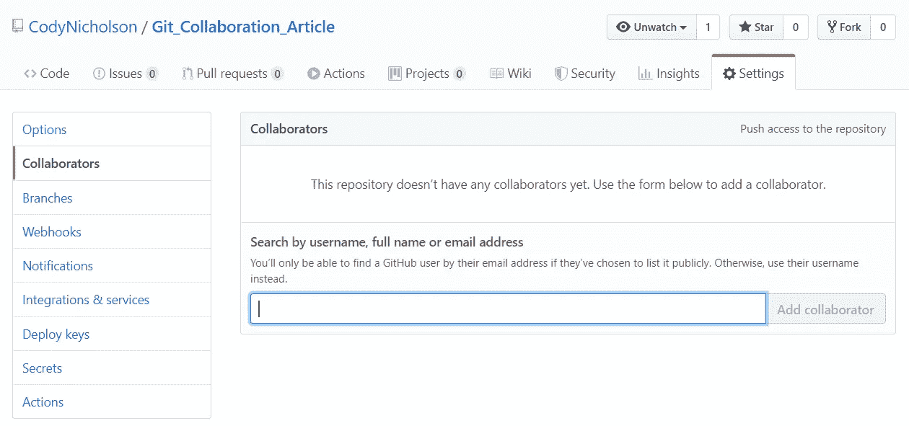

你可以通过他们的 GitHub **用户名**或者他们的**电子邮件地址**来添加你的团队成员。然后，他们将通过电子邮件收到加入您项目的邀请。

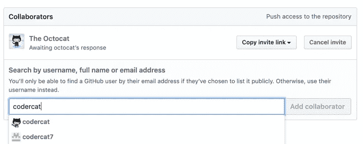

一旦他们接受，您将能够通过选择以下选项，在协作者页面上编辑他们的权限:

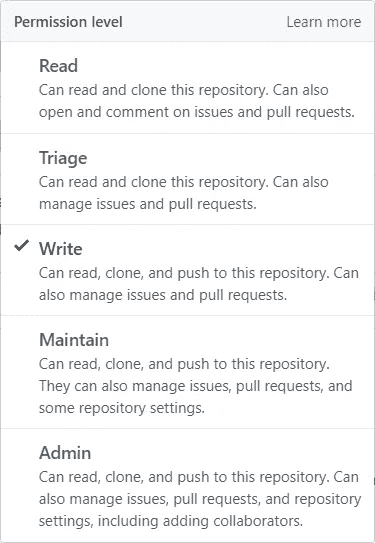

现在您和您的团队可以克隆您的存储库并开始开发了！如果你给你的团队成员“**写**”权限，他们就可以开始投稿了。

# 2.Git 分支

**Git** 中的**分支**的行为类似于我们用来组织工作片段的项目的副本。如果我们的项目中有三个任务要完成，我们可以为每个任务创建一个分支，然后在完成每个单独的任务后将每个分支合并到主分支中。

在我们新克隆的存储库中，尝试运行以下命令:

```
**git branch**
```

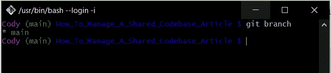

(1)运行“git branch”命令来查看我们所有的分支

git branch 命令列出了我们存储库中的分支。目前，我们只有默认的*主*分支，它是在我们创建存储库时自动创建的。我们可以使用 **git branch** 命令创建一个新的分支，并添加一个分支名，如下所示:

```
**git branch first_branch**
```

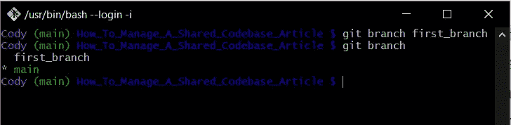

(1)创建一个分支，(2)使用“git branch”命令查看我们所有的分支

我们现在有了项目的两个不同的副本。主*分支旁边有一个星号——这意味着这是我们当前正在使用的项目分支。为了在项目的分支之间切换，我们使用了 **git checkout** 命令:*

```
**git checkout first_branch**
```

现在，如果我们运行 **git branch** 命令，我们会看到星星已经从 *main* 移动到 *first_branch* :

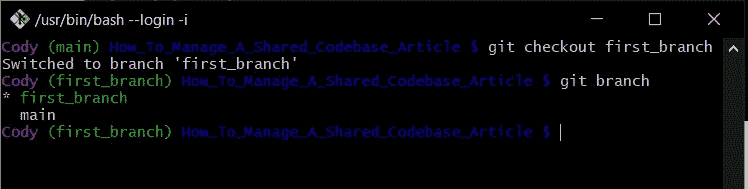

(1)切换到我们的新分支，(2)检查我们是否在分支上

在我们的新分支上，让我们添加一些变化。我们将创建一个名为 **app.sh** 的 shell 脚本，其中包含:

```
**echo “Hello world”**
```

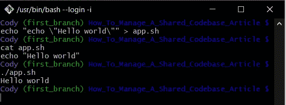

(1)创建“Hello world”shell 脚本，(2)查看脚本内容，(3)运行脚本

然后我们将添加文件并提交它。之后，我们可以运行 git log 来查看我们的新提交:

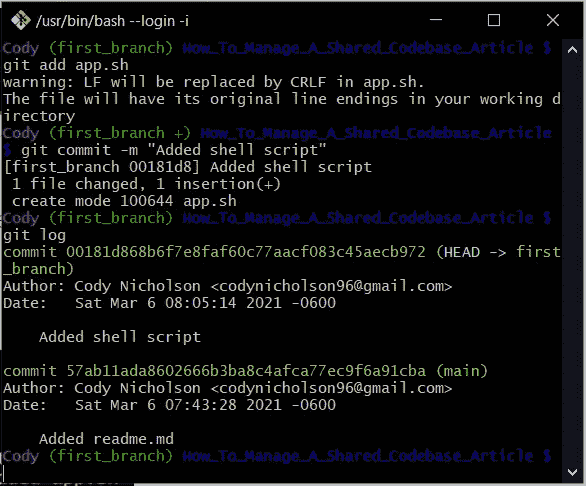

(1)使用 git add 选择要提交的 shell 脚本，(2)使用消息提交 shell 脚本，(3)使用“git log”查看新的提交

> 注意:请参见第二行，我在 Windows 上使用。/app.sh "。在 Mac 或 Linux 上，您可以使用“sh app.sh”来运行该文件。

现在让我们使用 git checkout 返回到我们的*主*分支，然后使用 git log 查看我们在主分支上的提交:

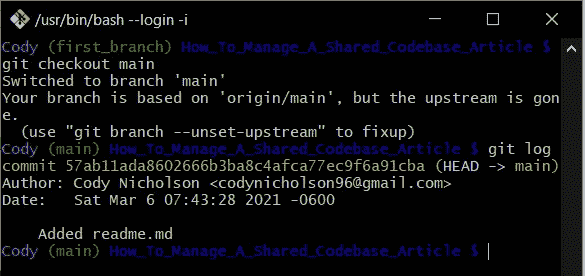

(1)使用 git checkout main 返回到主分支，(2)然后使用 git log 查看我们的 shell 脚本没有在这个分支上提交它，文件本身也没有

如您所见，我们在 *first_branch* 分支上创建的提交不在这里。让我们假设我们在 *first_branch* 上所做的工作已经完成，现在我们想把我们的变更转移到 *main* 分支上。为此，我们将不得不切换回我们的 *first_branch* ，并将我们的分支推到 GitHub。

在我们的 *first_branch* 上运行 **git push** 将会失败——但是它将提供我们可以用来**设置我们的上游**的命令。因为我们在本地存储库上创建了我们的分支，并且我们直到现在才推送这个分支——我们的新分支不知道推送至何处。我们将上游设置为**原点**，方法是在我们尝试推送时运行错误消息中给出的命令:“*git push-set-upstream origin first _ branch*”。

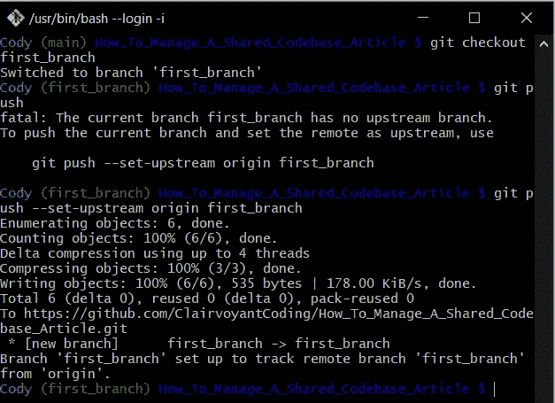

(1)切换回具有我们的新 shell 脚本的 first_branch，(2)尝试推送并得到一个错误，它不知道将该错误推送到哪里，(3)从错误消息中复制 set-upstream 命令并使用它来推送我们的新代码

# 3.拉取请求

我们回 GitHub 看看我们新推的分支吧。我们可以使用下图左下方的“**分支:主**”下拉菜单来更改我们正在查看的分支。由于我们刚刚推送了我们的分支，GitHub 给了我们一条消息，询问我们是否愿意为我们的新分支创建一个**拉取请求**。我们将单击绿色的“**比较&拉动请求**按钮。

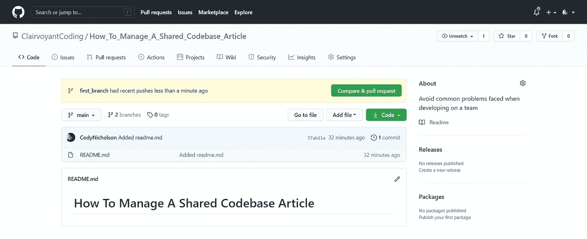

查看 GitHub 上的“比较和拉取请求”按钮，查看我们推送的新 first_branch

现在你可以看到 *first_branch* 将合并为 *main* 表示为:**base:main←compare:first _ branch**。旁边有一个绿色的“**能够合并**”信息，告诉你这些分支可以自动合并。点击**创建拉动请求**按钮创建拉动请求。

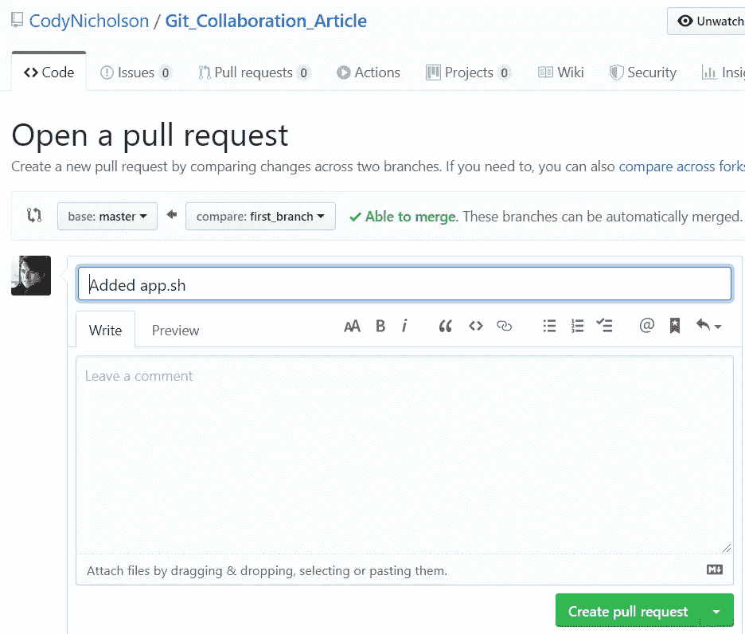

表单为我们的新 first_branch 创建拉请求，以合并到主分支中

下一页——如下图所示——是新打开的拉请求页面。点击**文件修改**工具栏选项，可以查看 *first_branch* 上的修改内容。由于我们所做的更改没有导致任何冲突，我们可以单击“**合并拉取请求**”按钮，Git 会自动将我们的代码合并到*主*分支中。

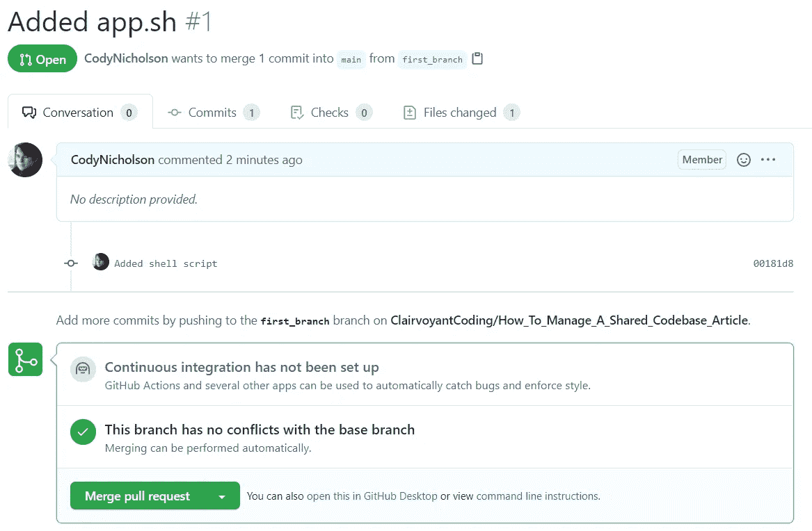

查看我们创建的拉动式请求

使用拉请求将代码合并到*主*分支需要这个漫长的过程，因为我们希望确保被破坏的代码永远不会出现在*主*分支上。

# 4.使用 Git Pull 更新本地主分支

自从我们将 *first_branch* 合并到 GitHub 上的 *main* 分支后，我们的 *main* 分支现在用来自我们 *first_branch* 的代码更新。然而，我们本地机器上的存储库不知道我们的主*分支*的更新。为了将本地机器上的*主*分支与*主*分支在线同步，我们将“**git check out main”**切换回我们的*主*分支，然后使用“**git pull”**命令获取更新的更改:

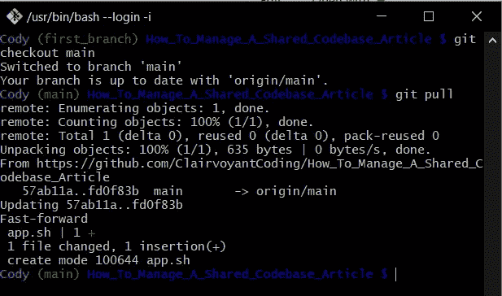

(1)在合并拉请求之后，从 first_branch 切换回 main，(2)然后在 main 分支上运行“git pull”来拉下合并的变更

在消息中你可以看到有一个文件发生了变化，这是我们合并到*主*的 *first_branch* 中新添加的 app.sh 文件。

# 4.当自动合并不可能时

这次合并很容易，因为我们没有任何冲突。如果两个开发人员对*主*分支做出了冲突的变更，我们将如何解决冲突？

在下图中，你会看到我首先创建了两个主分支:*第二个分支* & *第三个分支*。然后，我切换到*第二分支*，并将消息从“ **Hello world** ”更改为“ **Hello world from second branch！**”。现在我已经做了这个更改，我" **git add。"**选择所有要提交的更改，然后我"**git commit-m ' update app . sh '**"在 *second_branch* 上创建提交。然后我尝试" **git push** "知道它会失败，因为我没有设置上游-但是它会给我设置上游的命令，并第一次将我的 *second_branch* 推送到 GitHub:

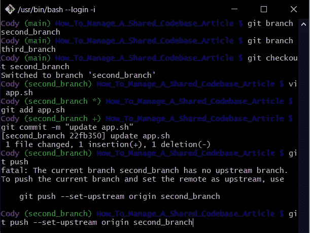

(1)创建 second_branch，(2)创建 third_branch，(3)切换到 second_branch，(4)用 vi 编辑 app.sh，(5) git add 选择我更改的要提交的文件，(6)提交 app.sh 文件更改，(7)明知会失败仍尝试推送，(8)复制命令以设置上游并推送 second_branch

项目的当前状态是*主*分支仍然有 **app.sh** 和消息“ **Hello world** ”，而*次 _ 分支*有来自次分支的更新消息“ **Hello world！**”。我们已经推出了第二个分支。如果我们愿意，我们可以立即将 *second_branch* 合并到 *main* 中，而不会像第一次那样发生冲突。然而，我们想要模拟一个冲突的变化。回到我们的终端或 git bash，让我们切换到 *third_branch* 并添加另一个更改:

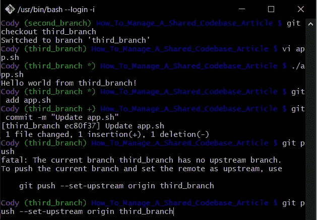

(1)切换到 third_branch，(2)使用 vi 编辑 app.sh，(3)运行 shell 脚本以查看更改，(4) git 添加要提交的文件，(5)将文件提交到 third_branch，(6)明知推送会失败仍尝试推送，(7)从错误消息中获取设置上游的命令，并将我们的新 third_branch 推送到 GitHub

在上面的图片中，你会看到我切换到 *third_banch* 并更改了消息“ **Hello World！**【到】**你好来自第三分局！**"在 vi 编辑器中。信息是"**你好，世界！**“因为我们创建了*第三 _ 分支*作为*主*分支的副本——它不知道我们对*第二 _ 分支*所做的更改。在设置我们的上游并将我们的*第三 _ 分支*推送到 GitHub 之后，我们的 GitHub 页面将会为我们的两个更新分支中的每一个分支提供一个“**比较&拉取请求**”提示，如下所示:

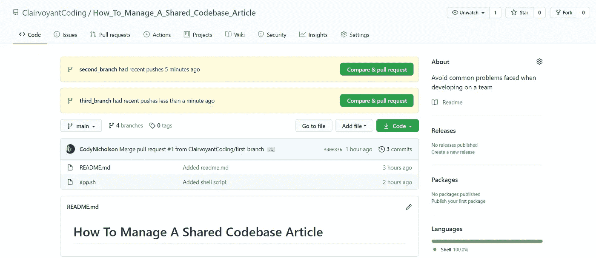

看到两个分支都成功推送到 GitHub

先合并 *second_branch* 吧。我们点击相应的“**比较&拉动请求**按钮，然后我们看到绿色的“**能够合并。**"间*主* & *次 _ 分支*下一页:

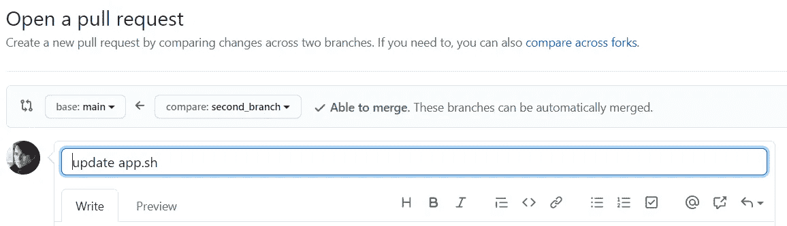

注意 second_branch 能够自动合并

我们点击绿色的“**打开拉式请求** t”按钮，然后点击“**合并拉式请求**”按钮，并且*第二 _ 分支*自动合并到*主*中，因为没有冲突的变更。之后，我们的*主*分支 **app.sh** 会有“**回音‘来自二分支的你好世界！’**”。

现在，让我们单击 GitHub 页面上看到的 *third_branch* 提示符的绿色“**Compare&pull request**”按钮。现在代替绿色的**能够合并。**“我们习以为常的消息—我们会看到红色的“**无法自动合并**”消息:

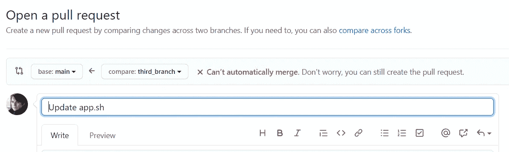

无法自动合并，因为我们对 third_branch 所做的更改与我们对已经合并的 second_branch 所做的更改相冲突

如果 GitHub 不能自动合并我们的分支，我们就不应该创建 pull 请求。相反，我们应该在本地存储库中解决 *third_branch* 中的合并冲突，然后将我们的更改推送到 GitHub。这意味着——我们应该用来自*主*分支的最新变化更新我们的*第三分支*,然后将结果*第三分支*推送到 GitHub。这个更新的 *third_branch* 将能够自动与 *main 合并。*

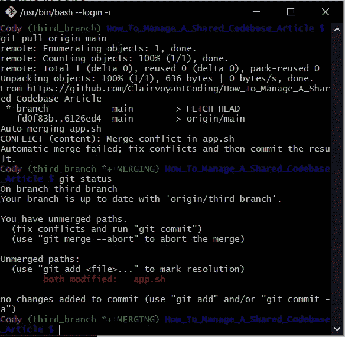

(1)将主分支的最新更改拉入 third_branch，这样我们可以解决冲突，(2)运行“git status”来查看哪些文件是冲突的

上面你会看到我从第三个分支开始。从那里我运行"**git pull origin main**"——这意味着在线访问 GitHub 存储库，并将 *main* 分支上的更改拉入当前分支。如果你看看我的 git bash 中括号内的绿色消息——它从“ **(third_branch)** ”变成了“**(third _ branch *+| MERGING)**”，因为我们现在正在本地将 *main* 合并到 *third_branch* 中，而不是在 GitHub 上。运行“ **git status** ”将向我们显示合并中的冲突文件，但在这种情况下，唯一的冲突文件是 **app.sh** 。让我们看看 **app.sh** 内部的冲突是什么:


(1)使用“cat”命令查看冲突文件 app.sh 的内容

正如您在上面看到的，git 自动将所有冲突的更改放到我们的文件中。<<<<<<< HEAD” and “||||||| fd0f83b” you can see the changes from *第三 _ 分支*之间。在“|||||| fd0f83b”和“=======”之间可以看到 *third_branch* 最初从 *main* 分支时的原始状态。最后，在“=======”和“>>>>>>>6126…”之间，可以看到*主*分支的当前状态。

Git 不知道哪个更改是正确的，这就是为什么它不能自动为我们合并代码。Git 向我们展示了所有的变更，因此我们可以自己决定保留哪些变更。因此，我将删除除了来自*第三 _ 分支*的最新更改之外的所有内容:

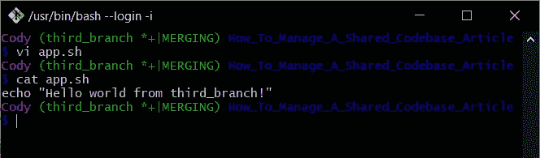

(1)使用 vi 来编辑文件以删除除了 third_branch 内容之外的所有内容，(2)使用“cat”来查看更新的文件

现在我们已经解决了合并冲突，我们可以 **git 添加**、 **git 提交**，以及 **git 推送**我们手动合并的代码:

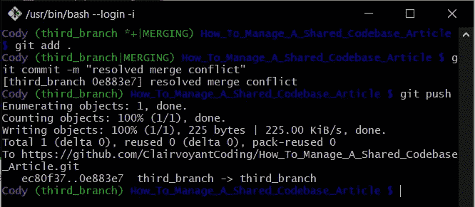

(1)使用 git add 选择要提交的更新文件，(2)使用描述变更的消息提交更新文件，(3)将对 third_branch 的变更推送到 GitHub

将 *third_branch* 推至 GitHub，会提示我们点击“**比较&拉取请求**按钮:

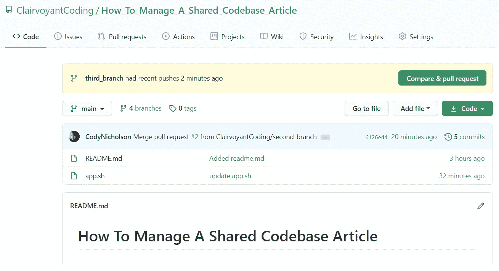

看到在 GitHub 上为我们更新的 third_branch 创建一个拉请求的消息

在打开*第三分支*和*主*之间的新拉动请求后，我们看到绿色的“**能够合并**”消息，因为我们的冲突现已解决:

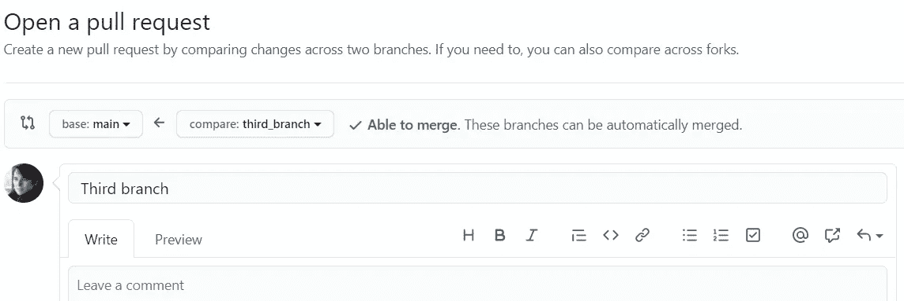

我们现在能够自动合并，因为我们解决了我们的冲突变更

我们可以点击**创建拉式请求**按钮。在“拉取请求”页面上，我们可以单击“**合并拉取请求**”，我们的更改将自动合并到 *main* 中。现在我们已经合并了我们的 pull 请求，我们可以返回到我们的 terminal/git bash，并将本地存储库的主分支与在线存储库同步:

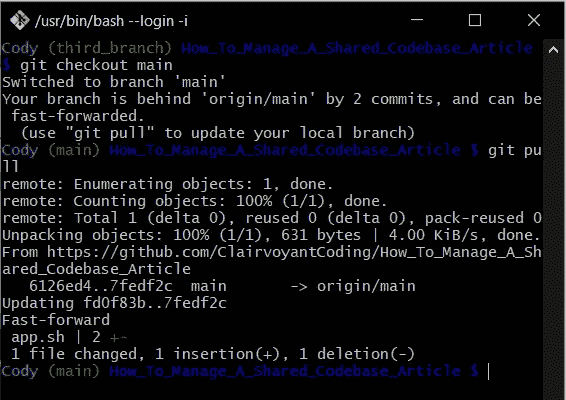

(1)切换主分支，(2)使用“git pull”来更新我们的本地 git 存储库，我们将这些更改合并到 GitHub 上的主分支中

# 5.其他需要了解的有用信息

完成前四个步骤后，我们可以返回 GitHub，点击工具栏选项中的**提交**，我们会看到:

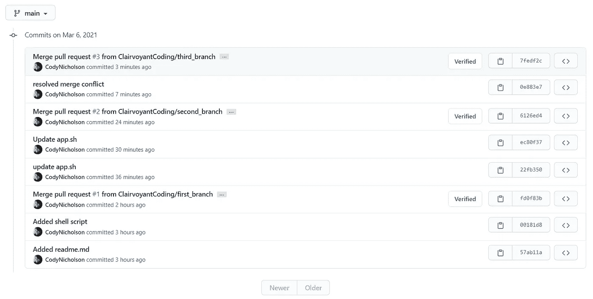

查看主分支上的所有提交，并查看我们创建的合并提交

在这里我们可以看到*主*分支上的所有提交，并且我们可以切换到其他分支来查看它们的提交。当学习使用 Git 和 GitHub 进行协作时——理解项目的历史如何随时间演变是很重要的。我鼓励你查看每个“**合并拉取请求**”提交，看看合并拉取请求如何改变项目的历史。

GitHub 上另一个有用的页面是分支页面，你可以从你的 GitHub 库主页点击[工具栏选项**分支**进入。在这里，我们可以看到我们推送到 GitHub 的所有分支——您会注意到，所有分支都已经被合并了。通常在我们合并一个分支后，我们可以通过点击下面的红色垃圾桶图标来删除这个分支。](https://github.com/ClairvoyantCoding/How_To_Manage_A_Shared_Codebase_Article/branches)

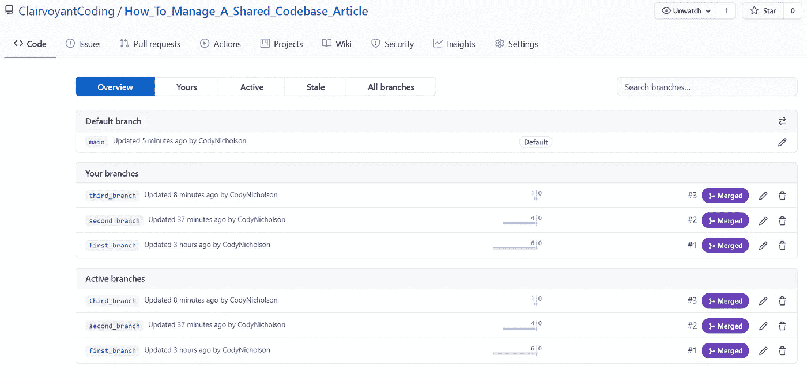

查看 GitHub 上的所有分支

感谢阅读！我很乐意听到你的反馈或回答你的任何问题，所以请在下面评论，我会尽力帮助你。