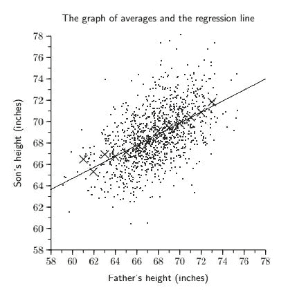
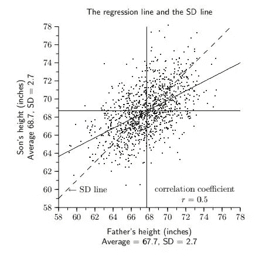
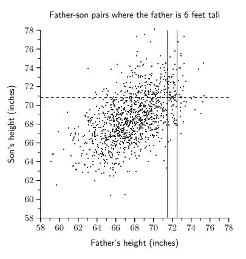

# 父亲的身高如何影响儿子的身高

> 原文：<https://towardsdatascience.com/how-the-fathers-height-influences-the-son-s-height-62ea0339638d?source=collection_archive---------8----------------------->

照片由 [Unsplash](http://unsplash.com) 上的 [vivek kumar](https://unsplash.com/@vikceo) 拍摄

假设男性的平均身高是 67.7 英寸(172 厘米)。如果一个男人有 72 英寸(183 厘米)高，他成年的儿子会有多高？

你的第一反应可能是:“哦，这很简单。儿子会和他爸爸一样高。”

虽然 72 英寸(183 厘米)是儿子身高的一个可能的猜测，但从统计学的角度来看，可能性不大。

# 相关性、回归和标准差

相反，我们应该收集父亲身高为 72 英寸(183 厘米)的儿子的平均身高数据。

然后，我们将对身高 58 英寸(147 厘米)、59 英寸(150 厘米)、60 英寸(152 厘米)、61 英寸(155 厘米)的父亲重复上述步骤，直到 78 英寸(198 厘米)。

接下来，我们可以绘制父亲身高(x 轴)和儿子身高(y 轴)的平均值图。标绘的点“x”表示父亲具有特定身高的儿子的平均身高。

回归线是方程 y=a+bx 的最佳拟合线。由于回归线是一条斜率为 b 的直线，所以斜率 b 就是回归系数。相关系数为 [0.5](http://people.stat.sfu.ca/~lockhart/richard/101/12_1/lectures/regression/web.pdf) 。

现在我们可以看到，父亲的身高和儿子的身高是正相关的，但仅仅是通过 0.5 的相关系数。请注意，标准差(SD)线的斜率没有回归线的斜率陡。父亲的身高每增加 1 SD，儿子的身高仅增加 0.5 SD。

皮尔森父子数据(通过芝加哥大学)

如果你是一个中等身高的男人，你可以期待你的儿子比你高几英寸(厘米)。

这是因为回归线和 SD 线都在平均高度处重合。例如，平均身高为 67.7 英寸(172 厘米)的父亲将会有一个 68.7 英寸(175 厘米)高的儿子。

然而，如果你比平均水平高得多或矮得多，预测显然会更棘手。

一个 78 英寸(198 厘米)高的男人会有一个 74 英寸(188 厘米)高的儿子。对于一个非常高的人来说，他的儿子会比他矮大约 4 英寸(10 厘米)。他的儿子仍然会比一般人高。

一个 58 英寸(147 厘米)高的男人会有一个 63.5 英寸(161 厘米)高的儿子。对于一个非常矮的人来说，他的儿子将比他高 5.5 英寸(14 厘米)。他的儿子仍然会比平均水平矮。

对于特别高或特别矮的父亲来说，他们的儿子会比平均水平高或矮，但不会比他们的父亲高那么多。

# 回到我们的问题

对于一个父亲身高 72 英寸(183 厘米)的人，我们应该通过在人口统计学中对父子身高和父亲身高 72 英寸(183 厘米)的儿子平均身高的回归相关性进行折衷来预测成年儿子的身高。我们对成年儿子身高的最佳猜测应该是回归平均值。

根据英国 1078 对父子身高的实际数据，对于身高 72 英寸(183 厘米)的父亲来说，他们的儿子平均身高为 71 英寸(180 厘米)。

皮尔森父子数据(通过[芝加哥大学](https://galton.uchicago.edu/~wichura/Stat200/Handouts/C10.pdf)

# 为什么父亲的身高只是等式的一部分

芝加哥大学的研究人员试图解释这一现象。

首先，我们的身高受父母身高的遗传影响。上述研究没有明确考虑母亲的身高。

从统计数据来看，平均身高的女性比比平均身高高几个标准差的特别高的女性要多得多。因此，一个特别高的男人很有可能会娶一个不特别高的女人，这样他们的儿子就不会像父亲一样特别高。

其次，我们的身高不仅仅是由基因或遗传因素决定的。还会受到营养、运动等环境因素的影响。

1884 年，博学的统计学家弗朗西斯·高尔顿招募了 1 万人来测量父母和孩子的身高。他付给每个参与者 3 便士。他发现孩子们的身高与总体平均值的偏差大约是他们父母偏差的三分之二[。](https://higherlogicdownload.s3.amazonaws.com/AMSTAT/1484431b-3202-461e-b7e6-ebce10ca8bcd/UploadedImages/Classroom_Activities/HS_6_Correlation_Francis_GALTON.pdf)

用高尔顿的话来说，当父母身高低于平均水平时，他们的孩子往往比他们矮。当父母比均值矮时，他们的孩子往往比他们高。