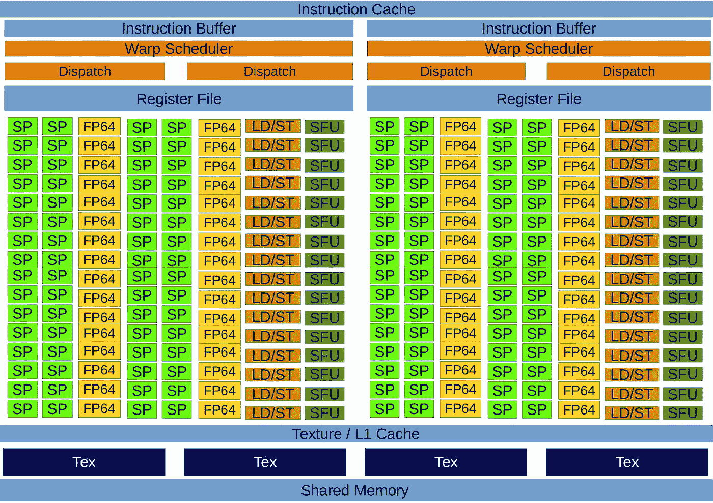

# GPU 到底怎么这么快？沿着 Nvidia CUDA-GPU 架构的 HPC 之旅。从零到现在。

> 原文：<https://towardsdatascience.com/how-the-hell-are-gpus-so-fast-a-e770d74a0bf?source=collection_archive---------19----------------------->

Rafael Pol 在 [Unsplash](https://unsplash.com?utm_source=medium&utm_medium=referral) 上的照片

有人将机器学习定义为数学(算法)、工程(高性能计算)和人类能力(经验)之间的完美和谐。因此，这些领域的任何进展都将有助于机器学习的发展。今天轮到了 HPC，具体来说，我们正在讨论 GPU 的进步。

Nvidia 刚刚宣布了其基于 Ampere 架构的 [Geforce RTX 30 系列](https://www.anandtech.com/show/16057/nvidia-announces-the-geforce-rtx-30-series-ampere-for-gaming-starting-with-rtx-3080-rtx-3090) (RTX3090，RTX3080，RTX3070)。安培是我们最喜欢的 GPU 品牌的最后一个架构，但迄今为止已经发布了几代支持 CUDA 的 GPU。在接下来的段落中，我将从头到尾描述 CUDA 架构的全球概况。今天，让我们一起驾驶有趣的道路，从费米到安培。但是在深入讨论细节之前，如果你不熟悉 GPU 计算，我强烈建议你访问我之前关于 CUDA 执行模型的文章。

遵循 Nvidia GPUs 的自然时间轴，该公司于 2001 年首次生产了一款能够进行可编程着色的芯片，Playstation 2 和 Xbox 使用的[*【GeForce 3】*](https://en.wikipedia.org/wiki/GeForce_3)*。在 GeForce 3(代号 *NV20* )之前，还有其他一些:NV1 (1995)、NV3 (1997)、NV4 (1998)、NV5 (1999)、GeForce I(1999 年年底)和 GeForce II (2000)。然而，GeForce 3 可能是第一款受欢迎的 Nvidia GPU。*

*指出 Nvidia 世界中目标类别和架构之间的差异是很有趣的，这可能会让读者感到困惑。传统上，Nvidia 为每个目标客户类别设计了不同类型的产品，为四种不同的产品命名:GeForce、Quadro、Tesla 和(最近的)Jetson 尽管这四种产品内部使用的基础架构是相同的。用 Nvidia 的话说，他们四个拥有相同的计算能力。GeForce 系列专注于桌面和游戏玩家；Quadro 被认为是为制作视频内容的工作站和开发者设计的；而特斯拉是为超级计算机和高性能计算设计的。最后，Jetson 系列在芯片中包含嵌入式 GPU。*

*正如我们刚才在上面看到的，Nvidia 在 90 年代初开始了它的冒险，专注于 grapichs 的 GPU，但我们直到 2007 年才开始使用第一个 CUDA 架构: [Tesla](http://developer.download.nvidia.com/compute/cuda/1.0/NVIDIA_CUDA_Programming_Guide_1.0.pdf) (是的，你是对的，他们后来为一个产品线使用了相同的架构名称，这就是为什么我说它可能会令人困惑)。Tesla 是一个非常简单的架构，所以我决定直接从 Fermi 开始，它引入了纠错码存储器，真正改善了上下文切换、存储器层次结构和双精度。*

# *费米体系结构*

*每个费米流式多处理器(SMI)由 32 个 CUDA 内核(流式处理器)、16 个加载/存储单元(LD/ST 单元)组成，以解决每个时钟 16 个线程的内存操作、四个特殊功能单元(SFU)以执行超越数学指令、一个内存层次结构和 warp 调度程序。*

**

*费米流式多处理器(*图片作者**

*该板有六个 64 位内存分区，带有一个 384 位内存接口，支持高达 6 GB 的 GDDR5 DRAM 内存。CPU 通过 PCI-e 总线连接到 GPU。每个 CUDA 内核都有一个全流水线算术逻辑单元(ALU)和一个浮点单元(FPU)。为了执行双精度，32 个 CUDA 内核可以执行 16 个 FP64 单元。每个 SM 有两个 warp 调度程序，可以同时发布和执行 2 个 warp。*

*这种架构的一个关键部分是内存层次结构。它引入了 64 KB 的可配置共享内存和每个 SM 的 L1 缓存，可以配置为 16 KB 的 L1 缓存和 48 KB 的共享内存；或者 16 KB 的共享内存和 48 KB 的 L1 缓存。尽管 CPU L1 缓存是为空间和时间局部性而设计的，但 GPU L1 仅针对空间局部性进行了优化。频繁访问缓存的 L1 内存位置不会增加命中数据的可能性，但是当几个线程访问相邻的内存空间时，这是很有吸引力的。768 KB 的 L2 缓存是统一的，由服务于所有操作(加载、存储和纹理)的所有 SMs 共享。两个缓存都用于在本地和全局内存中存储数据，包括寄存器溢出。但是，需要配置是在 L1 和 L2 缓存读取数据，还是仅在 L2 缓存。这种架构被称为*计算能力 2.x* ，这是 Nvidia 专门用来描述 GPU 硬件版本的术语，由主版本号(左数字)和次版本号(右数字)组成。具有相同主要修订号的器件属于相同的核心架构，而次要修订号对应于核心架构的增量改进。*

**

*费米记忆层级(*图片作者*)*

# *开普勒建筑*

*开普勒包括多达 15 个 SMs 和 6 个 64 位内存控制器。每个 SM 有 192 个单精度 CUDA 核，64 个双精度单元，32 个 sfu，32 个 LD/ST 单元和 16 个纹理单元。*

**

*开普勒流式多处理器(*图片作者**

*此外，四个 warp 调度器，每个调度器有两个调度单元，允许四个 warp 并发执行。它还增加了每个线程访问的寄存器数量，从 Fermi 中的 63 个增加到 255 个；它引入了 shuffle 指令，并通过在全局内存中引入对 FP64 原子的本机支持来改进原子操作。它还介绍了 CUDA 动态并行性，即从内核启动内核的能力。此外，内存层次的组织方式与费米相似。*

**

*开普勒记忆层次(*图片作者**

*64 KB 共享内存/L1 缓存通过允许在 L1 缓存和共享内存之间进行 32 KB/32 KB 分割而得到改进。它还将共享内存库宽度从 Fermi 中的 32 位增加到 64 位，并引入了 48 KB 只读数据缓存来缓存常量数据。L2 缓存也增加到 1536 KB，使费米 L2 缓存容量翻倍。此外，开普勒计算能力用 *3.x* 代码表示。*

# *麦克斯韦建筑*

*Maxwell 由多达 16 个 SMs 和 4 个内存控制器组成。每个 SM 都经过重新配置，以提高性能功耗比。它包含四个 warp 调度器，每个能够在每个时钟周期为每个 warp 发送两条指令。SM 分为四个 32-CUDA 核心处理模块，每个模块有八个纹理单元、八个 sfu 和八个 LD/ST 单元。*

**

*麦克斯韦流多处理器(*图片作者*)*

*关于内存层次，它具有 96 KB 的专用共享内存(尽管每个线程块最多只能使用 48 KB)，而 L1 缓存与纹理缓存功能共享。L2 缓存提供 2048 KB 的容量。内存带宽也增加了，从 Kepler 中的 192 GB/秒增加到 224 GB/秒，并且在共享内存中引入了对 FP32 原子的本机支持。麦克斯韦被表示为计算能力 *5.x* 。*

**

*麦克斯韦记忆层次(*图片作者*)*

# *帕斯卡建筑*

*Pascal 板由多达 60 个 SMs 和 8 个 512 位存储控制器组成。每个 SM 有 64 个 CUDA 内核和 4 个纹理单元。它拥有与开普勒和麦克斯韦相同数量的寄存器，但是提供更多的 SMs，因此总的来说有更多的寄存器。它被设计为比以前的架构支持更多的活动经线和线程块。共享内存带宽加倍，以更高效地执行代码。它允许加载/存储指令的重叠，以提高浮点利用率，也改善了 warp 调度，其中每个 warp 调度器能够在每个时钟分派两个 warp 指令。CUDA 核心能够处理 16 位和 32 位指令和数据，有利于深度学习程序的使用，但也为数值程序提供了 32 个 FP64 CUDA 核心。全局内存本机支持也扩展到包括 FP64 原子。*

**

*Pascal 流多处理器(*图片作者**

*内存层次结构配置也发生了变化。每个内存控制器都连接到 512 KB 的 L2 缓存，提供 4096 KB 的 L2 缓存，并引入 HBM2 内存，提供 732 GB/s 的带宽。它为每个 SM 提供 64 KB 的共享内存，以及一个 L1 缓存，也可用作纹理缓存，作为合并缓冲区来提高 warp 数据的局部性。它的计算能力用 *6.x* 代码来表示。*

**

*帕斯卡记忆层次(*图片作者*)*

*最后介绍了 NVLink 技术。背后的想法是，任何 4-GPU 和 8-GPU 系统配置都可以处理相同的问题。甚至，几组多 GPU 系统正在使用 InfiniBand 和 100 Gb 以太网互连，以形成更大、更强大的系统。*

# *沃尔特建筑公司*

*一个 Volta 板有多达 84 个 SMs 和 8 个 512 位存储控制器。每个 SM 有 64 个 FP32 CUDA 核心，64 个 INT32 CUDA 核心，32 个 FP64 CUDA 核心，8 个用于深度学习矩阵运算的张量核心，32 个 LD/ST 单元，16 个 sfu。每个 SM 分为 4 个处理模块，每个模块包含一个新的 L0 指令高速缓存，以提供比以前的指令缓冲区更高的效率，以及一个带有调度单元的 warp 调度程序，这与 Pascal 的 2 分区设置(每个子内核 warp 调度程序有两个调度端口)相反。这意味着 Volta 失去了在单个时钟周期内从一个线程发出第二条独立指令的能力。*

**

*Volta 流式多处理器(*图片作者*)*

*引入了合并的 128 KB L1 数据缓存/共享内存，提供了 96 KB 的共享内存。HBM2 带宽也得到了提高，达到 900 GB/s。此外，完整的 GPU 包括总共 6144 KB 的 L2 缓存，其计算能力用 *7.0* 代码表示。*

**

*伏打记忆层级(*图片作者*)*

*但是，最大的变化来自于它的独立线程调度。以前的体系结构以 SIMT 方式执行扭曲，其中 32 个线程共享一个程序计数器。在发散的情况下，活动掩码指示在任何给定时间哪些线程是活动的，留下一些线程是不活动的，并串行化不同分支选项的执行。Volta 包括一个程序计数器和每个线程的调用堆栈。它还引入了一个调度优化器，用于确定来自同一 warp 的哪些线程必须一起执行到 SIMT 单元中，从而提供更多的灵活性，因为线程现在可以在子 warp 粒度上分叉。*

*Volta 的最新突破性功能被称为*张量核心*，与之前的帕斯卡 P100 加速器相比，它的深度学习应用速度提高了 12 倍。它们本质上是混合精度 FP16/FP32 内核阵列。640 个张量核中的每一个都在 4x4 矩阵上运行，它们相关的数据路径是定制设计的，以提高这种矩阵上的浮点计算吞吐量。每个张量核每时钟执行 64 次浮点融合乘加(FMA)运算，为训练和推理应用提供高达 125 TFLOPS。*

*此外，第二代 NVLink 为多 GPU 系统配置提供了更高的带宽、更多的链路和改进的可扩展性。Volta GV100 支持多达 6 条 NVLink 链路和 300 GB/秒的总带宽，而 GP100 支持 4 条 NVLink 链路和 160 GB/秒的总带宽。*

# *图灵(不是全新的)架构*

*NVIDIA 首席执行官黄仁勋[就 Pascal、Volta 和 Turing 之间的架构差异提供了一个有趣的](https://seekingalpha.com/article/4199978-nvidia-corporation-nvda-ceo-jensen-huang-q2-2019-results-earnings-call-transcript)回复。基本上，他解释说伏打和图灵有不同的目标市场。Volta 旨在用于大规模培训，最多可连接八个 GPU，具有最快的 HBM2 和其他专门针对数据中心的功能。另一方面，图灵在设计时考虑了三个应用:专业可视化、视频游戏和使用张量核的图像生成。实际上，图灵拥有和 Volta 一样的计算能力， *7.x，*这就是为什么我说图灵不是一个全新的架构。*

*最显著的成就:使用 GDDR6 内存和引入 RT 内核，能够渲染视觉上逼真的 3D 游戏和复杂的专业模型:*

**

*图灵流式多处理器。来源:[英伟达](https://www.nvidia.com/content/dam/en-zz/Solutions/design-visualization/technologies/turing-architecture/NVIDIA-Turing-Architecture-Whitepaper.pdf)*

*像 Volta 一样，图灵 SM 被分成 4 个处理模块，每个模块都有一个 warp 调度程序和调度单元。图灵几乎等同于 Volta 在两个周期内执行指令，但调度程序可以在每个周期发出一条独立的指令。此外，与 Pascal 的 per-warp 不同，Volta 和 Turing 有每个线程的调度资源，每个线程有一个程序计数器和堆栈来跟踪线程状态。*

# *安培架构*

*最新的 CUDA 架构被称为 Ampere，提供了迄今为止最高的 GPU 性能。有人在这里做了一个真正完整的回顾，我强烈推荐。*

*每个 Ampere SM 包含四个处理模块，每个模块都有用于数据缓存的 L0 缓存、warp 调度器、16 个 INT32 CUDA 内核、16 个 FP32 CUDA 内核、8 个 FP64 CUDA 内核、8 个 LD/ST 内核、一个用于矩阵乘法的张量内核和一个 16K 32 位寄存器文件。每个 SM 都有一个 192 KB 的组合共享内存和 L1 数据缓存；在 GPU 级别，它有 40MB 的 L2 缓存来提高性能(比 Volta 中的 V100 大 7 倍)。L2 缓存分为两个分区，以实现更高的带宽。*

**

*安培流式多处理器。来源:[英伟达。](https://www.nvidia.com/content/dam/en-zz/Solutions/Data-Center/nvidia-ampere-architecture-whitepaper.pdf)*

*GA100 GPU 芯片由 128 个 sm 组成，但主要是因为-营销-制造，不同的安培 GPU 只会启用其中的一部分。比如 A100 GPU 只暴露 108 条短信。总之，完整的 GA100 由 8 个 GPC 组成，每个 GPC 有 16 个 SM 和 6 个 HBM2 堆栈。在 A100 GPU 的情况下，这被转换为 40 GB 的 HBM2 DRAM 存储器，速度为 1555 GB/s。*

*它还引入了第三代 NVIDIA 张量内核(继 Volta 和 Turing 之后)，允许它每时钟计算 8×4×8 混合精度矩阵乘法(将 8×4 矩阵乘以 4×8 矩阵)。例如，每个 A100 张量核每时钟执行 256 个 FP16 FMA(融合乘加)运算。Ampere 在其张量核上支持许多数据类型，包括 FP16、BF16、TF32、FP64、INT8、INT4 和 Binary。*

*最后在 Ampere 上呈现第三代 NVLink。在 A100 GPU 的情况下，它有 12 个 NVLink 链接，总带宽为 600 GB/s，用于多 GPU 计算。关于 PCIe 连接，A100 GPU 支持 PCIeGen 4，它提供每个方向 31.5 GB/秒的带宽(用于 x16 连接)，是 PCIe 3 的两倍带宽。*

# *参考*

*[费米白皮书](https://www.nvidia.com/content/PDF/fermi_white_papers/NVIDIAFermiComputeArchitectureWhitepaper.pdf)*

*[开普勒白皮书](https://www.nvidia.com/content/dam/en-zz/Solutions/Data-Center/tesla-product-literature/NVIDIA-Kepler-GK110-GK210-Architecture-Whitepaper.pdf)*

*[麦斯威尔白皮书](https://www.microway.com/download/whitepaper/NVIDIA_Maxwell_GM204_Architecture_Whitepaper.pdf)*

*[帕斯卡白皮书](https://images.nvidia.com/content/pdf/tesla/whitepaper/pascal-architecture-whitepaper.pdf)*

*[沃尔特白皮书](https://images.nvidia.com/content/volta-architecture/pdf/volta-architecture-whitepaper.pdf)*

*[图灵白皮书](https://www.nvidia.com/content/dam/en-zz/Solutions/design-visualization/technologies/turing-architecture/NVIDIA-Turing-Architecture-Whitepaper.pdf)*

*[安培白皮书](https://www.nvidia.com/content/dam/en-zz/Solutions/Data-Center/nvidia-ampere-architecture-whitepaper.pdf)*

*[GPU 上的并行算法](http://gac.des.udc.es/tesis/AdrianPerezDieguez.pdf)*