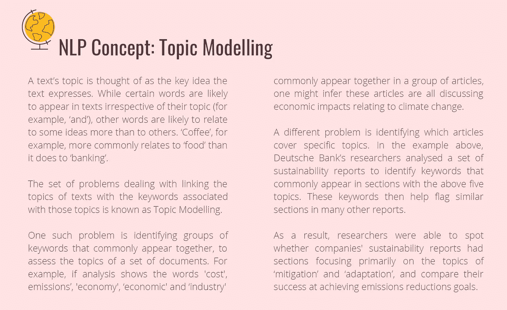
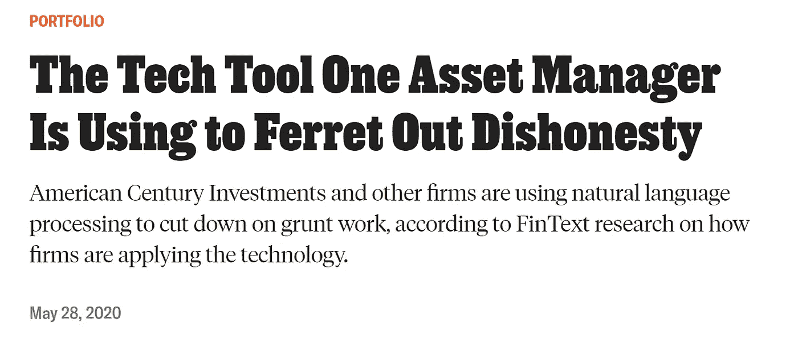

# 大型投资公司如何使用 NLP

> 原文：<https://towardsdatascience.com/how-the-large-investment-firms-use-nlp-822c7c79af96?source=collection_archive---------19----------------------->

## 调查游戏的当前状态

资料来源:Pexels

金融服务行业正在爱上文本处理，也称为自然语言处理(NLP)。

这种迷恋是必然的，因为投资公司淹没在文本数据中:分析、新闻、合同、合规报告…

金融部门确实喜欢内部技术。在硅谷之外，投资银行尤其以绝对的热情拥抱工程人才。尽管这一过程在 2008 年金融危机前就已经开始，但随后的监管通过创造对更好数据解决方案的需求加速了这一过程。

还有激励因素需要考虑。这是一个渴望赢得市场优势的行业；通过不同的方式处理数据，耳朵往往会对了解更多的前景感到兴奋，特别是如果这有助于一个好故事。

我在金融服务和自然语言处理的交叉领域已经有一段时间了，去年年底我决定收集尽可能多的信息来回答这个问题:

银行和资产管理公司是如何使用自然语言处理的？

我决定把我找到的案例研究收集成一个白皮书——
[**【金融如何使用自然语言处理——银行和投资管理中的 8 个案例研究】**](https://www.fintext.io/how-finance-uses-nlp/) 。

主要目的是让金融业内人士了解 NLP 现在提供的可能性。(披露:我是 FinText 的创始人)。

为此，报告还定义了关键的自然语言处理和机器学习概念(主题建模、命名实体识别、特征选择等)。)，清楚地展示出来，以便任何人都可以理解:

然而，当我在编纂这部作品时，我被某些发现震惊了。

我觉得与可能已经熟悉 NLP，但不一定熟悉金融服务领域的人分享它们会很好。今天我想在这里与你们分享的就是这些发现。

我相信，它们的相关性超越了金融领域的细节，延伸到了任何其他希望利用文本分析的非科技领域。

# **1。在金融 NLP 中，从熟悉的**开始

自 2017 年底以来，通过引入迁移学习和变形金刚，自动语言处理取得了长足的进步。

最重要的是，NLP 似乎每周都有所改善。除了模型，还有工具、语料库和学习资源。很快，这些复合收益开始增加。

但是，当您看到金融服务中实际文本处理应用程序所使用的技术时，它并不是技术的前沿。

总的来说，NLP 的概念在这个领域已经被熟悉和建立:嵌入，术语加权方案，聚类，从零开始训练分类器。

一般来说，投资公司面临的问题往往是规模和效率的问题:在许多情况下，你的目标是实现与五年前类似的事情，同时处理*更多的*数据*或*更少的*人员。因此，自动化凭借自身的力量从“美好到必须”变成了一种金融杠杆。*

不可否认，由于我正在收集公开可用的信息，可能许多当前的项目——尚未公开——正在使用大规模的大型模型。总的来说，我认为不太可能。

一个原因是内部金融 NLP 应用程序的开发考虑到了回报。技术的使用既不是为了技术本身，也不是为了抽象的研究。虽然实验肯定会发生，但它是为了解决非常具体的业务问题。在这种背景下，首先尝试既定的想法是有意义的。

部署更普通技术的第二个原因是许多水果挂得非常低。与处理大量杂乱数据集的任何领域一样，主要的工作是将数据集中在一起并进行清理。但是，就你能从数据中提取的价值而言，在你开始看到切实的收益之前，不需要太多的魔法。

# **2。求解优化内部流程**

虽然 NLP 对彭博和路孚特(Thompson Reuters 的市场数据服务)等数据提供商来说并不陌生，但我主要专注于研究内部发展。

第一个原因是，处于金融服务和 NLP 交叉点的许多提供商倾向于向内看。他们关注的是“如何”(看！我们正在使用这项非常酷的技术！)而不是在‘什么’上(这是我们神奇解决的问题)。

这种心态可能对很多有技术背景的人来说都很熟悉。人们攻击新技术是因为他们喜欢它，因此假设每个人都会喜欢它，如果他们愿意坐下来听的话。

然而，在金融服务业，高管们很少关心科技。即使在高盛或复兴资本(这两家公司对技术非常有战略眼光)，高管们仍然会更关心下一次胜利，而不是那个很酷的新玩意儿。

选择专注于内部开发的另一个原因是来自英格兰银行的证据，即当公司寻求部署 ML 技术时，他们喜欢首先在内部进行试验。

摘自:《英国金融服务业的机器学习》，2019 年 10 月

当谈到内部财务文本分析时，很快就发现解决问题实际上是理解业务流程。

**相对于解决方案补充现有工作流程的能力而言，技术扮演着次要角色**。

金融公司内部的动力因素是巨大的:真正改变一个过程是缓慢的。减少阻力的途径是温和地从正常做事的方式中消除痛点。

因此，最划算的方法是了解人们在处理文本数据时是如何一步一步地工作的。

为了说明这一点，这里有一个银行内部 NLP 应用程序的示例，它针对的是更广泛流程中的一个特定难点:

金融服务公司从许多不同的源系统接收特定于公司的数据。然而，不存在在不同数据源之间一致共享的单一公司标识符。因此，将不同的数据集与内部使用的名称进行匹配可能很困难，因为不同数据集之间的公司名称可能不同。

想到的直接解决方案是维护某种形式的基于规则的数据库。但是有一家银行抓住了这个特定的痛点，并使用嵌入和 TF-IDF 解决了这个问题，将每个公司名称视为一个“文档”并匹配相似的文档。

# **3。金融 NLP 的爆发时刻尚未到来**

一方面，我看到所有这些内部驱动的 NLP 应用程序，在跨越几乎每个部门的业务领域中萌芽，从研究到后台，从客户服务到营销。

事实上，我遇到的案例研究比实际写进报告的要多得多。例如，我没有提到 BNY-梅隆银行自动筛选电子邮件，将它们导向相关部门，或者苏格兰皇家银行将一些自然语言处理技术整合到预测客户流失的模型中。

我还遇到了几个大银行入股它们正在培育的小初创公司的例子(比如摩根大通入股 Limeglass，或者 ing 入股 Eigen Technologies)。这再次强调了过程的重要性——解决方案正在现实生活中得到完善。

然而，我收集的信息是*难以置信地*分散:一些新闻、晦涩的报道、meetup 演示、内部技术团队偶尔写的博客文章。

似乎没有任何业内人士支持 NLP，没有专业媒体，没有会议。总的来说，我看到了巨大的内部改进空间，但没有跨行业的讨论。

因此，尽管金融服务中的人工智能或机器学习已经成为热门话题，但金融服务中的 NLP 尚未成为一个主题。如果要我猜的话，我会说这可能会在未来几年内改变:

多年来，技术一直在使金融服务商品化，相互竞争的公司现在倾向于遵循类似的过程。当一家公司做出能产生巨大收益的改进时，它的竞争对手往往会紧随其后。不是马上(这些是要驾驶的大船)，而是最终。

新冠肺炎的经济影响只是一个额外的推动，因为公司会寻求充分利用他们的资源。预计未来几年银行和资产管理公司会有更多的用例，这是一个相当安全的赌注。

# **4。NLP 间接影响交易策略**

基于新闻建立股票预测现在是一种常见的机器学习练习。然而在实践中，大多数投资公司并没有使用文本数据流来设计交易策略。

部分原因在于投资的销售方式。就像超市不提供杂乱无章的食品，而是按照岛屿和区域来划分商品一样，投资产品是按照特定的类别销售的——尤其是面向大规模的专业投资者(比如养老基金)。

主题产品往往会吸引散户观众(对你我这样的普通人来说是行话)，但它们会与其他小众讲故事产品竞争:气候变化 ETF、科技追踪产品、专注于大麻的产品等。等等。

事实上，旨在跟踪新闻、博客和推文中提到最多的公司的 BUZZ perspective ETF 最终因投资者缺乏兴趣而倒闭。

总的来说，金融公司大多使用替代数据来检测隐藏的信号——好的和坏的。举例来说:请注意我们的报告是如何被行业顶级出版物报道的:

查出不诚实的行为。来源:[机构投资者](https://www.institutionalinvestor.com/article/b1ltqtf5drgq6j/The-Tech-Tool-One-Asset-Manager-Is-Using-to-Ferret-Out-Dishonesty)

这些信号会在更广泛的投资过程中发挥作用。当退一步总体审视这些案例时，你会发现银行和投资经理实际上在问自己:

**在当前过度饱和的数据环境中，消息灵通意味着什么？**

鉴于文本数据的爆炸式增长，这个问题只会变得更加紧迫。

# 摘要

让我们一起考虑这四个发现:

1.成熟的技术已经提供了大量的潜力。
2。解决内部瓶颈是当务之急。
3。许多人还没有意识到 NLP 的好处。知识是分散的。
4。在投资方面，用例并不是要打败某个指数。

第一个和第三个发现合在一起是有意义的。玩最新的巨型模型很酷，但不要嘲笑硅谷可能认为是昨天的新闻。

很多挑战仍然存在于数据清理和聚合中，但是要进行这样的努力，你首先需要知道有回报。因此，在使用行业关心的术语和概念的同时，交流可以实现什么是很有价值的。

根据第二个发现，如果没有领域专业知识，想做出一些实际有用的东西是很难做到的——如果你从未参与过银行或资产管理公司，你怎么知道它们的日常工作是什么样的？

因为太难了，很少有人去追求这些知识。如果你想在金融领域应用你的 NLP 技能，我绝对认为值得问这个行业的人一些非常普通的问题:

他们的一天是什么样子的？他们要追谁？他们反复做什么？他们看什么样的电子表格？

这就是第四个发现的来源:如果你想给银行或资产管理公司增加价值，不要试图取代实际的投资者。在内部，这些人往往是组织中最有权力的人。

NLP 对投资者有直接帮助的案例研究，是通过提供额外的处理过的知识，这些知识他们根本无法从其他途径获得。

这才是真正的优势所在。

**来源:**
1。**[**金融如何使用自然语言处理—银行和投资管理中的 8 个案例研究**](https://www.fintext.io/how-finance-uses-nlp/)**，2020 年 5 月，FinText****