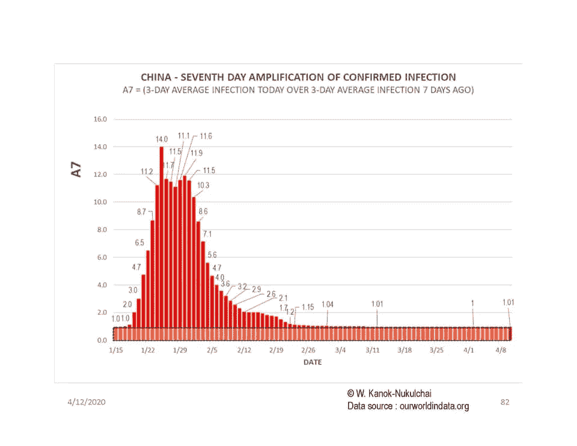
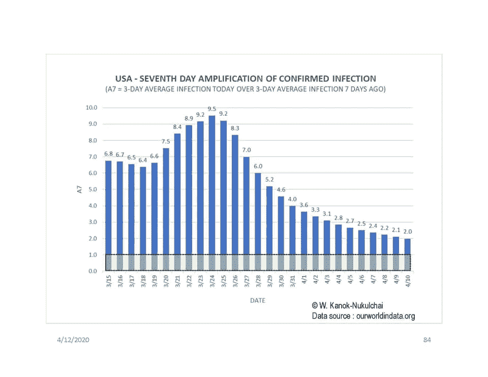

# 第七天放大因子如何能测量日冕无声载体的存在

> 原文：<https://towardsdatascience.com/how-the-seventh-day-amplification-factor-can-gauge-the-existence-of-corona-silent-carriers-b9414ef3df62?source=collection_archive---------40----------------------->

## 如果 A7=1.0，则第 7 天的确诊感染病例总数等于第 0 天的确诊感染病例总数。这意味着没有新的感染。

电晕爆发面临的一个关键挑战是相对无法估计无声携带者的数量。沉默携带者可能被证明比已知感染人数更为关键，因为受感染的个人可能被隔离并进行接触追踪；而沉默的携带者无法识别。

然而，我们可以通过使用一个数学表达式——第七天放大因子(A7)来定性地测量沉默携带者的存在。如果我们计算今天(第 7 天)确诊感染病例总数与七天前(第 0 天)确诊感染病例总数的比率，我们得出的比率称为“第 7 天放大系数”，或 A7。A7 始终大于或等于 1.0。超过 1.0 的部分指的是由于过去 7 天累积的新病例而导致的增加，以第 0 天数字的分数表示

这是相隔七天两点间累积新冠肺炎感染的简单数学比率。在两端使用 3 天滚动平均值来消除每日波动。

该比率基于一些假设:

## 假设

1.  今天检测呈阳性的患者至少在 7 天前感染了病毒(假设潜伏期为 5 天，检测期为 2 天)。
2.  这些患者(我们可以称之为第 7 天患者)是由第 0 天沉默携带者感染的，而不是由第 0 天患者感染的(因为他们已经被隔离)。
3.  无症状患者占所有感染病例的 80 %,约为第 0 天患者人数的 4 倍。
4.  许多“沉默的病人”可能已经康复，因此只有活跃的病人才能传播病毒。

## A-7 模拟的有用性

这个比率有三种用途

1.  监测当前趋势
2.  分析国家干预的有效性
3.  预测疾病爆发的结束。

## 为什么 A-7 很重要？

它被证明在定性上与社会中无症状的感染者有关，这些人被称为“沉默的病人”。在大多数国家缺乏大规模检测的情况下，预测这些沉默患者的存在是至关重要的。政府需要这种监测来实施干预措施，公共卫生官员也需要这种监测来评估他们应对病人数量突然增加的能力。它还有助于让公众了解危机的严重性，以及公民参与实施社会距离和坚持预防措施等措施的必要性。

> **“1.0”的完美比例**
> 
> 当比率 A-7 大于 1.0 时，则超过 1.0 的部分是由于从第 0 天开始增加的新感染病例。
> 
> 如果 A7 的值=1.0，则第 7 天的确诊感染病例总数等于第 0 天的确诊感染病例总数。这意味着没有新的感染，因此没有从第 0 天或一周前的任何一天传播病毒的沉默携带者。

## 例子

1.  **泰国**:3 月 24 日之后 A7 的快速下跌证实了 3 月 18 日措施的有效性(在关闭教育机构、购物中心和娱乐场所方面)。另外，根据目前的走势，我们可以大致预测 A7 将在 4 月 30 日左右冲击 1.0(除非不再有超级 Spreader)。
2.  **中国和南韩**:由于在疫情爆发之初采取了严厉的措施，A7 值很快下降到接近 1.0。
3.  **日新**:目前的措施并未奏效，图形显示出现反弹。两国政府现在都宣布了更严格的措施。
4.  美国:已确认的总感染率是世界最高的，部分原因是初期处理不当。然而，尽管病例和死亡人数非常多，但好的信号是，A7 的图表似乎在过去两周内呈下降趋势。

