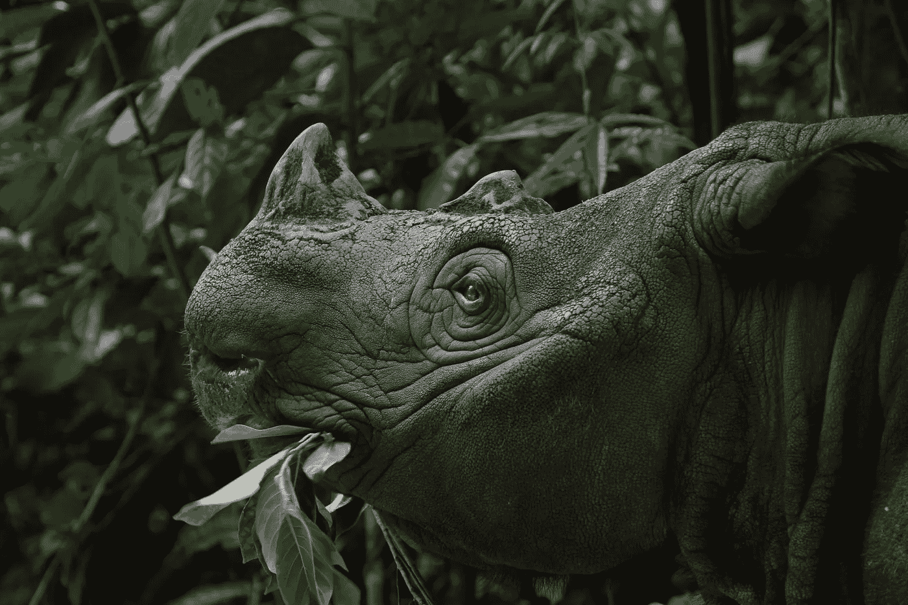
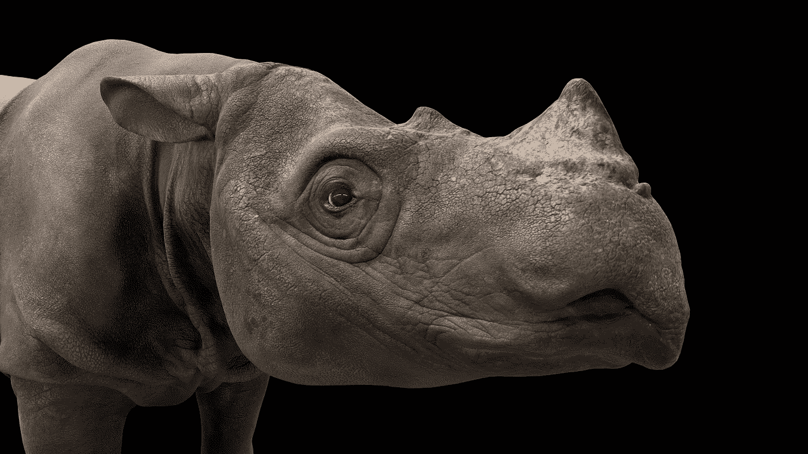
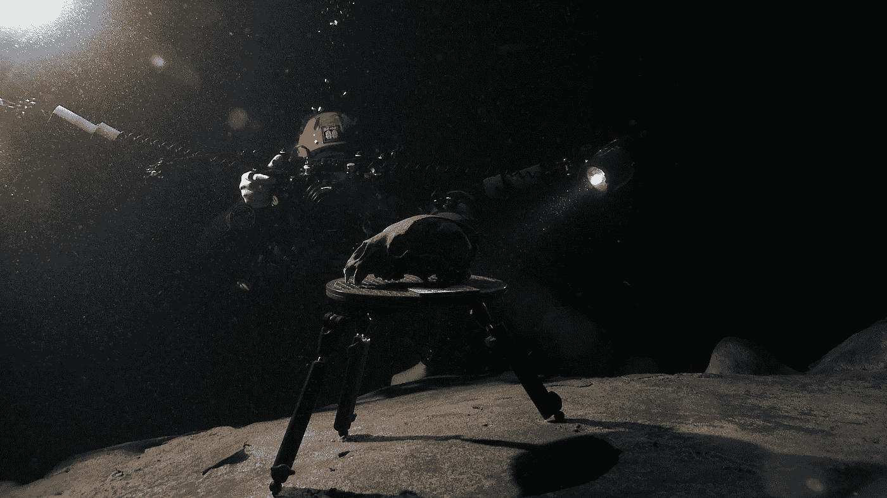
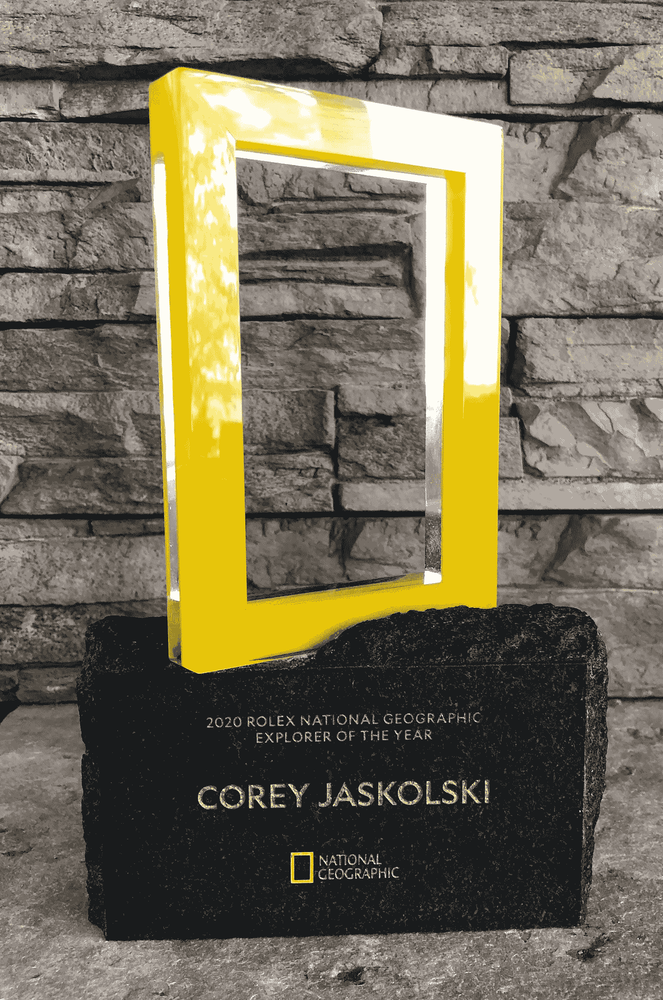
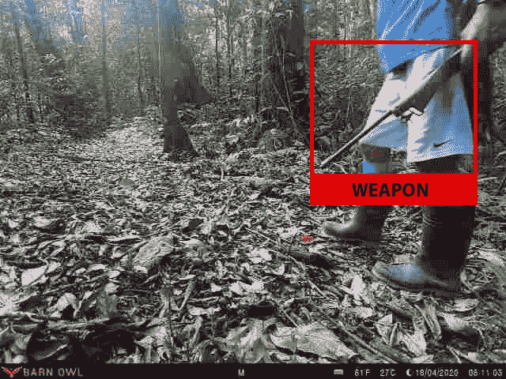

# 苏门答腊犀牛如何教会我重新思考人工智能

> 原文：<https://towardsdatascience.com/how-the-sumatran-rhino-taught-me-to-rethink-ai-4943b83fca3f?source=collection_archive---------27----------------------->

极度濒危的苏门答腊犀牛。这种动物在世界上仅存不到 80 只。图片由 3 瓦尔迪/[shutterstock.com](https://www.shutterstock.com/)

我曾在各大洲最美丽、最残酷的环境中工作过，当我部署我的一项新技术时，我总是有点惊讶自己会变得多么焦虑。对一个发明家来说，原型的第一次实地测试总是很困难的。。。它会像在实验室里那样工作吗？我错过了什么？我真希望当我按下电源开关时，这些人没有看到。。。

这一次，这个项目更加紧张。我正在部署一个定制的 3D 扫描设备，这是我用 6 万美元的零件制作的，试图在潮湿的印度尼西亚丛林深处的一个保护区创建一个世界上仅存的苏门答腊犀牛的数字副本。这可能是我们捕捉犀牛的数字副本的一次机会，这将有助于讲述它的故事，或者在最坏的情况下，如果保护努力失败，提供这种动物的完整数字记录。更重要的是，国家地理摄制组拍摄了我们努力的每一步。

苏门答腊犀牛的 3D 数字化模型。苏门答腊犀牛是地球上最濒危的陆地哺乳动物之一。[了解国家地理和其他组织如何努力拯救它们](https://www.nationalgeographic.org/projects/sumatran-rhino/)。图像:作者扫描的 3D 渲染

我的职业生涯是一个很长的系列(几十年了，但我尽量不去想太多！)这些类型的短跑。几个月的实验室开发用于保护、勘探或反偷猎安全应用的高科技系统，其间不时被密集的实地部署打断。我拥有麻省理工学院(MIT)的计算机科学和人工智能背景，最初并没有想到自己会从事为探索和保护开发技术和算法的职业。与《国家地理》的合作给了我一个机会，将我对计算机科学和人工智能的热情与保护、探索和讲故事结合起来。

在国家地理杂志做一名探险家和研究员是不可思议的冒险的同义词。不像大多数工作，它真的像听起来那么酷。我曾在 12500 英尺深的泰坦尼克号甲板上乘坐三人潜艇，同时我帮助开发了动力机器人，探索沉船内部的客舱。去年，我乘坐直升机飞越珠穆朗玛峰，拍摄了世界最高冰川的高分辨率航空激光雷达图。我和我们的环保伙伴一起驾驶绑在双座飞机机翼上的摄像机飞越刚果民主共和国，在打击偷猎大象的前线。我花了数百个小时在漆黑的地下世界执行任务，比如在被水淹没的洞穴里潜水，扫描玛雅人祭受害者，把我的身体塞进一个垂直裂缝，在一些地方只有 7 英寸宽，在那里坠落会让你楔住并破碎，在南非的洞穴系统中用探地雷达搜索前人类的墓葬。

使用 Gran Acuifero Maya 项目对一个被水淹没的洞穴中的冰河时期熊头骨进行 3D 数字化处理。图片由[吉尔·海纳思](https://www.intotheplanet.com/)提供

总的来说，这让我受到启发，并为技术和创新在分享和保护世界上最美丽的宝藏方面所发挥的作用感到兴奋，同时也让我害怕我们所关心的东西是多么脆弱。

由于我的工作，我最近被评为 [2020 年劳力士国家地理年度探险家](https://blog.nationalgeographic.org/2020/09/22/meet-the-2020-national-geographic-award-recipients/)。每年，这个享有盛誉的奖项都会授予那些在探索和讲故事方面表现出领导力、成就和精神的个人。之前的获奖者包括电影制作人詹姆斯·卡梅隆，水下摄影师布莱恩·斯凯瑞，史蒂夫·博耶斯和他的奥卡万戈荒野项目团队，以及环境人类学家肯尼·布罗德。如今，国家地理学会的使命——利用科学、探索、教育和讲故事的力量来照亮和保护我们这个世界的奇迹——比以往任何时候都更加重要。我非常荣幸能成为这项任务的一部分。

劳力士国家地理年度探险家奖。作者图片

当我在数字化苏门答腊犀牛的时候，我在我的笔记本电脑上渲染了一个预览图像，当时我在印度尼西亚的小屋。当我在屏幕上移动这个动物的 3D 图像时，我被它的逼真程度震惊了。当我停止移动鼠标的时候，我几乎不能分辨出这不是一张照片。有了人工智能背景，以及哲学爱好，我开始思考什么是“真正的”图像？我当然认为我用手机拍的照片是真实的图像，但除了代表像素值的一串数字，那真的是什么呢？如果我的合成数字化犀牛和照片无法区分，它和照片一样真实吗？我意识到，如果我可以创建对我来说看起来真实的 3D 模型，我就可以使用这些图像来训练 AI 系统。你看，数据是人工智能的[阿奇利的脚跟](https://en.wikipedia.org/wiki/Achilles%27_heel)。一个好的人工智能模型需要大量的数据，但在一些最具影响力的应用中——如保护、反偷猎、安全和医学成像——很难获得好的数据。

这个想法导致了我目前创办[合成公司](http://www.synthetaic.com/)的冒险，这是一家人工智能和合成数据公司，专注于人工智能的一些最高风险用例，有限的样本岛阻止了高质量的预测建模。在许多领域，根本没有足够的数据来有效地训练网络，特别是静态和动态图像。

偷猎者与步枪在外地部署。图片由[合成](https://www.synthetaic.com/)

非法偷猎者的照片很少。那些带有极端主义标志的新型丰田皮卡也是如此。手术室里对神经外科医生的实时反馈受到了罕见脑癌的有限图像库的限制。由于训练数据中的普遍性问题，种族偏见在面部识别中猖獗。

我开始[合成](http://www.synthetaic.com/)来回答我认为是人工智能中最大的两个问题。如果边缘案例不再存在会怎样？如果训练数据不再是一个约束，会怎么样？

自从我们开始[合成](http://www.synthetaic.com/)以来，我们已经扩展了这个概念，因为我们意识到，通过结合 3D 建模和新的生成式人工智能，我们可以更快、更便宜地增长数据，并且在某种程度上比任何其他数据合成技术都更符合训练最先进的人工智能。目前，我们正在生成用于脑外科手术决策的人类癌症显微图像，生成用于新冠肺炎检测的胸部 x 射线图像，为保护项目合成航空图像，并为几个未解决的安全情报需求创建数据。在每一种情况下，数据都无法与真实图像区分开来，但几乎是在我们的服务器上即时生成的，我们可以使用这些数据来训练 AI 模型，这些模型优于当前的最先进水平。

用于新冠肺炎检测的合成胸部 x 射线图像。图片由[合成](https://www.synthetaic.com/)

我们需要技术作为力量倍增器来解决世界上最困难的问题。即使是我们现在看到的简单技术，如滑轮或电力，也从根本上提高了我们作为个人和物种的能力。我相信，当人工智能充分发挥其潜力时，它将成为这样一种工具。它将帮助编号护林员保护广大地区免遭偷猎。当更多的治疗方案摆在桌面上时，它将帮助医生更早地诊断医疗问题。这将有助于我们在一个不确定的世界中保持安全。为了实现人工智能提供的承诺，我们需要难以想象的大量输入数据。[synthetic](http://www.synthetaic.com/)将长出这种高质量的数据来解锁“不可能”的 AI。