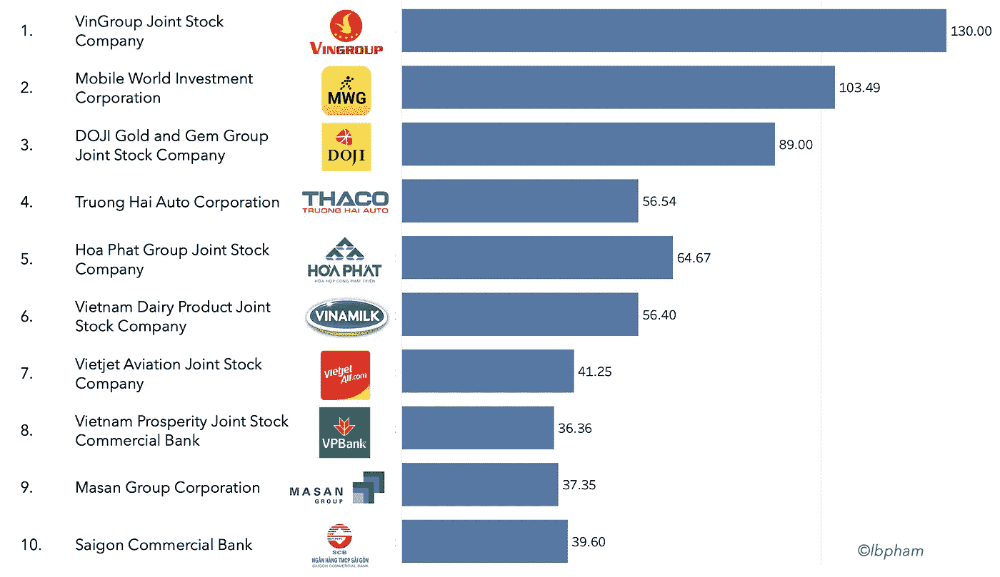
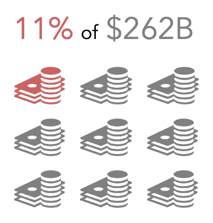
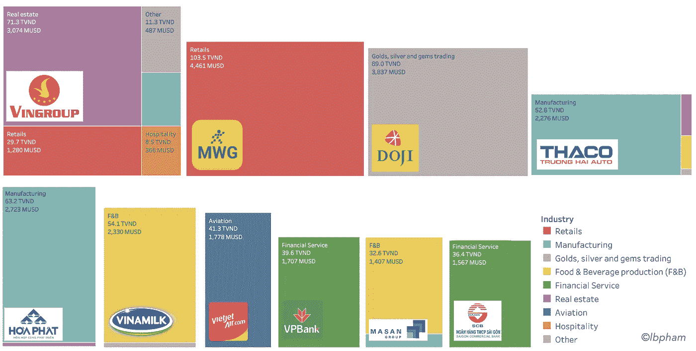
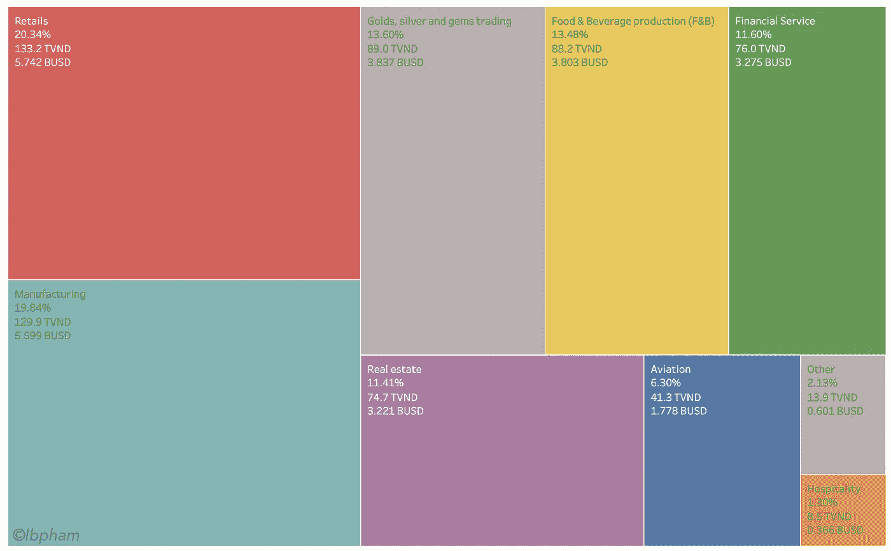
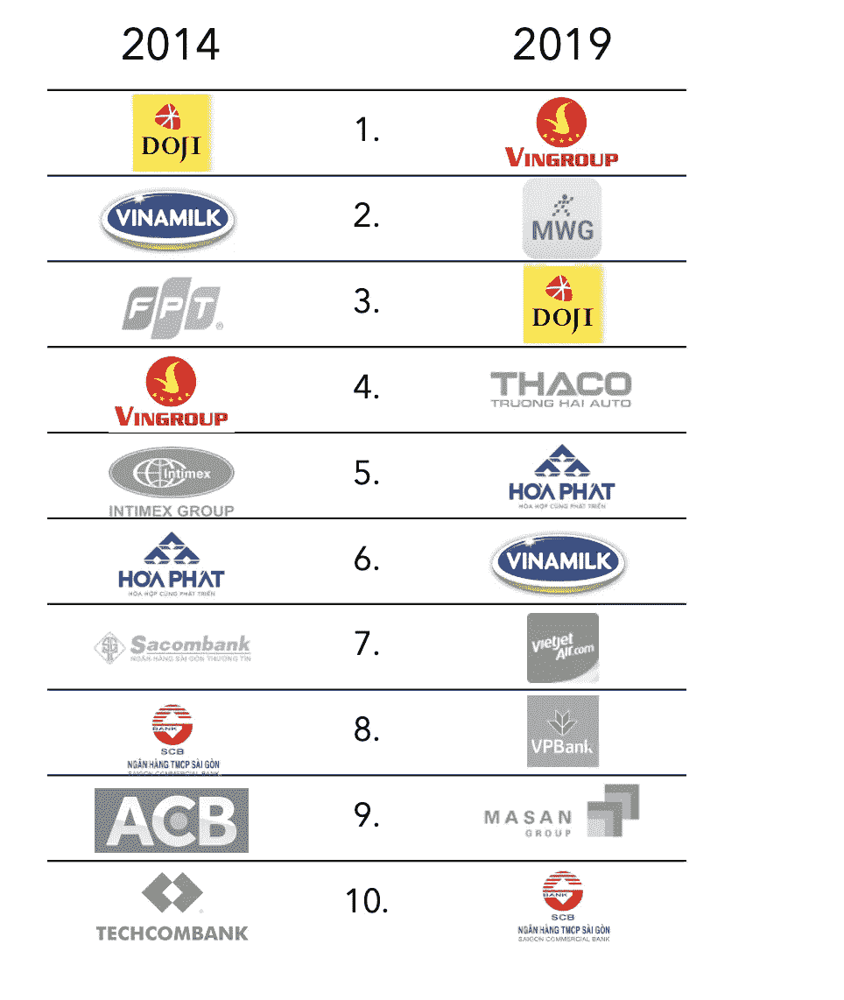
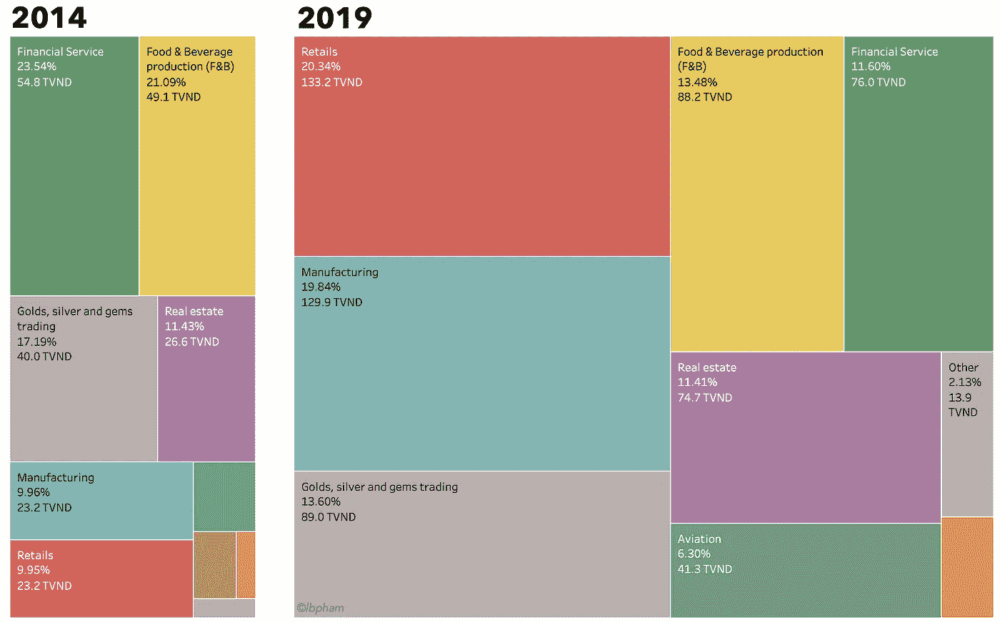
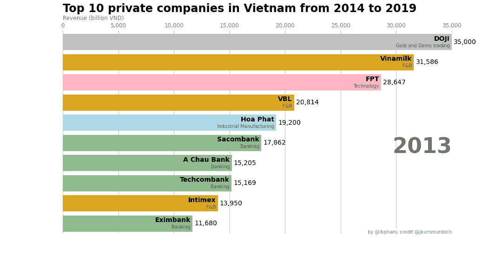

# 越南前 10 大公司是如何赚到数十亿美元的？

> 原文：<https://towardsdatascience.com/how-the-top-10-companies-in-vietnam-make-their-billions-bc262ed92940?source=collection_archive---------26----------------------->

## 2019 年，越南前 10 大私营公司的收入均超过 10 亿美元。他们是如何获得亿万财富的？

# 灵感

当我看到[视觉资本家](https://www.newcapitalmgmt.com/news/how-big-tech-makes-their-billions)关于美国五大科技公司的收入流的令人兴奋的图像时，这个问题一直萦绕在我的脑海里。看着每家公司按产品/服务系列和地理区域划分的收入，我想知道在我的国家——越南，顶级公司的情况会是怎样的。

带着这个问题，我把注意力集中在越南的前 10 家私营公司，来分析它们的收入是如何分解的。在本文的其余部分，我将一步一步地描述这一分析的过程和令人兴奋的发现:

1.  确定十大公司
2.  2019 年:收入细分
3.  2014:回顾
4.  2020 年:预测

# 前 10 名

在这个分析中，我使用了由 [VNR500](https://vnr500.com.vn/) 排名的 2019 年越南十大私营公司名单。

为什么选择 VNR500？我选择使用这份榜单，因为根据[的排名方法](https://vnr500.com.vn/Phuong-phap-luan-VNR500-4133-1009.html)，收入是编制这份榜单的第一标准。

为什么前 10 大**私营**公司，而不是越南“前 10 大**最大的**公司？VNR500 确实提供了一份越南前 10 大公司的名单，但我决定不使用这份名单，主要有两个原因:(1)这份名单中的 10 家公司中有 8 家是政府认为的关键行业(即能源、电信和金融服务)的国有公司；(2)榜单上 10 家公司中有 9 家不公开其财务报告，导致数据收集困难，只能从不同的新闻渠道获得非官方数据。

据此，我们将“剖析”越南 10 大私营公司 2019 年的收入，它们是:

[VNR500](https://vnr500.com.vn/) 排名前 10 位的越南私营企业，以及它们在 2019 年的收入(以万亿越南盾计)

这十家公司有多大？为了客观地看待问题，我看了这些公司 2019 年的总收入占同年越南国内生产总值的百分比([世界银行数据](https://data.worldbank.org/indicator/NY.GDP.MKTP.KD.ZG?locations=VN))。

2019 年前 10 家公司的总收入占越南 GDP 的百分比。

2019 年，越南前 10 大私营企业对该国 2019 年国内生产总值的贡献约为 11%。

很多吗？考虑到五大科技公司(亚马逊、苹果、Alphabet、脸书和微软)的收入为 9900 亿美元，相当于 2019 年美国国内生产总值的 4%(21.43 万亿美元)，你怎么看？

# 2019 年:收入细分

以下是越南十大私营公司按行业(产品/服务类型)分列的收入明细:

越南前 10 大私营公司 2019 年收入明细

*请注意，对于 DOJI 集团，该集团的合并财务报表并未向公众公布。在此分析中，我假设集团的所有收入都与其核心业务相关，即黄金、白银和宝石交易。然而，据了解，道纪集团自 2019 年* *开始在房地产领域开展* [*业务，尽管无法找到关于该业务收入的进一步信息。*](https://theleader.vn/doanh-thu-gan-4-ty-usd-cua-doji-1595316192955.htm)

如果我们看一下按行业细分的前 10 家公司的 2019 年收入，零售业和制造业是主导行业，各贡献约 130 万亿越南盾。看着这张图表，我想知道五年前十大公司的细分情况如何，这就是我们将在下一节探讨的内容。

2019 年越南前 10 大私营公司的合并收入明细

# 2014:回顾

回顾五年前，即 2014 年，事情与 2019 年有多么不同:

2014 年和 2019 年越南十大私营公司

*   **2014-2019 年间，越南国内生产总值**增长了**~ 1.5 倍**
*   前 10 家公司的总收入占 GDP 的百分比已经从 2014 年的 6%增长到 2019 年的 11%。
*   2014 年前 10 名中只有**五家**公司在 2019 年的榜单上。
*   2014 年榜单中有 4 家公司是**商业银行**。

因此，您可以看到前 10 名的综合收入明细在这 5 年中发生了怎样的变化。

零售业占据了第一位，在五年内增长了约 6 倍(注意，电子设备零售商的主导者之一 FPT 在 2014 年上榜，但在 2019 年退出)。2014 年排名第一的金融服务跌至第五，因为 2019 年只有两家商业银行上榜，而不是 2014 年的四家。这些年来，房地产一直保持着它的地位以及总收入的百分比。由于 FPT 集团退出前 10 名，电信和技术解决方案不再是 2019 年的组合。

2014 年与 2019 年相比，前 10 家私营公司的合并收入明细

# 2020 年:预测

以下是我对 2020 年十大榜单的预测:

**越捷航空**:由于疫情对航空业影响深远，如果越捷的排名下降，或者某个事件不在榜单上，也不会令人惊讶。

**维恩集团、MWG 和马桑集团——零售**:2019 年，[马桑从维恩集团](https://www.bloomberg.com/news/articles/2019-12-03/vingroup-masan-to-merge-units-to-create-vietnam-s-retail-giant)收购了零售业务，这将影响到名单中不止两家而是三家公司的位置。

*   ***VinGroup*** :零售业务在 2019 年为公司带来了约 30 万亿越南盾的收入。
*   ***MWG***:MWG 2019 年收入约 103 万亿越南盾，比文集团低约 27 万亿越南盾。现在，2020 年，VinGroup 不再有零售业务收入，也许这足以让 MWG 在榜单上占据第一的位置。
*   **当然，由于新冠肺炎在越南，不确定对零售市场的影响会有多大，但我们应该会看到马山今年的收入会有显著增长。**

你怎么想呢?你对 2020 年越南 10 大私企有什么预测？欢迎在评论区分享你的想法。

2020 年 9 月 18 日更新，2014-2019 年间越南 10 大私企的种族条形图。感谢 Pratap 文章对如何使用 Python 制作这个图表的指导。

2014-2019 年间越南十大私营公司(按 VNR500 排名)及其收入和主要业务

***来源:*** 详情请参考我的[电子表格](https://docs.google.com/spreadsheets/d/1sY45Ub-a7R9EriH_l4FR5s9haihs5pPza280vldzqVY/edit?usp=sharing)