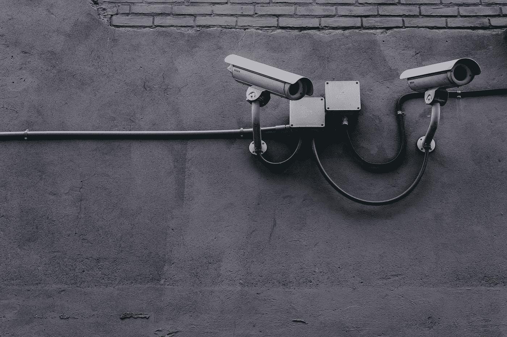
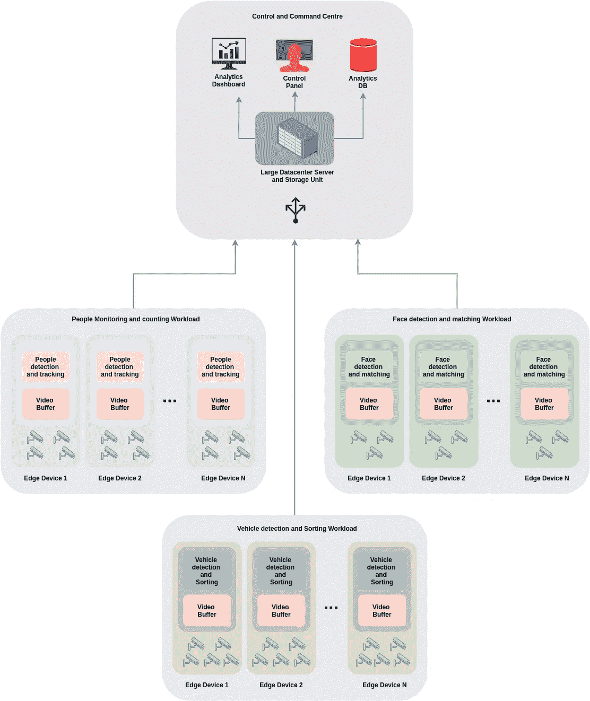
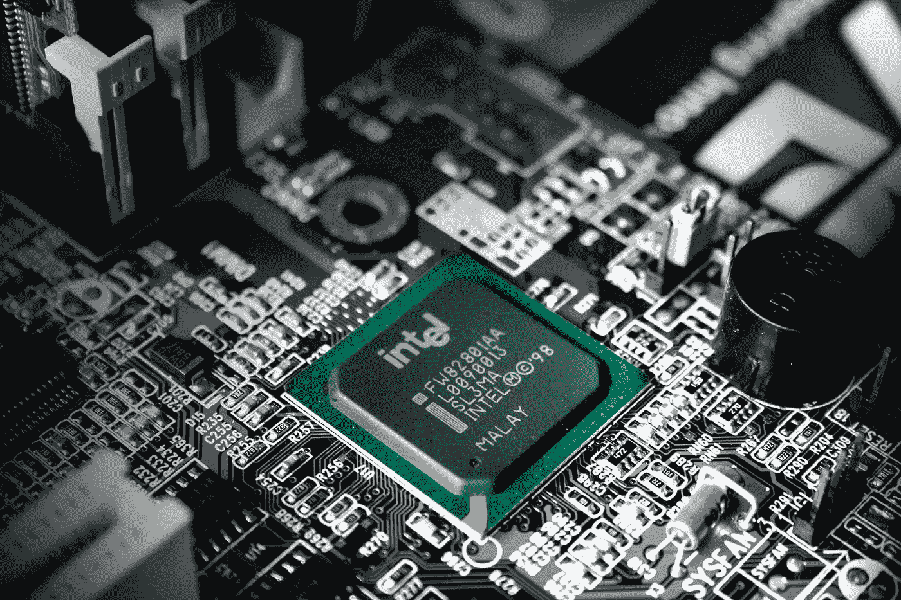

# 他们如何看你:人工智能监视内部运作的一瞥

> 原文：<https://towardsdatascience.com/how-they-see-you-a-peek-behind-inner-workings-of-ai-surveillance-4f23c014d08c?source=collection_archive---------51----------------------->

## 了解大规模监控系统是如何在边缘计算上驱动的

斯科特·韦伯在 Unsplash 上拍摄的照片

政府和企业使用的大规模智能监控系统吸引了大量负面报道和公众对隐私和数据安全问题的愤怒。他们经常进行数据收集和数据处理，以提取关于所拍摄场景的关键信息。

例如，这些系统据称可以对个人或群体进行人脸识别、匹配和信息提取。

数据隐私和这些监控系统的道德方面是另一个完全不同的话题，超出了本文的范围。更重要的是要意识到在构建这样一个系统的背后发生了什么。

你有没有想过这些系统在现实生活中是如何工作的？如果是，那么我建议你继续读下去，找出答案。

在过去的两年里，我一直从事大规模机器视觉系统的工作，通过这篇文章，我想与你分享我在一些项目中获得的一些见解，这些项目要求我设计涉及 200 多个相机的系统，这些相机需要使用人工智能后端进行实时处理。

我分享的方法或知识纯粹基于我的学习和实践经验，不应被视为我说这是绝对的最佳实践，或者这是所有监控系统的工作方式。相反，它是一个通用模板，展示了这种管道的潜力以及在大多数情况下如何处理数据。

瞿连浩在 Unsplash 上的照片

那么这一切是如何组合在一起的呢？概括地说，您有充当原始数据捕捉的感官助手的摄像机、可以是边缘计算设备或中央处理服务器的人工智能处理单元、命令中心或控制仪表板、用于传输感官数据的典型网络基础设施以及存储所有重要信息的数据库。

让我们以我最近参与的一个项目为例，这样我可以更容易地解释数字和讨论技术。

该项目是智能城市发展自动化路线图的一部分。一个典型的智能城市监控系统将包含至少 300 个摄像头，战略性地放置在关键区域，以监控正在发生的事情。

这些摄像机每秒产生大量数据，手动监控它们成为一项巨大的任务。这就是我的公司出现的原因。

我们开发了支持多种计算硬件配置的视觉处理系统，以实时处理这些视频。

典型的智能城市人工智能工作负载将包含人体检测和跟踪、带标签和车牌识别的车辆监控、异常检测、带匹配的人脸检测等。但所有这些工作负载都是非常资源密集型的，就像任何基于深度学习的视觉管道一样，也会抬高整个系统的价格。

一个简单的解决方法是避免在每台摄像机上运行所有这些工作负载。相反，我们选择与不同用例相关的摄像机，并将这些摄像机分配给每个工作负载。

例如，放置在建筑物入口处的摄像机适合运行人脸识别工作负载，因为在这种情况下人脸的可视性最好。路边的摄像头是观察行人和车辆的理想选择。

每台摄像机的硬件规格也是根据它需要处理的工作量来确定的。现在，你把这个处理硬件放在哪里？您可以有多种配置，但我们发现的最佳配置是边缘计算架构。这可以从下图中看出。

图片作者:维萨克·S·莫汉

上图展示了一个包含 3 个主要工作负载的准系统智能城市部署。一个是检测穿过摄像机视图的人，并计算在任一方向上穿过该区域的总人数。另一个工作负载是检测和匹配人脸，最后是车辆监控和交通相关信息分类工作负载。

基于边缘的处理让我们能够在摄像机级别调整软件，并帮助我们轻松扩展架构。

请注意分配给边缘设备的摄像机数量的差异。这通常基于工作负载限制。例如，与车辆监控工作负载相比，人脸检测和匹配用例具有相对较高的工作负载要求，因此对于实时处理而言，前者可以处理比后者更少的摄像机。

根据最终客户端的要求，我们将添加更多工作负载，通过使用边缘硬件，我们可以通过添加更多摄像头或包含新用例来进行水平扩展。

如前所述，每个工作负载的摄像机都是基于许多不同的参数手动识别的，其中一个主要参数是此类基础架构的总拥有成本。

Slejven Djurakovic 在 Unsplash 上拍摄的照片

每个工作负载都将集中管理，提取的信息作为小型数据有效负载传输到数据中心服务器，在那里进行预处理、排序并存储到数据库中。自定义分析引擎可以使用存储的数据来生成信息图，如热图、人群分析、基于面部匹配的标记警报等。可以修改该规则引擎或分析引擎，而不会有任何边缘硬件停机的风险，从而确保连续运行。

边缘硬件是难题的关键部分。虽然我们使用多种计算模块，这是大规模部署(如智能城市用例)的最佳选择，但我们发现英特尔或英伟达平台是最佳选择。

我们在多个项目上与两家公司密切合作，发现两家供应商的硬件可以很好地互补并提供良好的灵活性。

总之，任何典型的大规模视觉系统都是许多不同技术的融合，人工智能只是系统的一小部分。我希望这能让你对人工智能监控系统有一个基本的了解。在接下来的几周里，请关注这个空间的更多文章，我将在这里讨论与人工智能开发、架构设计和大规模视觉系统软件栈相关的主题。