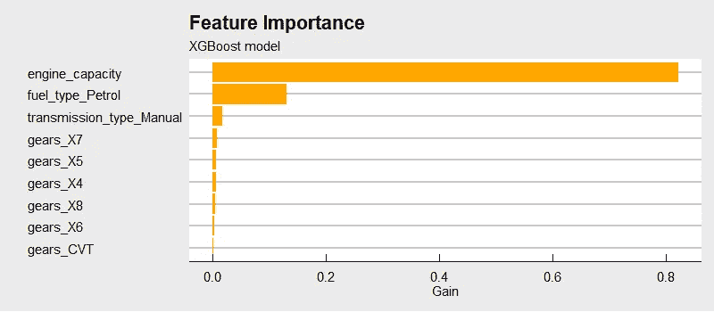
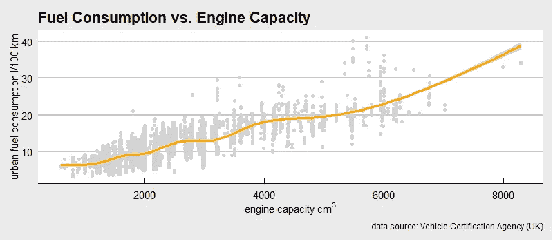
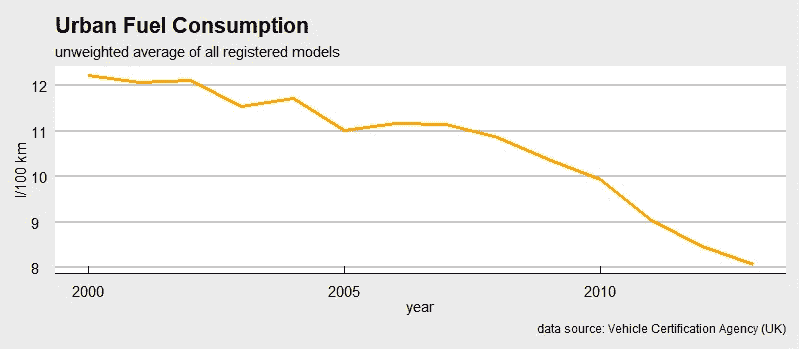
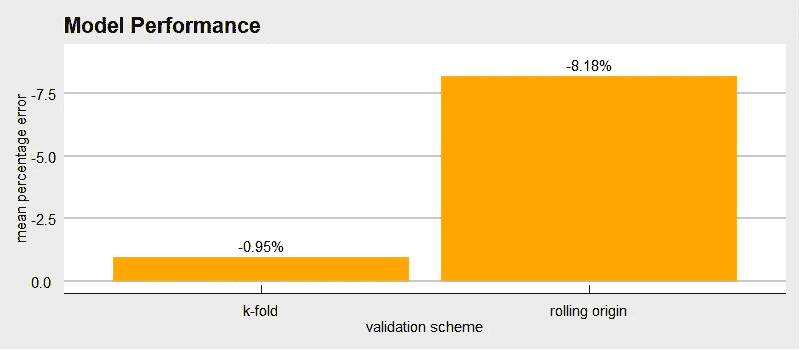
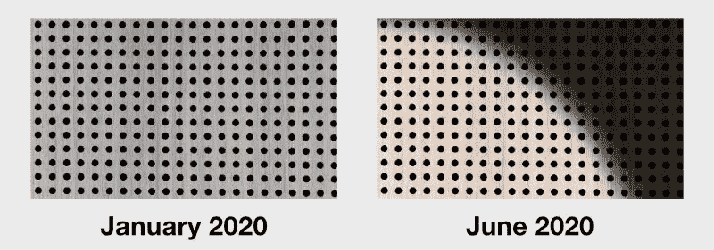
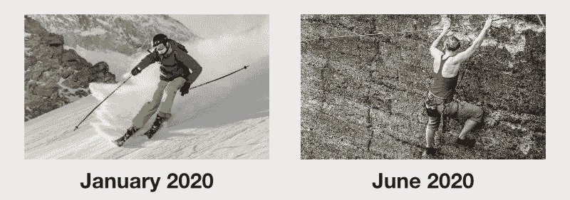

# 时间是如何毁掉你最珍贵的机器学习模型的

> 原文：<https://towardsdatascience.com/how-time-can-ruin-your-most-precious-machine-learning-model-46c438014c06?source=collection_archive---------41----------------------->

[Icons8 团队](https://unsplash.com/@icons8?utm_source=unsplash&utm_medium=referral&utm_content=creditCopyText)和[图板](https://unsplash.com/@aplaceforcreation?utm_source=unsplash&utm_medium=referral&utm_content=creditCopyText)在 [Unsplash](https://unsplash.com) 上的照片

在典型的 101 机器学习课程中，你会学到很多东西。您将学习不同的算法、特征工程、交叉验证等方法来获得可靠的性能测量，以及如何调整算法的超参数。然而，这些入门课程中的大多数不会告诉你当你的数据依赖于时间时可能出错的所有事情。

现在，你可能认为这不适用于你的问题，只适用于经济时间序列的典型预测。你可能错了。如今，普通数据科学家解决的大部分现实任务都依赖于时间。

每当你发现机器学习模型在部署后表现不佳时，你应该问一问在开发模型时，是否考虑了依赖于时间的影响，以及如何考虑。

# 基本示例:预测油耗

让我们从一个简单的例子开始。我们的任务是在 R&D 部门的设计和开发过程中预测汽车的油耗。客户为我们提供了许多不同汽车的数据，我们发现发动机容量、变速器类型和燃料类型是预测汽车消耗的重要特征。

发动机容量、燃料类型和变速器类型是最重要的特征

油耗随着发动机容量的增加而增加

我们使用 k-fold 交叉验证来验证我们的 XGBoost 模型，并获得了大约-0.95%的极好的平均百分比误差(MPE)。每个人都很兴奋，该模型被部署到 R&D 部门的用户中。

然而，很快用户开始抱怨预测的消费值不可能是真实的，而且高得不切实际。

## 油耗数据取决于时间

原来我们的数据包含了超过 10 年的训练实例。一旦我们加入这一数据生成过程的时间成分，很明显，这些年在制造节能汽车方面已经取得了实质性的进展。然而，我们的第一个模型无法了解这一进展，因为相应的功能已经丢失。

多年来，平均燃料消耗量已经下降

我们修正了验证方案，将时间考虑在内，并用滚动原点预测重采样替换了 k-fold 交叉验证。使用调整后的验证方案，我们发现用户是正确的。我们的模型的平均百分比误差(MPE)实际上比我们想象的要差 8 倍。该模型做出了严重偏颇的预测。

滚动原点验证产生的 MPE 比 k 倍验证差 8 倍(-8.18%对-0.95%)

现在，我们知道我们的数据取决于时间，我们可以创建一些功能，使机器学习算法能够做出更少偏差的预测。

# 时间可能很重要的不太明显的例子

上面的油耗例子非常明显，许多有经验的数据科学家不会落入这个陷阱。

然而，有时有些情况不太明显，不容易发现时间依赖性。甚至图像分类也依赖于时间吗？当然，举两个例子:

*   **使用 CCD 传感器进行自动质量控制**
    训练数据由 45，000 幅图像组成，这些图像是在一月份的晚上在荧光灯管照亮的车间中生成的。一旦该模型被部署，它将必须对 6 月的一个早晨阳光透过屋顶窗户照下来的图像进行操作。

[阿德里安·奥利雄](https://unsplash.com/@adrienolichon?utm_source=unsplash&utm_medium=referral&utm_content=creditCopyText)在 [Unsplash](https://unsplash.com/s/photos/steel?utm_source=unsplash&utm_medium=referral&utm_content=creditCopyText) 拍摄的照片

*   **在影像学分期时协助临床医生** 夏季和冬季不同的典型活动导致不同的伤害。这对数据生成和类不平衡有什么影响？临床医生和模型如何考虑这些不平衡，他们应该考虑吗？

[Willem De Meyer](https://unsplash.com/@willemdemeyer?utm_source=unsplash&utm_medium=referral&utm_content=creditCopyText) 和 [Frank Busch](https://unsplash.com/@frankbusch?utm_source=unsplash&utm_medium=referral&utm_content=creditCopyText) 在 [Unsplash](https://unsplash.com) 上拍摄的照片

大多数数据生成过程都受到人类及其环境的严重影响。因此，他们经常显示趋势，周期和强大的每日，每周和每年的模式。基本上，每当数据生成过程与人类交互并且不能在隔离的实验室中自动执行时，这些时间相关组件中的一些能够被发现并且必须被建模的机会很高。

# 如何检查数据是否依赖于时间？

每当你在处理一个机器学习问题，并且你的数据还不包括时间的时候，问自己以下问题:

*   什么过程产生了数据？
*   生成这些数据需要多长时间？
*   那段时间数据生成过程的环境稳定吗？
*   在那段时间里，流程(和业务)本身稳定吗？
*   环境和流程(以及业务)在未来会保持稳定吗？
*   随着时间的推移，生成的数据的统计属性是否稳定？

这些抽象问题可以由更具体的问题来支持，以检查流程、环境和数据中常见的时间相关效应:

*   季节、天气状况和假期会有什么影响？这会影响每年的模式吗？
*   光线条件、噪音和工作时间会有什么影响？这会影响每日或每周的模式吗？
*   维护会对数据产生什么影响？有典型的维护周期吗？
*   社会、科学和经济进步(或变化)会对数据产生什么影响？过去是否有任何趋势或变化，或者未来是否会有？
*   人口统计或组织的变化会对您的数据产生什么影响？过去有什么变化吗，或者将来会有什么变化吗？

作者插图

一旦确定了潜在的时间相关效应，您应该检查这些效应是否存在于数据中，以及您的数据是否实际覆盖了检测它所需的时间跨度。

# 如果你的数据依赖于时间怎么办？

如果数据依赖于时间，有三个基本选项来处理它。

1.  **通过调整环境或过程排除时间效应**。这只有在模型的输出不必包括趋势和季节性等时间效应的情况下才是可行的。*在上面的质量控制示例中，这可能意味着调整车间环境以保证稳定的照明条件。*
2.  **通过数据预处理排除时间效应**。这也是唯一可行的，如果模型的输出不必包括时间效应，如趋势和季节性。*在上面的质量控制示例中，这可能意味着修改图像以消除照明条件的影响。*
3.  **通过调整机器学习模型和数据来包含时间效应**。各种建模&特征工程技术可用于使机器学习模型包括时间效应。如果模型的输出依赖于时间效应，则应使用时间感知验证方案。*在上面的质量控制示例中，这可能意味着在训练数据中包括各种照明情况，甚至可能生成使模型意识到照明条件的特征。*

在你的机器学习项目中，你在时间方面有什么经验？你想读一篇关于各种建模和特征工程技术以及包括这些时间效应的验证方案的故事吗？

感谢您的阅读，我期待您的评论！