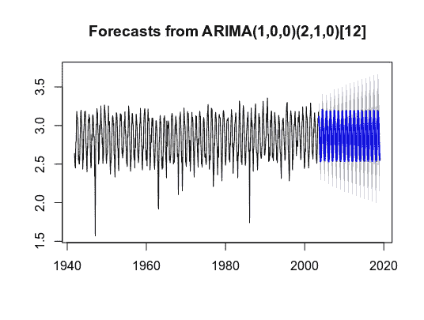
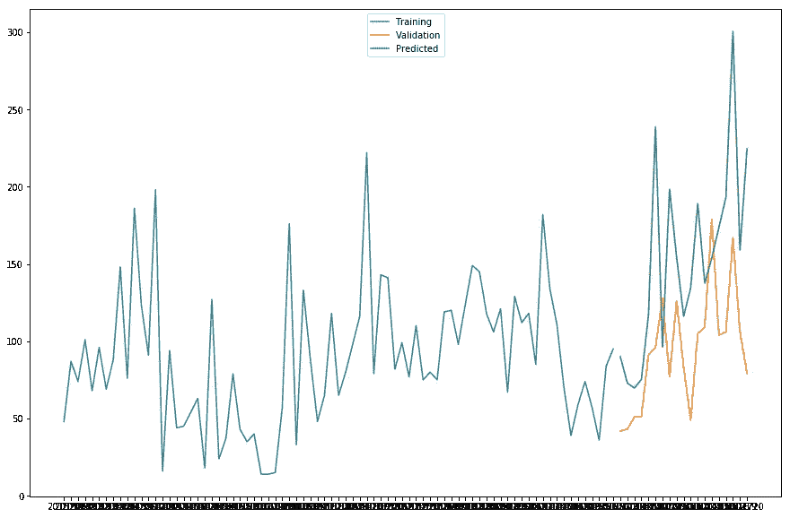

# 时间序列分析需要如何发展

> 原文：<https://towardsdatascience.com/how-time-series-analysis-needs-to-evolve-5dcb6190902d?source=collection_archive---------25----------------------->

## 时间序列分析非常依赖于过去的数据来生成有意义的预测。这就是为什么这并不总是可持续的。

在形而上学领域，关于时间实际上是如何工作的，有两种相当有趣的理论:时间的 **A 理论**和 **B 理论**。

**A 理论:**认为现在不同于过去和未来，从过去到未来的时间流动是真实的。例如，A-理论家会认为 1970 年和这一年发生的事件在形而上学上不同于 2020 年，这一时期的时间流动标志着一个持续转变的时期。在这种观点下，时间本质上可以被认为是一个真实的实体，就像引力一样。

**B 理论:**认为现在在形而上上与过去或未来并无不同。事实上，一个极端的 B 理论者会认为没有过去或未来这样的东西——时间只是人类发明的一个概念，作为理解世界的一种手段。如果没有我们的记忆，过去就不会存在，未来只是由个人对未来的想象组成。例如，有人可能会说 2022 年在技术上是不真实的，和现在没有什么不同。它只是一组标在世界通用的标准日历上的日期，用来标记我们对特定时间间隔的感知。

这些争论本质上是非常哲学的，我不会在这里深入探讨。然而，我发现它们确实为思考时间序列预测及其总体有效性提供了一个非常好的框架。

# 我们是在不知不觉中预测过去吗？

例如，当时间序列分析师试图预测天气模式时，他们真的试图“预测”什么吗？

温度数据在很大程度上是季节性的。对于北半球的一个国家来说，我们可以很肯定的说，6 月的平均气温会比 2 月高。我们可以断言这一点的原因很简单，因为过去多年的数据存在，以支持这一点。

例如，ARIMA 模型将低于气温的时间序列识别为具有很强的季节性成分，并相应地做出预测。

资料来源:RStudio

在这方面，时间序列分析师与其说是在预测未来，不如说是在“预测过去”。一个模型可以预测一个炎热的七月即将来临，但这也是过去发生过的事情。这不是新的。

也就是说，物理学确实认为**熵**是时间的固有属性——即“所有事物都趋向于无序”。让我们再次以天气为例。随着气候变化和全球气温上升成为越来越令人担忧的问题，这可能意味着未来气温预测将变得越来越不准确。

例如，关于气候变化是否会导致所有月份的平均气温升高，或者是否会导致极地冰盖融化事实上导致全球变冷的情况，仍然存在争议。事实上，结果可能是夏天温度更高，冬天温度更低。

我不是这方面的专家，也不想加入辩论的任何一方。然而，在熵随时间增加的论点下——这也意味着过去的数据在预测未来时变得越来越无用。

过去的数据只能预测类似于过去发生的趋势——它们不一定能解释从根本上改变系统的变化所带来的不确定性。

# 概率和情景分析在预测中的作用

这方面的一个经典例子是新冠肺炎对酒店业的影响。

我以前在 Medium 上写过几篇文章，讨论如何使用时间序列分析来预测酒店取消预订，使用的模型有 ARIMA 和 LSTM。

然而，即使是这些模型也无法解释这样一个事实，即新冠肺炎将有效地使全球旅游陷入停滞，酒店将需要因疫情而关闭。

这是一个“黑天鹅”事件，在过去的数据中不会被考虑。重要的是要记住，模型输出的质量取决于输入到模型中的数据——它不一定能解释熵，也不一定能解释未来存在高度无序和不确定性的事实。

时间序列领域越来越多地试图通过认识预测概率的价值来解释这种不确定性，而不是对时间序列未来的趋势做出艰难的预测。

例如，这里是通过 TensorFlow 概率库使用后验概率分布对酒店取消的预测。作为参考，后验概率分布指的是在考虑相关证据(即后验数据)后分配事件发生的概率的分布。本质上，该模型通过使用先前的后验数据作为可用证据来生成酒店取消的概率分布。

来源:Jupyter 笔记本

这里，模型显示这家酒店预计每周会有大约 100-200 次取消预订。然而，概率预测也表明，在极端情况下，酒店每周可能会有超过 500 次取消预订。虽然这也没有考虑到新冠肺炎场景下酒店关闭的影响，但它确实让酒店经理思考— *“在什么情况下，我的酒店会在一周内出现 500 次取消预订，我应该如何防范这种情况？”*

让我们将这一预测与使用 ARIMA 进行的预测进行对比。

来源:Jupyter 笔记本

我们看到，ARIMA 模型确实以合理的精度预测了测试数据的总体趋势，尽管在某些情况下倾向于高估取消频率。诚然，ARIMA 也可以将概率纳入其预测，因此两者之间的比较不一定是彻底的。

然而，ARIMA 强烈依赖于识别正确的 **p，d，q** 参数以及正确的季节顺序。作为参考， *p =自回归项的数量，d =使时间序列平稳的差值的数量，q =以前预测误差的移动平均值*。

如果序列的性质发生突变，那么这些参数很快就会变得与未来的预测无关。

例如，随着新冠肺炎期间所谓“居家度假”的明显增加，这很可能导致酒店取消的季节性因素发生重大变化。

鉴于航班成本对当地居民来说不是一个因素，酒店在未来的某些假期期间取消预订的数量可能会减少。另一方面，取消预订也可能上升，因为当地客户在住宿方面可能有更多选择，例如，取消酒店预订，与朋友住在一起。

我的主要论点是，时间序列需要注意不确定性在时间序列预测中的作用，并且在预测时更愿意接受**实验**，也就是说，如果某些参数发生变化，预测会是什么样子？

例如，不是假设 ARIMA 模型中的季节效应会持续一段时间——如果它被显著改变，预测会是什么样子？

这种“情景分析”的预测方法在未来将变得越来越有价值。“预测过去”的预测没有什么价值，但那些能够预测“想象中的未来”的预测可能有很大价值。

# 结论

归根结底，预测是一种预测未来的工具。然而，鉴于存在许多潜在的未来，生成许多潜在的预测才有意义。我们常常错误地认为未来将永远和过去一样。时间序列分析的真正价值在于“情景规划”——识别我们面前的潜在未来，并采取行动防范极端情景。

*免责声明:本文是在“原样”的基础上编写的，没有任何担保。本文旨在提供数据科学概念的概述，不应以任何方式解释为专业建议。*

# 参考

*   [安东尼奥、阿尔梅迪亚和努内斯(2019)。酒店预订需求数据集](https://www.sciencedirect.com/science/article/pii/S2352340918315191)
*   [Banfi (2017)。时间的 a 理论还是 B 理论？亚里士多德式的回答](https://scholar.uwindsor.ca/cgi/viewcontent.cgi?article=1119&context=essaysofsignificance)
*   [TensorFlow Probability:用结构化时间序列模型预测每周酒店取消预订量](/tensorflow-probability-predicting-weekly-hotel-cancellations-with-structural-time-series-modelling-eee0545f5f07)