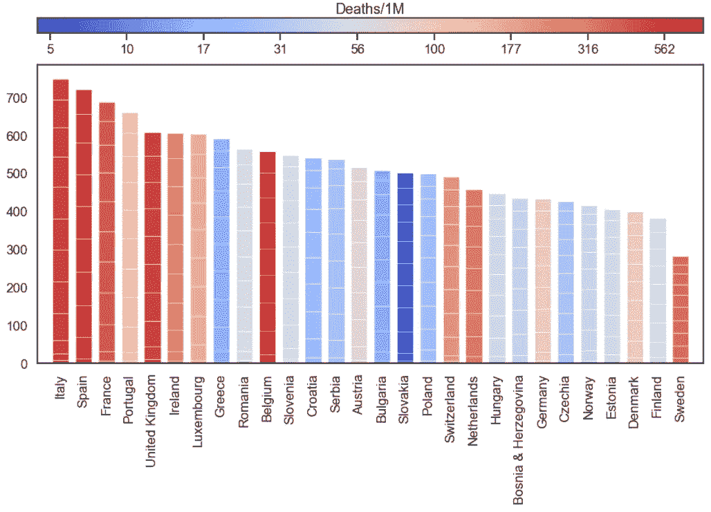
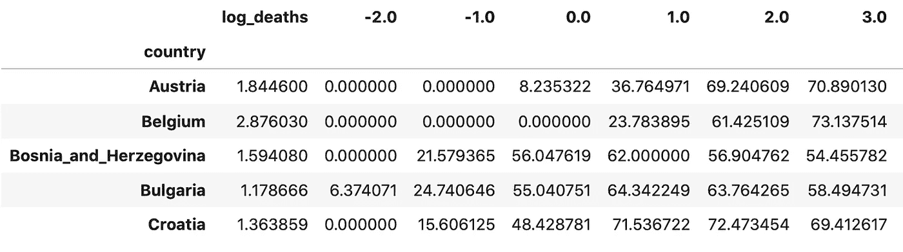
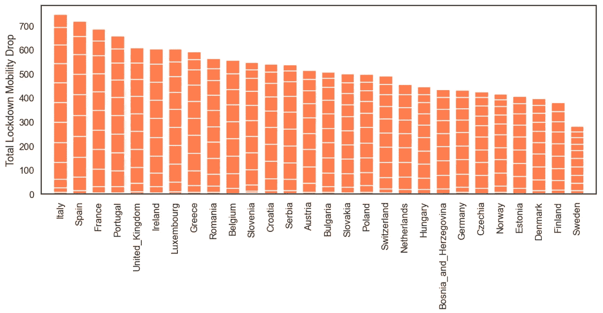
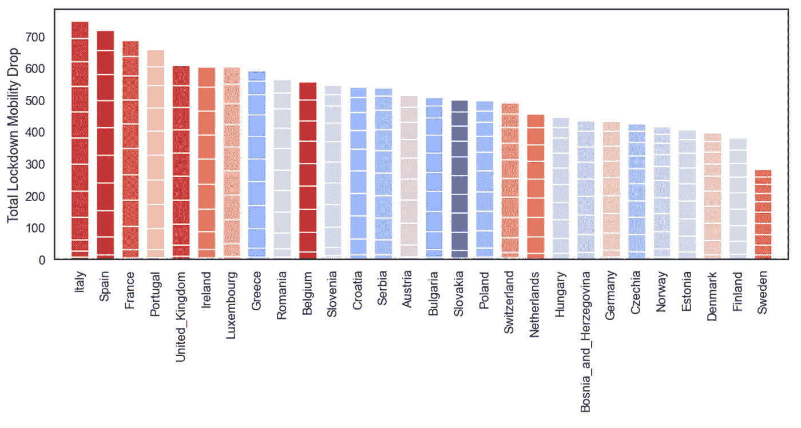
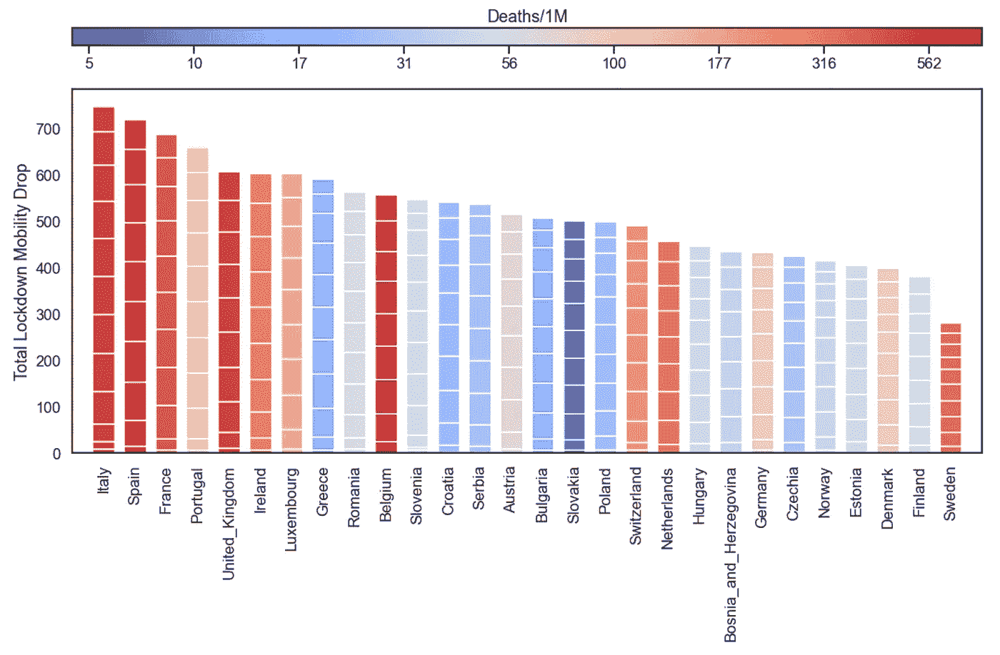

# 如何:用颜色编码的分段条形图

> 原文：<https://towardsdatascience.com/how-to-a-color-coded-segmented-bar-graph-9e09b5bad3b0?source=collection_archive---------69----------------------->

最近我做了很多新冠肺炎分析。上周末，我想为我正在撰写的关于 T4 新冠肺炎封锁和流动性水平的[博客文章](https://medium.com/data-in-the-time-of-corona/lockdown-fatigue-94efeae6f24a)制作一个特定类型的图表。我想要一个如下的条形图:

1.  每个条形反映一个国家在新冠肺炎封锁期间经历的总流动性下降；为此，我使用了谷歌和苹果的移动数据集。
2.  对每个条形进行分段，以便每个分段反映其封锁的连续一周内的流动性下降；换句话说，如果锁定持续 10 周，那么酒吧将由 10 个部分组成。
3.  每一条都用颜色编码，以反映该国的人均死亡人数。

本着*“这是我之前做的一张”* …这是我最终创建的图表，接下来我将解释我是如何制作它的。

# 一些错误的开始…

起初，我认为这是一个[堆积条形图](https://matplotlib.org/3.1.1/gallery/lines_bars_and_markers/bar_stacked.html)的变体，但是经过一番挖掘和研究，我得出结论，这不是正确的方法。虽然堆积条形图可以提供分段效果，但不可能单独给条形着色；更确切地说，堆积条形图*给* *段*着色，使得每个条形图由一组有序的多色段组成。接下来，我想一个[热图](https://matplotlib.org/3.1.1/gallery/images_contours_and_fields/image_annotated_heatmap.html)可能会有用，但那也不起作用，因为热图使用固定大小的单元，所以我们不能产生不同大小的片段。

最后，我想出了一个更加定制的解决方案，通过一次一段地构建每个条形，并给条形着色。这样做的好处是每个条和段都是可单独寻址的，因此控制大小和颜色很简单。在接下来的内容中，我将逐步描述所采用的方法，代码和样本数据可以从[这里](https://github.com/barrysmyth/data_science_in_practice/blob/master/notebooks/a_colour_coded_segmented_bar_graph.ipynb)下载。

# 样本数据集

为了解释这一点，我们需要一些样本数据。以下是新冠肺炎一级防范禁闭的数据，这些数据最初推动了该图表的开发。每行对应一个国家。有一列是该国(截至 2020 年 5 月中旬)每百万人死亡人数的对数(基数为 10)，还有一组列是一个国家封锁期每周的平均流动性下降百分比；这些周数是基于该国第 100 例确诊病例以来的周数。

例如，奥地利的死亡人数约为百万分之 70(log 10(70)~ 1.84)，封锁始于奥地利记录第 100 例(第 0 周)的一周，其流动性下降了 8%(相对于封锁前的水平)，在接下来的几周内，奥地利的流动性水平下降了 70%。柱状图中的分段高度将对应于这些单个的每周流动性下降。

顺便提一下，我们在这里使用死亡率的对数只是为了强调死亡率之间的差异，因为每百万人的原始死亡率值范围很广(从<5 to > 500)，对数标度有助于将这些值“分散”一点。

# 一段一段地绘制条形

为了构建我们的分段棒线，下面的 *plot_segments* 函数在适当的 x 轴坐标上分别绘制每个棒线的分段，为每个周值创建一个单独的棒线分段，并将这些分段堆叠在一起以生成最终的棒线。然后，通过将 *plot_segments* 应用于每周数据集的每一行，可以创建完整的条形图；我们使用熊猫申请功能来做到这一点。

这是由上述代码产生的基本分段条形图。根据我们的需求，每个国家/地区由一个分段的条形表示，每个分段对应于每周的流动性下降。不同大小的段表示国家之间和国家内部几周的差异，柱的总高度是每周流动性下降的总和。

当然，我们可以通过改变条的*宽度*和/或通过调整*线宽*来调整片段的大小(以控制片段之间的间距)；通过改变*边缘颜色*，我们也可以改变分割的颜色。事实上，我们甚至可以通过使用定制的 Matplotlib *补丁*来为我们的线段使用不同的形状，而不是简单的条，但那是另一天的事了。

# 对条/段进行颜色编码

现在我们有了基本的分段条形图，它为我们提供了对单个分段的控制，是时候使用相应国家的一些属性来给每个条形的分段着色了；在这种情况下，我们使用每个国家的(对数)死亡率作为该属性。

最好的方法是使用一张与我们的(对数)死亡率成比例的彩色地图(连续的颜色)。我们为此使用 Matplotlib 的 *coolwarm* 彩色地图，它提供了从红色到蓝色的良好过渡，我们缩放它，以便最高死亡率映射到红色，最低映射到蓝色。

然后，我们创建一个简单的字典，将一个国家的名称与其对应的颜色联系起来。由此产生的调色板，按照我们数据框架中的国家顺序排列如下，以供参考

现在我们有了自己的颜色，我们需要做的就是改变 *plot_segments* 函数的一行，这样我们就可以使用颜色字典中分配给当前国家的颜色，而不是使用固定的颜色。我们还应该将颜色字典传递到函数中，并记住 *x* 是国家名称。

现在我们有了:我们的分段条形图根据每个国家的死亡率进行着色。我们需要的最后一件东西是一个带标签的钥匙，用它来解释颜色，这样一看我们就可以估计对应于特定颜色的死亡率。

# 添加颜色键

为此，我们使用 Matplotlib [colorbar](https://matplotlib.org/3.2.1/api/_as_gen/matplotlib.pyplot.colorbar.html) ，它将在缩放后的彩色地图中显示连续的颜色。我们在主条形图上方显示一个水平的颜色条，但是，以类似的方式，我们可以在其中一个边上显示一个垂直的颜色条。

为了便于定位，我们给颜色条指定了自己的轴，并使用 gridspec 排列颜色条和条形图轴，如下所示。然后，在绘制分段条形图之后，我们添加颜色条，设置其标题，并添加其刻度标签。因为我们使用死亡率的对数(基数为 10 ),所以在将它们显示在颜色条上之前，我们将它们转换回常规死亡率；在最终版本中，我们可能希望为这些死亡率选择*舍入*数(例如，5、10、25、100、250、500)，但在这里，我们使用的是等间距刻度。

这里是最终的代码

完成的图表…

# 结论

这就完成了彩色编码分段条形图的开发。根据需要，每个条形由一组单独大小的段组成，每个条形可以单独进行颜色编码，以反映条形的一些独立属性。有没有我错过的更好的方法？如果是的话，我很想听听。

照目前的情况来看，这是一个非常灵活的解决方案。通过改变段之间的间隙的厚度(如上所述使用*线宽*，或间隙的颜色(使用*边缘颜色*，可以很容易地调整分段，当然，通过调整条的宽度和/或增加间隙计算，条/段的宽度和它们之间的间隙可以以通常的方式改变。甚至可以通过使用不同形状的贴片(圆形、椭圆形等)来改变单个片段的形状。).