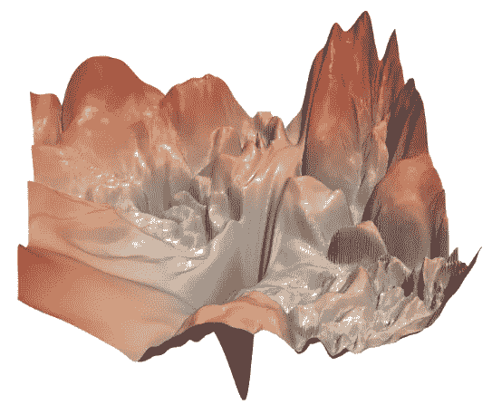

# 如何用量化加速和压缩神经网络

> 原文：<https://towardsdatascience.com/how-to-accelerate-and-compress-neural-networks-with-quantization-edfbbabb6af7?source=collection_archive---------5----------------------->

## 从浮点数到整数

神经网络是非常耗费资源的算法。它们不仅会导致巨大的计算成本，还会消耗大量的内存。

即使商用的计算资源与日俱增，优化深度神经网络的训练和推理也是极其重要的。

如果我们在云中运行我们的模型，我们希望最小化基础设施成本和碳足迹。当我们在边缘上运行我们的模型时，网络优化变得更加重要。如果我们必须在智能手机或嵌入式设备上运行我们的模型，硬件限制就会立即显现出来。

由于越来越多的模型从服务器转移到边缘，减少大小和计算复杂性是必不可少的。一个特别而迷人的技术是*量化*，它在网络内部用整数代替浮点数。在这篇文章中，我们将会看到它们的工作原理，以及你如何在实践中做到这一点。

# 量化

量化背后的基本思想是，如果我们将权重和输入转换为整数类型，我们会消耗更少的内存，并且在某些硬件上，计算会更快。

然而，有一个权衡:有了量化，我们可能会失去相当大的准确性。我们稍后将深入探讨这个问题，但首先让我们看看*为什么*量子化有效。

## 整数与浮点运算

你可能知道，你不能简单地在内存中存储数字，只能存储 1 和 0。因此，为了正确地保存数字并使用它们进行计算，我们必须对它们进行编码。

有两种基本表示:*整数*和*浮点数。*

**整数**用以 2 为基数的数制来表示它们的形式。根据使用的位数，一个整数可以有几种不同的大小。最重要的是

*   *int8* 或 *short* (范围从-128 到 127)，
*   *uint8* (范围从 0 到 255)，
*   *int16* 或 *long* (范围从-32768 到 32767)，
*   *uint16* (范围从 0 到 65535)。

如果我们想表示实数，我们必须放弃完美的精度。举个例子，数字 *1/3* 可以用十进制形式写成*0.33333……*，有无限多的数字*、*是*不能*在内存中表示的。为了处理这种情况，引入了**浮点数字**。

本质上，浮点数是形式中数字的科学表示法

其中基数最常见的是 2，但也可以是 10。(就我们的目的而言，这无关紧要，但我们假设它是 2。)

来源:[维基百科](https://en.wikipedia.org/wiki/Floating-point_arithmetic#/media/File:Float_example.svg)

与整数类似，浮点也有不同的类型。最常用的有

*   *半*或*浮点 16* (1 位符号，5 位指数，10 位有效位，所以**共 16 位**)，
*   *单个*或*浮点 32* (1 位符号，8 位指数，23 位有效位，所以**总共 32 位**)，
*   *double* 或 *float64* (1 位符号，11 位指数，52 位有效位，所以**总共 64 位**)。

如果您尝试以科学的格式将两个数字相加相乘，您会发现浮点运算比整数运算稍微复杂一些。实际上，每次计算的速度很大程度上取决于实际的硬件。例如，台式机中的现代 CPU 进行浮点运算的速度和整数运算一样快。另一方面，GPU 更适合单精度浮点计算。(因为这是计算机图形最普遍的类型。)

在不完全精确的情况下，可以说使用 *int8* 通常比 *float32* 更快。然而，默认情况下， *float32* 用于神经网络的训练和推理。(如果您以前训练过网络，并且没有指定参数和输入的类型，则最有可能是 *float32* 。)

那么，如何将一个网络从 *float32* 转换成 *int8* ？

## 量化网络

这个想法原则上很简单。(实际上没有那么多，我们后面会看到。)假设你有一个输出在 *[-a，a)* 范围内的层，其中 *a* 是任意实数。

首先，我们将输出缩放到 *[-128，128)* ，然后我们简单地向下舍入。也就是说，我们使用变换

举个具体的例子，我们来考虑下面的计算。

这里的值的范围在 *(-1，1)* 中，所以如果我们量化矩阵和输入，我们得到

这是我们看到结果不是一个 int8 的地方。由于两个 8 位整数相乘是一个 16 位整数，我们可以通过转换对结果进行反量化

为了获得结果

如你所见，这不是我们最初拥有的。这是意料之中的，因为量子化是一种近似，我们在这个过程中会丢失信息。然而，这有时是可以接受的。稍后，我们将看到模型性能是如何受到影响的。

## 使用不同类型的量化

我们已经看到，量子化基本上是在操作层面上发生的。从*浮动 32* 到 *int8* 并不是唯一的选择，还有其他选择，比如从*浮动 32* 到*浮动 16* 。这些也可以合并。例如，您可以将矩阵乘法量化为 *int8* ，而将激活量化为 *float16* 。

量子化是一种近似。一般来说，近似值越接近，预期的性能衰减就越小。如果你把所有的东西都量化为浮点，你把内存减半，可能你不会损失精度，但不会真正获得加速。另一方面，用 *int8* 量化可以导致更快的推断，但性能可能会更差。在极端情况下，它甚至不起作用，可能需要量子化意识训练。

# 实践中的量化

在实践中有两种主要的方法来进行量子化。

1.  **后训练:**使用 *float32* 权重和输入训练模型，然后量化权重。它的主要优点是应用简单。不利的一面是，它可能会导致精度损失。
2.  **量化感知训练:**训练时量化权重。这里，甚至为量化的权重计算梯度。当应用 *int8* 量化时，这有最好的结果，但它比另一个选项更复杂。

TensorFlow Lite 中的量化方法及其性能。来源: [TensorFlow Lite 文档](https://www.tensorflow.org/lite/performance/model_optimization)

TensorFlow Lite 中几种卷积网络架构的量化方法比较。来源: [TensorFlow Lite 文档](https://www.tensorflow.org/lite/performance/model_optimization)

实际上，性能很大程度上取决于硬件。量化为 int8 的网络在专门用于整数计算的处理器上会表现得更好。

## 量子化的危险

虽然这些技术看起来很有前途，但在应用时必须非常小心。神经网络是极其复杂的函数，尽管它们是连续的，但它们可以非常迅速地变化。为了说明这一点，让我们重温郝力等人的传奇论文 [*可视化神经网络的损失景观*](https://arxiv.org/abs/1712.09913) 。

下面是没有跳跃连接的 ResNet56 模型的损失情况的可视化。自变量代表模型的权重，而因变量是损失。

ResNet56 的损失情况可视化，无跳跃连接。来源: [*可视化神经网络的损失景观*](https://arxiv.org/abs/1712.09913) 郝力等人。

上图完美地说明了这一点。即使只是稍微改变一下重量，损失的差异也是巨大的。

在量化时，这正是我们正在做的:通过牺牲压缩表示的精度来逼近参数。不能保证它不会在结果中完全搞乱模型。

因此，如果你正在为安全至关重要且错误预测损失巨大的任务构建深度网络，你必须*极其*小心。

## 现代深度学习框架中的量化

如果您想尝试这些技术，您不必从头开始实现。最成熟的工具之一是 TensorFlow Lite 的模型优化工具包。它包含了尽可能缩小模型的方法。

您可以在下面找到文档和介绍性文章。

 [## 模型优化| TensorFlow Lite

### 边缘设备通常具有有限的内存或计算能力。可以对模型进行各种优化，以便…

www.tensorflow.org](https://www.tensorflow.org/lite/performance/model_optimization)  [## TensorFlow 模型优化工具包简介

### 我们很高兴在 TensorFlow 中推出一个新的优化工具包:一套技术，开发者，无论是…

medium.com](https://medium.com/tensorflow/introducing-the-model-optimization-toolkit-for-tensorflow-254aca1ba0a3) 

PyTorch 还支持多种量化工作流程。虽然它目前被标记为实验性的，但它是完全可用的。(但是预计 API 会改变，直到它处于*实验*状态。)

 [## PyTorch

### Raghuraman Krishnamoorthi、James Reed、Min Ni、Chris Gottbrath 和 Seth Weidman 重要的是要让效率…

pytorch.org](https://pytorch.org/blog/introduction-to-quantization-on-pytorch/)  [## (实验)在 LSTM 单词语言模型上的动态量化

### 编辑描述

pytorch.org](https://pytorch.org/tutorials/advanced/dynamic_quantization_tutorial.html)  [## 关于 BERT - PyTorch 教程 1.5.1 文档的(实验性)动态量化

### 提示为了充分利用本教程，我们建议使用 Colab 版本。这将允许您试验…

pytorch.org](https://pytorch.org/tutorials/intermediate/dynamic_quantization_bert_tutorial.html) 

# 其他优化技术

除了量化，还有其他技术来压缩你的模型和加速推理。

## 修剪

一个特别有趣的是*权重修剪*，在训练过程中，网络的连接被反复删除。(或者某些变奏中的后期训练。)令人惊讶的是，在某些情况下，您甚至可以移除 99%的权重，但仍然具有足够的性能。

如果你感兴趣，我写了一份关于该领域里程碑的详细总结，并讨论了最新的发展水平。

 [## 你能移除 99%的神经网络而不损失准确性吗？

### 权重剪枝简介

towardsdatascience.com](/can-you-remove-99-of-a-neural-network-without-losing-accuracy-915b1fab873b) 

## 知识的升华

第二个主要的网络优化技术是*知识提炼*。本质上，在模型被训练之后，一个小得多的*学生*模型被训练来预测原始模型。

知识提炼的师生模型。资料来源:[郭建平等人的调查](https://arxiv.org/abs/2006.05525v1)。

Geoffrey Hinton、Oriol Vinyals 和 Jeff Dean 在他们的论文*中介绍了这种方法，在神经网络中提取知识*。

 [## 提取神经网络中的知识

### 提高几乎任何机器学习算法的性能的一个非常简单的方法是训练许多不同的模型…

arxiv.org](https://arxiv.org/abs/1503.02531) 

提取已经被成功地应用于压缩 BERT，这是一个巨大的语言表示模型，在所有领域都有应用。通过蒸馏，该模型实际上可以在边缘使用，如智能手机设备。

这些努力的领导者之一是令人敬畏的[拥抱脸](https://huggingface.co/)，他们是 DistilBERT 论文的作者。

 [## 蒸馏伯特，伯特的蒸馏版本:更小，更快，更便宜，更轻

### 随着大规模预训练模型的迁移学习在自然语言处理(NLP)中变得越来越普遍…

arxiv.org](https://arxiv.org/abs/1910.01108) 

如果你对一个实际的例子感兴趣，你可以看看这篇关于上面提到的 BERT 蒸馏的文章，使用来自 PyTorch 生态系统的库 Catalyst。

 [## 带催化剂的伯特蒸馏

### 如何用催化剂蒸馏 BERT？

medium.com](https://medium.com/pytorch/bert-distillation-with-catalyst-c6f30c985854) 

# 摘要

随着神经网络从服务器转移到边缘，优化速度和大小极其重要。量化是一种可以实现这一点的技术。它将 *float32* 参数和输入替换为其他类型，如 *float16* 或 *int8* 。使用专门的硬件，与未量化的模型相比，可以更快地进行推理。

然而，由于它的量化是一种近似，必须小心。在某些情况下，它会导致显著的精度损失。

与其他模型优化方法(如权重修剪和知识提取)一起，这可能是最快的使用方法。有了这个工具，你可以在不重新训练你的模型的情况下获得结果。在训练后优化是唯一选择的情况下，量化会大有帮助。

[***如果你喜欢把机器学习概念拆开，理解是什么让它们运转，我们有很多共同点。看看我的博客，我经常在那里发表这样的技术文章！***](https://www.tivadardanka.com/blog)