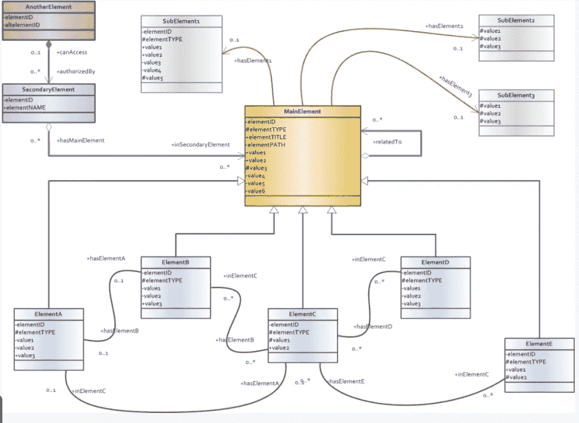

# 如何赢得数据可视化项目:成功的 3 个步骤

> 原文：<https://towardsdatascience.com/how-to-ace-your-data-visualization-project-3-steps-for-success-cf325839b0fe?source=collection_archive---------43----------------------->

## 这并不总是关于 viz 技能

[翁贝托](https://unsplash.com/@umby?utm_source=medium&utm_medium=referral)在 [Unsplash](https://unsplash.com?utm_source=medium&utm_medium=referral) 上拍摄的照片

*(注:所有观点均为本人)*

最近，我一直在从事不同的数据可视化项目，并能够记下关键的不同成功因素，使某些项目达到或超过客户的期望。

核心可视化技能当然很重要(例如，如果有人要求你提供一个 Tableau 仪表板，精通 Tableau 自然会有所帮助)，但是考虑到技术能力的一定门槛，还有其他一些决定项目成败的关键因素，这些因素落后于纯粹的技术技能，我觉得它们的重要性被忽视了，没有被充分提及。

在这篇简短的文章中，我强调了我学会的 3 个步骤，因为我认为它们与交付成功的数据可视化项目非常相关

## 1)了解数据模型

在可视化您的数据之前，最好对数据的结构、组织、收集、处理和管理有一个清晰的了解，即使您是数据团队的一员，而您只负责最终交付的可视化部分。

> 这也许是最关键的一步。**如果你对后端的数据没有一个清晰的视图，你将如何在前端开发一个整洁的可视化？**

来源:[Talend.com](https://www.talend.com/resources/data-model-design-best-practices-part-2/)

我在这里的主要建议是花所有必要的时间与您的数据工程师/云架构师/数据库管理员在一起，以确保您对项目范围内的数据建模概念的掌握尽可能牢固。

像下面这样的问题可以帮助您缩小关键元素的范围，甚至在您开始绘制和可视化数据之前，让您到达您需要的位置:

1.  **数据是如何组织的？模型中的关键关系是什么？**
2.  **数据是如何处理的？**
3.  **数据延迟水平如何？你收到实时信号了吗？如果没有，更新频率是多少？**
4.  **数据存放在哪里？哪些是关键的数据来源？**
5.  谁负责数据管道中的各个步骤？在这个过程中，第三方供应商是否有责任？
6.  你和客户对你要使用的关键变量的术语一致吗？

在这里不要给错误留有余地，这对于将项目引向正确的方向并避免在时间紧张时出错是至关重要的。

## 2)全面了解需求

确保你和客户在最终目标和交付物的形式上尽可能保持一致。

这归结为深入了解业务环境和客户面临的问题，并确保在工作中不放过任何一个需求。

在 [Unsplash](https://unsplash.com?utm_source=medium&utm_medium=referral) 上由 [Austin Distel](https://unsplash.com/@austindistel?utm_source=medium&utm_medium=referral) 拍摄的照片

询问大量问题并进行澄清是非常重要的，这样才能与你的对手保持完全一致，并减少出现以下情况的可能性:

1.  *交付不包含项目范围的完整* ***宽度*** *的可视化(即，省略关键业务指标和关系的表示)*
2.  *交付一个可视化的项目，该项目并未涵盖项目范围的全部* ***深度*** *(即，仅解决高层业务关系，而非低层业务关系)*

## 3)预测客户的需求，提供超出预期的服务

如果时间允许，最好总是努力超越客户的期望，不仅要让客户满意，还要让他们高兴。

照片由[光圈老式](https://unsplash.com/@aperturevintage?utm_source=medium&utm_medium=referral)在 [Unsplash](https://unsplash.com?utm_source=medium&utm_medium=referral) 上拍摄

这有点老生常谈，但在任何数据可视化项目中，你都可以试着让自己的思想处于一种对成品长期不满意的状态，从而让你的创造力在潜在方面流动，并进一步调整，这将有利于应用到你的工具/演示/仪表板的当前状态。

对客户和业务环境的深刻理解肯定可以帮助您发现可能需要进一步改进的领域，即使表面上并不需要。

这方面的例子包括:

1.  **添加增强的互动层**
2.  **增加产品共享、维护和更新方式的灵活性**
3.  **添加更低级别的功能，并能够向下钻取到尽可能多的相关视图**
4.  **通过向最终产品添加额外的视觉层，帮助客户发现他们最初可能没有考虑到的进一步的相关性和业务关系**

## 概括起来

拥有出色的数据可视化技能以及最常用工具和软件框架的技术知识是非常重要的，但是如果您能够:

1.  **从源头全面了解您的数据**
2.  **完全符合客户的需求，站在他们的角度考虑他们打算如何利用你的数据洞察力**
3.  **提前思考，提出创造性的改进和想法**

您可以大大增加将数据可视化项目提升到下一个级别的机会。感谢阅读！

**访问我的免费数据科学资源清单** [**这里**](https://landing.mailerlite.com/webforms/landing/k1n3r2)

 [## 通过我的推荐链接加入 Medium-Edoardo Romani

### 作为一个媒体会员，你的会员费的一部分会给你阅读的作家，你可以完全接触到每一个故事…

edo-romani1.medium.com](https://edo-romani1.medium.com/membership)