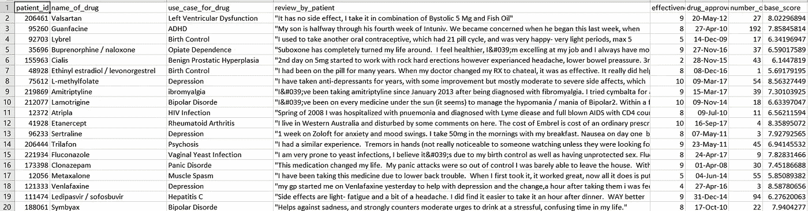
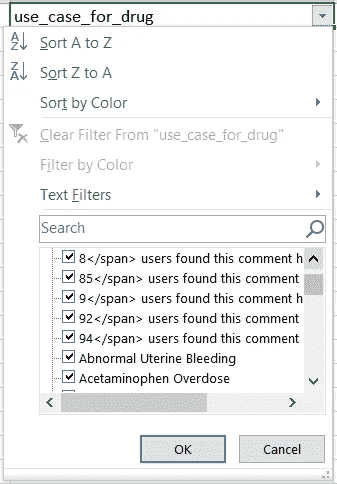

# 如何在大联盟比赛中获得快速准确的基线

> 原文：<https://towardsdatascience.com/how-to-achieve-a-quick-accurate-baseline-for-ml-competitions-11b7ae29b673?source=collection_archive---------61----------------------->

## 这篇文章描述了我如何只用几行代码就在*性病药物有效性预测挑战赛*中获得第五名。


照片由[欧文比尔德](https://unsplash.com/@owenbeard?utm_source=medium&utm_medium=referral)在 [Unsplash](https://unsplash.com?utm_source=medium&utm_medium=referral) 上拍摄

根据美国疾病预防控制中心的报告，2018 年美国报告了超过 240 万例性传播疾病(STDs)。该报告还强调，从 2017 年到 2018 年，因梅毒导致的新生儿死亡人数增长了 22%。基于这些事实，HackerEarth 宣布了[性病药物有效性机器学习预测挑战](https://www.hackerearth.com/challenges/competitive/hackerearth-machine-learning-challenge-std-drug-effectiveness/)，以提高人们对各种性病和用于治疗它们的药物的认识。

虽然我没有足够的时间专门参加比赛，但这一次看起来真的很有趣，我无法抗拒自己。一些快速分析和一些提交后，我在这里，在公共排行榜上获得第三名，在私人排行榜上获得第五名。我对我在这个问题上所花时间的排名感到非常惊讶，所以我决定写一篇关于我的方法的博客，以便每个人都能从快速准确的基线中受益。那么，让我们开始吧！

***免责声明:我不使用熊猫*** *(不，我不是嬉皮士——伪数据科学家，相信我)*


来源:[用](https://imgflip.com/i/412v91) [Imgflip](https://imgflip.com/) [模因生成器](https://imgflip.com/memegenerator) (CCO)创建了

[](https://github.com/atif-hassan/Competition-code/blob/master/Hackerearth/STD%20Drug%20Effectiveness/code/new_regression_ml.py) [## atif-Hassan/竞赛代码

### 这个库包含我为我参加的所有比赛编写的代码- atif-hassan/Competition-code

github.com](https://github.com/atif-hassan/Competition-code/blob/master/Hackerearth/STD%20Drug%20Effectiveness/code/new_regression_ml.py) 

# 数据分析

什么？你认为会有银弹吗？我刚告诉过你我不是嬉皮士伪数据科学家！在解决问题之前，你总是需要分析你的数据。



资料截图

*有效性评级*功能是由评审者提供的最终评级，因此，可用于替代*评审 _ 患者*栏。*药品由 UIC* 批准的功能没有多大意义，因为同一种药品有多个批准日期。有一种可能性是，批准是基于一个病人一个病人的基础上，但我没有深入挖掘这个想法。在平台提供的训练集和测试集中， *patient_id* 列不包含任何副本，因此它没有任何用处。经过这种初步的"*特征选择*"之后，我们剩下的是*药品名称(我们称此栏为* ***药品/药品名称****)**使用 _ 病例 _ 药物(我们称此栏为* ***疾病****)**药品 _ 疗效*和

*因为药物和疾病特征是分类的，所以让我们看看所有独特的实例，以便知道我们在这里处理的是什么。在 excel 的数据类别中快速应用筛选选项就可以做到这一点。*

**

*似乎疾病栏不是很干净*

*药物一栏中没有什么出乎意料的，尽管疾病一栏确实包含一些噪音。看起来噪音模式是一个数字后跟一个 span 句子，可能是一个刮擦错误。现在让我们检查测试数据集中的药物和疾病列是否都是它们的训练数据集对应物的子集。*

*代码查找出词汇(OOV)药物和疾病*

```
*OOV Drugs (158 in total):
-------------------------
Acetaminophen / caffeine
Advil Cold and Sinus Liqui-Gels
Afrin 4 Hour Extra Moisturizing
Amethia Lo
Amitriptyline / perphenazine
.
.
.OOV Diseases (34 in total):
---------------------------
22</span> users found this comment helpful.
39</span> users found this comment helpful.
55</span> users found this comment helpful.
Aphthous Ulce
Breast Cancer, Prevention
.
.
.*
```

*从上面的输出可以看出，测试集中有相当多的药物和一些疾病没有出现在训练集中，这是一个问题。但是等等，我们知道药物有时有多个名字。因此，也许，如果我们可以找到测试集中存在的药物的替代名称(存在于训练集中的名称)，那么，我们可以替换这些药物名称，并帮助模型理解大量样本。Drugs.com 是一个很好的网站。由于时间不多，我只手动替换了几个药名。如果所有 OOV 药品的名称都被替换为训练集中正确的名称，这肯定会有所帮助。*

```
*Drug "Esomeprazole / naproxen" was present as "Vimovo" in test set
Drug "Senna S" was present as "Docusate / senna" in test set
Drug "Empagliflozin" was present as "Synjardy" in test set
.
.
.*
```

*同样，疾病也可以被替代，但是在这种情况下，oov 的数量很少，所以我决定忽略它们。*

# *模型结构*

*一旦预处理完成，我就进入了模型构建阶段。我无法使用*药物有效性*和*处方次数*数字列*快速设计一些好的功能。*相反，我应用了 k-means 聚类，并使用所有聚类之间的样本距离作为特征。这种无监督的特征工程方法几乎总是对我有效。我将很快写一篇关于所有这些技巧和窍门的文章，但更多的将在后面。“药品”和“疾病”列是一次性编码的(ohe ),而“疾病”列中的所有干扰样本都被替换为一个字符串，代表一个缺失值。这两组一键编码与两个数字和 k 均值特征连接在一起。这导致了一个大而稀疏的特征空间。*

*最后，我使用 LightGBM 回归模型进行预测。使用 10 倍交叉验证对模型的超参数进行了一些调整。就是这样！这就是我能够连续 20 天保持在公共排行榜首位的原因，但值得称赞的是，前 4 名参与者一直工作到最后一刻！*

# *带回家的信息*

*永远记住，即使花费少量的时间和精力来挖掘数据中的模式，也能为您提供真正好的结果。这就是如何用几行代码实现快速准确的基线😉。*

*我知道这篇文章不包含任何可视化，但那是因为我没有把太多的数据分析融入到我的工作中。我恳求大家给我提供反馈，因为这是我的第一篇博客(所以请小心行事😅).*

> *谢谢大家！*