# 如何给你的 AWS API 网关 API 添加 API 键？

> 原文：<https://towardsdatascience.com/how-to-add-api-keys-to-your-aws-api-gateway-api-691bd17c5924?source=collection_archive---------9----------------------->

## [实践教程](https://towardsdatascience.com/tagged/hands-on-tutorials)

## 向 AWS API 添加 API 令牌以进行访问管理

如何给你的 AWS API 网关 API 添加 API 键？由[格伦·卡斯滕斯-彼得斯](https://unsplash.com/@glenncarstenspeters?utm_source=unsplash&utm_medium=referral&utm_content=creditCopyText)在 [Unsplash](https://unsplash.com/s/photos/computer?utm_source=unsplash&utm_medium=referral&utm_content=creditCopyText) 上拍摄的照片。

在本文中，我将解释如何向使用 AWS API Gateway 制作的 API 添加基本安全级别。这将通过添加令牌来完成。

令牌是您需要随 API 请求一起发送的代码，其工作方式或多或少类似于密码。如果您的令牌允许您访问数据，API 将向您发送数据。否则它会给你一个错误。

按照这个例子，您可以使用在上一篇文章中创建的 AWS API Gateway API，它发送回一个随机生成的密码。或者可以直接使用自己的 AWS API。

让我们开始吧:

# 步骤 1:创建使用计划

转到使用计划选项卡，然后单击创建。这将让你开始建立一个使用计划。

你必须选择你的客户可以提出多少个请求。对于我的基本计划，我想每月允许 100 个请求。我允许每秒 9 个请求。我允许一次最多有 100 个请求。

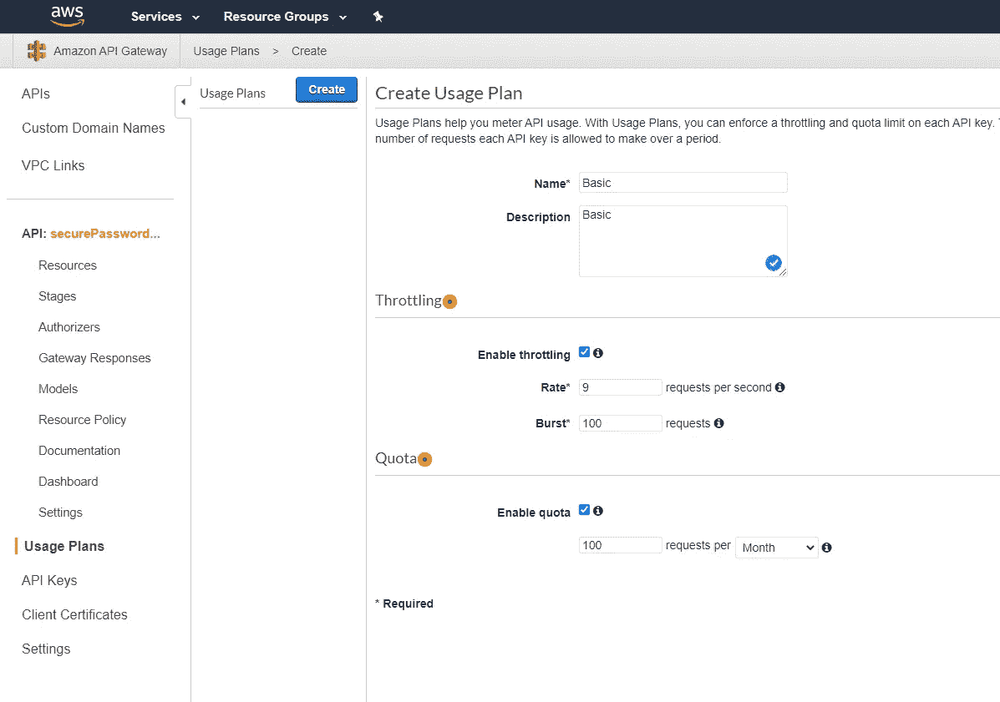

然后，您需要将 API 及其阶段添加到使用计划中，如下所示:

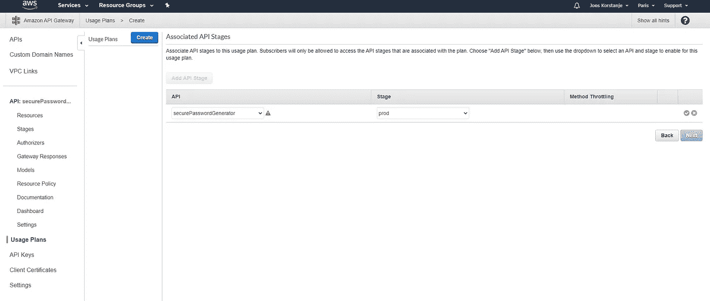

现在，您有了一个使用计划，它为拥有该使用计划的用户发出的 API 请求指定了使用限制。为了将此使用计划传递给您的用户/客户，您需要一个与使用计划相关联的 API 密钥。让我们现在做那件事。

# 步骤 2:在 AWS API Gateway 中设置 API 密钥

点击“将 API 密钥添加到使用计划”。这将允许您向刚刚创建的使用计划添加 API 密钥。

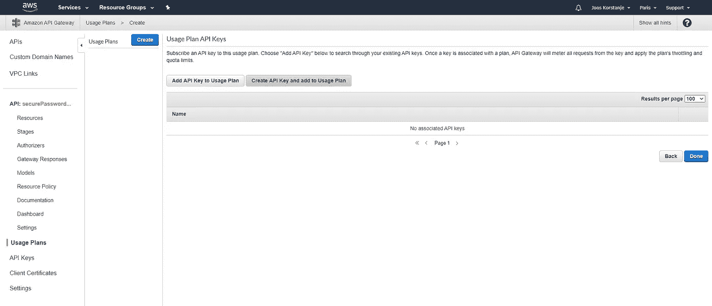

为 API 键创建名称和描述(可以是任何内容),并让 API 键自动生成:

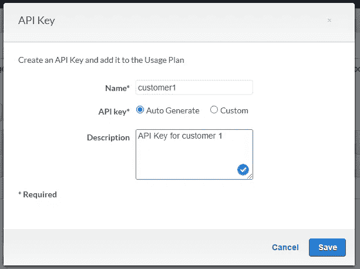

然后点击完成。现在，您拥有了与您的使用计划所指定的访问规则相关联的第一个 API 键。

# 步骤 3:不允许在 AWS API 网关中没有 API 密钥的访问

现在，我们已经允许使用 API 密钥进行访问。但是没有 API 密钥的访问仍然有效！我们必须改变这种状况。

转到您的 API 方法:

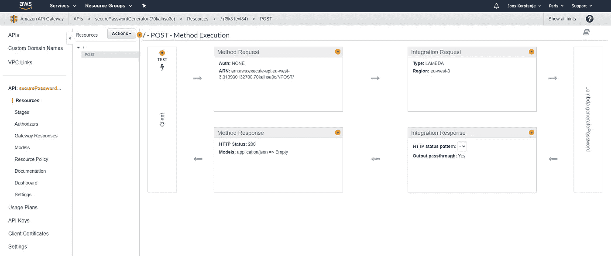

点击方法请求，进入以下菜单。一条警告信息已经在等着你了:

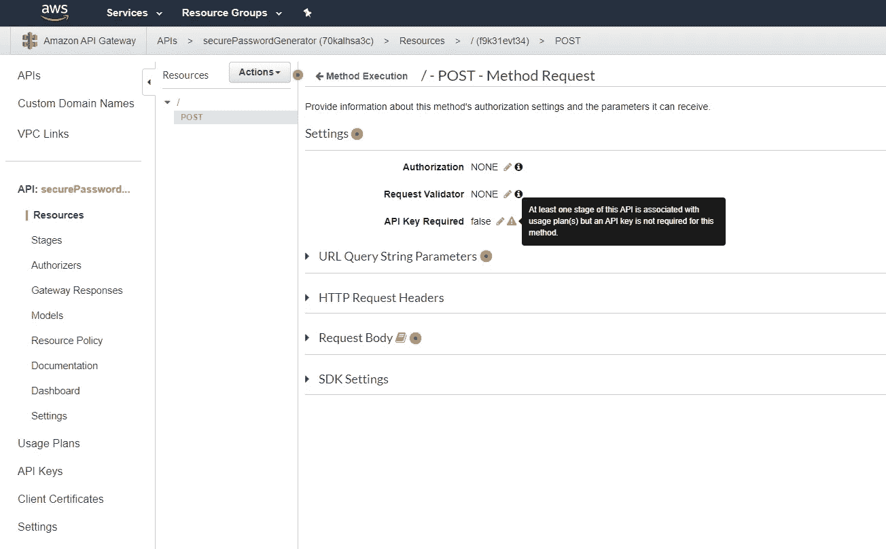

现在，您需要将“需要 API 密钥”更改为“真”，以确保 API 只接受带有 API 密钥的请求:

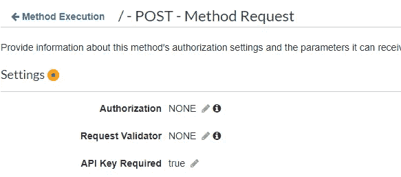

# 步骤 4:部署您的 API

现在，要完成 API 键的添加，您需要部署 API 以使更改生效。

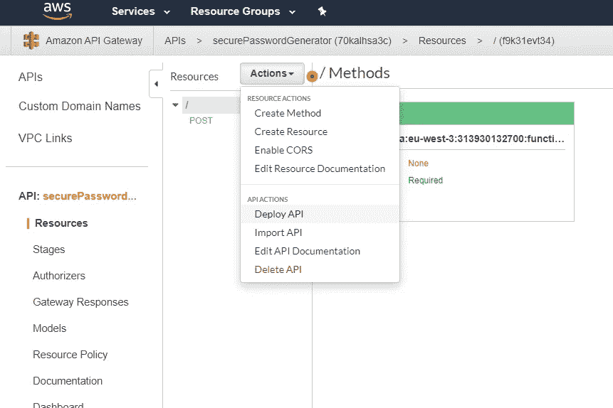

在这个小示例中，我们只有一个 prod 阶段，因此我们可以直接部署到 prod:

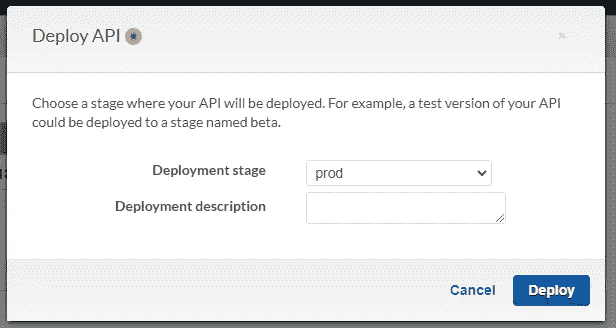

# 步骤 5:测试新的 API

现在，当在没有指定 API 键的情况下测试 API 时，我们得到了正确的 403“禁止访问”响应。可以从笔记本中执行以下 Python 代码来对此进行测试:

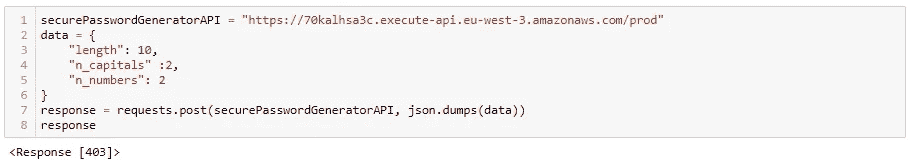

要找到您的 API 密钥，请转到 API 密钥，选择您的 customer1 API 密钥，然后单击显示。复制并粘贴它，以便测试 API:

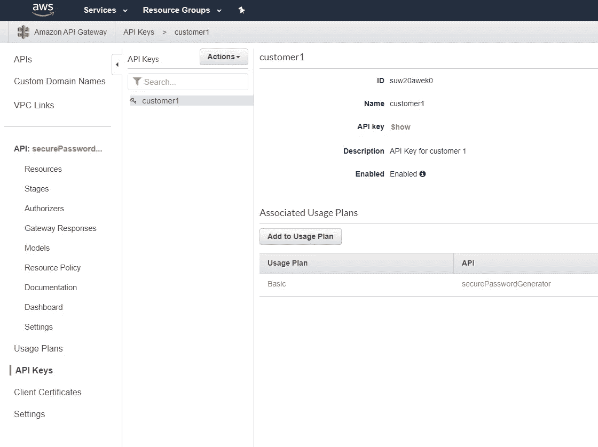

在 Python 代码中，现在需要在 *x-api-key* 头中传递 API 键，如下所示:

正如我们所希望的，我们得到了一个生成的密码，但是现在开发者不得不使用 API 密匙！

*我希望这篇文章对你有用。不要犹豫，继续关注更多！*