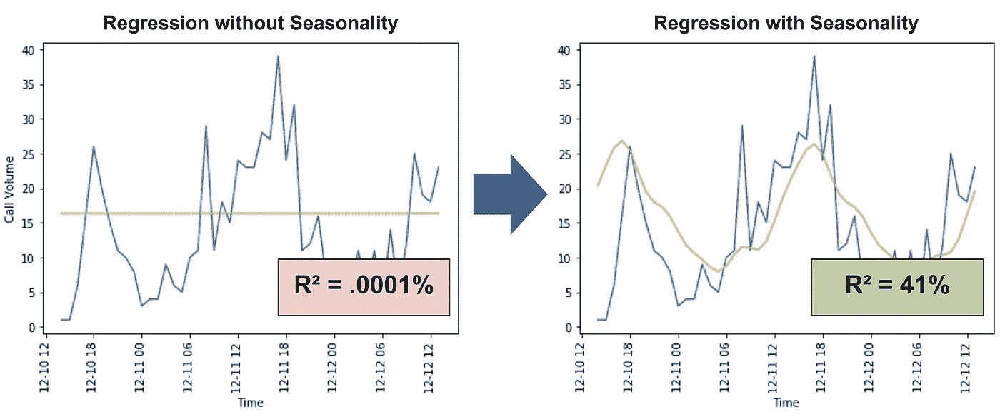
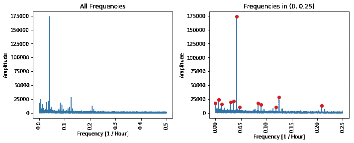
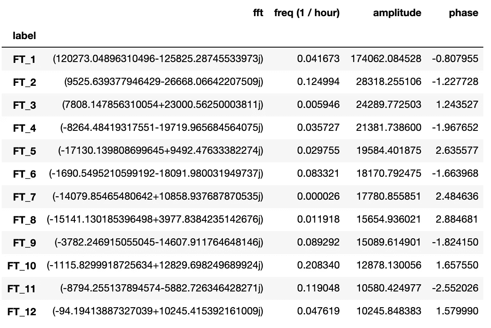
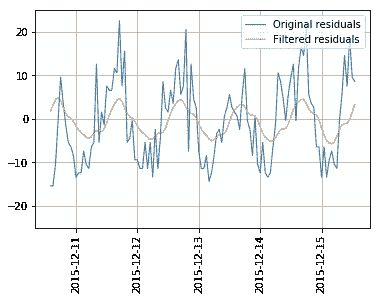
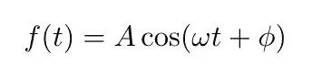
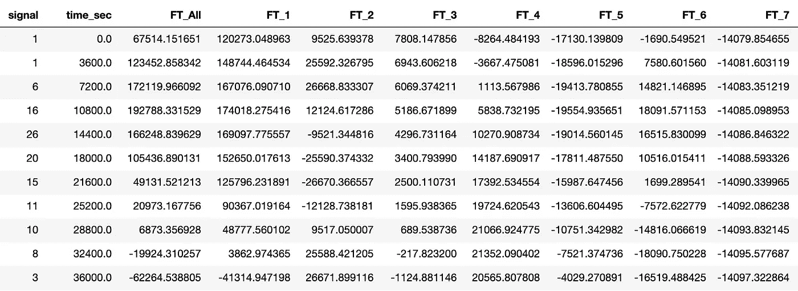
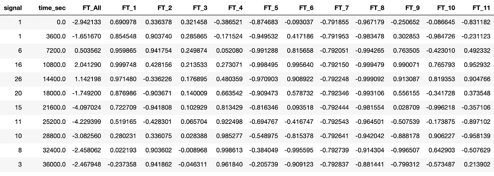
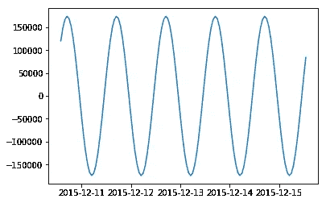
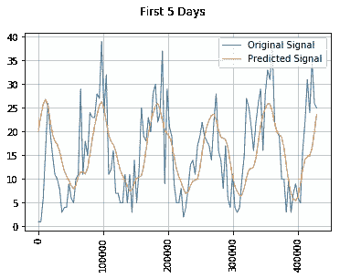

# 如何将傅立叶项添加到回归和季节性分析中(使用 Python 和 SciPy)

> 原文：<https://towardsdatascience.com/how-to-add-fourier-terms-to-your-regression-seasonality-analysis-using-python-scipy-99a94d3ae51?source=collection_archive---------12----------------------->

## 使用傅立叶项将季节性包括在回归中



希望到此结束时，你也能够将你的回归提高 410，000 倍！

## 重温我们的 911 电话记录

在上一篇文章中，我们研究了如何使用傅立叶变换来分析宾夕法尼亚州蒙哥马利县 911 电话呼叫数据的季节性。如果你还没看过，看看下面吧(虽然你也一定能看完这篇文章)。

[](/analyzing-seasonality-with-fourier-transforms-using-python-scipy-bb46945a23d3) [## 使用 Python 和 SciPy 通过傅立叶变换分析季节性

### 通过寻找 911 电话数据中的季节性趋势，学会从噪音中分离信号

towardsdatascience.com](/analyzing-seasonality-with-fourier-transforms-using-python-scipy-bb46945a23d3) 

我们在数据中发现了一些有趣的周期性。通话量有 3 个主要的季节性趋势:每天，每天 3 次，每周一次。但是季节性并不能解释一切。历史不会完全重演。例如，潮汐整天都在退潮和流动(这是季节性的)，改变了水位，但每年，全球变暖都会增加整体海平面(除非我们采取措施)。如果你仅仅通过观察潮汐来预测未来许多年的水位，你会低估水位，因为你没有考虑海平面是如何随着时间的推移而上升的。

同样，蒙哥马利县的人口从 2010 年到 2019 年增长了约 3.9%，因此可以合理地假设，由于人口的增长，我们的数据中的 911 呼叫量也略有增加(我们将查明情况是否如此)。

为了解决这个问题，我们将对上次分析季节性的方法做一个大的改变。我们将首先运行线性回归，然后对残差(第一次回归的误差)执行傅立叶变换。

我们正在做的是尽最大努力不使用季节性来解释数据，然后我们将使用季节性来解释我们无法解释的东西。所以让我们开始吧。

## 计算残差

第一步是做回归。我的偏好是使用 Sckit-Learn 的线性回归模型，你可以使用任何你觉得舒服的模型。

```
# time_sec is the hourly timestamp converted to seconds
X = pd.DataFrame(data['time_sec']) 
# signal is how many calls were made in that hour
y = pd.DataFrame(data['signal'])model = LinearRegression()
model.fit(X, y) 
data['pred_signal_linreg'] = model.predict(X)
data['residuals'] = data['signal'] - data['pred_signal_linreg']
```

查看模型系数和截距，我们发现斜率约为 3E 10，截距为 16.40。

```
>> print('Slope: {:.2e}, Intercept: {:.2f}'.format(model.coef_[0,0], model.intercept_[0]))
**Slope: -2.59e-10, Intercept: 16.40**
```

因此，通话量从每小时约 16.4 次通话开始，每年通话量下降约 10×60×60×24×365 3E 每小时约 0.009 次通话。

我们最初的假设是，我们会看到 911 电话的增加与人口增长成比例，但这似乎并不正确。此外，很明显，这种回归不是很有帮助。其余真的少得可怜。

```
>> print('R-squared: {:.2e}'.format(model.score(X,y)))
**R-squared: 1.00e-06**
```

但是这种云也有一线希望。仅时间上的不良拟合就表明，我们可以通过引入傅立叶项来显著改善情况。

## 傅立叶变换和傅立叶逆变换

[第 1 部分](/analyzing-seasonality-with-fourier-transforms-using-python-scipy-bb46945a23d3)详细介绍了这一过程。简而言之，我们将使用傅立叶变换来找到最主要的频率，然后使用傅立叶逆变换来给出对应于这些频率的函数。

这是傅立叶变换后我们找到的主频。

```
time = data['time']
residuals = data['residuals']fft_output = fft.fft(residuals)
power = np.abs(fft_output)
freq = fft.fftfreq(len(residuals))peaks = scipy.sig.find_peaks(power[freq >=0], prominence=10**4)[0]
peak_freq =  freq[peaks]
peak_power = power[peaks]
plt.plot(peak_freq, peak_power, 'ro')
```



以下是这些峰值对应的值(与我们在第 1 部分中看到的没有太大不同)。为了便于参考，我将它们标为`FT_1 ... FT_12`。



如果您对如何获得这些值感兴趣，`FFT` 列是运行`scipy.fft.fft(residuals)`的输出。您可以通过运行`fft.fftfreq(len(residuals))`获得频率。这些频率的单位是`1 / timestep`，其中时间步长是残差之间的间隔(在我们的例子中，这是一个小时)，振幅是`abs(fft)`，相位是`cmath.phase(fft)`。

这些行中的每一行都对应于一个正弦曲线。我们可以使用傅里叶逆变换来计算这些正弦曲线，并绘制它们的和与原始残差的关系。它们非常合适。

```
filtered_residuals = fft.ifft(filtered_fft_output)N = 24 * 5
plt.plot(time[:N], residuals[:N], linewidth=1, label='Original residuals')
plt.plot(time[:N], filtered_residuals[:N].real, linewidth=1, label='Filtered residuals')
plt.legend(loc='upper right')
ax2.set_title('First 5 Days')
plt.grid()
plt.ylim((-25, 25))
plt.xticks(rotation=90)
```



## 融入我们的回归

现在让我们将正弦曲线纳入初始回归。这些正弦曲线的问题在于振幅不在范围内。你可以在上面的图表中看到，它显得太低了。这是因为我们对残差进行了傅里叶变换，并将输出过滤为 12 项。所以我们的过滤

我们最初的回归只是使用时间作为唯一的变量，但现在我们可以添加傅立叶项。相位、幅度和频率让我们用这个公式画出 FFT 项对应的波形。



A =振幅，ω=角频率= 2 *π*频率，φ=相移

我们现在要做的是，如果我们增加几个与 FFT 波形相关的新变量，我们会得出什么样的新回归。

所以我们回到我们的原始数据，以秒为单位的时间和当时的呼叫次数，我们添加了几列，对应于傅立叶变换的每个波。然后我们可以将这些加在一起成为一个新的列，`FT_All`。这看起来像:

```
for key in fourier_terms_dict.keys():
    a = fourier_terms_dict[key]['amplitude']
    w = 2 * math.pi * (fourier_terms_dict[key]['freq (1 / hour)'] / 3600)
    p = fourier_terms_dict[key]['phase']
    data[key] = data['time_sec'].apply(lambda t: math.cos(w*t + p))data['FT_All'] = 0
for column in list(fourier_terms.index):
    data['FT_All'] = data['FT_All'] + data[column]
```

这为我们提供了一个新变量`FT_All`，它与我们之前绘制的“过滤残差”相同。



之前我们只是对 signal = f(time)进行回归，但现在我们可以对 signal = f(time，FT_All)进行回归



之前我们只是对 signal = f(time)进行回归，但现在我们可以对 signal = f(time，FT_All)进行回归

这些傅立叶项可能看起来令人生畏，但基本上，它们只是我们认为在傅立叶变换中很重要的正弦曲线(即波)。它们很重要，因为它们在频域达到峰值。如果我们绘制`FT_1`图，我们会看到这是一个具有一天周期和特定相移的波，这与我们在数据中看到的每日季节性相匹配。

```
>> plt.plot(data['time'][:24*5], data['FT_1'][:24*5])
```



现在我们可以使用新变量进行回归。

```
# time_sec is the hourly timestamp converted to seconds
# list(fourier_terms.index) are the names of our Fourier terms
X = pd.DataFrame(data[['time_sec', 'FT_All']]) 
# signal is how many calls were made in that hour
y = pd.DataFrame(data['signal'])model = LinearRegression()
model.fit(X, y)
```

这是前 5 天的回归结果。它看起来很有希望。



最后，如果我们检查模型得分，我们可以看到我们比以前做得好得多。

```
>> model.score(X,y)
0.4089566840099922
```

通过增加一个新变量，R 从 0.000001 提高到 0.41。一点都不差！

## 为什么傅立叶变换对回归有帮助？

傅立叶变换并不是回归中分析季节性的唯一方法。我肯定会考虑探索其他更简单的选择。就像为一天中的一个小时或一周中的一天添加一个虚拟变量，特别是如果你已经对将要发生的事情有了强烈的直觉。

例如，假设您知道 911 呼叫量在下午 6 点到 9 点之间达到峰值，那么您可以创建一个新变量，当时间在下午 6 点到 9 点之间时，该变量为`1`，否则为`0`。这个系数会非常清楚地告诉你，在晚上的时间里会有多少更多的呼叫量。

挑战在于知道如何开始。是晚上 6 点到 9 点，还是晚上 7 点到 10 点？还是周末比晚上更能影响通话量？傅立叶变换是回答这些问题的好方法。它为您提供了一种可量化的方法来测量数据中的季节性。然后，如果您想在回归中利用它，有一个简单的选择，通过合并傅里叶变换输出的正弦曲线来实现。或者，您可以从傅立叶分析中获得见解，并在您的回归中测试更简单的变量。

## [**Github 上的项目代码**](https://github.com/Kommandat/seasonality-fourier-analysis/blob/master/notebooks/Part%202%20-%20Regression%20%20Analysis%20with%20scipy-fft.ipynb)

## [ka ggle 上的数据集](https://www.kaggle.com/mchirico/montcoalert)

## 在此阅读第 1 部分[的](/analyzing-seasonality-with-fourier-transforms-using-python-scipy-bb46945a23d3)

[](/analyzing-seasonality-with-fourier-transforms-using-python-scipy-bb46945a23d3) [## 使用 Python 和 SciPy 通过傅立叶变换分析季节性

### 通过寻找 911 电话数据中的季节性趋势，学会从噪音中分离信号

towardsdatascience.com](/analyzing-seasonality-with-fourier-transforms-using-python-scipy-bb46945a23d3)