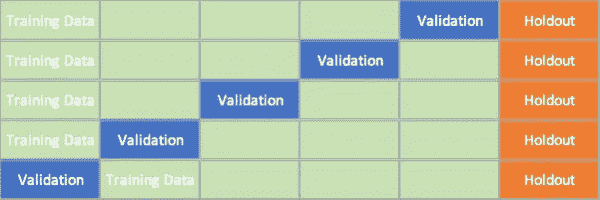
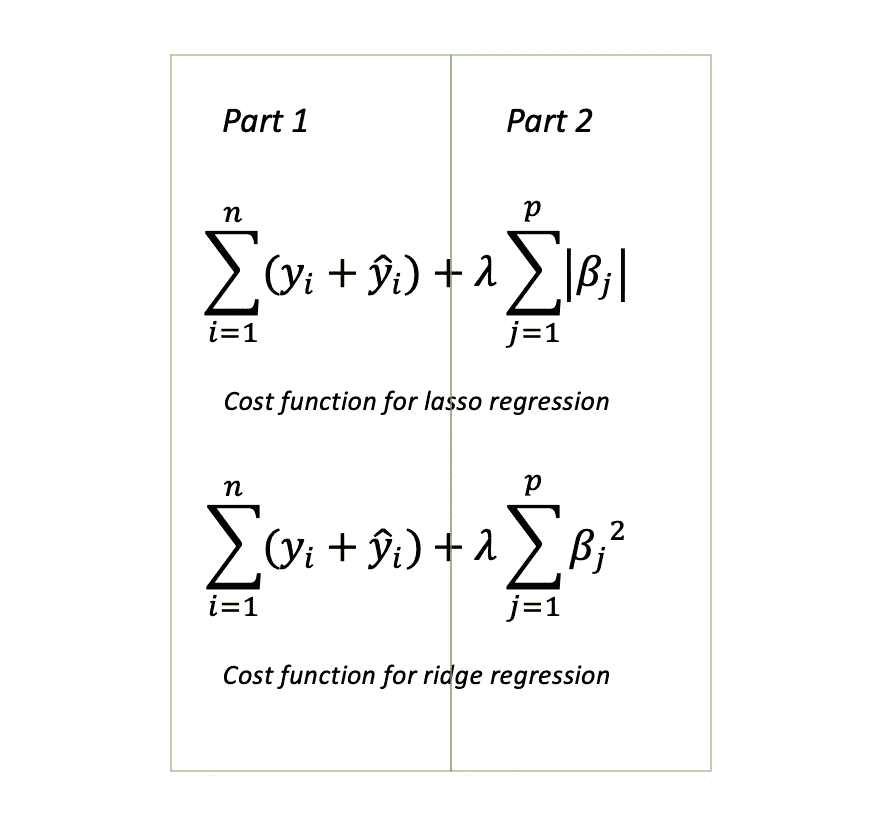

# 如何解决过度拟合(初学者友好)

> 原文：<https://towardsdatascience.com/how-to-address-overfitting-beginner-friendly-f26d7e7dd05?source=collection_archive---------49----------------------->

## 防止过度拟合的三种基本方法

图片由 [StartupStockPhotos](https://pixabay.com/users/StartupStockPhotos-690514/?utm_source=link-attribution&utm_medium=referral&utm_campaign=image&utm_content=594090) 来自 [Pixabay](https://pixabay.com/?utm_source=link-attribution&utm_medium=referral&utm_campaign=image&utm_content=594090)

想象一下，你的老板给你一些数据，让你训练一个分类模型。你非常努力地调整你的模型，最终得到一个训练有素的模型，准确率达到 99%。你把这个模型交给你的老板，并自信地告诉他，这个模型将会运行良好，有助于促进业务。几天后，你的老板来到你面前，愤怒地向你展示了他部署模型时的可怕结果。你对正在发生的事情感到非常困惑，因为当你训练模型时，你获得了 99%的准确率。哦，天哪，那是“过度拟合”。当我们仅使用训练数据训练模型时，会发生过度拟合。它与训练数据非常吻合，但当模型应用于看不见的数据(测试数据)时，它的表现会更差。让我们向前一步，看看我们可以做些什么来处理过度拟合。

**如何感知过度拟合？**

你可能听过成千上万次的训练数据和测试数据。当我们训练一个模型时，我们通常将数据分成训练集和测试集。然后，我们使用训练集来训练我们的模型，并使用测试集来测试我们的模型的性能，因为我们需要一些看不见的数据来进行测试，以查看它是否能在看不见的数据上很好地工作。通常，如果训练集比测试集具有稍好的准确性，则模型是可接受的。我们会说模型训练得很好。但是，如果训练集的表现比测试集好得多，比如说训练集的准确率达到 90%，而测试集的准确率只有 60%，那么我们可以说这个模型过度拟合了。

**如何解决过度拟合？**

不幸的是，我们过度训练了模型，但幸运的是，我们有以下解决方案来根除它:

**1。交叉验证**

这是机器学习中的另一个流行术语，你们很多人可能都很熟悉。以前，我们简单地将数据集分成训练集和测试集。现在，我们将使用我们的训练设备进行锻炼。例如，我们想对训练数据进行 5 重交叉验证。首先，我们将训练数据平均分成 5 个子集。每次我们分离数据时，我们从 5 个子集中依次取出一个作为“测试数据”。

*打住打住，为什么我们刚做了测试数据又要做？*

交叉验证的想法是，我们用训练数据调整我们的模型，在训练模型时，我们可以使用“作弊”的测试数据来改进我们的模型，以避免过度拟合。

五重交叉验证。验证表明“作弊”的测试数据。保持表示测试数据。

**2。特征减少**

具有更多特征的模型倾向于制造更复杂的模型，并且更复杂的模型倾向于不太通用。有主成分分析(PCA)和特征选择来减少数据的特征数量。减少要素的代价是会丢失数据中的信息，但同时也会提高模型性能。

**3。正规化**

在知道什么是正则化之前，你需要知道什么是代价函数(又名损失函数)。成本函数是计算生成的误差模型的函数。例如，在线性回归中，我们通常使用均方误差(MSE)作为成本函数。正则化试图减少或增加模型中的权重，以使模型更简单。如果权重接近零，它只是最小化该特征的影响。然而，如果权重下降到零，那么它就完全去掉了这个特性。我们有套索、脊和弹性网来帮助我们这样做。让我们先谈谈套索和山脊，因为它们非常相似，将用于比较。我会根据它的数学公式来解释如何做套索和脊的工作。

套索回归和岭回归

第 1 部分是线性回归的原始成本函数。然后，在原代价函数中加入第二部分，组成新的代价函数。当我们训练一个模型时，我们的目标是试图尽可能少地最小化成本函数，因为成本函数代表误差。λ是试图惩罚权重的惩罚参数。例如，如果我选择 lambda = 10000 (lambda 现在相当大)，为了使整个成本函数的值尽可能小，所有的权重都被迫变得非常小，大概是 0.0001，那么我们通过减少模型中的一些权重，成功地使我们的模型变得更简单。但是权衡就是，如果 lambda 太大，那么模型就会变得太简单。因此，我们可能最终得到一个不适合的模型，或者整个函数将过于关注惩罚项，并基于惩罚项最小化成本函数。

当我们决定λ时，我们必须小心。套索和山脊的区别在于公式不同。套索的正则化项是绝对值，但山脊是平方值。由于公式的不同，它们的结果也会略有不同。这两种结果都会使权重变小。Ridge 只会惩罚变小的权重，但不会强制它们变为零。Lasso 可以通过在权重不相关的情况下将权重设置为零来克服山脊的缺点，从而减少模型的要素数量。总之，如果模型包含许多无用的变量，而你想去掉一些，那么 Lasso 更适合正则化。如果模型中的大部分变量都是有用的，而你想保留所有的变量，那么岭更适合正则化。

如果你想深入研究数学，看看 lasso 如何将权重设置为零，而 ridge 却不能，请查看 Chetan Patil 的答案，其中有一个很好的数学示例。

*Lasso 和 ridge 只在你很了解数据集的情况下才适用，但是如果我们的模型包含大量变量，而你很难知道数据中的所有变量，那该怎么办呢？*

模型中的变量可能有用也可能没用。如果你对它们没有想法，那么一个有弹性的网会帮助你。一个弹性网结合了 lasso 和 ridge 的罚项，并为它们分配不同的 lambdas。然而，缺点是计算量很大。