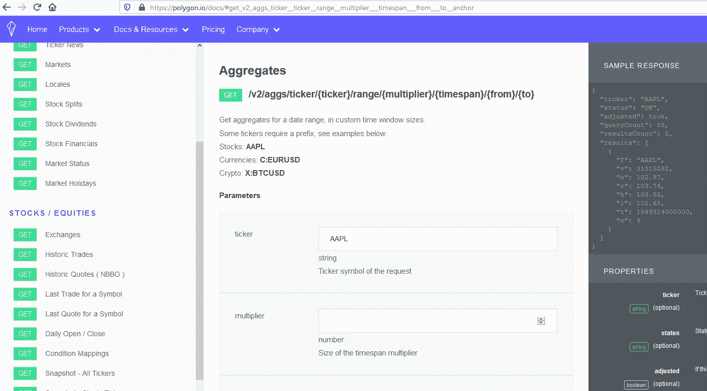
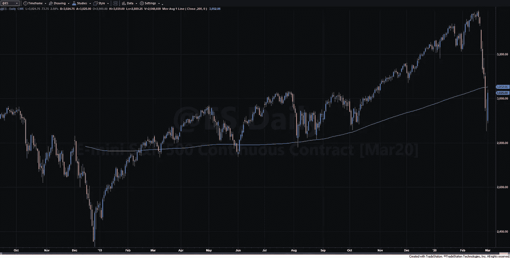

# 如何用 Python 分析一个量化金融交易假设

> 原文：<https://towardsdatascience.com/how-to-analyse-a-quantitative-finance-trading-hypothesis-in-python-152c0ee3af67?source=collection_archive---------16----------------------->

## 用 Python 和多边形实现的 SMA200 简单移动平均定量分析。


图像由 AdobeStock 授权。

在这篇文章中，我将使用 Python、Jupyter Notebook 和来自 [Polygon.io](http://polygon.io) 的数据来分析美国股市的 200 期移动平均线。

选择这种策略的原因是，如果有任何指标可以在交易界产生共识，那就是 200 周期简单移动平均线。人们普遍认为，该指标可以用作动态支撑位/阻力位，它可以决定市场是看涨还是看跌。我们将分析确认或否认资产或工具是否对该水平做出反应。

因此，在这篇文章中:

1.  我将简单介绍交易策略中的均线和均值回复的概念。我会这样做，因为我知道不是所有的读者都知道均值回归策略的存在，以及均线在这些策略中的作用。
2.  我将介绍我如何使用 Jupyter 笔记本和来自 [Polygon.io](http://polygon.io) 的数据分析和显示信息所需的所有步骤。
3.  我将分享我所获得的结果——在开始写这篇文章的时候我还不知道这些结果。因此，可以发现三种情况: *(a)* 证明 200 周期移动平均线起作用的确凿证据， *(b)* 证明它不按照我们分析的路径起作用的确凿证据， *(c)* 非确凿证据。
4.  任何获得的结果都是正确的，从这个意义上说，评估定量策略意味着肯定的确认，否定的确认和不确定的结果。这一基本方法不会改变。

虽然通常会进行更彻底和详细的研究，但基本流程仍然与这里描述的相同，因此它将有助于那些想了解简单方法来模拟交易策略和想法的人。我将使用 Python 和日常数据使文章更容易理解，但是这里描述的方法可以应用于任何语言和任何其他时间范围。

# 移动平均线和均值回归

移动平均线有一个合理的逻辑动机，它构成了建立均值回复策略的基本项目。交易策略可以用不同的方法和推理来构建(你甚至可以做相反的事情，比如*买入突破—* ,因为它们构成了启动运动的开始——或者*卖出突破*——因为据说大多数突破都是失败的—),这两种策略都将根据条件而有效，但无论你构建哪种策略，几乎所有的策略都可以归类为动量或均值回复。

动量策略操作市场的惯性趋势和爆发，基本概念是趋势倾向于持续，有时由反向者推动，其他由大型参与者发起的运动的强度推动，他们将保持价格上涨(反之下跌)。均值回归策略利用了这样一个事实，即极端的价格波动之后会出现修正，而且总体而言，资产或工具的价格会趋向于其平均水平。说，可以更容易地理解，移动平均线具有充当动态支撑和/或阻力的*【神奇】*属性，因为它是确定资产何时到达其平均点的可量化数字。因此，通常的概念是，在趋势期间，价格倾向于对这个平均价格做出反应，不知何故，这似乎是正确的。

也有完全基于均线的策略。这些策略在经验丰富的交易者中名声不佳，但我个人认为它们对一些专门研究这类系统的交易者来说非常有效。移动平均线策略的问题是，如果没有适当的背景和一些市场机制的解读，很容易机械地实施它们。此外，像任何高度机械化的策略一样，你需要承受巨大的损失。

当市场机制强烈看跌(或强烈看涨)时，均值回归策略也可能产生毁灭性的影响，因为你可能会面临一个点，你所有的条目都丢失了，因为势头如此强大，以至于均值回归被系统地超越。理解战略的本质，正确解读市场机制，对长期战略统计数据(提款、连续亏损等)有良好的理解。)被要求在这项业务中盈利；均值回归也不例外。

有些人也使用 200 周期的日均线作为市场整体趋势的简单指标。因此，人们常说，当资产/工具的交易价格低于该价格时，市场被认为是熊市，当交易价格高于该价格时，市场被认为是牛市。从这个意义上来说，200 周期日均线被用作市场指标或过滤器来排除买卖交易。如果价格高于 200 周期移动平均线，我们可以继续买入，如果价格低于 200 周期移动平均线，我们要么不买，要么卖出。

# 数据集

## 从 [Polygon.io](http://polygon.io) 获取数据

第一步是定义模拟条件。在这种情况下，我将分析 S&P500 指数的资产如何对 200 周期的日均线做出反应。有不同的途径来测试这一点。一种选择是直接使用 CME ES E-Mini S&P500 期货合约；另一个是分析跟踪 S&P500 的间谍 ETF，最后一个是分析符合 S&P500 的单个资产。

为了使文章更容易阅读和理解，我们将使用 ETF 方法。使用单个资产是可能的，但需要稍高的努力，CME 期货数据通常更昂贵。使用 SPDR·标准普尔 500 信托基金，通常以其纽约证券交易所的股票代号(SPY)而闻名，似乎是一篇介绍性文章的好方法。

间谍被世界各地的对冲基金广泛交易，因此，通过使用它，我们得到了一个准确反映 S&P500 美国股票指数的可交易资产。使用 SPY 的另一个相关优势是，我们不必像在未来合同中那样处理结算日期。

[Polygon.io](http://polygon.io) 可以直接访问美国所有主要交易所，它提供实时(通过 WebSockets)和历史(使用 API Rest)市场数据。对于 Python 来说，GIT 中有一个[随时可以使用的访问客户端，它可以使用 pip 安装在您的 Python 发行版中:](https://github.com/polygon-io/client-python)

```
pip3 install polygon-api-client
```

提供的 Python 客户端简化了对数据的访问，使我们能够专注于制定策略。

首先，我将检查我们想要操作的资产，在我们的案例中，正如所讨论的，我们将分析 *S & P500 SPDR ETF* 。

API 正确地记录在 [polygon.io](http://polygon.io) 中，但是客户端没有。然而，检查源代码非常简单，因为 API 方法和客户端之间存在一对一的对应关系，所以如果您不知道应该调用客户端对象的哪个方法[，您可以直接在 git](https://github.com/polygon-io/client-python/blob/master/polygon/rest/client.py) 中查找。

例如，如果您想要检索间谍的历史每日价格——正如我们在本例中打算的那样——我们将在 API 文档中查找，发现我们需要使用的 REST 方法是 *Aggregates* 。



Polygon.io 的 API 文档是查找需要调用的 REST 方法的地方。

REST 方法提供了检索给定时间范围内的聚合(包括每日)数据的能力。我们将使用过去 20 年的数据进行分析，这是可以检索的最大历史时期。

要调用的客户端方法是:

因此我们的第一个 Jupyter 细胞是:

从 Polygon.io 检索数据

请注意，我们正在对数据进行分割调整，这对股票非常有用。

## 数据时区

默认情况下，返回的时间戳似乎是复活节时间，这是您通常从数据馈送提供程序获得的时间。

> 总是计划并仔细检查你的时间戳和时区。时区总是容易引起麻烦，你需要确保没有出错。到目前为止，我发现的最简单的解决方案是始终使用东部时间进行模拟，即使是其他时区，如芝加哥和法兰克福仪器。

对源数据和计算机的本地时区都使用东部时间。这一规则不会对传统市场资产产生任何问题，因为夏令时发生在周六至周日的晚上，市场关闭，因此你可以只使用东部时间，忘记时区和夏令时。对于 24x7 交易加密工具，使用 GMT 可能更好。

因此，我们检查返回的第一个时间戳是(注意，我们从 1980 年就开始请求数据，用简单的英语来说就是:给我你所有的一切—):

```
728283600000
```

这对应于:

```
GMT Friday, 29 January 1993 05:00:00
```

或者

```
ET/EST   Friday, 29 January 1993 00:00:00 (GMT -05:00)
```

这意味着我们在东部时间的第一天接收数据，ETF SPY 的数据是可用的:1993 年 1 月 29 日。间谍在 1993 年 1 月 22 日开始交易，所以看起来我们得到了我们需要的一切，我们可以进一步进行。

## 将数据转化为可操作的东西

为了快速处理数据，我们将把数据转换成一个 NumPy 数组。我们将:

1.  计算检索数据的长度。
2.  为数据分配一个 7 列数组(开盘、盘高、盘低、收盘、成交量、时间戳、SMA200)。

将结果转换成 Numpy 数组

使用 NumPy 有三个原因:

1.  它提供了向量和数组操作的函数。
2.  它是一个 C 编译的库，将利用预编译的例程，因此，作为预编译的 C 库比常规的 Python 和 Python 数据类型更快。
3.  它将使用针对向量运算优化的微处理器汇编指令(使用向量符号的代码通常比使用 for 循环的代码更快)。

这三个原因可以归结为一个好处:减少你需要模拟的时间。这与本例无关，但适用于大参数日内模拟。

## 使用 SMA200 丰富数据

下一步是为整个数据集填充一个简单的移动平均值。我们将使用 NumPy 提供的一些工具将内部操作(计算收盘价的总和)转移到 NumPy 向量操作中。我怀疑是否可以避免外部循环，但在这种情况下，这是不相关的，因为它不到 5000 次迭代。还可以使用围绕 NumPy 构建的一些辅助库来实现移动平均，这可能会提高性能，但为了使代码和解释尽可能简单，我们将只使用 for 循环。

最后一步，我准备了一个数据集，其中包含了执行分析所需的所有信息。

# 分析

## 从假设到可测量的策略

要测试的确切假设是:

1.  当价格在均线上反弹时(穿过均线，但收盘时在均线上方)，均线是动态支撑(与熊市相反)。
2.  当价格违反移动平均线时(穿过移动平均线并在移动平均线下方收盘)，移动平均线无效，因此资产/工具/市场开始了看跌行动(看跌行动可以采用相反的方式)。

为了评估价格是否反弹，我们将检查未来几天的价格是高还是低。如果所谓的反弹存在，那么在均线被穿越后的接下来几天应该会有一个看涨的趋势。我也会分析接近 SMA 但不触及它的价格。

这个标准多少有点武断，当然，还可以(也应该)进行其他一些分析。但作为起点是一样好的。这样做的目的是让分析保持简单，以显示该过程是如何完成的:

1.  我们根据自己的交易经验/外部想法或行业知识制定直观的方法/策略。
2.  我们将启发式想法/策略转化为可测量、可量化的策略。
3.  我们评估这个策略。
4.  如果结果显示这条研究路径可能会导致可操作的策略，我们会重复不同的参数或想法。

## 用 Python 实现策略

在这种情况下，我将生成一个类型为 *bool 的 NumPy 数组—* 对应于底层 C 库中的 bool 类型—。这个数组包含分析和测量假设的条件。

可以使用 Pandas 数据框(通常用于需要不同数据类型的大型策略)。在其他语言中，方法会稍有不同(在 C #中，我使用结构的链表),但是向数据集添加带有条件和中间结果的列的模式是相同的。

## SMA200 成为价格反弹的动力支撑

第一个测试将评估跨越 SMA200 的价格。将评估两种不同的情况:价格收盘在移动平均线以上，价格收盘在移动平均线以下。

NumPy 数组由三列填充，如果前一天的价格高于 SMA200，第一列包含 True。当最低价低于 SMA200 但收盘价高于 SMA 200 时，第二列存储 True。当收盘价低于 SMA200 时，第三列存储 True。这三列是独立生成的。稍后将使用 NumPy 选择器合并这些条件，以分析特定的场景。

在这种情况下，为条件/结果定义了一个单独的 NumPy 数组，但是也可以有一个集成了数据和模拟结果的 Pandas 数据框架。在这种情况下，会向模拟数据中添加额外的列。

测试作为动态支撑的 SMA200

结果如下:

```
There are 59 times when price crosses the 200 period mean but price closes above it.
When that happens:
  21 times the next day is bullish
  38 times the next day is bearish
  35.59322033898305% of times the next day is bullish
  64.40677966101694% of times the next day is bearish

There are 39 times when price crosses the 200 period mean and price closes below it.
When that happens:
  18 times the next day is bullish
  21 times the next day is bullish
  46.15384615384615% of times the next day is bullish
  53.84615384615385% of times the next day is bearish
```

首先可以注意到的是，每天穿越 SMA200(前一天在 SMA200 上方时)并不常见。自 1993 年以来，这种情况只发生过 98 次。所以每年发生三次。

第二件要注意的事情是，当价格收盘低于 SMA 时，第二天的价格方向是高度不确定的(46%比 53%)，所以这不会提供任何统计优势。

第三件可以注意到的事情是，当价格收盘在 SMA 上方时，第二天往往是熊市而不是牛市，因此我们没有注意到任何反弹，至少在移动平均线被穿越后的第二天。SMA200 作为动态支撑的共识——也是口头禅——对于反弹的这个具体定义来说，实际上并不成立。64%对 36%实际上是一个统计优势，在我看来，必须加以考虑。

在这里，我们可能会对不同反弹定义的进一步测试感兴趣。例如，我们可能希望分析第二天的开盘是否高于移动平均线交叉时的收盘价格(这样我们就可以买入/卖出开盘缺口)。这意味着只需将条件更改为:

```
# RESULT - NEXT DAY IS BULLISH (1) OR BEARISH (0) - USE OPENING GAP
if(dataset[i+1,OPEN] > dataset[i,CLOSE]):
    analysis[i,NEXT_DAY] = True
```

如果对该标准进行测试，我们会得到以下结果:

```
There are 59 times when price crosses the 200 period mean but price closes above it.
When that happens:
  30 times the next day opens higher
  29 times the next day opens lower
  50.847457627118644% of times the next day opens higher
  49.152542372881356% of times the next day opens lower

There are 39 times when price crosses the 200 period mean and price closes below it.
When that happens:
  26 times the next day opens higher
  13 times the next day opens lower
  66.66666666666666% of times the next day opens higher
  33.33333333333333% of times the next day opens lower
```

根据这些标准，当价格收盘在 SMA 上方时，我们对第二天的价格没有任何线索。对于价格收盘低于 SMA 的情况，我们可以确定一个统计优势:价格倾向于高开。

有了这些结果，在日线 SMA200 被突破后的第二天，但价格已经在它上方收盘，我肯定不会寻找多头头寸，这违反了共识。

我们还可以评估第二天的最高价是否高于移动平均线被穿过的当天的最高价。这些是结果:

```
# RESULT - NEXT DAY IS BULLISH (1) OR BEARISH (0) - USE HIGHS
    if(dataset[i+1,HIGH] > dataset[i,HIGH]):
        analysis[i,NEXT_DAY] = True
---
There are 59 times when price crosses the 200 period mean but price closes above it.
When that happens:
  28 times the next day high is higher
  31 times the next day high is not higher
  47.45762711864407% of times the next day high is higher
  52.54237288135594% of times the next day high is not higher

There are 39 times when price crosses the 200 period mean and price closes below it.
When that happens:
  6 times the next day high is higher
  33 times the next day high is not higher
  15.384615384615385% of times the next day high is higher
  84.61538461538461% of times the next day high is not higher
```

同样，没有确凿的证据(52%对 47%)表明价格收盘高于 SMA，并且价格收盘低于 SMA 时，价格没有超过前一天的高点(84%对 15%)。如果价格达到前一天的最大值，最新的情况是做空的好时机。然而，值得注意的是，目前的会议低和高价格是不可操作的，因为我们不知道他们提前。

> 务必要反复检查每个结果，以确保模型准确地代表我们的交易假设。诸如事件发生的次数(为了获得统计上有效的结果)、我们得到哪些统计值以及如何定义模型之类的附加点与找到可操作的边相关。本文未涉及的其他方面，如 MAE、利润/损失比率或参数敏感性也应包括在内。

由于结果没有证实假设，我们将质疑用于定义反弹的模型。用 SMA200 看看 S&P500 的日线图可能会有帮助:



S&P500 的未来(续)。带 SMA200 的日线图。

似乎很明显，SMA200 起到了动态支撑/阻力的作用。但是如果对图表进行详细分析:

1.  价格接近均线，经常反弹，但有时甚至不触及均线。
2.  反弹并不总是清晰的，有时它在同一个日线蜡烛线出现，有时在下一个蜡烛线出现，有时在第三个蜡烛线出现。

看过图表后，我们可以将反弹定义为第二天的低点高于价格穿过平均线时的低点。如果对这种情况进行分析:

```
# RESULT - NEXT DAY IS BULLISH (1) OR BEARISH (0) - USE LOWS
    if(dataset[i+1,LOW] > dataset[i,LOW]):
        analysis[i,NEXT_DAY] = True
---
There are 59 times when price crosses the 200 period mean but price closes above it.
When that happens:
  37 times the next day's low is higher than SMA day's low
  22 times the next day's low is lower than SMA day's low
  62.71186440677966% of times the next day's low is higher
  37.28813559322034% of times the next day's low is lower

There are 39 times when price crosses the 200 period mean and price closes below it.
When that happens:
  14 times the next day's low is higher than SMA day's low
  25 times the next day's low is lower than SMA day's low
  35.8974358974359% of times the next day's low is higher
  64.1025641025641% of times the next day's low is lower
```

使用这种新模型，当价格收盘高于平均价格时，第二天的最低价有 62%比 37%的机会高于当天的最低价。

相反，当价格收盘低于 SMA 时，64%对 35%的情况下第二天的低点会更低。

虽然这符合假设和移动平均线作为动态支撑的概念*,但重要的是要理解这一新定义并没有定义可交易的行为*,因为我们永远不会提前知道低/高价格(我们知道开盘价/收盘价，因为我们总是可以在最后或第一分钟买入/卖出开盘价或收盘价，平均来说，我们将接近开盘价/收盘价)。

我想在这里强调的想法是，虽然一切都是从一个基本和简化的模型开始的，但是迭代通常是需要的。这需要一直做下去，直到找到与我们的经验一致且可行的东西，或者直到这个想法被抛弃。

> 对于这种特殊情况，可以(并且可能应该)定义更复杂的模型。例如，可以定义移动平均值周围的阈值和范围。还可以定义移动平均线以下的穿透范围和移动平均线以上的反弹范围。通过这样做，可能会模拟出一个更精确的模型。有了范围和值，还可以进行参数模拟，找到可交易的策略。

按照相同的程序，但颠倒符号，SMA200 可以被分析为电阻。对于这种情况，我们得到以下结果:

```
There are 31 times where crosses the 200SMA but price closes below it.
When that happens:
18 times next day is bullish
13 times next day is bearish
  58.06451612903226% of times the next day is bullish
  41.935483870967744% of times the next day is bearish

There are 40 times where crosses the 200SMA and price closes above it.
When that happens:
15 times next day is bullish
25 times next day is bearish
  34.883720930232556% of times the next day is bullish
  58.139534883720934% of times the next day is bearish
```

可以用与前几份报告类似的方式进行分析。

## 作为看涨/趋势市场指标/过滤器的 SMA200

第二个分析评估 SMA200 是否能给我们一些关于市场整体趋势的信息，以及它是否能被用作排除买入或卖出交易的过滤器。

同样，需要定义一个初始的、可操作的和可测量的模型。为了简单起见，我们分析价格收盘低于 SMA200 的影响，并评估这是否会在一周和一个月后产生更低的价格。分析是完全相同的，但是这次我们创建了两个额外的列来测试 7 天和 30 天后的价格。所分析的情况是当前价格和一周/一个月远期价格都很低。

这些是结果:

```
There are 59 times when price crosses the 200 period mean but price closes above it.
When that happens:
  37 times the next day low is higher
  22 times the next day low is lower36 times the next week low is higher
  23 times the next week low is lower

  43 times the next month low is higher
  16 times the next month low is lower

There are 38 times when price crosses the 200 period mean and price closes below it.
When that happens:
  14 times the next day low is higher
  24 times the next day low is lower21 times the next week low is higher
  17 times the next week low is lower

  23 times the next month low is higher
  15 times the next month low is lower
```

从长期来看，日价格收于 SMA200 上方的情景更加乐观。43 倍对 16 倍的价格高于 SMA200 交叉时的价格。

当穿过 SMA200 且价格收于其下方时，长期来看仍是看涨的，但强度较小。一个潜在的结果是，当价格穿越并收于 SMA200 下方时，更有可能出现熊市。

# 不要相信任何东西，质疑一切

理解每一个结果都必须被质疑是很重要的。按照我们的例子，值得一提的是我们最后的结果“证明”了 200 周期的 SMA 起到了动态支撑的作用。当价格收盘在 SMA 之上时，这种偏差更加明显，但当价格收盘在 SMA 之下时，这种偏差也存在(一个月后价格上涨了 23 倍，而价格下跌了 15 倍)。

这是否意味着 200 SMA 均线作为动态支撑？理论上是的，但重要的是，我们分析了一个很大程度上看涨的指数(S&P500)。日线图不允许有那么多的案例和广泛的分析，因为即使像这个例子中那样用了那么多年，数据集也不大。市场机制是相关的，对于日内策略，你可能既要关注熊市，也要关注牛市。这将有助于你理解给定的分析或策略在不同条件下的表现。

另一种选择——对于这种特殊的分析——是对不那么乐观的指数进行同样的分析，比如法兰克福 DAX 指数或悉尼 ASX 指数。在任何情况下，重要的一点是，每个结果都必须进一步质疑，尤其是当我们不处理大型数据集或数据集倾向于有偏差时(如 S&P500 在分析期间表现强劲)。

# 附加步骤

这里的分析非常简单，主要介绍如何在 Python 中进行定量分析的一般工作流程。在现实生活的分析方面，如进一步的模型定义，风险和参数分析将需要详细涵盖。