# 如何分析单个时间序列变量

> 原文：<https://towardsdatascience.com/how-to-analyse-a-single-time-series-variable-11dcca7bf16c?source=collection_archive---------19----------------------->

## [探索时间序列建模](https://towardsdatascience.com/tagged/time-series-modeling)

## 用 Python 代码进行时间序列建模


在 [Unsplash](https://unsplash.com?utm_source=medium&utm_medium=referral) 上 [tangi bertin](https://unsplash.com/@tangib?utm_source=medium&utm_medium=referral) 拍摄的照片

欢迎回来！这是[专栏](https://towardsdatascience.com/tagged/time-series-modeling)的第二篇文章，探索用 Python 代码对时间序列数据进行分析和建模。如果你不熟悉基本的统计学概念，比如估计量、假设检验、p 值等，可以看看我之前的帖子: [***用 Python 代码进行时间序列建模:基本面统计***](/fundamental-statistics-7770376593b) 。

在这篇文章中，我们将开始探索分析一个单一的时间序列变量。给定一个时间序列变量，我们应该从哪里开始分析？我们如何深入了解这些数据？老实说，我第一次被要求对一个. csv 文件格式的时间序列数据进行分析时，没有任何关于数据源和应用程序的进一步信息，我不知道从哪里开始。在这篇文章之后，希望下次你会有一些关于如何开始分析一个时间序列变量的想法。

在这里，我将分析历史苹果股票价格数据。的。csv 文件可以从[雅虎财经](https://sg.finance.yahoo.com/quote/AAPL/)下载。我下载了去年的 AAPL 数据，从 2019 年 3 月 13 日到 2020 年 3 月 13 日。原始数据包括每日开盘价、最高价、最低价、收盘价、调整收盘价和成交量。在这篇文章中，我将分析 AAPL 的每日收盘价。

```
import numpy as np
import pandas as pd
import matplotlib.pyplot as pltAAPL_price = pd.read_csv('AAPL.csv',usecols=['Date', 'Close'])
AAPL_price.set_index('Date',inplace=True,drop=True)AAPL_price.plot(legend=False)
plt.title('AAPL Daily Close Price')
```

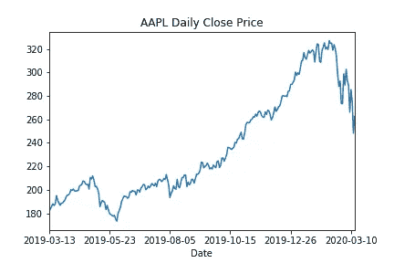

# 1.滚动平均值和方差

样本参数不是恒定的，它们也是随时间变化的。单点样本均值或样本方差不会向我们透露太多信息。如果不知道样本参数的方差，我们就无法知道样本参数对总体参数的估计有多好。因此，我们不能依赖点样本均值或样本方差来估计总体参数。

我们将应用滚动窗口方法获得一年期间的多个样本均值和样本方差值，而不是从一年的 AAPL 股票价格数据计算一个点的样本均值和样本方差值。以下代码显示了如何以 10、30 和 50 的不同窗口大小显示样本均值。

```
import numpy as np
import pandas as pd
import matplotlib.pyplot as pltAAPL_price = pd.read_csv('AAPL.csv',usecols=['Date', 'Close'])
AAPL_price.set_index('Date',inplace=True,drop=True)ax = AAPL_price.plot(legend=False)
ax.set_title('AAPL Daily Close Price')AAPL_price.rolling(window=10).mean().plot(ax=ax)
AAPL_price.rolling(window=30).mean().plot(ax=ax)
AAPL_price.rolling(window=50).mean().plot(ax=ax)ax.legend(['Daily price', 'm=10', 'm=20', 'm=30'])
```

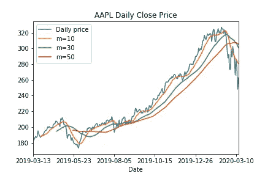

类似地，我们可以用不同的窗口大小来可视化样本方差。

```
import numpy as np
import pandas as pd
import matplotlib.pyplot as pltAAPL_price = pd.read_csv('AAPL.csv',usecols=['Date', 'Close'])
AAPL_price.set_index('Date',inplace=True,drop=True)ax = AAPL_price.plot(legend=False)
ax.set_title('AAPL Daily Close Price')AAPL_price.rolling(window=10).var().plot(ax=ax)
AAPL_price.rolling(window=30).var().plot(ax=ax)
AAPL_price.rolling(window=50).var().plot(ax=ax)ax.legend(['Daily price', 'm=10', 'm=30', 'm=50'])
```

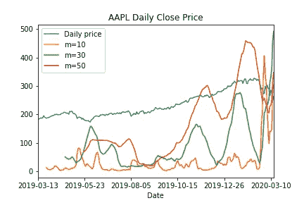

当选择窗口大小时，总是有一个折衷。以滚动样本均值为例，我们会发现较大的窗口大小会生成更平滑的滚动样本均值图。我喜欢从过拟合和欠拟合的角度来考虑窗口大小的选择。小窗口尺寸倾向于捕捉每个时间点的更详细的信息，而大窗口尺寸包括更长时间段的更全面的信息。这样，小的窗口大小可能会造成过拟合，因为它过于关注每个时间点的移动。而大的窗口尺寸可能导致拟合不足，因为它捕捉了太多的整体趋势，但忽略了每个点的局部运动。因此，应仔细选择合适的窗口大小，以避免过度拟合和欠拟合。

# 2.平稳性和弱相关性

为了用普通最小二乘法(OLS)来估计生成过程，时间序列数据需要平稳和弱相关。OLS 是线性回归中常用的方法，将在本系列第 4 篇文章中详细讨论: ***用 Python 代码进行时间序列建模:如何用线性回归对时间序列数据建模。***

平稳性有三个要求。时间序列数据的均值和方差都是常数。此外，具有滞后(h)的两个时间点的协方差是滞后的函数，而不应依赖于时间点(t)。

弱相关性要求当滞后 h 变得无穷大时，两个时间点的相关性变为零。

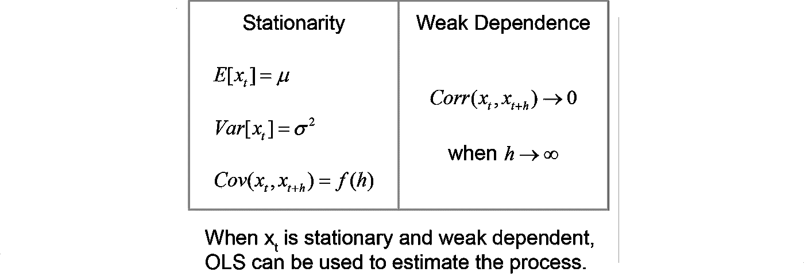

# 3.自回归过程和移动平均过程

常见的时间序列过程有两种:自回归过程和移动平均过程。我们将详细讨论这两个过程。

**3.1 自回归过程性质**

对于自回归过程，时间序列数据依赖于自身，具有时滞。当时间序列数据仅依赖于自身且时滞为 1 时，该过程称为 AR(1)。如果时间序列数据依赖于自身，滞后时间为 N，那么这个过程称为 AR(N)。

这里以 AR(1)为例。如果满足两个要求，AR(1)过程是平稳的和弱相关的:第一个时间点的期望值为零，时间序列依赖于前一个时间点，乘法参数位于-1 和 1 之间。

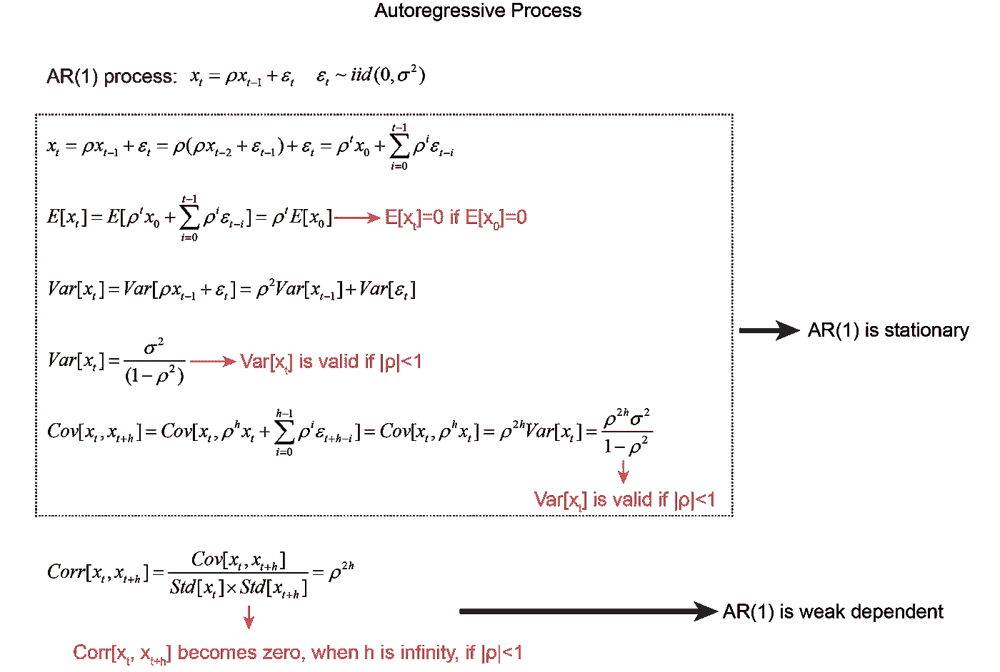

AR(1)流程属性

在 AR(1)过程中，ρ的值决定了 AR(1)过程是否平稳。以下是ρ如何影响 AR(1)过程的简单可视化。从结果中我们可以看出，当ρ越接近 1 时，AR(1)过程穿越零线的频率越低。

```
import numpy as np
import matplotlib.pyplot as pltN = 10000
rho = 1sigma = np.random.normal(loc=0, scale=1, size=N)
x = [0]
for i in range(1,N):
    x.append(rho*x[-1]+sigma[i])plt.plot(x, label='rho=1')
plt.legend()
plt.xlim(0,N)
```

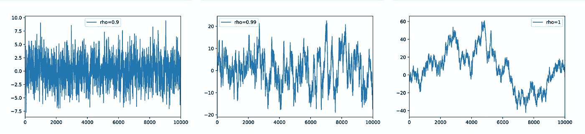

ρ为 0.9，0.99，1 的 AR(1)过程

**3.2 移动平均过程属性**

MA(1)过程是平稳的、弱相关的。

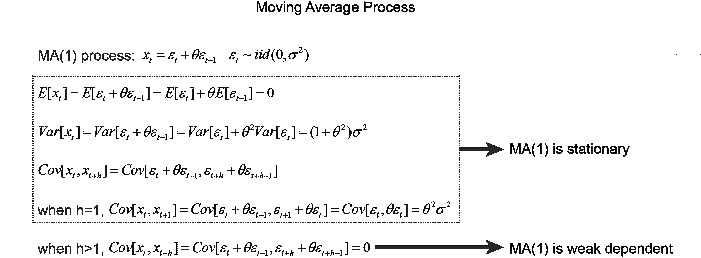

MA(1)流程属性

**3.3 自相关函数(ACF)和偏自相关函数(PACF)**

根据上述 MA(1)和 AR(1)的性质，我们可以将相关性写为:


通过绘制不同时滞的相关性，我们可以清楚地看到 AR(1)过程和 MA(1)过程的区别。这个相关图被称为自相关函数(ACF)。AR 过程的 ACF 图显示指数下降，并且在几个时间点之后相关性下降到几乎为零。然而，MA(1)过程的 ACF 图显示，在前两个时间点之后，相关性迅速下降到零。

```
import numpy as np
import matplotlib.pyplot as plt
from statsmodels.graphics.tsaplots import plot_acfN = 10000
rho = 0.5sigma = np.random.normal(loc=0, scale=1, size=N)
x = [0]
for i in range(1,N):
    x.append(rho*x[-1]+sigma[i])plot_acf(np.array(x),lags=10)
```

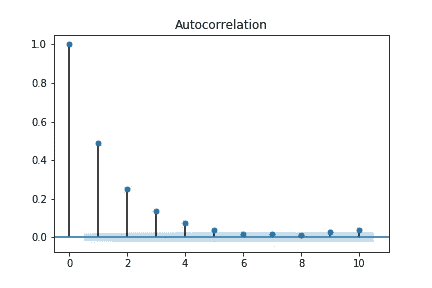

AR(1)过程的 ACF

```
import numpy as np
import matplotlib.pyplot as plt
from statsmodels.graphics.tsaplots import plot_acfN = 10000
theta = 0.5sigma = np.random.normal(loc=0, scale=1, size=N+1)
x = []
for i in range(1,N+1):
    x.append(sigma[i]+theta*sigma[i-1])plot_acf(np.array(x),lags=10)
```

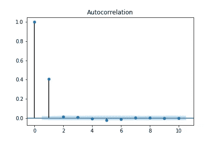

MA(1)过程的 ACF

虽然 ACF 图可以用来区分 MA 和 AR 过程，但它不能很好地区分 AR(1)过程和 AR(2)过程。偏自相关函数(PACF)可以用来区分 AR(1)和 AR(2)过程。如下例所示，AR(1)过程的 PACF 显示相关性在前 2 个时间点后迅速下降到零，而 AR(2)过程的 PACF 显示相关性在前 3 个时间点后下降到零。

```
import numpy as np
import matplotlib.pyplot as plt
from statsmodels.graphics.tsaplots import plot_pacfN = 10000
rho = 0.5
rho2 = 0.4sigma = np.random.normal(loc=0, scale=1, size=N)
x = [0,0]
for i in range(2,N):
    x.append(rho*x[-1]+rho2*x[-2]+sigma[i])plot_pacf(np.array(x),lags=10)
```

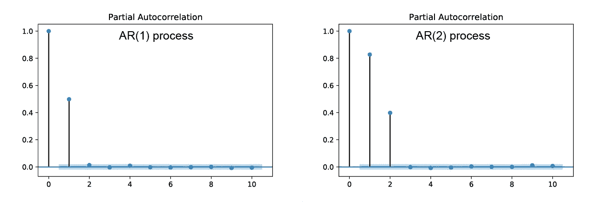

AR(1)和 AR(2)过程的 PACF

# 4.整合过程的顺序

**4.1 单位根和迪基-富勒检验**

如上图，当ρ为 1 时，AR(1)过程是非平稳的。AR 过程中ρ=1 的情况称为单位根。下面是单位根为什么是非平稳的一个简单证明。

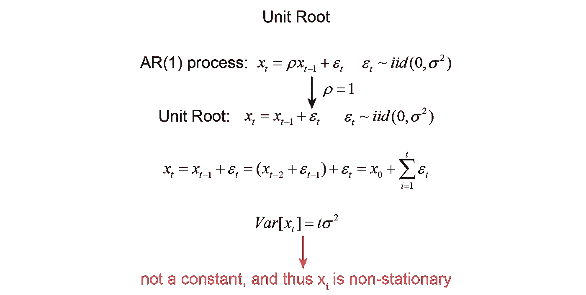

单位根是非平稳的一个简单证明

单位根可以用扩展的 Dickey-Fuller (ADF)检验。

```
import pandas as pd
from statsmodels.tsa.stattools import adfullerAAPL_price = pd.read_csv('AAPL.csv',usecols=['Close'])
result = adfuller(AAPL_price.iloc[:,0].values)
print(f'p value is {result[1]}')
```

输出:

p 值为 0.5961654850033034

由于 p 值大于 0.05 的显著性水平，我们不能拒绝时间序列数据是非平稳的零假设。因此，时间序列数据是非平稳的。

具有单位根的 AR 过程是序列相关的。然而，序列相关的时间序列数据不一定是具有单位根的 AR 过程。

**4.2 整合过程的顺序**

对于有单位根的 AR 过程，如果时间序列数据的一阶差分是平稳的，那么时间序列数据遵循 I(1)过程。类似地，如果需要二阶差分来获得平稳数据，则该过程遵循 I(2)过程。为了找出整合过程的顺序，需要测试一系列 ADF。

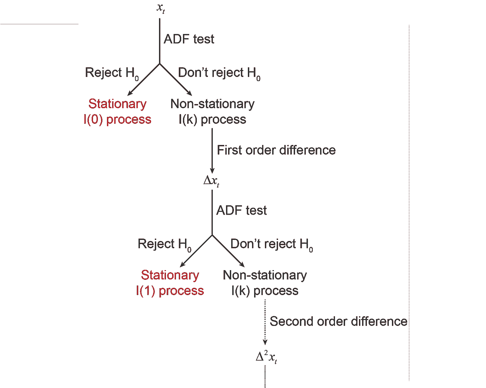

如何检验整合过程的顺序

# 摘要

在这篇文章中，我们讨论了如何分析单个时间序列变量。通常，我们可以通过绘制时间序列数据的滚动平均值和方差来开始分析。然后我们可以用 ACF 检验来看时间序列数据是遵循自回归过程还是移动平均过程。如果数据遵循自回归过程，那么我们可以使用 PACF 检验来寻找自回归过程的阶。此外，我们可以使用 Dickey-Fuller 测试来确定时间序列数据是否遵循积分过程。

在下一篇文章中，我们将继续讨论如何分析多个时间序列变量。敬请关注！