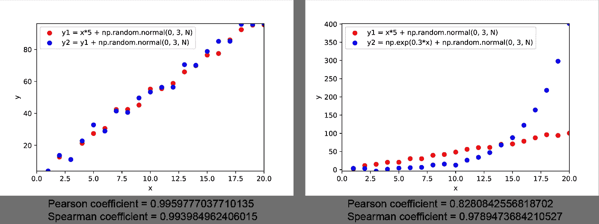

# 如何分析多个时间序列变量

> 原文：<https://towardsdatascience.com/how-to-analyse-multiple-time-series-variable-5a8d3a242a2e?source=collection_archive---------33----------------------->

## 探索时间序列建模

## 用 Python 代码进行时间序列建模


照片由 [tangi bertin](https://unsplash.com/@tangib?utm_source=medium&utm_medium=referral) 在 [Unsplash](https://unsplash.com?utm_source=medium&utm_medium=referral) 上拍摄

欢迎回来！这是探索用 Python 代码对时间序列数据进行分析和建模的系列文章中的第 3 篇。在第一篇文章中，我们已经讨论了基础统计: [***用 Python 代码进行时间序列建模:基础统计***](/fundamental-statistics-7770376593b) 。第二个帖子已经涵盖了单个时间序列变量的分析: [***用 Python 代码进行时间序列建模:如何分析单个时间序列变量*** 。](/how-to-analyse-a-single-time-series-variable-11dcca7bf16c)

在本帖中，我们将继续探讨如何分析多个时间序列变量。

# **1。滚动协方差**

协方差是两个随机变量的联合线性可变性的度量。协方差本身很难解释，因为它取决于变量的大小。为了归一化协方差，通常使用相关系数。两种常用的相关系数是:皮尔逊相关系数和斯皮尔曼排名相关系数。

皮尔逊相关系数值在-1 到 1 之间，其中-1 表示强的负线性关系，0 表示没有线性关系，1 表示强的正线性关系。

斯皮尔曼的排名相关系数值也位于-1 和 1 之间。但 Spearman 的排名相关系数衡量的是两个变量之间的单调性，其中-1 表示强负单调关系，0 表示无单调关系，1 表示强正单调关系。要理解这两个变量之间的单调性，我们可以想到(y₁ -y₁)是如何随(y₂ -y₂)变化的:如果它们同向变化，那么这两个变量就是正单调的；否则，它们是负单调的。

以下模拟显示了皮尔逊相关系数和斯皮尔曼排名相关系数之间的差异。当 y1 和 y2 呈线性关系时，皮尔逊相关系数和斯皮尔曼排名相关系数都接近 1。然而，当 y1 和 y2 呈现单调关系时，皮尔逊相关系数变得小于斯皮尔曼排名相关系数。

```
import numpy as np
from scipy.stats import spearmanr
from scipy.stats import pearsonr
import matplotlib.pyplot as pltN=20
x = np.linspace(1,N,num=N)
y1 = x*5 + np.random.normal(0, 3, N)
y2 = np.exp(0.3*x) + np.random.normal(0, 3, N)
#y2 = y1 + np.random.normal(0, 3, N)plt.scatter(x,y1,color='r',label='y1 = x*5 + np.random.normal(0, 3, N)')
plt.scatter(x,y2,color='b',label='y2 = y1 + np.random.normal(0, 3, N)')
plt.legend(loc='upper left')
plt.xlabel('x')
plt.ylabel('y')
plt.xlim(0,N)
plt.ylim(min(min(y1),min(y2)),max(max(y1),max(y2)))
```



皮尔逊系数衡量两个变量的线性，而斯皮尔曼系数衡量两个变量的单调性

# 2.虚假关系与滚动协整

为了使用时间序列数据 x 对时间序列数据 y 建模，我们通常要求 x 和 y 都是平稳的 I(0)过程。如果不熟悉单个时间序列变量的平稳性检验，可以参考我之前的帖子: [***用 Python 代码进行时间序列建模:如何分析单个时间序列变量***](/how-to-analyse-a-single-time-series-variable-11dcca7bf16c) 。

当两个时间序列变量都是非平稳的时，即使基本的生成过程没有偶然的关系，它们也可能表现出很强的相关性。这种强烈的相关性可能纯粹是由两个时间序列变量具有非常数均值这一事实引起的。这种现象被称为虚假关系。

然而，在特殊情况下，我们可以使用时间序列数据 x 对时间序列数据 y 建模，当 x 和 y 都是 I(1)过程且协整时。基本上，协整意味着 x 和 y 之间存在放大效应，在任何时间点，我们总是可以将 x 乘以同一个参数，得到一个接近 y 的值，这样，残差就是 I(0)过程。


x 和 y 之间的协整

使用 statsmodels 库可以很容易地检验协整。

```
import numpy as np
from statsmodels.tsa.stattools import cointN=20
x = np.linspace(1,N,num=N)
y1 = x*5 + np.random.normal(0, 3, N)
y2 = np.exp(0.3*x) + np.random.normal(0, 3, N)
print(f'P value is {coint(y1,y2)[1]}')
```

输出:

p 值为 0.9859002580259643

由于 P 值大于 0.05 的显著性水平，我们不能拒绝不存在协整的零假设。

# 摘要

在这篇文章中，我们讨论了如何分析多个时间序列变量的协方差和协整性。在下一篇文章中，我们将更进一步，探索如何使用线性回归来建模时间序列数据。敬请关注！