# 如何分析你最喜欢的音乐艺术家的歌词的情感和文字

> 原文：<https://towardsdatascience.com/how-to-analyze-emotions-and-words-of-the-lyrics-from-your-favorite-music-artist-bbca10411283?source=collection_archive---------11----------------------->

## 使用 Python 对歌词进行文本和情感分析的有趣方式。

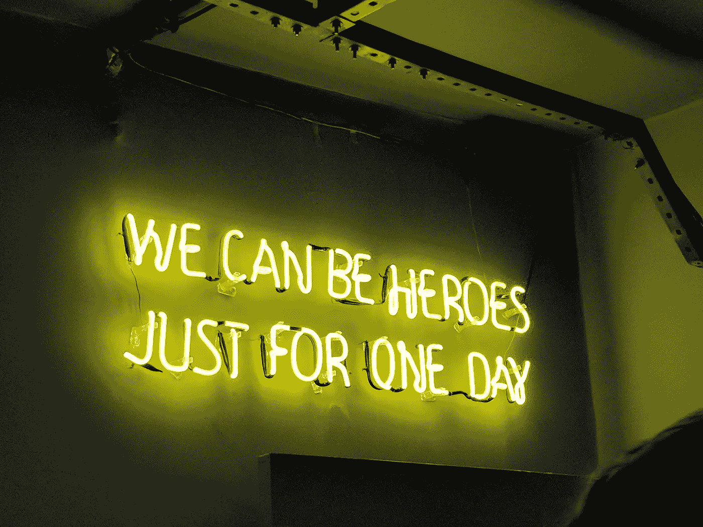

加布里埃尔·巴西诺在 [Unsplash](https://unsplash.com/s/photos/lyrics?utm_source=unsplash&utm_medium=referral&utm_content=creditCopyText) 上的照片

音乐是一种表达我们情感的强大语言，在很多情况下，它被用作处理生活中艰难时刻的一种疗法。音乐中使用的不同声音、节奏和效果能够在一瞬间改变我们的情绪，但当我们听音乐时，有一个成分有时会被忽略；歌曲的歌词。

歌词是强有力的文本，分享了作者创作歌曲时的想法。这就是为什么我决定分析我最喜欢的乐队之一的歌词；**金属。**

在他们的音乐生涯中，Metallica 的歌词在概念和想法上有了明显的变化，考虑到他们从 80 年代开始演奏音乐到现在，这个乐队是一个很好的学习选择。

在这篇文章中，我将展示和解释我如何使用**单词云**、**一个统计表**、**单词频率比较图**、 **VADER 情感分析、**和 Genius 提供的一个很酷的数据集来实现这个想法。所以没什么好说的了，让我们开始工作吧！。

# 必需的库:

*   **熊猫**和 **Numpy** 进行数据分析。
*   **重新**和**管柱**进行数据清洗。
*   **Matplotlib** 和 **Wordcloud** 来绘制漂亮的图形。
*   用于情感分析、标记化和词条化。
*   **Sklearn** 统计词频。
*   **Lyricsgenius** 提取歌词数据。
*   **Genius 凭证**访问他们的 API 和数据采集([单击此处](https://docs.genius.com/#/getting-started-h1)了解更多信息)。
*   脚本 **Helpers.py** 存储用于提取、清理和转换数据的函数(该脚本由我创建，位于我的 GitHub 存储库中)

```
#libraries used to extract, clean and manipulate the datafrom helpers import *
import pandas as pd
import numpy as np
import string#To plot the graphsfrom wordcloud import WordCloud
import matplotlib.pyplot as plt
plt.style.use('seaborn')#library used to count the frequency of wordsfrom sklearn.feature_extraction.text import CountVectorizer#To create the sentiment analysis model, tokenization and lemmatizationimport nltk
from nltk.sentiment.vader import SentimentIntensityAnalyzer
from nltk import word_tokenize
import nltk.data
nltk.download('vader_lexicon')
nltk.download('punkt')
```

完整的代码、脚本、笔记本和数据都在我的 Github 存储库中

([点击这里](https://github.com/cristobalvch/Music-Lyrics-NLP))

# 1.获取、清理和转换数据

## 1.1 创建歌词数据:

第一步是获得艺术家最流行歌曲的信息。为此，我创建了一个名为 **search_data()** 的函数，该函数有助于自动收集每首歌曲的属性。该函数使用库 lyricsgenius 来获取数据，并且您必须传递参数**艺术家姓名**、**要提取的最大歌曲数量**，以及您的**客户端访问令牌**:

```
#Extracting the information of the 50 most popular songs of Metallica using function created on helpers scriptaccess_token = "your_genius_access_token"
df0 = search_data('Metallica',50,access_token)
```


提取金属乐队最受欢迎的 50 首歌曲(图片由作者提供)

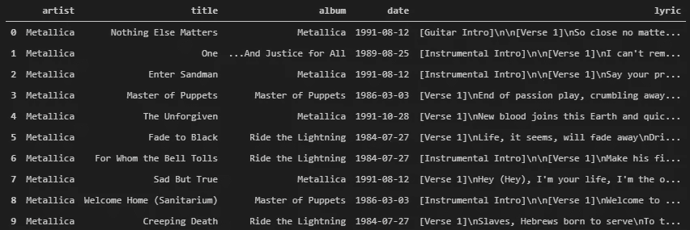

提取了信息的数据框(图片由作者提供)。

您可能已经注意到,“歌词”列中有许多单词和符号对于研究并不重要，因为它们用于解释歌曲的结构，所以我使用函数 clean_data()清理了这些信息，并创建了一个新列来按十年对歌曲进行分组。这个新列将帮助我们在分析数据时有更好的理解。最后，我过滤了信息，只使用有歌词的歌曲，因为有些艺术家有器乐歌曲。

```
#cleaning and transforming the data using functions created on helpers scriptdf = clean_lyrics(df0,'lyric')#Create the decades columndf = create_decades(df)#Filter  data to use songs that have lyrics.df = df[df['lyric'].notnull()]#Save the data into a csv filedf.to_csv('lyrics.csv',index=False)df.head(10)
```

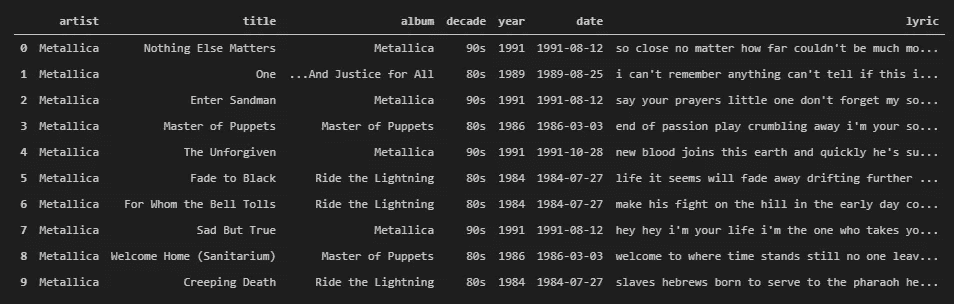

已提取信息的干净数据帧(图片由作者提供)。

现在我们有了一个干净的数据框架来开始创建我们的单词数据框架。您可以点击[这里的](https://github.com/cristobalvch/Music-Lyrics-NLP/blob/master/lyrics.csv)访问该数据的 CSV 文件。

## 1.2 创建单词数据:

为了对金属乐队的歌词进行完整的分析，我想看看他们在不同年代是如何使用词汇的。所以我必须根据每首歌的歌词创建一个单词的数据框架。为了做到这一点，首先我考虑了歌词中独特的词，因为一些歌曲在合唱部分重复了相同的词。我定义了一个名为 unique 的函数来完成这个过程，这个参数对应于一个单词列表

```
def unique(list1):
   # intilize a null list
     unique_list = []
   # traverse for all elements
     for x in list1:
         # check if exists in unique_list or not
         if x not in unique_list:
              unique_list.append(x)
     return unique_list
```

然后我使用下面的代码来存储歌词的唯一单词，这个函数是上面定义的，另一个函数叫做 lyrics_to_words，你可以在 helpers 脚本中找到。我把这些信息保存在歌词数据框中一个名为单词的新栏目里。

```
#Stores unique words of each lyrics song into a new column called words#list used to store the wordswords = []#iterate trought each lyric and split unique words appending the result into the words listdf = df.reset_index(drop=True)for word in df['lyric'].tolist():
    words.append(unique(lyrics_to_words(word).split()))#create the new column with the information of words listsdf['words'] = words
df.head()
```

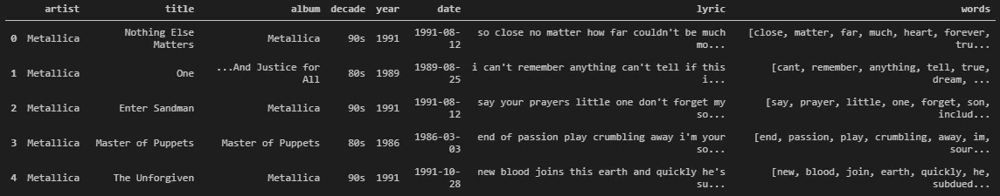

包含新单词列的数据框(图片由作者提供)

正如你可能注意到的，现在我们有一个存储歌词中每首歌的独特单词的栏目。

但这是创建我们的单词数据框架的第一步。下一步是使用这个新单词列，按十年计算一个独特的单词在歌曲歌词中使用的次数，并将所有这些结果存储到一个新的 5 列数据框中，一列用于单词，其他列用于按十年计算的出现频率。

考虑根据每个数据删除自己的停用词很重要，以防 clean 函数不能删除所有停用词。停用词是自然语言中意义不大的词，如“and”、“the”、“a”、“an”以及类似的词。

```
#Create a new dataframe of all the  words used in lyrics and its decades#list used to store the informationset_words = []
set_decades = []#Iterate trought each word and decade and stores them into the new listsfor i in df.index:
   for word in df['words'].iloc[i]:
       set_words.append(word)
       set_decades.append(df['decade'].iloc[i])#create the new data frame  with the information of words and decade listswords_df = pd.DataFrame({'words':set_words,'decade':set_decades})#Defined  your own Stopwords in case the clean data function does not remove all of themstop_words =
['verse','im','get','1000','58','60','80','youre','youve',
  'guitar','solo','instrumental','intro','pre',"3"]# count the frequency of each word that aren't on the stop_words listscv = CountVectorizer(stop_words=stop_words)#Create a dataframe called data_cv to store the the number of times the word was used in  a lyric based their decadestext_cv = 
cv.fit_transform(words_df['words'].iloc[:])data_cv = pd.DataFrame(text_cv.toarray(),columns=cv.get_feature_names())
data_cv['decade'] = words_df['decade']#created a dataframe that Sums the ocurrence frequency of each word and group the result by decadevect_words = data_cv.groupby('decade').sum().Tvect_words = vect_words.reset_index(level=0).rename(columns ={'index':'words'})vect_words = vect_words.rename_axis(columns='')#Save the data into a csv filevect_words.to_csv('words.csv',index=False)#change the order of columns to order from the oldest to actual decadevect_words = vect_words[['words','80s','90s','00s','10s']]
vect_words
```

点击这里的[可以进入查看代码。](https://github.com/cristobalvch/Music-Lyrics-NLP/blob/master/lyrics-analysis.ipynb)

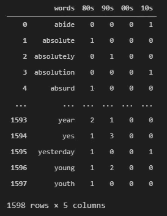

金属乐队歌词的数据框架(图片由作者提供)。

这个数据框很有趣也很有用，因为它向我们展示了 Metallica 根据歌曲发行的年代在歌词中使用一个词的次数。例如，**年轻**这个词在 20 世纪 80 年代的一首歌中出现，在 20 世纪 90 年代的两首歌中出现，在 21 世纪初和 2010 年代出现 0 次。

您可以点击[这里](https://github.com/cristobalvch/Music-Lyrics-NLP/blob/master/words.csv)访问该数据的 CSV 文件。

# 2.享受分析数据的乐趣

为了开始分析 Metallica 创作他们的歌词所用的词，我想回答我脑海中的许多问题。这些问题是:

*   十年来，他们的歌词中最常用的词是什么？
*   每首歌用了多少词？
*   decade 使用的总词和独特词有哪些？
*   一个特定十年中使用频率最高的单词与其他十年相比如何？

## 2.1 按十年划分的词云:

谷歌引用的词云是“*由特定文本或主题中使用的词组成的图像，其中每个词的大小表明其频率或重要性*”。为此，单词 Cloud 按十年分组，将向我们展示在不同的十年中金属乐队的歌词中使用最频繁的单词。

我使用 Matplotlib 和 Wordcloud 库创建了这个图表，其中有一个函数，您必须根据您想要绘制的年代传递数据框、数字的行数和列数。在我的例子中，我有 4 个十年(80 年代，90 年代，00 年代，10 年代)，我想要 2x2 格式的图表。

```
def plot_wordcloud(df,row,col):
     wc = WordCloud(background_color="white",colormap="Dark2",
                     max_font_size=100,random_state=15)
     fig = plt.figure(figsize=(20,10))

     for index, value in enumerate(df.columns[1:]):
       top_dict = dict(zip(df['words'].tolist(),df[value].tolist()))
       wc.generate_from_frequencies(top_dict)
       plt.subplot(row,col,index+1)
       plt.imshow(wc,interpolation="bilinear")
       plt.axis("off")
       plt.title(f"{value}",fontsize=15)plt.subplots_adjust(wspace=0.1, hspace=0.1)
    plt.show()#Plot the word cloud
plot_wordcloud(vect_words,2,2)
```

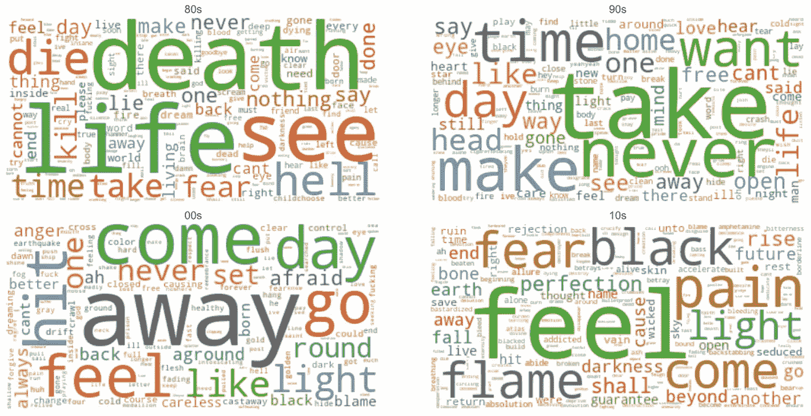

按十年列出的最常用单词的单词云(图片由作者提供)

观察在金属乐队音乐生涯的不同时期使用的词汇之间的差异是很酷的。在 80 年代，单词集中在与生与死有关的概念上，而在 10 年代，单词则是关于感情的更深刻的概念。

## 2.2 文字统计表:

我还定义了一个函数来计算几十年中不同时期的字数统计。您必须将歌词的数据帧和单词的数据帧作为参数传递。我使用了以下代码来创建该表:

```
def words_stats(df,main_df):
    unique_words = []
    total_words = []
    total_news = []
    years = []

    for value in df.columns[1:]:
        unique_words.append(np.count_nonzero(df[value]))
        total_words.append(sum(df[value]))
        years.append(str(value))
        total_news.append(main_df['decade'    [main_df['decade']==value].count())data = pd.DataFrame({'decade':years,
                          'unique words':unique_words,
                          'total words':total_words,
                          'total songs':total_news})data['words per songs'] = 
         round(data['total words'] / data['total songs'],0)data['words per songs'] = 
         data['words per songs'].astype('int')return data#display the table of statistics
words_stats(vect_words,df)
```

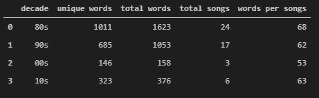

十年词汇统计表(图片由作者提供)。

有了这个表格，我们可以显示很多关于 Metallica 的歌曲和歌词的信息。例如，80 年代有更多的词和歌曲，这是因为最著名的歌曲都是在这十年间发行的。2000 年代每首歌的字数少于其他几十年，也许我们可以推断 2000 年代的歌曲比其他几十年的时间短。

## 2.3 几十年间一个词出现频率的比较:

另一个可以帮助我们理解这一数据的很酷的分析是看一看十年中使用最频繁的单词与其他十年中相同单词的频率相比的趋势。

使用下面的函数，您可以创建一个线形图，以查看一组常用词在特定十年中的趋势。例如，如果我想将 20 世纪 80 年代的 10 个最常见的单词与其他几十年进行比较，我必须将这些信息和单词的数据帧作为参数传递给函数:

```
def plot_freq_words(df,decade,n_words):
    top_words_2020 =   
        df.sort_values([decade],ascending=False).head(n_words)fig = plt.figure(figsize=(15,8))plt.plot(top_words_2020['words'],top_words_2020[df.columns[1]])
    plt.plot(top_words_2020['words'],top_words_2020[df.columns[2]])
    plt.plot(top_words_2020['words'],top_words_2020[df.columns[3]])
    plt.plot(top_words_2020['words'],top_words_2020[df.columns[4]])plt.legend(df.columns[1:].tolist())
    plt.title(f"Most frequent words in {decade} compared with other   decades",fontsize=14)
    plt.xlabel(f'Most Frequent Words of {decade}',fontsize=12)
    plt.ylabel('Frecuency',fontsize=12)
    plt.xticks(fontsize=12,rotation=20)
    plt.yticks(fontsize=12)
    plt.show()#Ploting the comparision plot
plot_freq_words(vect_words,'80s',10)
```

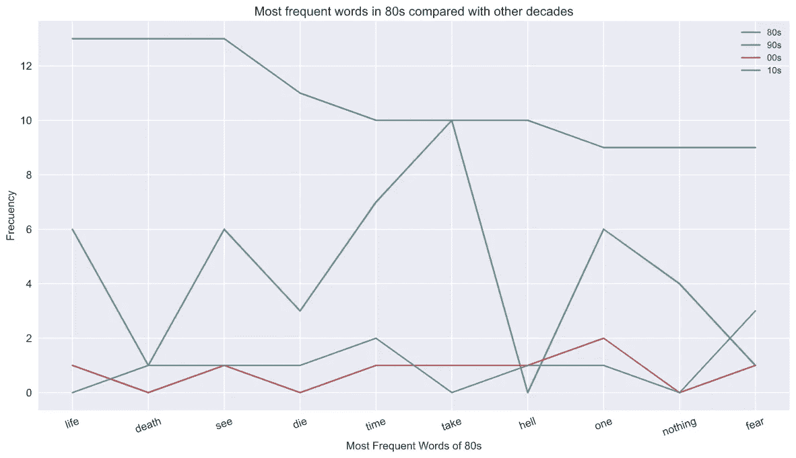

比较不同年代单词出现频率的图表

你可能会注意到，在 20 世纪 80 年代，金属乐队歌词中最常用的两个词是“生”和“死”,两个词都出现了 12 次。但是在 20 世纪 90 年代，只有 6 首歌词使用了“公正的生活”,而在接下来的几十年里，只有 1 首歌词使用了“死亡”。

# 3.歌曲歌词的情感分析

NLKT Python 库的[**【VADER】**](https://github.com/cjhutto/vaderSentiment)(**价感知词典和情感推理机**)是一个词库和基于规则的情感分析工具 ***。*** VADER 使用了一个[情感词典的组合](http://livernspleen.com/wp-content/uploads/2013/09/social-media-tool-as-a-learning-resource.pdf)是一个词汇特征(例如，单词)的列表，这些词汇特征通常根据它们的语义取向被标记为正面或负面。VADER 模型使用 4 种不同的情感指标。

*   **阴性**、**中性**和**阳性**度量表示属于这些类别的文本比例。
*   **复合**指标计算所有词汇等级的总和，它是介于-1(消极性的最大限度)和 1(积极性的最大限度)之间的标准化值。

如果你想了解更多关于 VADER 指标的信息，请点击[这里](https://github.com/cjhutto/vaderSentiment#about-the-scoring)。

我使用下面的代码来计算数据帧的歌曲歌词的 4 个度量。

```
#Create lists to store the different scores for each wordnegative = []
neutral = []
positive = []
compound = []#Initialize the modelsid = SentimentIntensityAnalyzer()#Iterate for each row of lyrics and append the scoresfor i in df.index:
    scores = sid.polarity_scores(df['lyric'].iloc[i])
    negative.append(scores['neg'])
    neutral.append(scores['neu'])
    positive.append(scores['pos'])
    compound.append(scores['compound'])#Create 4 columns to the main data frame  for each scoredf['negative'] = negative
df['neutral'] = neutral
df['positive'] = positive
df['compound'] = compounddf.head()
```

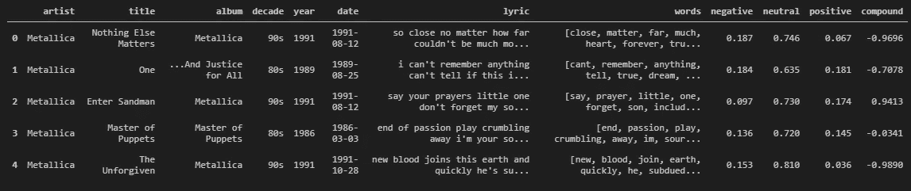

带有情感指标的歌词数据框(图片由作者提供)

现在，一个很好的方法是使用 Matplotlib 库在散点图上绘制歌曲及其各自的情感指标。在这种情况下，我绘制了每首歌词按十年分组的负得分和正得分。

```
for name, group in df.groupby('decade'):
    plt.scatter(group['positive'],group['negative'],label=name)
    plt.legend(fontsize=10)plt.xlim([-0.05,0.7])
plt.ylim([-0.05,0.7])
plt.title("Lyrics Sentiments by Decade")
plt.xlabel('Positive Valence')
plt.ylabel('Negative  Valence')
plt.show()
```

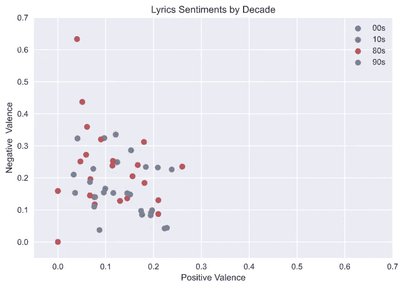

歌词正面得分和负面得分散点图(图片由作者提供)

分析这个情节，我可以推断出金属乐队的歌词倾向于更多的负价，因此导致产生更多的负面情绪。

我也想分析这种情绪，但是使用十年分数的平均值。所以我只是把有这个结果的主要数据框架按十年分组。

```
means_df = df.groupby(['decade']).mean()
means_df
```

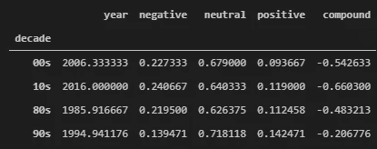

按十年分组的歌词数据帧的含义(图片由作者提供)

```
for name, group in means_df.groupby('decade'):
    plt.scatter(group['positive'],group['negative'],label=name)
    plt.legend()plt.xlim([-0.05,0.7])
plt.ylim([-0.05,0.7])
plt.title("Lyrics Sentiments by Decade")
plt.xlabel('Positive Valence')
plt.ylabel('Negative  Valence')
plt.show()
```

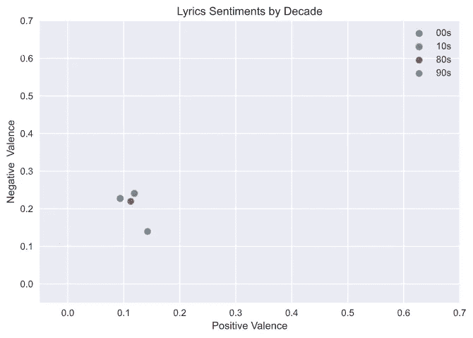

十年平均值的正分数散点图和负分数散点图(图片由作者提供)

我意识到金属乐队 90 年代的歌词比其他几十年更倾向于正面。考虑到主流音乐中最著名的金属乐队是在 90 年代，这真的很有趣。

# 3.结果和结论的解释

*   金属乐队的大多数著名歌曲都是在 20 世纪 80 年代发行的。
*   金属乐队歌曲的第一句歌词使用了与死亡、活在地狱和杀戮主题相关的词，多年来，这句歌词被改为使用恐惧、痛苦和崛起等词来表达最深刻的人类情感。
*   20 世纪 90 年代发行的歌曲的歌词比其他几十年更有积极的感觉。
*   在 2010 年代，金属乐队用了 323 个独特的词创作了 6 首歌曲的歌词。
*   每首歌词的字数在 50 到 70 之间。

总结这篇文章，我们学习了如何使用一种新的技术来分析应用于音乐的文字和文本情感。与过去的几十年相比，生活在这个现代的十年里的人们所拥有的优势是惊人的。我的意思是，在你舒适的家中使用简单的技术来创造惊人的研究和项目，它允许我们随着社会不断发展，利用技术来实现我们的目标，并享受做有趣事情的时间。

这篇文章将有第二部分，我将试着找到金属乐队在他们的歌曲歌词中暴露的主要话题、概念和想法。

# 我的其他文章:

[](https://medium.com/datadriveninvestor/automating-playlists-on-spotify-from-the-music-folders-of-your-computer-c79060eadab2) [## 从电脑的音乐文件夹中自动播放 Spotify 上的播放列表。

### 将音乐文件导出到 Spotify 播放列表的有趣方式。

medium.com](https://medium.com/datadriveninvestor/automating-playlists-on-spotify-from-the-music-folders-of-your-computer-c79060eadab2) [](/predicting-the-music-mood-of-a-song-with-deep-learning-c3ac2b45229e) [## 用深度学习预测一首歌的音乐情绪。

### 一个很酷的方法来预测音乐曲目的情绪与神经网络模型使用 Keras 和 Tensorflow 库对…

towardsdatascience.com](/predicting-the-music-mood-of-a-song-with-deep-learning-c3ac2b45229e) [](/clustering-music-to-create-your-personal-playlists-on-spotify-using-python-and-k-means-a39c4158589a) [## 使用 Python 和 K-Means 对音乐进行聚类，在 Spotify 上创建您的个人播放列表。

### 在 Spotify 播放列表中按相似性对歌曲进行分组的简单方法。

towardsdatascience.com](/clustering-music-to-create-your-personal-playlists-on-spotify-using-python-and-k-means-a39c4158589a) [](https://medium.com/@cristobal.veas.ch/una-forma-interactiva-para-buscar-y-analizar-ofertas-de-trabajo-en-la-web-ef9327b0a8d3) [## 一个在网络上工作的总线和分析的交互格式。

### 像自动化和可视化一样，这也是 Python 和 Power Bi 的主要用途。

medium.com](https://medium.com/@cristobal.veas.ch/una-forma-interactiva-para-buscar-y-analizar-ofertas-de-trabajo-en-la-web-ef9327b0a8d3) [](https://medium.com/@cristobal.veas.ch/una-forma-genial-para-buscar-y-analizar-arriendos-de-departamentos-en-la-web-e20727390a8c) [## 一个友好的公共汽车和分析人员在网上到达部门。

### 由于自动化的原因，很多时候需要使用 Python 和 Power Bi。

medium.com](https://medium.com/@cristobal.veas.ch/una-forma-genial-para-buscar-y-analizar-arriendos-de-departamentos-en-la-web-e20727390a8c) [](https://medium.com/@cristobal.veas.ch/c%C3%B3mo-hacer-reflexionar-a-tu-computador-con-las-noticias-del-pa%C3%ADs-dc14d2fc0a67) [## 你用电脑看报纸的新闻

### 一个有趣的形式分析了帕拉布拉斯和他的感觉，这是一个关于蟒蛇皮的新闻…

medium.com](https://medium.com/@cristobal.veas.ch/c%C3%B3mo-hacer-reflexionar-a-tu-computador-con-las-noticias-del-pa%C3%ADs-dc14d2fc0a67) 

参考资料:

*   [https://www . aprendemachinehlearning . com/ejerciio-NLP-cuentos-de-hernan-casciari-python-espan ol/](https://www.aprendemachinelearning.com/ejercicio-nlp-cuentos-de-hernan-casciari-python-espanol/)
*   http://jdaytn.com/posts/download-blink-182-data/
*   【https://agailloty.rbind.io/en/project/nlp_clean-text/ 
*   [https://www.pluralsight.com/guides/topic-identification-nlp](https://www.pluralsight.com/guides/topic-identification-nlp)