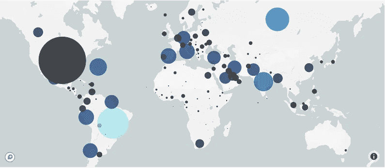
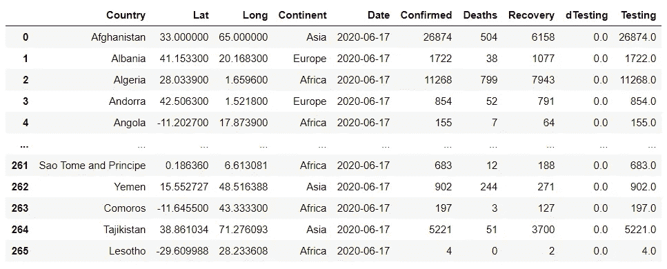
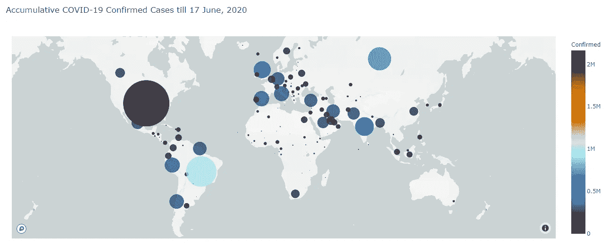
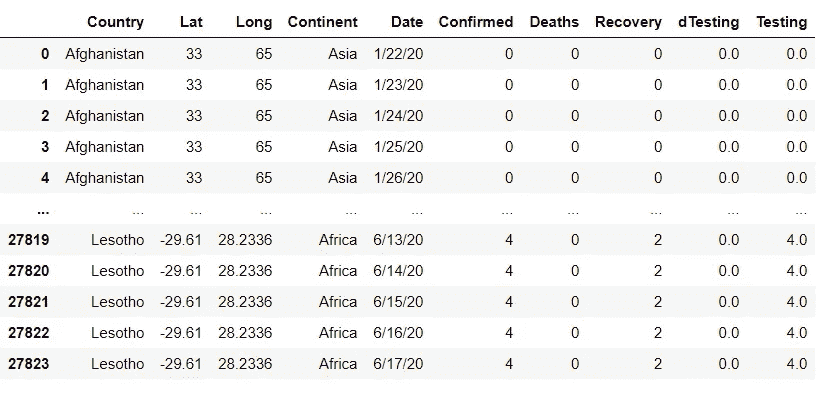
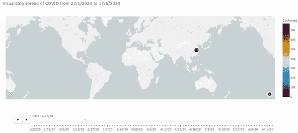

# 如何使用 Plotly Express 在 Mapbox 上制作散点图动画？

> 原文：<https://towardsdatascience.com/how-to-animate-scatterplots-on-mapbox-using-plotly-express-3bb49fe6a5d?source=collection_archive---------23----------------------->



COVID19 在全球的传播。[乌萨马·汗](https://www.linkedin.com/in/usamabintariq/)在 [Github](https://github.com/usamatrq94/Plotly-express-scatter-mapbox-tutorial/blob/master/Notebook.ipynb) 上生成的图像

Plotly Express 是一个数据可视化库，允许我们快速有效地可视化小数据。在本教程中，我们将学习如何使用 Plotly express 内置的散点图框功能制作动画。

散点图框需要以下参数:

1.  *df* ，这是你熊猫的数据框。
2.  *lat* 是包含纬度坐标的列的名称。
3.  *lon* 是包含经度坐标的列的名称。
4.  *颜色*是为单个散射点着色的列的名称。
5.  *大小*是决定个体散点大小的柱的名称。

虽然上述论点是基本的，我们可以通过它们创建一个散点图，但这不是全部。Plotly Express 散点图框功能提供了大量的功能，可以在文档中找到[这里](https://plotly.com/python-api-reference/generated/plotly.express.scatter_mapbox.html#plotly.express.scatter_mapbox)。

有了这些理解，我们现在可以在 Mapbox 上创建一个简单的散点图，稍后可以转换成动画。但在此之前，我们必须看一看并了解我们的数据集。

对于这个例子，我们将使用新冠肺炎数据集，可以在这里找到。它被进一步处理。有关数据预处理的更多信息，请查看这里。

如下面的数据集所示，第一列显示了国家的名称，接下来的两列显示了国家的纬度和经度坐标。“洲”列显示了各个国家的洲。“日期”列显示国家/地区数据的上次更新日期。“已确认”栏代表已确认的 COVID 病例，“死亡”栏代表因 COVID 而死亡的人数，“恢复”栏代表治愈该病毒的人数。

特定国家显示的所有数据代表自记录首例病例以来的累计总数，而非每日增加数。



COVID 19 的数据集。[乌萨马·汗](https://www.linkedin.com/in/usamabintariq/)在 [Github](https://github.com/usamatrq94/Plotly-express-scatter-mapbox-tutorial/blob/master/Notebook.ipynb) 上生成的图像

了解数据集后，现在是创建散点图的时候了。我们将为已确认的 COVID 病例创建散点图，并将其绘制在地图框上。让我们看看我们如何能做它。

现在，由于我们要可视化已确认的病例,“已确认”列将被转发到 size 和 color 参数。请看看下面的代码:

```
# Necessary Importing
import pandas as pd
import plotly.express as px#Importing dataset as pandas dataframe
datasets = pd.read_csv('covid-dataset.csv')# Creating and visualizing a scatter plot on Mapbox
fig = px.scatter_mapbox(datasets, lat="Lat", lon="Long",
                  color="Confirmed", size="Confirmed",
                  color_continuous_scale=px.colors.cyclical.IceFire,
                  size_max=70, zoom=0.75, hover_name='Country', 
                  hover_data = ['Confirmed', 'Deaths', 'Recovery'], 
                  title = 'Accumulative COVID-19 Confirmed Cases
                  till 17 June, 2020')
fig.show()
```

从上面的代码中我们可以看到，这里很少有未知的参数。我们一个一个来破。

1.  “数据集”只是传递到函数中的熊猫数据框的名称。
2.  “lat”和“long”是数据框中带有经纬度坐标的列的名称。
3.  因为我们对可视化确诊病例感兴趣，所以我们将“确诊”列转发给了 size 和 color 参数。
4.  “color_continuous_scale”询问我们将用于可视化数据的配色方案。可用的选项很少，请参考上面的文档链接。
5.  “size_max”要求地图上绘制的气泡的最大尺寸。而“缩放”是显示地图的默认缩放值。您可以随意使用这两个值，并根据自己的喜好进行优化。
6.  “hover_name”和“hover_data”要求当光标悬停在地图上的特定气泡上时显示列。
7.  顾名思义，“标题”指定地图的标题。

现在明白了这一点，让我们来看看上面代码片段的输出。



Covid19 全球确诊病例。由[乌萨马·汗](https://www.linkedin.com/in/usamabintariq/)在 [Github](https://github.com/usamatrq94/Plotly-express-scatter-mapbox-tutorial/blob/master/Notebook.ipynb) 上生成的图像

哇，看起来真棒。您也可以为死亡和恢复列生成类似的映射。你自己试试。

完成后，下一个任务是将数据框中的“日期”列制作成动画，并查看自 1 月份病毒爆发以来确诊病例是如何累积的。

之前使用的数据集被切片以可视化最大记录日期(2020 年 6 月 17 日)的数据。为了创建一个动画，我们需要移除切片器并再次理解我们的数据集。让我们来看看。



COVID19 的完整数据集。由[乌萨马·汗](https://www.linkedin.com/in/usamabintariq/)在 [Github](https://github.com/usamatrq94/Plotly-express-scatter-mapbox-tutorial/blob/master/Notebook.ipynb) 上生成的图像

该数据集包含 2020 年 1 月 22 日至 2020 年 6 月 17 日记录的冠状病毒确诊病例、死亡和康复。数据库中所有其余的列都与前面解释的相同。

现在，我们需要在散点图上显示日期，并可视化 COVID19 确诊病例如何在世界各地传播。为此，我们需要给 scatter_mapbox 函数一些额外的参数。

```
fig = px.scatter_mapbox(datas, lat="Lat", lon="Long",
            animation_frame = 'Date', animation_group = 'Country', 
            color="Confirmed", size="Confirmed",
            color_continuous_scale=px.colors.cyclical.IceFire, 
            size_max=70, zoom=0.75, hover_name='Country', 
            hover_data = ['Confirmed', 'Deaths', 'Recovery'], 
            title = 'Visualizing spread of COVID from 22/1/2020 to
            17/6/2020')fig.show()
```

从上面的代码可以看出，为了创建动画，scatter_mapbox 函数被赋予了两个额外的参数。这些参数是“动画 _ 帧”和“动画 _ 组”。“animation_frame”要求包含要制作动画的时间序列信息的列。完成这些后，我们最终生成了下面的动画:



Covid19 的全球传播。[乌萨马·汗](https://www.linkedin.com/in/usamabintariq/)在 [Github](https://github.com/usamatrq94/Plotly-express-scatter-mapbox-tutorial/blob/master/Notebook.ipynb) 上生成的图像

本教程到此为止，请看一下这个项目的 GitHub，[这里](https://github.com/usamatrq94/Plotly-express-scatter-mapbox-tutorial)。