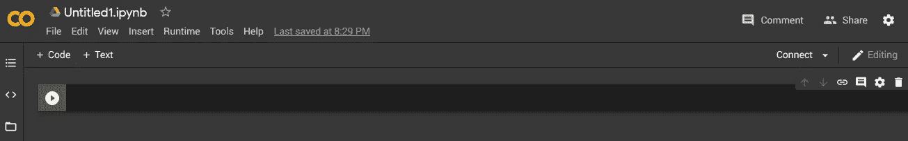
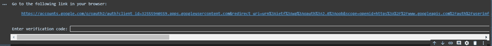
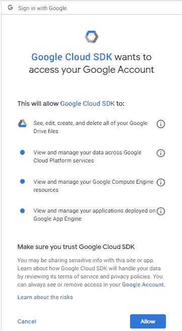
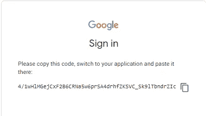
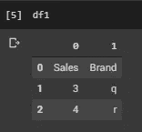
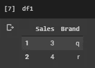
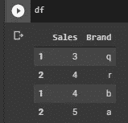

# 如何将您的工作表附加到云上

> 原文：<https://towardsdatascience.com/how-to-append-your-sheets-on-the-cloud-3cd9e0a2cf39?source=collection_archive---------49----------------------->

## 在 Colab 中运行 python 笔记本可以显著减轻您的日常任务。以下是如何用 6 个简单的步骤完成其中一项任务。

由 [Unsplash](https://unsplash.com?utm_source=medium&utm_medium=referral) 上的 [La-Rel Easter](https://unsplash.com/@lastnameeaster?utm_source=medium&utm_medium=referral) 拍摄的照片

谷歌为你提供了一些免费的 CPU，甚至一个小规模的 GPU，非常适合通过其托管的 Jupyter 笔记本应用程序 Google Colab 运行简单的任务。

以前被称为谷歌实验室，现在谷歌实验室不需要设置，如果你有一个谷歌帐户，访问它就像访问[的网站一样容易。](https://colab.research.google.com)

一旦你进入，你只需要点击“新笔记本”按钮。然后，您将拥有自己的托管笔记本，可按如下方式使用:

截图来自 [Google Colab](https://colab.research.google.com)

你的第一个笔记本会在你的 Google Drive 中自动创建一个名为“Colab Notebooks”的文件夹来自动存储你的所有工作。

在对该工具进行简要说明之后，让我们深入研究我们的代码，将位于您的驱动器中的工作表添加到新的 Google 工作表中。整个过程由 6 个简单的步骤组成。

# 第 1 步-验证 Google 帐户，以便能够在您的 Google 表单中进行更改

为了阅读和修改您的 Google Sheets 文档，您首先需要验证 Google Colab 以访问您的 Google Drive 文档。尽管这两个应用都属于谷歌，但它们之间的访问需要你方的独家认证。

如果您在笔记本的第一个单元格中运行下面的代码，您就可以对 Google Drive 文档进行任何更改。

参见[我的 Github 页面](https://github.com/lor9n4o12/Append-Gsheets)中的完整代码

运行该单元将生成一个链接并询问授权码。

截图来自 [Google Colab](https://colab.research.google.com)

截图来自谷歌

单击链接完成登录过程。

如左图所示，这种认证将允许您查看、编辑、创建和编辑 Google Drive 中的所有文件。所以一定要仔细检查你从笔记本上运行的任何代码，以避免不可逆转的错误。

允许在文档中进行更改。

一旦允许，系统将生成一个代码。复制代码并将其粘贴到 Colab 中，以完成身份验证过程。

截图来自谷歌

# 步骤 2 —从 Google Sheet URLs 中读取文件，并将数据放入 pandas 数据框架中

第二步是从 Colab 笔记本中读取你的 Google Drive 中的文件。

这一步包括打开 Google Sheets 来读取数据，选择数据所在的工作表，获取数据，最后将数据放入 pandas dataframe。

参见[我的 Github 页面](https://github.com/lor9n4o12/Append-Gsheets)中的完整代码

这里需要注意的是，链接不必是公开的，因为所有的权限都被授予了，所以你可以从你的浏览器中复制你的 Google Sheets 文档的链接。

# 步骤 3-设置列，并在数据框中指定数据范围

将数据放入 dataframe 后，接下来的步骤是设置列和指定数据范围。

截图来自[谷歌 Colab](https://colab.research.google.com)

如果您的列是数据的一部分，并且没有位于图像上当前为“0”和“1”的列部分，则需要使用以下代码设置列并指定数据范围。如果已经有了列名，可以跳过这一步。

完整代码见[我的 Github 页面](https://github.com/lor9n4o12/Append-Gsheets)

截图来自 [Google Colab](https://colab.research.google.com)

当执行完成时，可以在这里看到更新的 df1 数据帧。

# 步骤 4 —从不同的数据帧中选择相同的列名，以便以后追加

append 函数的一个关键点是所选工作表中的列数应该匹配。否则，append 命令将在下一步中生成错误。因此，您需要提前选择具有相同名称的列，以便将正确的值附加到彼此。

在下面的例子中，我选择了存在于两个工作表中的“销售”和“品牌”列。您可以对它们进行重命名，或者添加任意多的列，只要所有这些都可以在两个文件中找到。

参见[我的 Github 页面](https://github.com/lor9n4o12/Append-Gsheets)中的完整代码

注意列名前后的空格。

# #步骤 5 —追加数据帧

数据集终于可以追加了。因此，我们只需要运行我们的单行代码来完成 append 函数。

参见[我的 Github 页面](https://github.com/lor9n4o12/Append-Gsheets)中的完整代码

在这个例子中，我把重点放在了 append 上，但是根据您的需要，您也可以使用“merge”、“join”或“concatenate”函数。你可以查看熊猫文档来发现这些其他功能的细节。

截图来自[谷歌 Colab](https://colab.research.google.com)

在将新数据写入 Google Sheets 之前，通过运行“df”检查追加是否成功完成很重要。查看最新版本的 dataframe。

# 第 6 步——打开您想要写入新数据的 Google Sheets 文件，然后使用 set 函数插入数据

最后但同样重要的是，您需要打开一个新的 Google Sheet 文档，选择相关的工作表，用“set_with_dataframe”函数将新的数据帧写入其中。

完整代码见[我的 Github 页面](https://github.com/lor9n4o12/Append-Gsheets)

恭喜你。您现在已经添加了 Google 表单，甚至没有将它们下载到您的计算机上。这并不意味着你不能在你的本地计算机上做同样的事情，但是因为这是一个更普遍的做法，所以我没有在这篇文章中讨论它。

此外，这篇文章的目的不仅是向您展示附加表，而且让您意识到您在云中有一种免费的处理能力，称为 Google Colab，并向您展示如何与您的 Google Drive 中的文件进行交互，以便能够在许多其他用例中使用它。

下次见！

同样来自作者:

 [## 3 第 2 层区块链扩展对 Gig 经济的潜在好处

### 让我们一起来看看区块链应该如何扩展，以及第 2 层扩展对 Gig 有什么影响…

medium.com](https://medium.com/@furkansaatcioglu/3-potential-benefits-of-layer-2-blockchain-scaling-on-the-gig-economy-9c24f77489c1)