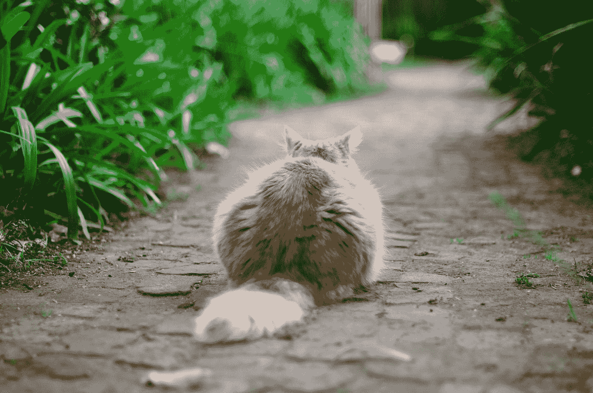
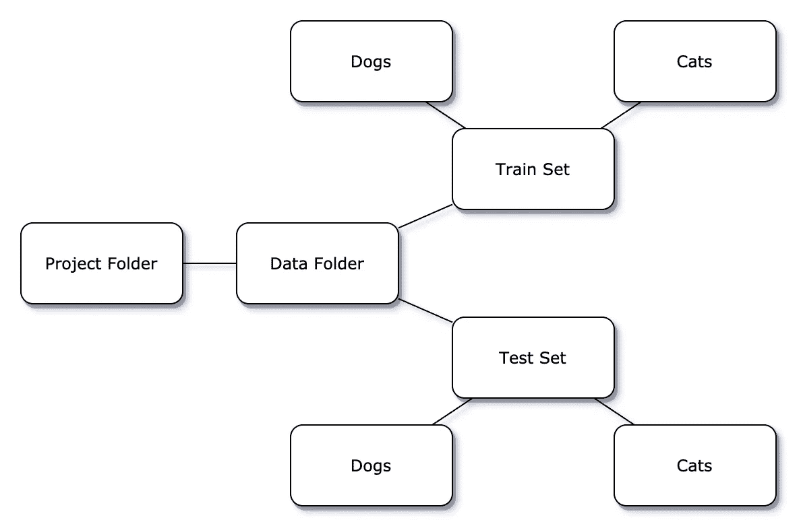
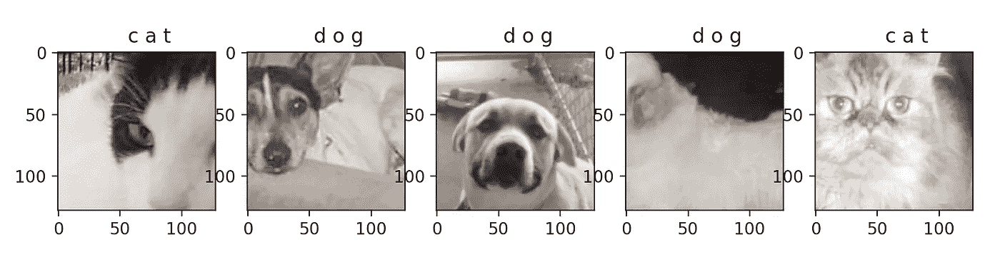

# 如何将 PyTorch 中的 CNN 应用到您的图像中？

> 原文：<https://towardsdatascience.com/how-to-apply-a-cnn-from-pytorch-to-your-images-18515416bba1?source=collection_archive---------9----------------------->

## 您将学习如何在几分钟内将下载的图像上传到 PyTorch。



在 [Unsplash](https://unsplash.com?utm_source=medium&utm_medium=referral) 上由[Marnhe du ploy](https://unsplash.com/@marnhe?utm_source=medium&utm_medium=referral)拍摄的照片

大家好！今天我想谈谈把你的图片上传到你的 PyTorch CNN。

今天我们将讨论以下内容:

*   如何正确存储图像，让您可以轻松地将您的数据标记出来。
*   如何使用 PyTorch 访问数据并在途中做一些预处理？
*   最后，我们将使用一个非常简单的 CNN 对我们的图像进行分类。

# 首先，如何存储数据？

我将使用[这个](https://www.kaggle.com/chetankv/dogs-cats-images)数据集，其中包含了猫和狗的图像。

存储图像最简单的方法是为每个类创建一个文件夹，用类的名称命名文件夹。

让我举个例子:



作者图片

只需正确命名文件夹，就可以让 PyTorch 知道向哪个类断言图像。

# 现在，让我们进入代码。

```
import matplotlib.pyplot as plt
from torchvision import datasets, transforms
from torch.utils.data import DataLoader
import torch.nn as nn
import torch.nn.functional as F
import torch.optim as optim
import torchdef get_data():
    data_dir = '/your_path/Data/'

    train_set = datasets.ImageFolder(data_dir + '/training_set')
    test_set = datasets.ImageFolder(data_dir + '/test_set')

    return train_set, test_set
```

上面的函数从目录中获取数据。您只需指定到您的**训练集**和**测试集**文件夹的路径。PyTorch 随后会使用指定目录中的文件夹名称自动将标签分配给图像。

然而，您可能想在使用图像之前做一些预处理，所以让我们做吧，此外，让我们马上创建一个**数据加载器**。为此，让我们在上面的代码中添加一些新行。

```
def get_data():
    data_dir = '/your_path/Data/'

    **transform** = transforms.Compose([
        #transforms.RandomRotation(20),
        transforms.RandomResizedCrop(128),
        #transforms.RandomHorizontalFlip(),
        transforms.ToTensor()])

    train_set = datasets.ImageFolder(data_dir + '/training_set', **transform=transform**)
    test_set = datasets.ImageFolder(data_dir + '/test_set', **transform=transform**)

    train = **DataLoader**(train_set, batch_size=32, shuffle=True)
    test = **DataLoader**(test_set, batch_size=32, shuffle=True)

    return train, test
```

在转换过程中，你可能需要对图像进行裁剪、翻转、调整大小、旋转等操作。为此，您可以使用**转换**在一个地方指定您需要的所有东西。然后，您可以使用上传的图像创建**数据加载器**。

# 这就是 CNN 发挥作用的地方。

现在，当您准备好数据后，您可能想快速浏览一下。为此，您可以使用这个简单的函数，它将显示前 5 幅图像。

```
def train_imshow():
    classes = ('cat', 'dog') # Defining the classes we have
    dataiter = iter(train)
    images, labels = dataiter.next()
    fig, axes = plt.subplots(figsize=(10, 4), ncols=5)
    for i in range(5):
        ax = axes[i]
        ax.imshow(images[i].permute(1, 2, 0)) 
        ax.title.set_text(' '.join('%5s' % classes[labels[i]]))
    plt.show()
```



作者图片

让我们来定义我们的卷积神经网络:

```
class Net(nn.Module):
    def __init__(self):
        super(Net, self).__init__()
        self.conv1 = nn.Conv2d(3, 6, 5)
        self.pool = nn.MaxPool2d(8, 8)
        self.conv2 = nn.Conv2d(6, 16, 5)
        self.fc1 = nn.Linear(16, 100)
        self.fc2 = nn.Linear(100, 50)
        self.fc3 = nn.Linear(50, 2)

    def forward(self, x):
        x = self.pool(F.relu(self.conv1(x)))
        x = self.pool(F.relu(self.conv2(x)))
        x = x.view(-1, 16)
        x = F.relu(self.fc1(x))
        x = F.relu(self.fc2(x))
        x = self.fc3(x)
        return x
```

我使用了这里定义的网络[并做了一点修改，现在它可以和我的图片一起工作了。](https://pytorch.org/tutorials/beginner/blitz/cifar10_tutorial.html)

现在我们可以指定标准、优化器、学习率和训练网络。

```
criterion = nn.CrossEntropyLoss()
optimizer = optim.SGD(net.parameters(), lr=0.01, momentum=0.9)if torch.cuda.is_available(): # Checking if we can use GPU
    model = net.cuda()
    criterion = criterion.cuda()

def train_net(n_epoch): # Training our network
    losses = []
    for epoch in range(n_epoch):  # loop over the dataset multiple times
        running_loss = 0.0
        for i, data in enumerate(train, 0):
            # get the inputs; data is a list of [inputs, labels]
            inputs, labels = data

            # zero the parameter gradients
            optimizer.zero_grad()

            # forward + backward + optimize
            outputs = net(inputs)
            loss = criterion(outputs, labels)
            loss.backward()
            optimizer.step()

            # print statistics
            losses.append(loss)
            running_loss += loss.item()
            if i % 100 == 99:  # print every 2000 mini-batches
                print('[%d, %5d] loss: %.10f' %
                      (epoch + 1, i + 1, running_loss / 2000))
                running_loss = 0.0
    plt.plot(losses, label='Training loss')
    plt.show()
    print('Finished Training')
```

您可以保存和加载您训练过的网络。

```
PATH = './cat_dog_net.pth'
torch.save(net.state_dict(), PATH)

# Loading the trained network
net.load_state_dict(torch.load(PATH))
```

让我们把测试图像输入网络。

```
correct = 0
total = 0
with torch.no_grad():
    for data in test:
        images, labels = data
        outputs = net(images)
        _, predicted = torch.max(outputs.data, 1)
        total += labels.size(0)
        correct += (predicted == labels).sum().item()

print('Accuracy of the network on the %d test images: %d %%' % (len(test),
    100 * correct / total))
```

测试集误差为 **66%** ，这还不错，尽管获得尽可能好的精度并不是本文的目标。

[在这里](https://github.com/Einnmann/DS_projects/blob/master/cats_and_dogs.py)你可以找到完整的代码。

干得好！现在你已经准备好使用你的图像来练习深度学习了！

感谢您的阅读！