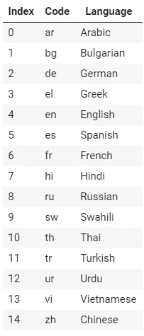

# 如何将 BERT 应用于阿拉伯语和其他语言

> 原文：<https://towardsdatascience.com/how-to-apply-bert-to-arabic-and-other-languages-5c3410ddd787?source=collection_archive---------4----------------------->

## 多语言(XLM-罗伯塔)与单语(阿拉伯伯特)的方法，以及机器翻译如何帮助。


迪米特里 B 在 [Unsplash](https://unsplash.com?utm_source=medium&utm_medium=referral) 上拍摄的照片

到目前为止，Nick 和我一直在使用英语编写几乎专门关于 NLP 应用程序的教程…虽然通用算法和思想可以扩展到所有语言，但是支持英语 NLP 的大量资源并不能扩展到所有语言。例如，BERT 和类似 BERT 的模型是一个非常强大的工具，但是模型发布几乎总是用英语，可能后面还有中文、俄文或西欧语言的变体。

出于这个原因，我们将关注一个有趣的类伯特模型类别，称为**多语言模型**，它有助于将大型类伯特模型的功能扩展到英语以外的语言。

克里斯·麦考密克和尼克·瑞安

# 1.多语言模型

# 1.1.多语言模型方法

多语言模型采用一种相当奇怪的方法来处理多种语言…

多语言模型不是单独处理每种语言，而是根据来自混合语言的文本进行预训练。

在这篇文章和附带的笔记本中，我们将使用一个来自脸书的名为 **XLM-R** 的特定多语言模型(“跨语言语言模型—罗伯塔”的简称)。

最初的伯特在英语维基百科和 BooksCorpus(自助出版书籍的集合)上接受过预训练，而 XLM-R 在维基百科和来自 100 种不同语言的通用抓取数据上接受过预训练！不是 100 种不同的模型在 100 种不同的语言上接受训练，而是一个单一的伯特型模型，它是在所有这些文本上预先训练好的。


(图片由作者提供)

这里真的没有任何东西试图刻意区分语言。例如，在 XLM-R:

*   有一个单一的、共享的词汇表(包含 25 万个令牌)来涵盖所有 100 种语言。
*   输入文本中没有添加特殊的标记来指示它是什么语言。
*   它不是用“平行数据”(多种语言的同一句话)训练的。
*   我们没有修改培训目标来鼓励它学习如何翻译。

然而，XLM-R 并没有预测无意义或对其众多输入语言中的任何一种都只有最起码的理解，而是表现得令人惊讶地好，甚至与用单一语言训练的模型相比也是如此！

# 1.2.跨语言迁移

如果您的应用程序是用另一种语言编写的(从现在开始，我们将使用阿拉伯语作为例子)，您可以像使用常规 BERT 一样使用 XLM-R。您可以在您的阿拉伯语培训文本上微调 XLM-R，然后使用它来用阿拉伯语进行预测。

然而，XLM-R 允许你利用另一种更令人惊讶的技术…

假设您正试图构建一个模型来自动识别阿拉伯语中令人讨厌的(或“有毒的”)用户评论。已经有一个很棒的数据集叫做“维基百科有毒评论”,大约有 225，000 条标签评论——只不过都是英文的！

你有什么选择？用阿拉伯语收集类似规模的数据集将会非常昂贵。以某种方式应用机器翻译可能很有趣，但有其局限性(我将在后面的部分中更多地讨论翻译)。

XLM-R 提供了另一种称为“跨语言迁移”的途径。你可以在英文的维基百科有毒评论数据集*上微调 XLM-R，然后将其应用于阿拉伯语评论*！


(图片由作者提供)

XLM-R 能够将它在英语中学习到的特定任务知识应用到阿拉伯语中，尽管我们从未向它展示过任何阿拉伯语的例子！这是从一种语言到另一种语言的迁移学习的概念——因此，“跨语言迁移”。

在这篇文章附带的笔记本中，我们将看到纯粹在大约 400k *英语*样本上训练 XLM-R 实际上比在(小得多的)阿拉伯数据集上微调“单语”阿拉伯模型产生更好的*结果。*

> *这个令人印象深刻的壮举被称为* ***零距离学习*** *或* ***跨语言迁移*** *。*

# 1.3.为什么是多语言？

多语言模型和跨语言转移是很酷的技巧，但是如果脸书只是为这些不同的语言中的每一种训练和发布一个单独的模型不是更好吗？

是的，这可能会产生最准确的模型——如果网上每种语言的文本都像英语一样多就好了！

> *只对单一语言的文本进行预训练的模型称为* ***单语*** *，而对多种语言的文本进行预训练的模型称为* ***多语言*** *。*

下面的柱状图显示了对于一小部分选择的语言，XLM-R 的作者能够为预训练收集多少文本数据。


(图片作者，改编自 XLM-R [论文](https://arxiv.org/pdf/1911.02116.pdf)图 1)

请注意，比例是对数的，因此英语数据大约比阿拉伯语或土耳其语多 10 倍，比意第绪语多 1000 倍。

# 1.4.按资源划分的语言

不同的语言有不同数量的训练数据可用于创建大型的类似 BERT 的模型。这些被称为**高**、**中**和**低资源**语言。英语、汉语和俄语等高资源语言在网上有大量免费的文本，可以用作训练数据。因此，NLP 研究人员主要集中于开发大型语言模型和这些语言的基准。

我改编了 XLM-R [论文](https://arxiv.org/pdf/1911.02116.pdf)的图 1 中的柱状图。这是他们的完整条形图，显示了他们为 100 种语言中的 88 种语言收集的数据量。


这些语言用两个字母的 ISO 代码标注——你可以在[这里](https://en.wikipedia.org/wiki/List_of_ISO_639-1_codes)的表格中查找。

下面是柱状图中的前十个代码(注意，在德语之后还有另外~10 种语言有类似的数据量)。


请注意，这个“数据量”的排名与每种语言在互联网上有多少用户的排名并不匹配。在维基百科上查看这个表格。在柱状图中，中文(代码`zh`)排在第 21 位，但迄今为止拥有最多的用户(仅次于英语)。

类似地，NLP 研究人员对不同语言付出的努力和关注并不遵循柱状图中的排名——否则汉语和法语会排在前 5 名。

> *最近有一个名为*[*OSCAR*](https://oscar-corpus.com/)*的项目，它为不同语言的类似 BERT 的模型提供了大量的预训练文本——如果你正在寻找未标记的文本来使用你的语言进行预训练，那么绝对值得一试！*

# 1.5.利用机器翻译

也有可能涉及“机器翻译”(自动翻译文本的机器学习模型)，以尝试和帮助解决语言资源有限的问题。这里有两种常见的方法。

**方法 1——翻译所有内容**

您可以完全依赖英文模型，将应用程序中的任何阿拉伯文本翻译成英文。


(图片由作者提供)

这种方法与单语模型方法具有相同的问题。最好的翻译工具使用机器学习，对于可用的训练数据也有同样的限制。换句话说，针对中低资源语言的翻译工具还不足以成为我们问题的简单解决方案——目前，像 XLM-R 这样的多语言 BERT 模型可能是更好的选择。

**方法#2 —增加训练数据**

如果你的任务中已经存在大量带标签的*英语*文本，那么你可以将这些带标签的文本翻译成阿拉伯语，并用它来扩充你可用的*阿拉伯语*训练数据。


(图片由作者提供)

如果您的语言中有一个不错的单语模型，并且有一个大型英语数据集可用于您的任务，那么这是一个很好的技术。我们在一个附带的笔记本中将这种技术应用于阿拉伯语，它的表现优于 XLM-R(至少在我们的初始结果中——我们没有执行严格的基准测试)。

# 1.6.XLM R 词汇

正如你可能想象的那样，为了适应 100 种不同的语言，XLM-R 拥有与最初的 BERT 非常不同的词汇。

XLM R 的词汇量为 250，000 个单词，而伯特的词汇量为 30，000 个单词。

我在这里发布了一个笔记本[,在这里我浏览了 XLM-R 的词汇，以了解它包含的内容，并收集各种统计数据。](https://colab.research.google.com/drive/1M7pDk5bbZh_wB4GMtVjDqVG2l9hCK1Wk)

以下是一些亮点:

*   它包含 13，828 个字符的“字母表”。
*   其中 62%是全词，38%是子词。
*   为了统计英语单词，我尝试在 WordNet(一种综合英语词典)中查找所有完整的单词，找到了大约 11，400 个英语单词，这只是 XLM-R 词汇量的 5%。

# 2.比较方法

# 2.1.自然语言推理

评估多语言模型最常用的任务叫做**自然语言推理(NLI)** 。原因是有一个优秀的多语言基准数据集叫做 **XNLI** 。

我们将在下一节讨论 XNLI，但是如果您不熟悉的话，这里有一个对基本 NLI 任务的解释。

在 NLI，我们被给予两个句子:(1)一个“前提”和(2)一个“假设”，并被要求确定是否:

*   1 逻辑上产生 2(这称为“**蕴涵**”)
*   2 与 1 矛盾(“矛盾”)
*   2 对 1 没有影响(“中性”)

以下是一些例子:


> *据我所知，NLI 主要是一个*基准测试任务*而不是一个实际应用——它需要模型开发一些复杂的技能，所以我们用它来评估和基准测试像 BERT 这样的模型。*

# 2.2.MNLI 和 XNLI 概述

在 NLI 上对多语言模型的基准测试是通过组合两个名为“MNLI”和“XNLI”的数据集来完成的。

MNLI 将为我们提供大量的**英语**训练实例，以微调 XLM-罗伯塔对 NLI 的总任务。

XNLI 将为我们提供少量不同语言的 NLI 测试示例*。我们将采用我们的 XLM-罗伯塔模型(我们将仅对英语 MNLI 示例进行微调)，并将其应用于 XNLI 的**阿拉伯语**测试用例。*

***关于 MNLI***

*[**多体裁自然语言推理**](https://cims.nyu.edu/~sbowman/multinli/) (MultiNLI 或 MNLI)语料库于 2018 年发布，是超过 40 万个*英语*句子对的集合，标注有文本蕴涵信息。*

> **在 MNLI 中，‘多’是指多体裁，而不是多语言。很困惑，我知道！它被称为“多体裁”，因为它旨在成为斯坦福 NLI 语料库(SNLI)的继任者，后者完全由一些取自图像说明的简单句子组成。MNLI 通过添加多种更难的文本“体裁”增加了任务的难度，如转录的对话、政府文件、旅游指南等。**

*该语料库包含 392，000 个训练示例，20，000 个“开发示例”(开发模型时使用的测试示例)，以及 20，000 个“测试示例”(报告基准分数的最终测试集)。*

*以下是一些随机选择的培训示例*

```
*Premise:
    If I had told you my ideas, the very first time you saw Mr. Alfred
    Inglethorp that astute gentleman would have ”in your so expressive idiom
    ”'smelt a rat'!
Hypothesis:
    In the event that I had revealed my ideas to you, Mr. Alfred would have been
    absolutely oblivious to your knowledge of my ideas.
Label:
    2 (contradiction)----------------Premise:
    Like federal agencies, the organizations we studied must protect the
    integrity, confidentiality, and availability of the information resources
    they rely on.
Hypothesis:
    Some organizations must protect the confidentiality of information they rely
    on.
Label:
    0 (entailment)----------------Premise:
    Well? There was no change of expression in the dark melancholic face.
Hypothesis:
    He just looked at me and said, Well, what is it?
Label:
    0 (entailment)----------------*
```

***关于 XNLI***

*“XNLI”代表跨语言自然语言推理语料库。论文([此处](https://arxiv.org/pdf/1809.05053.pdf))于 2018 年 9 月首次提交给 [arXiv](https://arxiv.org/abs/1809.05053) 。*

*该数据集由 MLNI 数据集中已经被人工翻译成 14 种不同语言(如果包括英语，则总共为 15 种语言)的示例的较小子集组成:*

**

*XNLI 不提供这些不同语言的训练数据，所以它旨在作为我们将在这里采用的跨语言方法的基准。*

*对于每种语言，有 5000 个测试集句子对和 2500 个开发集句子对。*

> *NYU 大学的 Sam Bowman 负责 MNLI 和 XNLI 数据集。XNLI 是与脸书合作完成的。*

*这里有几个来自阿拉伯语测试集的随机例子。*

```
*Premise:
    في المسرحية الاجتماعي كذلك، فإن فرص العمل والتنسيق بين الأدوار المختلفة ربما
    تساعد الأطفال على فهم أوجه التشابه والاختلاف بين الناس في الرغبات والمعتقدات
    والمشاعر.
Hypothesis:
    لا يستطيع الأطفال تعلم اى شئ .
Label:
    2 (contradiction)----------------Premise:
    لماذا ، كما كنت  أخبر سيادته هنا ، من فكر مثلك أن وجود الأنسة بيشوب على متن
    السفينة سيجعلنا أمنين ، ليس من أجل أمه ،ذاك النخاس القذر سكت عن ما هو مستحق
    له .
Hypothesis:
    لم أتحدّث إلى سيادته منذ زمن طويل.
Label:
    2 (contradiction)----------------Premise:
    لقد قذفت إعلان عن كوكاكولا هناك
Hypothesis:
    ضع إعلان مشروب غازي.
Label:
    1 (neutral)----------------*
```

# *2.3.单语教学法*

*我们为这篇文章创建了两个笔记本——一个用于应用单语模型，另一个用于应用多语言模型(XLM-R)。*

*对于单语方法，我使用了一个社区提交的模型，从[到](https://huggingface.co/asafaya/bert-base-arabic)。该模型的文档显示，它预先接受了大量阿拉伯文本的训练，并且在过去 30 天内有很高的下载量(这意味着它是一个受欢迎的选择)。*

*我用两种不同的方法微调了这个模型。*

***方法 1——使用一个小的带标签的数据集***

*我们可以使用 XNLI 的小型验证集(2500 个人工翻译的阿拉伯语示例)作为我们的训练集。这是一个非常小的训练集，特别是与英语 MNLI 中的大约 40 万个例子相比！我认为这种方法与您自己尝试收集带标签的数据集最为相似。*

*该方法在阿拉伯语 XNLI 测试集上的准确率为 61.0%。这是我们尝试的各种方法的最低分(在后面的部分有一个结果表)。*

***方法 2——使用机器翻译的示例***

*XNLI 的作者还为 14 种非英语语言中的每一种语言提供了大型英语 MNLI 数据集的机器翻译副本。*

*这将为我们提供充足的训练数据，但想必数据的质量会更低，因为样本是由不完善的机器学习模型而不是人类翻译的。*

*这种方法在阿拉伯语 XNLI 测试集上给了我们 73.3%的准确率。*

# *2.4.多语言方法*

*对于多语言方法，我根据完整的英语 MNLI 训练集对 XLM-R 进行了微调。*

*使用 huggingface/transformers 库，应用 XLM-R 和应用伯特几乎是一样的，你只是使用不同的类名。*

*要使用单语方法，您可以用以下代码加载模型和标记器:*

```
*from transformers import BertTokenizer
from transformers import BertForSequenceClassification# Load the tokenizer.
tokenizer = BertTokenizer.from_pretrained("asafaya/bert-base-arabic")# Load the model.
model = BertForSequenceClassification.from_pretrained("asafaya/bert-base-arabic", num_labels = 3)*
```

*对于 XLM-R，这就变成了:*

```
*from transformers import XLMRobertaTokenizer
from transformers import XLMRobertaForSequenceClassification# Load the tokenizer. 
xlmr_tokenizer = XLMRobertaTokenizer.from_pretrained("xlm-roberta-base" )# Load the model.
xlmr_model = XLMRobertaForSequenceClassification.from_pretrained("xlm-roberta-base", num_labels=3)*
```

***学习率***

*代码的其余部分是相同的。然而，我们确实遇到了参数选择的关键差异…我们发现 XLM-R 比伯特需要更小的学习速率-我们使用 5e-6。当我们尝试 2e-5(BERT 建议的最小学习率)时，XLM-R 训练完全失败了(模型的性能从未比随机猜测有所提高)。注意 5e-6 是 2e-5 的四分之一。*

***跨语言结果***

*使用这种跨语言转换方法，我们在阿拉伯语 XNLI 测试集上获得了 71.6%的准确率。相比之下，对阿拉伯语例子进行微调的单语模型只得到 61.0%的分数！*

*XML-RoBERTa 的作者在他们的[论文](https://arxiv.org/pdf/1911.02116.pdf)中报告了 73.8%的阿拉伯语分数，见表 1:*

**

*表格最下面一行的模型更大，它与 BERT-large 的规模相匹配。在我们的例子中，我们使用了较小的“基础”尺寸。*

*我们较低的精度可能与批量大小、学习速率和过拟合等参数选择有关。*

# *2.5.结果摘要*

*同样，我使用这些笔记本的目的是提供工作示例代码；不执行严格的基准测试。为了真正比较这些方法，应该进行更多的超参数调整，并且应该对多次运行的结果进行平均。*

*但是这里是我们用最小的调整得到的结果！*

**

*对于表中的第 2–4 行，您可以通过对阿拉伯语 XNLI 验证示例进行微调来进一步改进这些结果。(我用 XLM-R 快速尝试了一下，确认分数上升到了 74.2%！)*

# *2.6.使用哪种方法？*

*考虑到我更容易用`arabic-bert-base`获得好的结果，并且知道它需要更少的内存(由于更小的词汇量)，我想在这种情况下我会选择单语模型。*

*然而，这仅仅是因为一个团队预先训练并发布了一个很好的阿拉伯语单语模型！*

*我原本想用印尼语作为这个项目的示例语言，但是*

1.  *印尼语不在 15 种 XNLI 语言之列。*
2.  *我发现的最好的印度尼西亚型号，[CAH ya/Bert-base-Indonesia-522m](https://huggingface.co/cahya/bert-base-indonesian-522M)，是在相对适度的文本量(~0.5GB)上预先训练的，因此我对它的性能持怀疑态度。*

*对于印度尼西亚人来说，我仍然想尝试这两种方法，但我怀疑 XLM-R 会走在前面。*

# *笔记本示例*

*这篇文章中提到的两个笔记本(一个实现多语言实验，另一个实现单语实验)可以从我的网站[这里](https://bit.ly/3irTX3y)购买。我还在 YouTube [这里](https://www.youtube.com/playlist?list=PLam9sigHPGwM27p3FQpLK1nt0eioiM-cq)提供了这些笔记本的演示。*