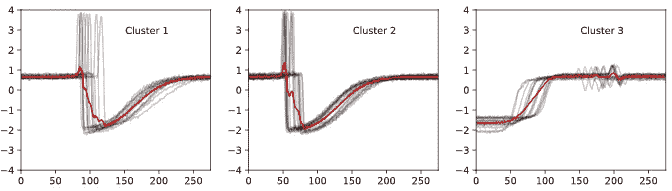
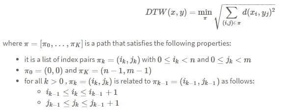
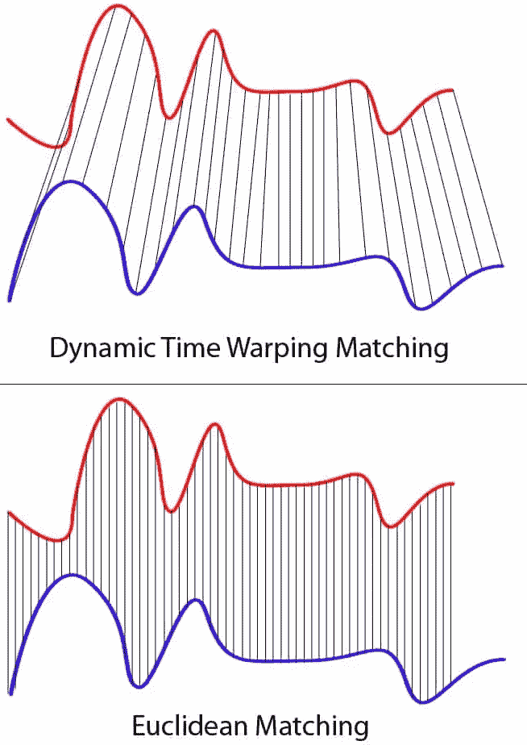
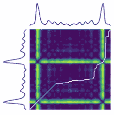
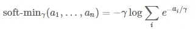
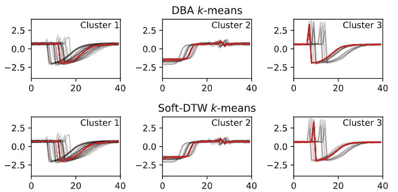

# 如何对时间序列数据应用 K 均值聚类

> 原文：<https://towardsdatascience.com/how-to-apply-k-means-clustering-to-time-series-data-28d04a8f7da3?source=collection_archive---------0----------------------->

## 使 k-means 算法适应时间序列的理论和代码


图片由 [Piqsels](https://www.piqsels.com/en/public-domain-photo-zzzsy) 提供

聚类是一种无监督的学习任务，其中算法将相似的数据点分组，而没有任何“基础事实”标签。数据点之间的相似性用距离度量来衡量，通常是[欧几里德距离](https://en.wikipedia.org/wiki/Euclidean_distance)。

将不同的时间序列聚类到相似的组中是一项具有挑战性的聚类任务，因为每个数据点都是有序的序列。

时间序列聚类最常见的方法是将时间序列展平到一个表中，每个时间索引(或序列的聚合)有一列，并直接应用标准的聚类算法，如 [k-means](https://scikit-learn.org/stable/modules/clustering.html#k-means) 。 *(K-means 是一种常见的聚类算法，通过将样本分成 K 组并最小化每个聚类中的平方和来构建数据聚类)。*

如下所示，这并不总是很好。图表中的每个子图都绘制了一个由具有欧几里德距离的 k 均值聚类生成的聚类。红色的簇形心没有捕捉到系列的形状。



[来源](https://tslearn.readthedocs.io/en/stable/user_guide/clustering.html) : tslearn 文档

直观上，标准聚类算法中使用的距离度量，如欧几里德距离，通常不适用于时间序列。更好的方法是**用一个比较时间序列的度量代替默认的距离度量，比如** [**动态时间扭曲**](https://en.wikipedia.org/wiki/Dynamic_time_warping) 。

在本文中，我将解释如何使用动态时间弯曲将 k 均值聚类调整到时间序列。我将提供来自`[tslearn](https://github.com/tslearn-team/tslearn)`包的简单代码示例。

# 时间序列的动态时间弯曲距离度量

但首先，为什么常见的[欧氏距离](https://en.wikipedia.org/wiki/Euclidean_distance)度量[不适合](http://alexminnaar.com/2014/04/16/Time-Series-Classification-and-Clustering-with-Python.html)时间序列？简而言之，它对时间偏移是不变的，忽略了数据的时间维度。如果两个时间序列高度相关，但其中一个移动了一个时间步长，欧几里德距离就会错误地将它们测量为相距较远。点击[此处](http://alexminnaar.com/2014/04/16/Time-Series-Classification-and-Clustering-with-Python.html)查看详细示例。

相反，最好使用动态时间弯曲(DTW)来比较序列。DTW 是一种测量在时间、速度或长度上不完全一致的两个时间序列之间的相似性的技术。

## DTW 解释道

给定系列 **X** =(x₀、…、xₙ)和系列 **Y** =(y₀、…、yₘ)，从 **X** 到 **Y** 的 DTW 距离被公式化为以下优化问题:



来源: [tslearn 文档](https://tslearn.readthedocs.io/en/stable/user_guide/dtw.html)

总结一下 DTW 方程: **DTW 计算为 X 中每个元素与其在 Y 中最近的点***之间的平方距离之和的平方根。*注意，DTW(X，Y) ≠ DTW(Y，X)。**

*让我们进一步分析一下。*

*DTW 将序列 **X** 中的每个元素与序列 **Y** 中的每个元素进行比较(n x m 比较)。比较起来， *d(xᵢ，yⱼ)，*不过是简单的减法 *xᵢ — yⱼ* 。*

*然后对于 **X** 中的每个 *xᵢ* ，DTW 选择 y 中最近的点进行距离计算。*

**

*上图:说明 DTW 如何将蓝色系列中的每个点与红色系列中最近的点进行匹配。下图:说明欧几里得距离度量如何匹配两个时间序列中的点。请注意，系列长度不同，与欧几里得匹配不同，DTW 能够将蓝色系列中的每个点与红色系列中的一个点进行比较。来源: [wikicommons](https://commons.wikimedia.org/wiki/File:Euclidean_vs_DTW.jpg)*

*这在 **X** 和 **Y** 之间创建了一条扭曲的“路径”,将 X 中的每个点与 Y 中最近的点对齐。该路径是时间序列的时间对齐，可最小化对齐序列之间的欧几里德距离。*

**

*两个时间序列(蓝色)之间的 DTW 路径(白线)的图像。热度图突出显示了距离值( *xᵢ — yⱼ)。* [*来源*](https://tslearn.readthedocs.io/en/stable/user_guide/dtw.html#dtw-softdtw) *: tslearn 文档**

*使用复杂度为 O(MN)的动态规划来计算动态时间弯曲。点击[此处](https://en.wikipedia.org/wiki/Dynamic_time_warping)或[此处](http://alexminnaar.com/2014/04/16/Time-Series-Classification-and-Clustering-with-Python.html)了解具体算法详情。*

*用 python 中的 DTW 很容易比较两个时间序列:*

```
***from** **tslearn.metrics** **import** dtw
dtw_score = dtw(x, y)*
```

## *DTW 的变体:软 DTW*

*[软 DTW](https://arxiv.org/abs/1703.01541) 是 DTW 的一个可微分变体，它用一个可微分的`soft-min`运算代替了不可微分的`min`运算:*

**

*[*来源*](https://tslearn.readthedocs.io/en/stable/user_guide/dtw.html#dtw-softdtw) *: tslearn 文档**

*根据该函数，软 DTW 依赖于一个超参数 *γ* 来控制结果度量的平滑。像 DTW 一样，可以使用动态规划在二次时间内计算软 DTW。*

*脚注:软 DTW 的主要优势源于它处处可微。这允许软 DTW 被用作神经网络损失函数，比较地面真实序列和预测序列。*

```
***from** **tslearn.metrics** **import** soft_dtw
soft_dtw_score = soft_dtw(x, y, gamma=.1)*
```

# *具有动态时间弯曲的 k-均值聚类*

*通过以下修改，k-means 聚类算法可以应用于具有动态时间弯曲的时间序列。*

1.  *动态时间弯曲(DTW)用于收集相似形状的时间序列。*
2.  *群集质心，或*重心*，是相对于 DTW 计算的。A *重心*是 DTW 空间中一组时间序列的平均序列。 [DTW 重心平均(DBA)](http://lig-membres.imag.fr/bisson/cours/M2INFO-AIW-ML/papers/PetitJean11.pdf) 算法最小化重心和聚类中序列之间的 DTW 距离的平方和。[软 DTW 算法](https://arxiv.org/abs/1703.01541)最小化重心和聚类中系列之间的软 DTW 距离的加权和。权重可以调整，但总和必须为 1。*

*结果，质心具有模拟集群成员形状的平均形状，而不管成员之间的时间偏移发生在哪里。*

**

*顶行:使用 DTW 的 K-均值聚类(DBA 算法)。底部一行:使用软 DTW 的 K-均值聚类。每一列显示了来自不同簇的系列和它们的质心，用红色绘制。[源码+代码](https://tslearn.readthedocs.io/en/stable/auto_examples/clustering/plot_kmeans.html#sphx-glr-auto-examples-clustering-plot-kmeans-py)。*

*使用`[tslearn](https://tslearn.readthedocs.io/en/stable/user_guide/clustering.html)` Python 包，用 k-means 和 DTW 简单聚类时间序列数据集:*

```
***from** **tslearn.clustering** **import** TimeSeriesKMeansmodel = TimeSeriesKMeans(n_clusters=3, metric="dtw", max_iter=10)
model.fit(data)*
```

*要使用软 DTW 代替 DTW，只需设置`metric="softdtw"`。*

*注意`[tslearn](https://tslearn.readthedocs.io/en/stable/gettingstarted.html#time-series-format)`期望一个单一的时间序列被格式化为二维数组。一组时间序列应该被格式化为一个形状为`(num_series, max_length, 1)`的三维数组。如果集合中的系列长度不等，则较短的系列将增加 NaN 值。tslearn 具有易于使用的[实用函数](https://tslearn.readthedocs.io/en/stable/gettingstarted.html#time-series-format)用于正确格式化数据，并且[易于与其他时间序列包和数据格式](https://tslearn.readthedocs.io/en/stable/integration_other_software.html)集成。*

# *最后一句话*

*我希望你喜欢读这篇文章。要了解时间序列机器学习，请查看我的其他文章:*

*[](https://link.medium.com/1nJUjkUg4bb) [## 如何对时间序列应用层次聚类

### 聚类是一种无监督的学习任务，其中算法将相似的数据点分组，而没有任何“基础事实”…

link.medium.com](https://link.medium.com/1nJUjkUg4bb) [](/a-brief-introduction-to-time-series-classification-algorithms-7b4284d31b97) [## 时间序列分类算法简介

### 专门为时间序列分类设计的专用算法

towardsdatascience.com](/a-brief-introduction-to-time-series-classification-algorithms-7b4284d31b97) [](https://medium.com/towards-artificial-intelligence/highly-comparative-time-series-analysis-a-paper-review-5b51d14a291c) [## 高度比较的时间序列分析——一篇论文综述

### 用于比较、聚类、分类和注释的时间序列特征提取分析

medium.com](https://medium.com/towards-artificial-intelligence/highly-comparative-time-series-analysis-a-paper-review-5b51d14a291c) 

# 参考

*   [通过数据块了解动态时间扭曲](https://databricks.com/blog/2019/04/30/understanding-dynamic-time-warping.html)
*   帕帕里佐斯，约翰和格拉瓦诺，路易斯，2015。 [k 形:高效准确的时间序列聚类](http://www1.cs.columbia.edu/~jopa/Papers/PaparrizosSIGMOD2015.pdf)
*   [时间序列分类和聚类](http://alexminnaar.com/2014/04/16/Time-Series-Classification-and-Clustering-with-Python.html)Alex Minnaar
*   ts 了解[集群](https://tslearn.readthedocs.io/en/stable/user_guide/clustering.html)的用户指南
*   [动态时间扭曲百科](https://en.wikipedia.org/wiki/Dynamic_time_warping)文章
*   [lumen ai 的时间序列聚合](http://www.lumenai.fr/blog/time-series-aggregation)

 [## 阅读亚历山德拉·阿米登(以及媒体上成千上万的其他作家)的每一个故事

### 作为一个媒体会员，你的会员费的一部分会给你阅读的作家，你可以完全接触到每一个故事…

alexandra-amidon.medium.com](https://alexandra-amidon.medium.com/membership)*