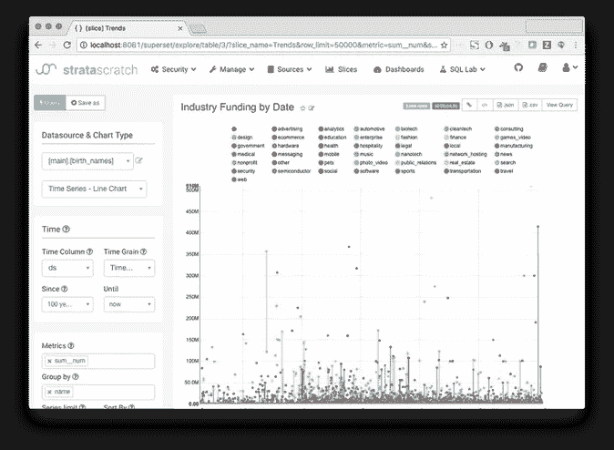
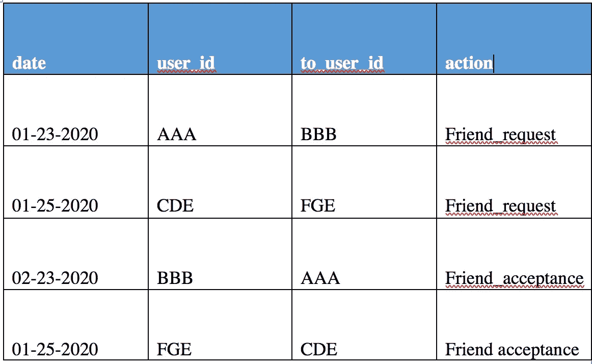
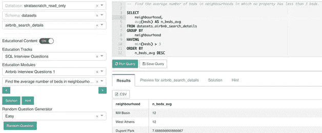

# 如何解决分析/数据科学职位的技术问题

> 原文：<https://towardsdatascience.com/how-to-approach-technical-questions-in-an-analytics-data-science-interview-1dc956eaebc0?source=collection_archive---------23----------------------->

## 我们将通过两个在分析/数据科学职位面试中被问到的真实例子来讲述如何处理技术问题。

我喜欢和我的读者交流，了解他们在技术面试时所关心的问题。他们经常充满焦虑，在准备的时候不知道从哪里开始。在本文中，我将通过两个真实的 SQL 示例来回答读者提出的最常见的问题，这两个示例说明了面试官在做出招聘决定时希望测试什么。



来源:stratascratch.com

# **读者最常见的问题:公司在技术面试中会问什么类型的技术问题，我该如何准备？**

## 技术技能——容易培养的技能

至于准备，你只需要练习。但更具体地说，编写 SQL 语法和任何其他技术语言的能力**绝对**需要成为你的第二天性。这要么需要多年的经验，要么需要数百道练习题，才能让你的技能达到行业标准。你可以在我最喜欢的一些平台上查看我的另一篇文章。我会做你能做的所有中级和困难的问题。

## 实用技能——很难培养的技能

一旦技术部分成为第二天性，真正的工作就开始了。任何面试的第二个重点是测试某人如何思考和分解一个问题。他们在测试某人如何处理问题并提出解决方案。

> 你可以集中精力学习如何最好地沟通，并用白板演示一个全面的方法来回答业务问题，并涵盖面试官的所有边缘案例。

根据我在技术访谈中的经验，他们的重点是测试对代码正在做什么的理解，你如何考虑各种场景/边缘情况，以及输出的含义是否与业务问题相关。

# 面试

所以让我们来谈谈在面试中你可能会遇到什么类型的 SQL 问题。与您可能在工作中编写的又长又复杂的查询相比，SQL 问题本身相当简单。在工作中，为了回答问题和构建可伸缩的数据产品，您可能要跨几十个表编写数百行(如果不是数千行的话)代码。但是在面试中，要么给你 1 或 2 个表，要求你创建一个包含不超过 10 行代码的连接或自连接的 SQL 查询。如果幸运的话，您会得到 SQL 代码并被要求调试它(提示:很明显，代码总是有问题)。

就您的技术技能而言，只要您知道如何编写连接并使用像 COALESCE 这样稍微高级的函数，您就没问题。让面试变得困难的是

*   想象一旦你写完代码，输出会是什么样子。代码几乎不在可执行的平台上。
*   开发查询，使其回答面试问题
*   传达所有边缘案例并在 SQL 查询中折叠边缘案例
*   传达解决方案将提供的业务权衡(例如，这个查询真正回答了什么，盲点是什么？)

有了这四个让面试变得困难的要点，让我们来看几个例子来说明这些要点。


来源:theladders.com

# **以下是技术面试中被问到的两个真实的 SQL 问题:**

## **1。真实面试写 SQL 查询的例子**

*给你一张表，其中包含用户好友请求、接受和日期。如何编写一个查询，让你的好友在一段时间内获得%的接受率？*



首先，您可能永远不会得到填充了数据的实际表格。所以你应该问面试官表格包含哪些列，表格中包含什么类型的数据。

这个查询很容易创建(提示:使用自连接将朋友请求与接受分开)。任何懂 SQL 的人都可以编写查询来计算一段时间内朋友接受的百分比。一个可行的 SQL 查询可能如下所示:

```
SELECT
 (CASE WHEN b.action = ‘Friend_acceptance’ THEN 1 ELSE 0 END) / (CASE  WHEN a.action = ‘Friend_request’ THEN 1 ELSE 0 END) as percentage_acceptance
FROM table a
LEFT JOIN (SELECT * FROM table WHERE action = ‘Friend_acceptance’) b ON a.user_id = b.to_user_id
 WHERE action = ‘Friend_request’
```

您是否看到这个查询没有解决许多边缘情况，甚至没有真正回答这个问题？此查询评估一生中朋友接受的百分比。但是面试官想让我评估几天、几周、几个月或者几年的百分比吗？此外，你如何处理几天后朋友的接纳？你认为接受的时间是多少？从技术上来说，任何时候一个朋友接受你的请求都应该计入百分比。但是从商业角度来说，如果朋友两年后接受了请求，会有什么好处呢？你正试图打造一款将人们联系在一起的产品，你应该努力尽快实现这一目标/

此外，我在构建问题时会问面试官的另一个问题是——你是从朋友发出请求的那一天开始计算接受度，还是从请求被接受的那一天开始计算？为什么或为什么不？

所有这些问题对于完整地回答这个问题非常重要。你的面试官将测试你是否能发现并理解你的解决方案中的这些差距。这里没有正确或错误的答案，但是您需要确定有多种方法来编写查询，并讨论选择之间的权衡。

## **2。理解统计和业务含义的真实面试示例:**

*如果你做了一个 AB 实验，发现由于在试点地区推出了一项新功能，朋友接受度提高了 2 倍(p < 0.05)，* ***你会将它部署到生产中，并向所有地区的所有用户推出吗？***

大多数人会说是，但在面试中，最明显的答案可能不是正确的。在这种情况下，正确的答案是——视情况而定。为什么要靠，靠什么？答案是，这取决于特性的行为方式和特性的效果。一切都是一个系统，所以如果你在一个系统中做了一个改变，它会影响到系统的另一部分。在本例中，如果实验部署在平台的登录页面，您可能会问它占用了什么空间。对其他功能有影响吗？

另一个问题可能是算法本身。算法是不是减少了好友请求的数量？因为分母是一个小数字，这会导致朋友接受度的增加吗？为什么或为什么不？

显然，作为一个不了解特性和平台复杂性的人，不可能对你的推荐有信心。但你应该能够识别这些问题，并与面试官一起讨论，这样他们就能理解你是如何思考和处理模糊问题的。



来源:[stratascratch.com](http://www.stratascratch.com)

# 结论

在准备 SQL 面试时，我给你的主要建议是理解为什么以及如何编写代码来解决特定的问题。

*   呈现的是什么数据，代码如何回答这个问题？
*   我的代码中有哪些空白？
*   我写代码的方式有什么利弊？
*   我需要哪些额外信息来确保我考虑的是整体情况？

> 准备好交流你为什么要写特定的代码行，你添加了什么逻辑来解决特定的边缘情况和场景，以及输出会产生什么。你的解释和代码本身一样重要(如果不是更重要的话)。

此外，在你制定解决方案时，一定要和面试官交流，尽可能让他们了解你的思考过程。

SQL 面试不仅是为了测试你的技术能力，也是为了测试你的思维能力。把注意力集中在面试中要用到的技能上，确保尽可能多地做练习题。