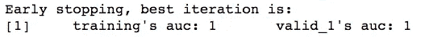
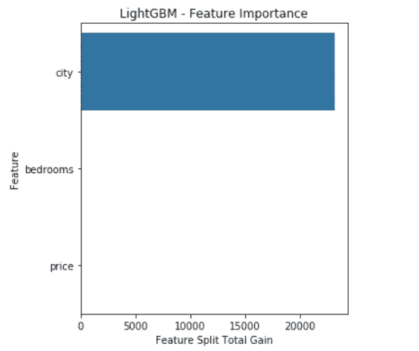
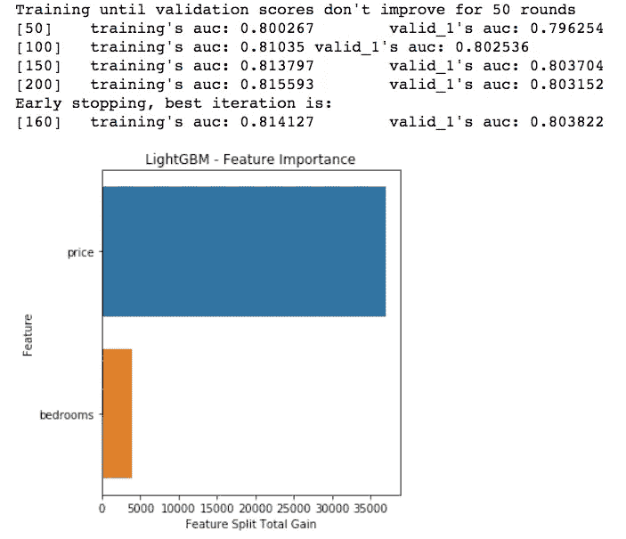

# 如何评估两个数据集之间的相似性？—对抗性验证

> 原文：<https://towardsdatascience.com/how-to-assess-similarity-between-two-datasets-adversarial-validation-246710eba387?source=collection_archive---------39----------------------->

## 验证方法

## 使用来自墨尔本和悉尼的 Airbnb 数据评估严重性并找出不同训练和测试集的原因。

[咖啡极客](https://unsplash.com/@coffeegeek?utm_source=medium&utm_medium=referral)在 [Unsplash](https://unsplash.com?utm_source=medium&utm_medium=referral) 上的照片

ML 模型依赖的一个主要假设是，训练集和验证集来自相同的群体并且同分布。尽管如果训练集和测试集具有完全不同的分布，但是这种假设从来都不是完全正确的，您的模型从训练数据中学到的任何东西都不适用于测试数据。

例如，让我们设想一个墨尔本和悉尼的房地产数据，列如下；“郊区名称”、“卧室数量”和“价格”。如果你的训练集只有墨尔本的房子，在特性列表中保留“郊区名称”列是个好主意吗？

假设模型将无法学习悉尼的“郊区名称”列中的信息。这显然是一个问题，这种类型的训练-测试不相似性问题的严重性可以使用对抗性验证来评估。

> 因为整个想法是理解训练和测试集是如何不同的，所以我们可以训练一个分类器来预测一个例子是属于训练集还是测试集。如果这两个数据集分布相同，则数据中不会有任何信号来区分它们，模型的预期精度将为 0.5-基本上是随机猜测。模型的分类能力量化了数据集之间的相似性。

此外，模型中特征的重要性使我们能够发现哪些变量实际上具有不同的分布，因为模型使用这些特征来区分示例。

## Airbnb —墨尔本和悉尼数据集示例

为了让这个概念变得明显，我们将使用 Airbnb 在墨尔本和悉尼的公开数据创建一个极端而简化的例子。([数据来源](http://insideairbnb.com/get-the-data.html))

我们有 2 个数据集，即`melb`和`sydney`，列为“城市”(指郊区)、“卧室”和“价格”。`melb`是我们的训练数据，而`sydney`是测试数据。

我们将跳过预处理步骤，从定义应用该方法的实际函数开始，但是完整的代码在这里[可用](https://github.com/anil-gurbuz/Adversarial-Validation/blob/master/adversarial_validation.py)。

函数的参数；

*   train:我们将使用`melb`作为我们的原始训练数据集，与其他数据集`sydney`相比,“城市”列中有完全不同的条目
*   测试:`Sydney`是原始的测试数据集。
*   列:包含在数据集中的要素列表，这些要素需要被考虑用于量化差异。
*   分类列:这是特定于 LightGBM 的，因为我们需要在训练期间指定它们——如果您想要应用不同的分类模型，这可能不是必需的。

我们首先为我们的训练和测试示例创建一组新的标签。我们创建了一个由 0 和 1 组成的数组，其中 0 是训练示例(`melb`)标签，1 是测试示例(`sydney`)标签。这些 0 和 1 将试图被我们的分类器预测。

## 预测性能

预测性能可以通过准确性、AUC 或任何类型的二元分类性能指标来衡量，在本例中我们将使用 AUC。 ***这是表示数据集相似程度的指标，因此如果它们显著不同，我们的模型应该能够区分这两个数据集，并最终得到接近 1 的 AUC 值。***

训练和验证集 AUC。

在本例中，我们最终获得了完美的分类性能，因为数据集之间的差异非常明显。下一点是调查哪些特征可能是造成这种差异的原因。

## 个体特征的重要性

*通过比较特性的重要性，我们可以在单个特性级别上评估现有差异的责任。*

看上面的图，整个信息增益仅通过使用“城市”来实现。换句话说，分类器能够通过在“城市”列上进行拆分来区分示例，因此这是对`melb`和`sydney`数据集具有不同分布的特征。

信息增益是一种快速评估特征对最终模型的贡献的方法，但它不直接表示对分类性能的贡献。它表示特征在模型中的主导地位，但要了解某个特征对最终预测性能的贡献程度，我们应遵循以下步骤。

该过程从逐个移除高信息增益特征开始，然后重新应用该方法来查看这些特征对分类性能的影响。这可以提供更可靠的结果，并让您评估特征对最终 AUC 的贡献，因此我们将删除“城市”并重新训练模型以观察 AUC 的变化。— *这个逻辑和很多特征选择技术没什么区别。唯一不同的是解释。对性能的贡献越大，意味着变量对原始训练数据和测试数据之间的差异的责任越大。*

如上所述，通过去除“城市”, AUC 降低到 0.80。我们还看到，AUC 仍然很高，而“价格”被视为造成数据集之间差异的另一个特征。

> 最后，需要注意的是，这不是一种特性选择技术。即使一个特性在训练和测试中可能有非常不同的分布，它仍然可以包含有价值的信息并帮助您的最终模型。在调试模型性能时，意识到这些差异和风险是有好处的。