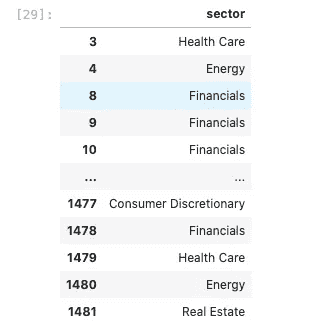
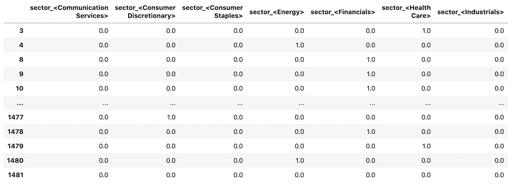
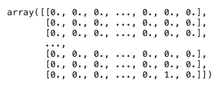
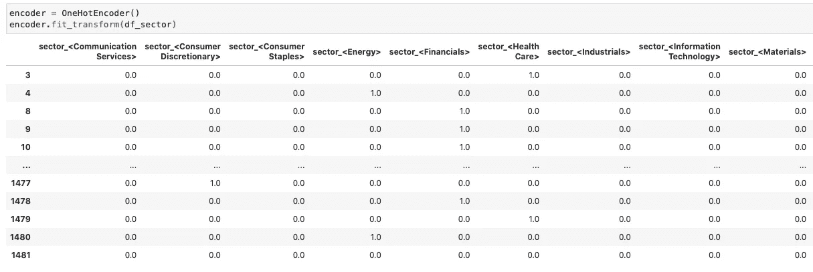

# 如何使用 Sklearn One Hot 编码器分配标签

> 原文：<https://towardsdatascience.com/how-to-assign-labels-with-sklearn-one-hot-encoder-e59a5f17df4f?source=collection_archive---------19----------------------->


[图片](https://stock.adobe.com/ca/images/abstract-cyberspace-digital-world-and-future-technology-speed-power-and-a-breakthrough-to-success-3d-illustration-of-clusters-of-information-with-a-binary-code-element/311368290)由 [Siarhei](https://stock.adobe.com/ca/contributor/207151695/siarhei?load_type=author&prev_url=detail) 拍摄

## 一个优雅的方式来改善 sklearn 一个热编码器，再也不用考虑新的列标签分配。

大多数机器学习算法不能处理现成的分类数据。在预测建模中使用分类变量之前，通常将标签编码器或一个热编码器应用于分类变量。

Python 中的 Sklearn 库是大多数机器学习从业者的必去之地。它提供了出色的通用功能，允许我们用一行代码执行复杂的操作。同时，它的一些功能过于笼统，可能难以使用。

# 一个热编码

一种热编码是将分类变量转换为 N 个二进制列的过程，其中 N 是原始列中唯一值的数量。例如，在我最近对新冠肺炎期间股价行为的研究中

[](/covid-19-rampage-on-the-stock-market-machine-learning-comes-to-explain-3332707954af) [## 新冠肺炎在股票市场上横冲直撞。机器学习来解释。

### 使用机器学习来识别新冠肺炎期间受打击最大的股票中的共同因素。

towardsdatascience.com](/covid-19-rampage-on-the-stock-market-machine-learning-comes-to-explain-3332707954af) 

我用**一个热门编码**来分解行业分类



转换成二进制列表示，如下所示:



# 履行

使用默认的 sklearn 包可以完成一个热转换:

```
sklearn.preprocessing.**OneHotEncoder**# df = some DataFrameencoder = OneHotEncoder()
encoder.fit_transform(df)
```

上述实现的代码输出如下所示:



它是正确的，但是它不提供标签，这使得很难知道新列背后的含义。没有这些知识，分析预测模型的输出将是不可能的。在[文档](https://scikit-learn.org/stable/modules/generated/sklearn.preprocessing.OneHotEncoder.html)中提供了一些关于标签分配的指导，但这仍然是一个挑战。因此，需要一种更好的解决方案。

# 自定义 One Hot 编码器

向 **One Hot Encoder** 输出添加标签同时保持“一行”实现的一种优雅方式是创建一个包装器类，该类在 **transform()** 操作期间“在盒子内部”分配标签。代码如下:

使用这个包装器，输出如下所示:



我现在将分解它的实现，并详细解释它是如何工作的。

# 初始化

```
from sklearn.preprocessing import OneHotEncoder as SklearnOneHotEncoderclass OneHotEncoder(SklearnOneHotEncoder):
    def __init__(self**,** **kwargs):
        super(OneHotEncoder**,** self).__init__(**kwargs)
        self.fit_flag = False
```

该类继承自 sk learn . preprocessing . onehotencoder，这意味着所有原始功能都被保留。我还添加了 **self.fit_flag** 属性来跟踪编码器是否合适。

# 合适的

```
def fit(self**,** X**,** **kwargs):
    out = super().fit(X)
    self.fit_flag = True
    return out
```

**fit()** 法本质上是原来的 **fit()** 法。我用的是**超级()。fit(X)** 从**sk learn . preprocessing . onehotencoder**中访问原始方法，然后在返回输出之前将 **self.fit_flag** 更新为 **True** 。

# 改变

```
def transform(self**,** X**,** **kwargs):
    sparse_matrix = super(OneHotEncoder**,** self).transform(X)
    new_columns = self.get_new_columns(X=X)
    d_out = pd.DataFrame(sparse_matrix.toarray()**,** columns=new_columns**,** index=X.index)
    return d_outdef get_new_columns(self**,** X):
    new_columns = []
    for i**,** column in enumerate(X.columns):
        j = **0** while j < len(self.categories_[i]):
            new_columns.append(f'{column}_<{self.categories_[i][j]}>')
            j += **1** return new_columns
```

Transform 方法更加复杂，因为这是我实现标签分配的地方。首先创建 **sparse_matrix** 变量，存储原始 **transform()** 方法的输出。然后我调用我编写的 **get_new_column()** 方法来访问 OneHotEncoder 的内部属性以检索类名。

get_new_columns ()方法本质上是一个两级嵌套迭代器。在第一级，我迭代原始数据帧中的列。在第二层，我迭代 self.categories_[i]中的值，其中 **self.categories_** 属于原始的 OneHotEncoder，而“ **i** ”是被转换的表中的列的序号索引。在每一步，我都将列名附加到一个列表中，一旦迭代完成，这个列表就会返回。最终， **new_columns** 变量的长度为相当于 **sparse_matrix** 转换为数组**后的水平维度。**

在最后一步中，我使用内置功能将 **sparse_matrix** 转换为一个数组，然后使用由 **get_new_columns()** 方法返回的列名创建一个 DataFrame。

# 拟合变换

```
def fit_transform(self**,** X**,** **kwargs):
    self.fit(X)
    return self.transform(X)
```

最后一个方法包括顺序执行我修改过的 **fit()** 和 **transform()** 方法，返回一个带有指定列名的热数据帧。


# 结论

我希望这个教程对你有用。请随意抓取上面的代码片段，并在您自己的应用程序中使用它。

编码快乐！