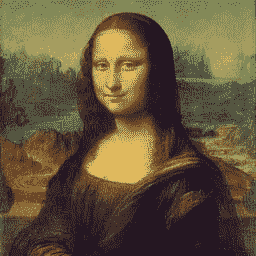
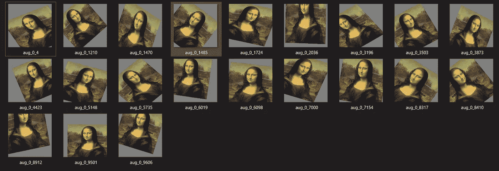
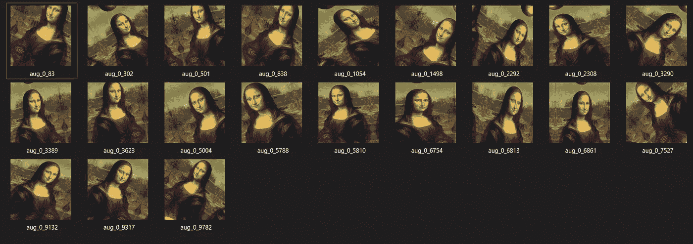
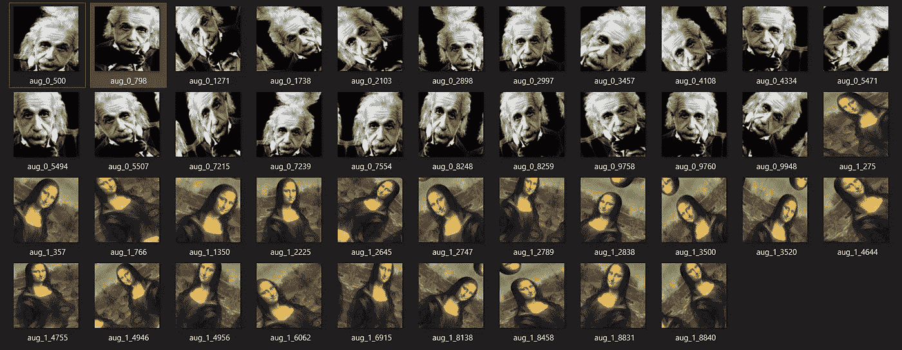

# 如何使用 Keras 扩充数据

> 原文：<https://towardsdatascience.com/how-to-augmentate-data-using-keras-38d84bd1c80c?source=collection_archive---------18----------------------->

## 使用 Python 和 Keras 进行数据扩充


本·斯特恩在 [Unsplash](https://unsplash.com/s/photos/puzzle?utm_source=unsplash&utm_medium=referral&utm_content=creditCopyText) 上的照片

如果您想要扩充数据或增加训练或验证数据的数量，数据扩充非常有用。例如，如果你有 2000 张图片，你想得到其中的 5000 或 10000 张，那么这将非常有用。

但如果你有 5 或 10 张图像，不要指望从数据增强中获得 2000 或 10000 张图像，仍然能够从深度学习模型中获得不错的结果。因为深度学习模型会高度偏向这 5 张或者 10 张图片。

> 如果你的图片少于 100 张，我建议你使用传统的机器学习

## 使用单幅图像演示数据扩充过程。



test.jpg——图片来自 [Pixabay](https://pixabay.com/?utm_source=link-attribution&utm_medium=referral&utm_campaign=image&utm_content=74050) 的[维基图片](https://pixabay.com/users/WikiImages-1897/?utm_source=link-attribution&utm_medium=referral&utm_campaign=image&utm_content=74050)

```
from keras.preprocessing.image import ImageDataGenerator
from skimage import iodatagen = ImageDataGenerator(        
            rotation_range=45,
            width_shift_range=0.2,  
            height_shift_range=0.2,    
            shear_range=0.2,        
            zoom_range=0.2,        
            horizontal_flip=True,         
            fill_mode='constant', cval=125)x = io.imread('test_image/test.jpg')x = x.reshape((1, ) + x.shape)
i = 0
for batch in datagen.flow(x, batch_size=16,
                          save_to_dir='augmented',
                          save_prefix='aug',
                          save_format='png'):    
  i += 1    
  if i > 20:        
     break
```

我们数据扩充需要的库是 Keras 的`ImageDataGenerator`。为了读取单个图像，我还从`skimage`导入了`io`。首先，我们需要为数据生成器创建一个实例。方法是创建一个名为`datagen`的变量(你可以给它取任何你喜欢的名字)，并用内部参数使它等于`ImageDataGenerator`。

`rotation_range=45`表示我想在 0 到 45 度之间随机旋转我的图像。`width_shift_range=0.2`和`height_shift_range=0.2`表示将图像沿 X 轴移动 20%，沿 Y 轴移动 20%。`shear_range=0.2`表示将图像剪切 20%。`zoom_range`表示放大缩小 20%。对于镜面反射，我已经给出了`horizontal_flip=True`。`ImageDataGenerator`最重要的论点是`fill_mode`。当你的图像移动 20%时，会有一些剩余空间。您可以选择几种方法来填充该区域，

*   **常量**——用黑色填充该区域。您可以通过给`cval`一个值来改变颜色
*   **最近的**——用最近的像素填充该区域并拉伸它。
*   **反射**——用图像的反射填充该区域。
*   **环绕** —通过环绕图像来填充该区域。

使用后，`io.read`我们可以读取图像。在读取图像后，您可以看到图像是`(256, 256, 3)`，在对其进行整形后，您可以看到图像是`(1, 256, 256, 3)`，因为当我们进入卷积层时，输入大小通常首先是图像的数量。其次是尺寸，最后是配色方案。

我们应用实例`datagen`的方式是使用`datagen.flow`。这里我们使用`.flow` ，因为只有一个图像。`batch_size=16`表示正在生成或放大 16 幅图像，并将图像保存在`augmented`文件夹中。由于`datagen`是在一个有限循环中，我们需要使用一个`for-loop`并在它到达 20 张图像时中断它。(类似于`epochs`)

现在我们知道了它是如何工作的，让我们看看不同`fill_mode`的例子，



cval=125 的常数


最近的



显示

## 使用多幅图像演示数据扩充过程。


test1.jpg——图片由[提供。欢迎并感谢您的访问！来自](https://pixabay.com/users/janeb13-725943/?utm_source=link-attribution&utm_medium=referral&utm_campaign=image&utm_content=1144965) [Pixabay](https://pixabay.com/?utm_source=link-attribution&utm_medium=referral&utm_campaign=image&utm_content=1144965) 的ツ


test2.jpg——图片来自 [Pixabay](https://pixabay.com/?utm_source=link-attribution&utm_medium=referral&utm_campaign=image&utm_content=74050) 的[维基图片](https://pixabay.com/users/WikiImages-1897/?utm_source=link-attribution&utm_medium=referral&utm_campaign=image&utm_content=74050)

```
from keras.preprocessing.image import ImageDataGenerator
from skimage import iodatagen = ImageDataGenerator(        
            rotation_range=45,
            width_shift_range=0.2,  
            height_shift_range=0.2,    
            shear_range=0.2,        
            zoom_range=0.2,        
            horizontal_flip=True,         
            fill_mode='reflect')import numpy as np
import os
from PIL import Imageimage_directory = 'test_folder/'
SIZE = 128
dataset = []my_images = os.listdir(image_directory)
for i, image_name in enumerate(my_images):    
   if (image_name.split('.')[1] == 'jpg'):        
       image = io.imread(image_directory + image_name)        
       image = Image.fromarray(image, 'RGB')        
       image = image.resize((SIZE,SIZE)) 
       dataset.append(np.array(image))x = np.array(dataset)i = 0
for batch in datagen.flow(x, batch_size=16,
                          save_to_dir='augmented',
                          save_prefix='aug',
                          save_format='png'):    
  i += 1    
  if i > 20:        
     break
```

我必须定义`SIZE = 128`,因为不管你的图像大小是多少，我们都可以把它调整到一个普通的大小。为了读取所有的图像，我将使用`for-loop`来读取图像。对于每幅图像，我们必须在`.jpg`时将其分割。最后，调整大小的图像将被添加到数组中。我们可以像上面所做的那样做其余的事情。现在我们有了`test1.jpg`和`test2.jpg`。



输出

## 使用多类来演示数据扩充过程。

多类是你在大多数课程中所期望的。现在，我已经将每张图片按照它们的类别进行了分类，因为这就是数据在数据集中的表现方式。使用`datagen.flow_from_directory`将分别读取子文件夹中的图像。举个例子，如果你有猫，狗，车等类。然后将所有这些图像放入相应的文件夹中。

```
i = 0
for batch in datagen.flow_from_directory(directory='test_folder/',
                                          batch_size=16,
                                          target_size=(256, 256),   
                                          color_mode="rgb",     
                                          save_to_dir='augmented',   
                                          save_prefix='aug',    
                                          save_format='png'):    
   i += 1    
   if i > 31:        
     break
```

## 结论

文章到此为止。我希望你能学到新的东西。谢谢，注意安全！

## 资源

[](https://www.youtube.com/channel/UC34rW-HtPJulxr5wp2Xa04w) [## Sreeni 为显微镜专家开发的 Python

### 本频道将带您了解学习 Python 编码的整个过程；从基础到高级…

www.youtube.com](https://www.youtube.com/channel/UC34rW-HtPJulxr5wp2Xa04w)