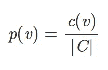
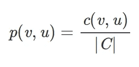
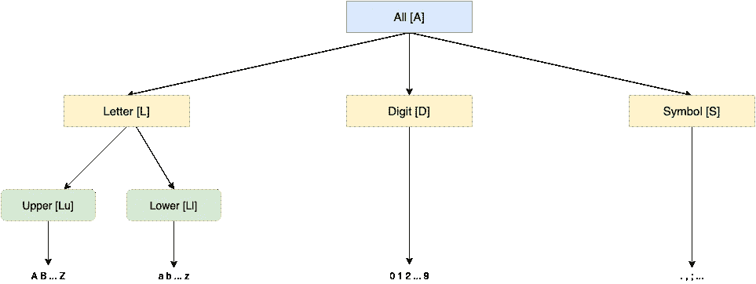

# 如何自动检测数据集中的错误

> 原文：<https://towardsdatascience.com/how-to-auto-detect-format-errors-in-a-dataset-6609a9e9aacc?source=collection_archive---------19----------------------->

## 引入泛化树和泛化语言来自动检测结构化数据集中的损坏值。

乔治·贝克在[的照片](https://www.pexels.com/search/mistake/)

给定一个大型的结构化数据集，比如 excel 电子表格或 CSV 文件，有没有办法**避免检测不可避免的错误这种令人疲惫不堪、影响工作效率的琐事**？

在这个故事中，我们应用[黄志鹏](https://scholar.google.com/citations?user=WdEqRxEAAAAJ&hl=en&oi=sra)和叶烨他在 [*“自动检测:表中数据驱动的错误检测”*](https://dl.acm.org/doi/abs/10.1145/3183713.3196889?casa_token=SAUDUyrv2lwAAAAA:Aao6vxthGuNfNSEJyUYX_CyjUyrn0LM6fXrRsUvpGfB8GiQBBSJ6ZFJS-Q2_SQ3u3dPDzGwTJmYSTw) 中提出的思想，自动检测表格数据中的格式错误。

> [学习率](https://mailchi.mp/d2d2d4a109b5/learning-rate-newsletter)是为那些对 AI 和 MLOps 的世界感到好奇的人准备的时事通讯。你会在每周五收到我关于最新人工智能新闻和文章的更新和想法。在这里订阅！

# 问题陈述

损坏的数据或丢失的值会对分析管道产生严重的负面影响。垃圾输入垃圾输出这个短语简洁地表达了这个问题。**然而，由于这些错误的异质性，检测这些错误可能是一个非常具有挑战性的问题；简单的打字错误、格式错误、与陈旧数据的集成、拒绝约束等。**

为了解决这个问题，数据科学家设计了许多技术，大致分为两类:*单列*方法，用于检测单个列中发生的错误；以及*多列*方法，用于识别诸如拒绝约束之类的违规。

> 错误检测技术大致分为两类:单列和多列方法。

在这个故事中，我们关注一个单列方法，并讨论如何自动检测格式错误。事实证明，格式错误不仅会影响下游分析结果的质量，还会彻底破坏自动化管道。假设有一个数据列，其格式为`03/11/2020`，并且有一个使用格式`02.11.2020`的值。最好的情况是提取日期的自动化作业会抛出异常。最坏的结果将会产生难以调试的逻辑错误。

让我们来讨论这个问题的定义。给定一个结构化数据集，我们构造一个包含其列的集合。**我们想要的是检测单个列中存在低概率的值。**在上述示例中，如果大部分日期符合第一种格式，我们希望为遵循不同日期模式的值分配低概率。

**天真的解决方案**

我们生活在大数据时代，因此，一个解决方案是收集大量的表格数据(如维基百科表格、公开可用的 excel 表格等)。)并提取一个集合`C`，它包含这个集合中存在的所有列。

我们希望这些列在很大程度上是干净的，因此，它们可以为两个值`v, u`的列内共现提供良好的统计测量。**直觉上，如果两个值** `**v,u**` **在列中频繁共存，那么它们应该是兼容的。**

为此，我们可以使用一种叫做*逐点互信息* (PMI) *的统计度量。首先，我们计算在列中遇到值`v`的概率。*

在该公式中，`c(v)`表示值为`v`的列数，而`|C|`是列数。相应地，我们计算两个值`v,u`同时出现的概率。

现在，`c(u,v)`表示包含`u`和`v`的列数。我们现在准备计算值`v,u`的 PMI。

结果范围从负无穷大到正无穷大。因此，我们通过除以`-log p(v,u)`得到标准化的 PMI (NPMI)来标准化它。**注意，如果** `**v**` **和** `**u**` **是偶然同现** `**p(u,v)**` **等于** `**p(v)p(u)**` **，则比值为** `**1**` **和 PMI** `**0**` **为无相关性。另一方面，如果这些值频繁地同时出现并且正相关，则 PMI 大于**`**0**`**；否则，PMI 取值小于** `**0**` **。**

让我们看一个具体的例子。让`v = 1`和`u = 2`。假设我们的集合`C`中有`100M`列，我们有`c(v) = 1M`、`c(u) = 2M`、`c(u,v) = 500K`。我们可以计算出`p(v) = 0.01`、`p(u) = 0.02`和`p(u,v) = 0.005`。有了这些值，我们可以计算出 NPMI 等于`0.6`，它大于`0`。**我们可以直观地说，价值观** `**u**` **和** `**v**` **高度契合。如果这两个值中的一个是很少发生的错误，你可以试试会发生什么。**

# 泛化树和泛化语言

我们有一个有希望的解决方案，但这是一个幼稚的方案。例如，假设我们有两个日期:`03.17.2019`和`03.18.2019`。这些看起来非常适合出现在同一列中，因为它们符合相同的日期模式。尽管如此，没有什么能保证我们会在同一列中看到这些精确的值，不管我们的列集`|C|`有多大。因此，我们的方法会将它们标记为导致许多假阳性的潜在错误。稀疏是这里的一个问题。

解决方案是将值概括成模式；我们可以将它们归纳为类似于`\d{2}.\d{2}.\d{4}`的模式，而不是让值为`03.17.2019`和`03.18.2019`。现在，只要一个具有这种日期格式的列就可以给出我们想要的信息。我们可以使用*泛化树*和*泛化语言*来实现这种类型的泛化。下图给出了一个泛化树的示例。

泛化树

从那棵树，我们可以实例化许多泛化语言。我们可以认为泛化语言是一个将任意输入映射到泛化树任意层的函数。为了更好地理解它，让我们构建两个由图中的树派生的一般化语言。

第一种语言会将`03.17.2019`转化为`\A{2}.\A{2}.\A{4}`。看来我们已经解决了我们的问题，对吗？嗯，不完全是；让我们看看另一种语言的定义。

使用第二种语言`03.17.2019`变成了`\D{2}\S\D{2}\S\D{4}`。但是`03-17-2019`呢？泛化语言 2 将其转换成完全相同的模式。我们无法发现这里的问题。正如我们所见，选择正确的语言至关重要。

# 权衡取舍

上一节的例子展示了为每种情况选择正确语言的重要性。请注意，我们可以选择多种语言，然后找到一种巧妙的方法来汇总结果。

无论如何，有两个问题我们需要考虑:

*   *敏感性与鲁棒性*:正如我们所看到的，**一种语言越一般化，它就越能以牺牲敏感性为代价对抗稀疏性。**例如，如果一种语言将所有东西都推广到根级别(All [A])，我们可以缓解稀疏性问题，但这样我们将无法捕捉任何格式差异。在另一个极端，如果我们将所有东西都推广到叶子级别，我们最终会得到一个高度敏感的语言，由于数据稀疏，它会产生许多误报。
*   *内存问题*:很明显，不同的泛化语言消耗不同的内存量。**一种语言越概括，它需要的内存空间就越少。**另一方面，一种将一切都推广到叶子级别的语言需要数百千兆字节的内存。

因此，这个问题实际上是一个约束优化难题:**给定一个泛化树，选择特定数量的泛化语言，这些语言可以捕获不同类型的格式错误，服从一个精度度量和内存预算。**

# 结论

在这个故事中，我们提出了一个由和何提出的想法，并把它用于自动检测结构化数据集中的格式错误。我们展示了如何使用逐点互信息解决这个问题，并给出了泛化树和泛化语言的定义。

最后，我们得出结论，我们的问题归结为约束优化的挑战:给定一个泛化树，选择特定数量的泛化语言，这些语言可以捕获不同类型的格式错误，服从精度度量和内存预算。这个问题的建议解决方案可以在下面的故事中找到。

 [## 如何使用泛化语言自动检测数据集中的错误

### 使用远程监督和汇总预测结果生成验证数据，就像大海捞针一样。

towardsdatascience.com](/how-to-auto-detect-errors-in-a-dataset-part-ii-683b114865be) 

> **我叫 Dimitris Poulopoulos，是希腊比雷埃夫斯大学***[**BigDataStack**](https://bigdatastack.eu/)***的机器学习研究员和博士(c)。我曾为欧洲委员会、欧盟统计局、国际货币基金组织、欧洲中央银行、经合组织和宜家等主要客户设计和实施人工智能和软件解决方案。如果你有兴趣阅读更多关于机器学习、深度学习和数据科学的帖子，请在 twitter 上关注我的********[**LinkedIn**](https://www.linkedin.com/in/dpoulopoulos/)**或**[**@ james2pl**](https://twitter.com/james2pl)**。********