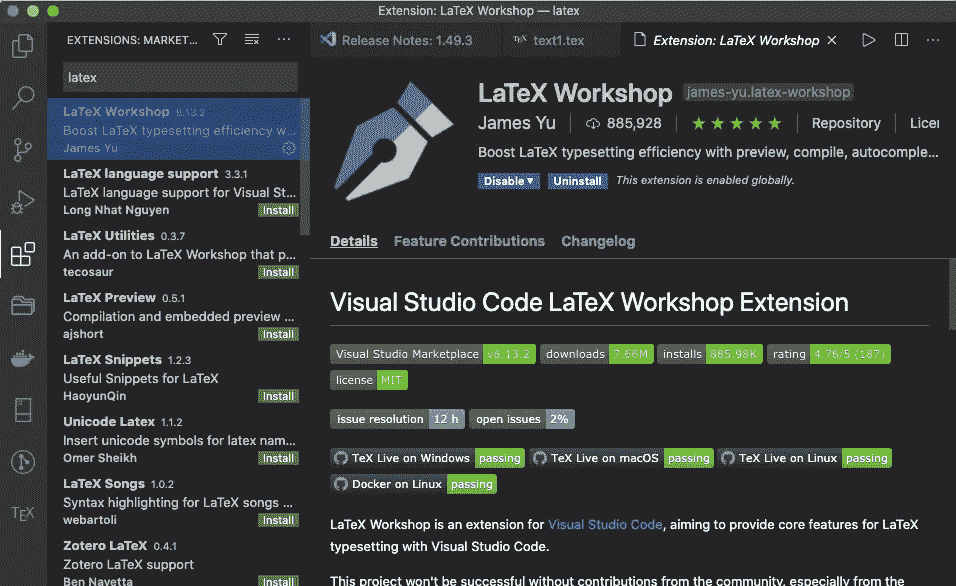
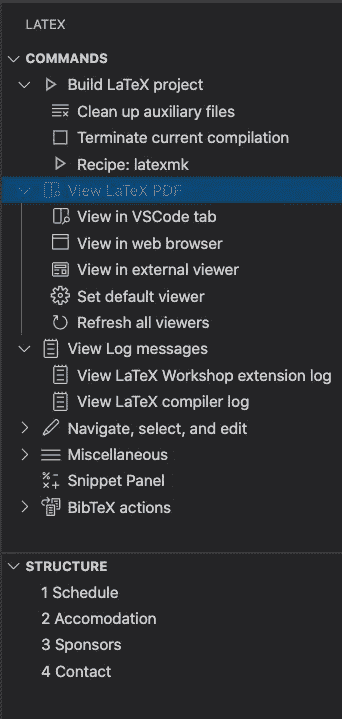
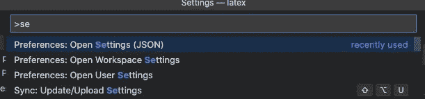
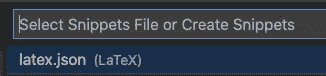
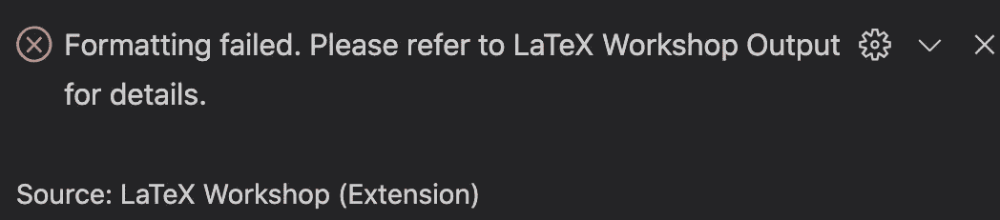
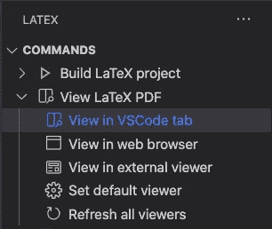
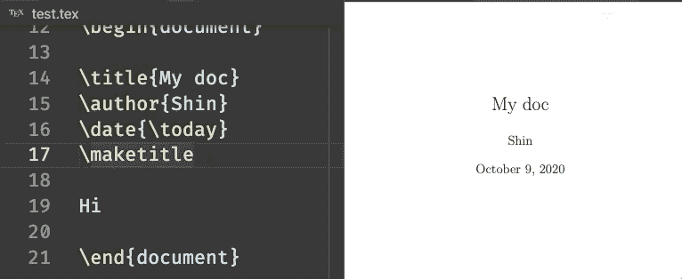

# 使用 LaTeX 时如何自动更新 PDF

> 原文：<https://towardsdatascience.com/how-to-auto-update-pdf-when-working-on-latex-ad9eeabdb7a1?source=collection_archive---------8----------------------->

## 使用 latexmk 和 VSCode 自动更新 PDF 的指南


[由 www.freepik.com 创作的照片](https://www.freepik.com/photos/background')

```
**Table of Contents**[**Introduction**](#de65)1\. [Installing LaTeX](#0781)
2\. [Creating PDF from a terminal using latexmk](#a506)
3\. [Installing LaTeX Workshop Extension to VS Code](#41d5)
4\. [Create your own snippets](#3a71)
5\. [Testing the snippet](#fe49)
6\. [LaTeX Workshop error](#97e9)
7\. [Automatically update PDF when you save](#0730)[**Conclusion**](#fab4)
```

# 介绍

我偶尔会使用 LaTeX。我用 [Typora](https://typora.io/) 写文章、报告、笔记等等。但是我不能完全控制 markdown 的布局。所以我重新开始使用乳胶。我想分享一下我学到的东西。本文展示了如何用 VS 代码设置 LaTeX，以便在保存 TeX 文件时自动更新 PDF。

# 安装 LaTeX

这次我装了`mactex-no-gui`。

Mac:

```
# macOS MacTex Install
$ brew install --cask mactex-no-gui# Updating the packages
$ sudo tlmgr update --self && sudo tlmgr update --all
```

安装相当快，但需要很长时间来更新。
您可能需要重启终端并检查是否正常工作:

```
$ latex --version
$ latexmk --version
$ platex --version
```

如果它不起作用，那么你需要添加一个路径到你的`~/.zshrc`或者`~/.bash_profile`:

```
export PATH="/Library/TeX/texbin/:$PATH"
```

再次检查:

```
$ latex --version
pdfTeX 3.14159265-2.6-1.40.21 (TeX Live 2020)
kpathsea version 6.3.2
...
$ latexmk --version
Latexmk, John Collins, 29 September 2020\. Version 4.70b
...
$ platex --version
e-pTeX 3.14159265-p3.8.3-191112-2.6 (utf8.euc) (TeX Live 2020)
kpathsea version 6.3.2
...
```

[Linux 安装](https://medium.com/@rcpassos/writing-latex-documents-in-visual-studio-code-with-latex-workshop-d9af6a6b2815):

```
# Arch Linux Family
sudo pacman -S texlive-most
# For Ubuntu, you might need a ppa:
sudo add-apt-repository ppa:jonathonf/texlive
sudo apt update && sudo apt install texlive-full
# Fedora
sudo dnf install texlive-scheme-full
```

对于 Windows 和其他 Linux 操作系统，请参见本页。

[](/three-ways-to-create-dockernized-latex-environment-2534163ee0c4) [## 创建 Dockernized LaTeX 环境的三种方法

### LeTeX + Docker + VSCode 远程容器入门

towardsdatascience.com](/three-ways-to-create-dockernized-latex-environment-2534163ee0c4) 

# 使用 latexmk 从终端创建 PDF

您通常需要多次运行 LaTeX。`[latexmk](https://mg.readthedocs.io/latexmk.html)`帮助您避免这种麻烦。Latexmk 是一个 [Perl](http://www.perl.org/) 脚本，你只需要运行一次，它就会为你做所有的事情。

latexmk 的使用方法如下:

```
$ latexmk -silent text.tex
```

当你保存一个 tex 文件时，它会自动更新 PDF 文件。我们可以通过修改您主目录中的`.latexmkrc`文件来改进它。

```
$ touch ~/.latexmkrc
```

并添加以下内容。

```
#!/usr/bin/env perl# LaTeX
$latex = 'latex -synctex=1 -halt-on-error -file-line-error %O %S';
$max_repeat = 5;# BibTeX
$bibtex = 'pbibtex %O %S';
$biber = 'biber --bblencoding=utf8 -u -U --output_safechars %O %S';# index
$makeindex = 'mendex %O -o %D %S';# DVI / PDF
$dvipdf = 'dvipdfmx %O -o %D %S';
$pdf_mode = 3;# preview
$pvc_view_file_via_temporary = 0;
if ($^O eq 'linux') {
    $dvi_previewer = "xdg-open %S";
    $pdf_previewer = "xdg-open %S";
} elsif ($^O eq 'darwin') {
    $dvi_previewer = "open %S";
    $pdf_previewer = "open %S";
} else {
    $dvi_previewer = "start %S";
    $pdf_previewer = "start %S";
}# clean up
$clean_full_ext = "%R.synctex.gz"
```

*   我们使用`platex`和`dvipdfmx`将一个 tex 文件转换成 PDF。
*   `latexmk -pv text.tex`构建后会显示一个 PDF。
*   `latexmk -pvc text.tex`保存 tex 文件时会更新 PDF 文件。(您需要单击 PDF 文件来查看更新。)
*   您可以通过`ctrl+C`停止查看更新的文件。

# 将 LaTeX Workshop 扩展安装到 VS 代码

现在让我们转到 VS 代码。我们可以在 LaTeX 编辑器中使用 VS 代码。



VSCode 扩展 LaTeX 研讨会。作者图片

安装 LaTeX Workshop 后，您会在左侧边栏的末尾看到 TeX 图标。

LaTeX Workshop 扩展在保存时创建一个 PDF，您可以在 VS 代码或浏览器中查看 PDF。它具有格式化、智能感知完成、语法高亮、代码片段和快捷方式等功能。



LaTeX Workshop 菜单项。作者图片

您可以通过单击查看 LaTeX PDF 预览 PDF。

按 CMD/CTRL+SHIFT+P 打开 settings.json。



VS 代码 CMD/CTRL+SHIFT+P .图片作者

在 settings.json 中添加以下内容:

```
{
// your other settings
// ...
// ...
// ---------- Language ----------
    "[tex]": {
        // Enable intellisence/quick suggestions
        "editor.suggest.snippetsPreventQuickSuggestions": false,
        // Indentation size
        "editor.tabSize": 2
    },
    "[latex]": {
        // Enable intellisence/quick suggestions
        "editor.suggest.snippetsPreventQuickSuggestions": false,
        // Indentation size
        "editor.tabSize": 2
    },
    "[bibtex]": {
        // Indentation size
        "editor.tabSize": 2
    },
    // ---------- LaTeX Workshop ----------
    //  Enable command and environment completion for used package
    "latex-workshop.intellisense.package.enabled": true,
    // target file when deleting generated file
    // Add "* .synctex.gz" to default value
    "latex-workshop.latex.clean.fileTypes": [
        "*.aux",
        "*.bbl",
        "*.blg",
        "*.idx",
        "*.ind",
        "*.lof",
        "*.lot",
        "*.out",
        "*.toc",
        "*.acn",
        "*.acr",
        "*.alg",
        "*.glg",
        "*.glo",
        "*.gls",
        "*.ist",
        "*.fls",
        "*.log",
        "*.fdb_latexmk",
        "*.snm",
        "*.nav",
        "*.dvi",
        "*.synctex.gz"
    ],
    // dump generated files to "out" directory
    "latex-workshop.latex.outDir": "out",
    // Build recipe
    "latex-workshop.latex.recipes": [
        {
            "name": "latexmk",
            "tools": [
                "latexmk"
            ]
        },
    ],
    // Parts used in the build recipe
    "latex-workshop.latex.tools": [
        {
            "name": "latexmk",
            "command": "latexmk",
            "args": [
                "-silent",
                "-outdir=%OUTDIR%",
                "%DOC%"
            ],
        },
    ],
}
```

默认情况下，智能/快速建议不会在代码段内触发。要启用它们设置:

```
"editor.suggest.snippetsPreventQuickSuggestions": false,
```

# 创建您自己的片段

LaTeX Workshop 提供了许多[片段和快捷方式](https://github.com/James-Yu/LaTeX-Workshop/wiki/Snippets)。您也可以添加自己的代码片段。单击 VS 代码工具栏左下方的 cog，并选择 User Snippets。


用户片段。作者图片

并从菜单中选择 latex.json (LaTeX)。



选择 latex.json. Image by Author

让我们创建一个基本模板。以下是您可以添加的示例片段:

```
{
 "report": {
  "prefix": "report",
  "body": [
   "\\documentclass[${1:a4paper,11pt}]{${2:jsarticle}}",
   "",
   "",
   "% Math",
   "\\usepackage{amsmath,amsfonts}",
   "\\usepackage{bm}",
   "% image",
   "\\usepackage[dvipdfmx]{graphicx}",
   "\\usepackage[english]{babel}",
   "$3",
   "",
   "\\begin{document}",
   "",
   "\\title{$4}",
   "\\author{$5}",
   "\\date{${6:\\today}}",
   "\\maketitle",
   "",
   "",
   "$0",
   "",
   "",
   "\\end{document}"
  ],
  "description": "LaTeX Sample Template"
 }
}
```

您可以添加多个代码片段:

```
{
 "report": {
  "prefix": "report",
  "body": [
  ...
  "description": "LaTeX Sample Template"
 },
 "note": {
  "prefix": "note",
  "body": [
  ...
  "description": "Note format"
 },
  "exam": {
  "prefix": "exam",
  "body": [
  ...
  "description": "Exam format"
 }
}
```

# 测试代码片段

我发现 VScode 的 tabstop 不能与 Vim/vscodevim 一起使用，所以如果你正在使用它，你需要禁用它。


实际操作中的一个片段。作者图片

# LaTeX 车间错误

当您保存一个 tex 文档时，如果您有以下错误，您需要安装一些 Perl 包。



LaTeX Workshop 错误。作者图片

首先安装最新的 Perl:

```
# For Mac
$ perl -v
This is perl 5, version 18, subversion 2 (v5.18.2) built for darwin-thread-multi-2level
(with 2 registered patches, see perl -V for more detail)Copyright 1987-2013, Larry Wall
...
$ brew install perl
```

打开一个新标签或重启您的终端并检查安装的版本:

```
$ perl -vThis is perl 5, version 32, subversion 0 (v5.32.0) built for darwin-thread-multi-2levelCopyright 1987-2020, Larry Wall
```

您必须安装以下 Perl 包:

```
$ cpancpan[1]>install Log::Log4perl
Running install for module 'Log::Log4perl'
...
cpan[2]>install Log::Dispatch::File
Running install for module 'Log::Dispatch::File'
...
cpan[3]>install YAML::Tiny
Running install for module 'YAML::Tiny'
...
cpan[4]>install File::HomeDir
Running install for module 'File::HomeDir'
...
cpan[5]>install Unicode::GCString
Running install for module 'Unicode::GCString'
...
```

# 保存时自动更新 PDF

您可以通过单击 LaTeX Workshop 菜单中的“在 VSCode 中查看”或“在 web 浏览器中查看”来查看 PDF。

当您更新并保存 tex 文件时，它将自动更新 PDF 文件。



乳胶菜单。图片作者。



当您保存 tex 文件时，PDF 将被更新。图片作者。

# 结论

MacTeX 是一个巨大的文件，但是使用 macTeX-no-gui 和 VS 代码允许我们在保存一个 tex 文件时进行更新。

现在您知道了如何使用`latexmk`从终端创建 PDF。如果您喜欢用 GUI 将 LaTeX 转换成 PDF，LaTeX Workshop 是一个很好的工具。您可以在 VSCode 中创建自己的 LaTeX 代码片段。

我希望您发现这很有用，并且希望这将有助于您在编写 LaTeX 文档时的生产力。

# 参考

*   [VSCode で最高の LaTeX 環境を作る (Japanese)](https://qiita.com/Gandats/items/d7718f12d71e688f3573)
*   [https://medium . com/@ rcpassos/writing-latex-documents-in-visual-studio-code-with-latex-workshop-d 9 af 6a 6b 2815](https://medium.com/@rcpassos/writing-latex-documents-in-visual-studio-code-with-latex-workshop-d9af6a6b2815)
*   [https://github.com/James-Yu/LaTeX-Workshop/wiki/Snippets](https://github.com/James-Yu/LaTeX-Workshop/wiki/Snippets)
*   [https://tex . stack exchange . com/questions/445521/latex ident-cant-locate-log-log 4 perl-pm-in-Inc-you-may-need-to-install-the-l](https://tex.stackexchange.com/questions/445521/latexindent-cant-locate-log-log4perl-pm-in-inc-you-may-need-to-install-the-l)
*   [乳胶食谱](http://latex-cookbook.net/cookbook/examples/)
*   [latexmk 手动](http://ftp.jaist.ac.jp/pub/CTAN/support/latexmk/latexmk.pdf)

**通过** [**成为**](https://blog.codewithshin.com/membership) **会员，获得媒体上所有故事的访问权限。**


[https://blog.codewithshin.com/subscribe](https://blog.codewithshin.com/subscribe)