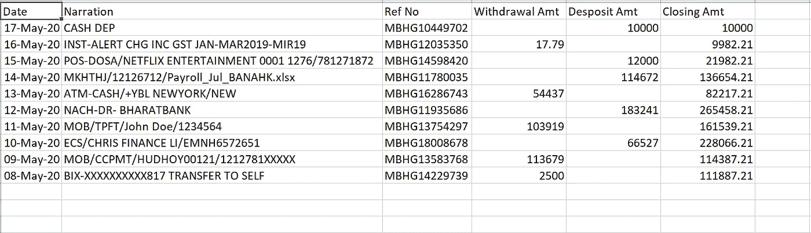

# 如何自动接收电子邮件中的 Excel 文件-提高您的工作效率

> 原文：<https://towardsdatascience.com/how-to-automate-excels-received-on-email-increase-your-productivity-3d2f50ddc958?source=collection_archive---------19----------------------->

## 从电子邮件下载文件并按照我们的要求进行处理的分步指南

我们每天都会收到大量的电子邮件；有些是垃圾邮件，有些是促销邮件，有些很重要，有些非常重要(比如我的故事通知)。管理相同的内容是一个繁琐的过程。让我们把日常工作外包给电脑来减轻我们的负担。

假设多家银行通过电子邮件向我们发送每日交易摘要，我们需要在一个 excel 中整理这些摘要以执行现金流分析。现在，我们有很多这样的用例，比如来自多个供应商的发票、来自多个员工的 MIS(管理信息系统)、工作邀请电子邮件、多个新闻文章等等。

由 [Webaroo](https://unsplash.com/@webaroo?utm_source=medium&utm_medium=referral) 在 [Unsplash](https://unsplash.com?utm_source=medium&utm_medium=referral) 上拍摄的照片

外包这项活动不仅可以减轻我们的工作，还可以通过降低人工出错率来提高我们的生产率。我们将使用强大的 ETL 工具 Pentaho Data Integration (Kettle)来实现这种自动化。我们不必编写一行代码来执行这种自动化。是-没有代码！

如果你没有在你的系统中安装 PDI，那么我会建议你仔细阅读下面的分步指南。

 [## Pentaho 数据集成安装指南-简单而强大的 ETL 工具。

### 使用简单的图形用户界面构建数据管道，无需编写一行代码。

medium.com](https://medium.com/ai-in-plain-english/pentaho-data-integration-installation-guide-easy-yet-powerful-etl-tool-80930cff46c6) 

# 用户故事——让我们定义我们的用例

如果你一直在跟踪所有的故事，那么我观察到一个标准的模式，比如用简单的英语定义故事，编写测试用例，然后一步一步的过程。

*   我想从我的 Gmail 下载银行对账单 CSV 文件。
*   我想把收到的信息整理成一个文件。

# 输入数据

理解输入数据和细微差别是一个很好的实践。这有助于我们编写广义逻辑。

这些是从 Bank-1 和 Bank-2 接收的虚拟交易数据。我们总是可以摆弄真实的数据集。

银行 1 交易数据

Bank - 2 交易数据

正如您所观察到的，这两个库都遵循预定义的结构，唯一的区别是头的命名约定。我们可以在数据管道流中进行同样的管理。

> 请注意，在现实世界中，您不会看到结构相同的场景。然而，我们可以使用元数据注入插件来处理如此复杂的结构。

# 测试案例

让我们为这个管道定义我们的测试用例。

*   检查输出文件格式。
*   在输出文件中交叉验证两个供应商的报表中的几个行项目。

# 步骤 1:项目设置

理想情况下，建立项目的基本框架是一个很好的实践。正如我在之前的故事中提到的。我更喜欢把我所有的项目存放在一个名为 **Work** 的文件夹里。

1.  **输入-** 这是我们下载报表的地方。
2.  **输出** -存储我们的输出文件
3.  这是我们配置和下载电子邮件文件的地方。PDI 工作档案。
4.  **Process-Bank-1-file . ktr**&**Process-Bank-2-file . ktr**——这些是我们将在其中处理下载的 CSV 文件的转换文件。

项目文件夹结构

如果你有任何困难理解上述步骤或勺子(桌面应用程序)，然后要求你通过下面的链接。

 [## Pentaho 数据集成(Kettle)及其组件入门。

### 了解勺子、平底锅、厨房等关键部件将使我们对 PDI 工具有更好的了解

medium.com](https://medium.com/ai-in-plain-english/getting-started-with-pentaho-data-integration-kettle-and-its-components-ef1e71101323) 

# 步骤 2: **设置应用程序密码**

假设我们在 Gmail 账户中收到了银行对账单。这可以是任何帐户，我们可以阅读电子邮件，只要我们有相同的[开放认证(OAuth)](https://docs.servicenow.com/bundle/orlando-servicenow-platform/page/administer/notification/concept/c_OAuthEmailAuthentication.html) 细节。

我们需要设置一个应用程序密码，通过没有双重认证的应用程序读取 Gmail。我们需要遵循谷歌提供的[指南](https://support.google.com/accounts/answer/185833?hl=en)。下面是截图指南。我们需要在您的个人资料图标中点击“管理您的 Google 帐户”。

点击安全标签，然后点击应用程序密码

在选择应用程序选项中选择“邮件”,然后选择设备其他(自定义名称)

您将收到一个弹出窗口，要求输入应用程序密码。复制并存储在安全的地方

> 请注意，我们不能使用我们的 Gmail 密码通过 PDI 或任何其他应用程序来验证或访问电子邮件。我们将不得不创建一个相同的应用程序密码。

# 第三步:让我们阅读 Gmail 并下载文件

一旦设置了应用程序密码，我们就可以从 Gmail 下载文件并对其进行分析。下面是我们需要观察的步骤。

*   **拖动步骤/插件:**在 PDI main.kjb 作业文件中，我们需要搜索‘开始’，‘获取邮件(pop 3/IMAP)’，‘转换’和‘成功’步骤。

主作业流程

*   **编辑“获取邮件”步骤属性**:我们需要双击“获取邮件(POP3/IMAP)”步骤并编辑属性。下面是我们需要编辑的属性。

1.  我们需要使用 POP3 或 IMAP 来读取和获取文件。你可以通过下面的[链接](https://developers.google.com/gmail/imap/imap-smtp)了解更多相同的内容。我们需要将步骤名称重命名为“download_bank_statements”。
2.  在**源主机**里，放上 imap.gmail.com。我们需要选中**使用 SSL** 复选框
3.  我们需要使用**端口**993；这是特定于 IMAP 和 SSL 的。您可以参考第 1 点链接来了解各种端口。
4.  填写你的**用户名**和 app **密码**(不要用你的 Gmail 密码；就不行了)。请注意，medium.blog@gmail.com 是一个虚拟地址。
5.  将**目标目录**定义为输入路径。确保**获取邮件附件**和不同的文件夹被选中。
6.  在**设置**选项卡中，我们需要更改**检索**以获取所有消息选项。这是因为我们可能每天都会收到相同的命名约定文件。或者，我们还可以执行一些活动，比如将电子邮件移动到其他目录，比如“已处理”或删除电子邮件等。
7.  在**过滤器**选项卡中，我们需要使用**接收日期**过滤器添加一个过滤器。同样，我在这里硬编码了日期。但是，我们可以很容易地使用系统日期变量。我会写一个单独的博客解释 PDI 的变数。我们也可以去掉这个过滤器；这将获取所有的电子邮件

常规选项卡属性

设置选项卡属性

过滤器选项卡属性

带有电子邮件的收件箱截图示例

既然我们已经配置了电子邮件下载流程。让我们核对一下这两个文件。

# 第四步:整理信息

整理多个工作簿中的信息有多种方法。我们可以创造一个广义的流动；它迎合了多种类型的结构或者创建了一个简单的 case 转换。我们将使用后者。

如果你想推广多工作簿处理，那么我会推荐你阅读下面的指南。

 [## 如何自动化多个 Excel 工作簿并执行分析

### 应用这个循序渐进的指南来解决问题，使用神奇的元数据注入 PDI。

towardsdatascience.com](/how-to-automate-multiple-excel-workbooks-and-perform-analysis-13e8aa5a2042) 

Process-Bank1-Files.ktr 和 Process-Bank2-Files.ktr 转换是相同的，唯一的区别在于文件名的变化。

打开 Process-Bank1-Files.ktr，拖动“文本文件输入”和“Microsoft Excel Writer”。

1.  在**文本文件中输入**，我们将把名称改为 input。
2.  在**文件**页签中，浏览到‘D:\ Work \ automate mail \ Input \ Bank-1-transaction . CSV’；假设银行遵守相同的命名惯例。
3.  在**内容**页签中，将**分隔符**改为“，”，**格式**改为 mixed。
4.  在**字段**选项卡中，点击**获取字段**按钮，并将名称列更改为列 1、列 2、列 3..如下面的邮件所示。

文件选项卡属性

字段选项卡属性

在“Microsoft Excel writer”插件和**文件&工作表标签**中，添加输出文件的文件路径(D:\ Work \ automatemulelexcel \ Output \ consolidated statement)，在**扩展名**字段中将扩展名更改为**xlsx【Excel 2007 及以上】**，如果输出文件存在字段，则在**中选择**使用现有文件写入**，并选择**写入现有工作表****

在“Microsoft Excel writer”插件和**内容选项卡**中，选择**写入行**时将**中的现有单元格下移**，勾选**在工作表末尾开始写入(追加行)**，勾选**省略标题**字段，点击**获取字段**按钮。

文件和工作表标签属性

内容选项卡属性

现在，我们需要复制相同的转换，只需将输入文件名更改为 D:\ Work \ automate mail \ Input \ Bank-2-transaction . CSV

我们需要在输出文件夹中创建一个空的 excel (xlsx)文件，并将其命名为 ConsolidatedStatement.xlsx，标题如下。这里的想法是创建一个模板并定期覆盖它。

就这样，让我们看看它是否工作。

# 步骤 5:连接、执行作业和测试

在 Main.kjb 文件中，我们需要通过顺序浏览来连接作业文件中的两个转换。

我们所有的努力都会在这一步得到理想的实现；在那里我们执行并看到输出。让我们看看我们创建的管道是否按照我们的预期工作。

成功

在这里，我们可以执行前面定义的测试用例，并根据我们的需求分析文件。

**结论**

上面的数据管道有一些细微的差别，可以调整，也可以推广到多种结构和文件。因为我是根据我的便利来挑选用例的，这可能是也可能不是真实的情况。但是，您可以以此为平台进行构建。我们可以使用 PDI 执行许多类似的活动。接下来，我们将以如何使用 PDI 发送电子邮件通知为例。

欢迎在评论区提问。

# 下一篇文章再见。快乐的 ETL

如果你喜欢类似的内容，那么我会推荐你使用下面的链接订阅。

 [## WryteEx -开发、数据工程、项目管理等

### 我写的博客有数据工程、金融、Python、Python Django、项目管理、Web 开发等等……

wryteex.com](https://wryteex.com/)