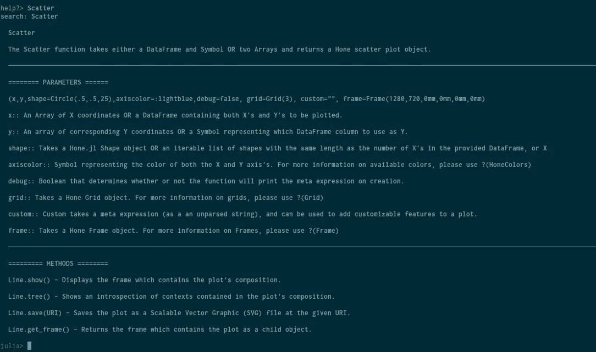
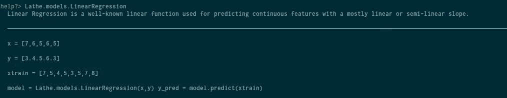
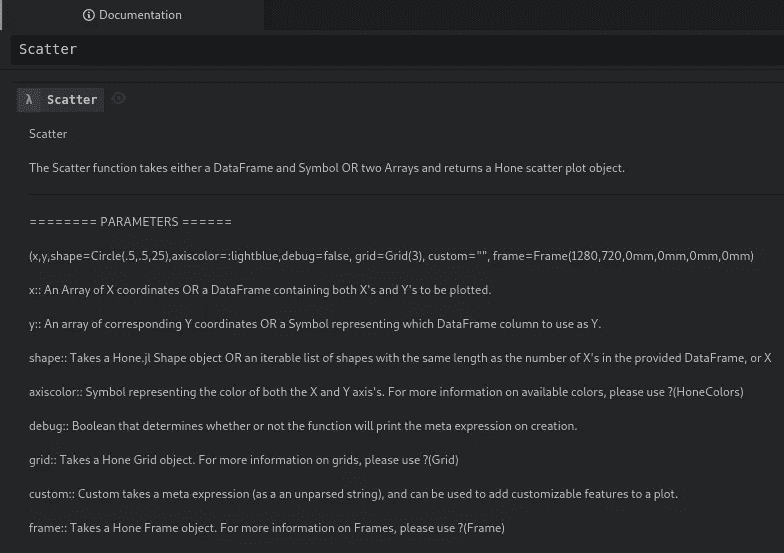
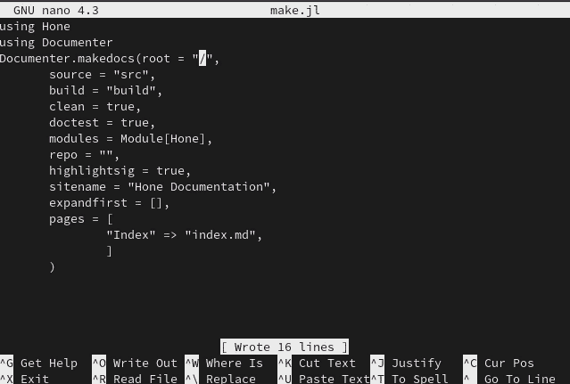
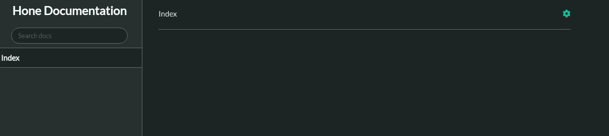
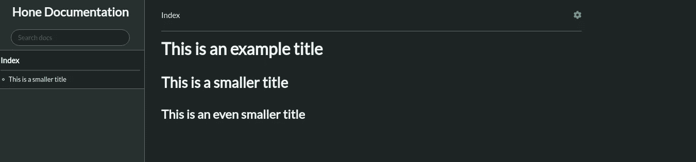
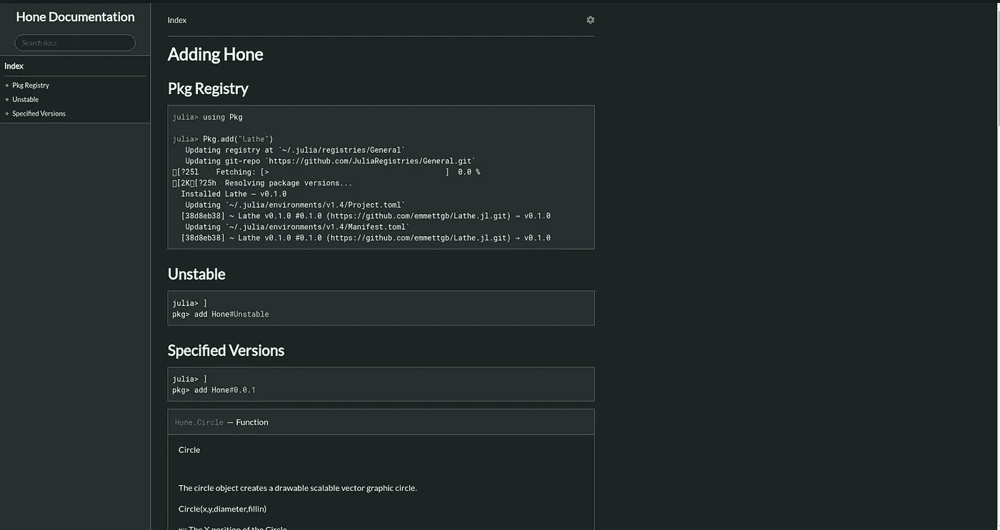
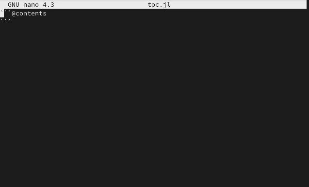
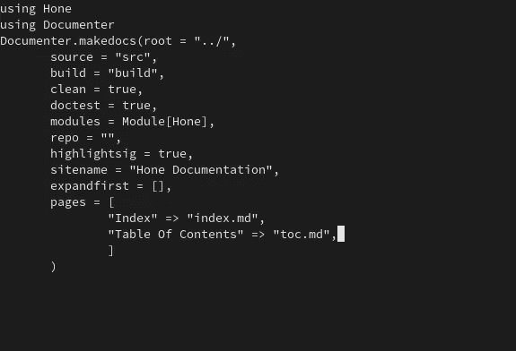
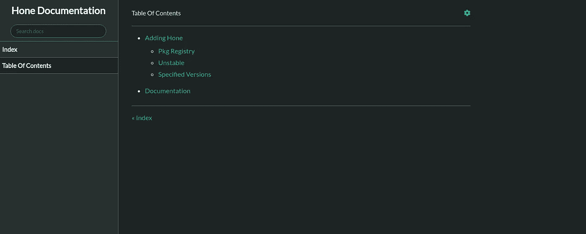

# 如何用 Documenter.jl 自动化 Julia 文档

> 原文：<https://towardsdatascience.com/how-to-automate-julia-documentation-with-documenter-jl-21a44d4a188f?source=collection_archive---------32----------------------->

## 没有文档，软件是没有用的，所以用 Documenter.jl 把文档的痛苦去掉吧


不管喜欢还是讨厌，文档创建在任何软件的创建中都是相当关键的一步。您可以构建人类已知的最伟大的模块，但是没有文档，没有人会知道如何使用它。当涉及到编程时，创建文档常常是事后的想法。制作模块和应用程序既费时又困难，还会让人非常沮丧。因为一般来说，编程通常是一个非常棘手的过程，并且可能比预期的要长得多，所以文档通常是编程过程中非常冗长、乏味的一部分。

对 Julia 开发者来说幸运的是，有 Documenter.jl. Documenter.jl 是一个模块，可以用来从代码中提取 Julia 文档字符串，并将它们编译成元信息、markdown 和 HTML。Documenter 不仅能够自动创建文档网站，而且还具有一些功能，可用于轻松地将文档推入存储库，以自动完成在 web 上加速文档的整个过程。

# Julia 文档

像大多数其他语言一样，Julia 以文档字符串为特色，文档字符串记录了实际软件本身内部的代码。然而，与大多数其他语言不同，Julia 有一种非常酷的方式来研究这种文档，这使得使用模块变得轻而易举。首先，Julia 包含了一个帮助函数？()，它可以用在语言中的任何模块、类型、宏或函数上。



这本身就非常有帮助，如果你的模块有一个文档图，比如 Lathe，那么你就不需要去网站查看 Julia 语言的文档。



最重要的是，如果您碰巧使用 Juno 在中开发 Julia，那么您就可以利用出色的文档窗格。使用 documentation 窗格，您可以在文本编辑器中将 Julia 模块文档预编译到一个漂亮的 GUI 中，然后查看所有包的文档。



要在 Julia 中记录一个函数，只需在函数上方添加一个 docstring 即可。或者，您也可以使用@doc 宏来记录一些东西。

```
@doc"""
This is my docstring!\n
I like pizza.
"""
function thisisdocumented()
    continueend
```

# 设置您的文件系统

为了用 Documenter.jl 创建文档，我们首先需要设置一些目录供模块使用。我们将首先创建一个根目录来存储我们的文档。这通常是在 Julia 包的/doc 目录中完成的，但是，重要的是要记住，Documenter 使用的是您的全局 Julia 包，而不是您的本地包。因此记住这一点，您不一定需要将这些文件放入存储库的位置。但是，这有一个条件，因为为了构建文档，您必须有一个源目录。

```
cd Projects
mkdir HoneDox
cd HoneDox
```

现在我们在一个空的目录中，我们需要为 Documenter 创建一个基本的文件结构。在此过程中，我想创建的第一个文件是“index.md”。如果没有 Index markdown 文件，Documenter 将无法创建文档，因此该文件非常重要，并且不会自动生成。

```
touch index.md
```

接下来，我们将创建一个文件。您可以将它放在一个名为 Doc 的新目录中，或者放在几乎任何地方。

```
mkdir doccd doc
nano make.jl
```

在这个文件中，我们首先要做的是导入文档管理器。

```
using Documenter
```

接下来，我们想要导入我们想要为其制作文档的模块。对于这个例子，我将使用 Hone.jl。

```
using Hone
```

如果您想要文档化的包没有导出您想要文档化的函数，那么您也必须添加作为该模块的子模块的任何模块。当使用 auto-doc 时，这将使您更容易将不同模块的文档分开。我不会这样做，因为 Hone 的所有功能都包含在内，并且不需要使用任何附加模块就可以导出。

接下来，我们需要从文档管理器中调用 makedocs()方法。这个函数需要很多参数，所以我将逐一介绍:

```
root - Root will determine where the file-system root is for this project. This is equivalent to the top of the repository in Github, and most of the time is going to be "./"source - Source is the directory of your source files from the root directory.build - Build is the directory where you want Documenter to put your new HTML site from the root directory.clean - This is a boolean that will determine whether or not Documenter is going to clean the build after finishing.doctest - Doc test is another boolean that will determine whether or not Documenter will let you know of any problems with your module's docstrings, e.g. undocumented functions.modules - These are the modules that we imported before, they will be put into a list here for Documenter to process.repo - Repo will determine where your " edit on github" link will go. We will be ignoring this for now.sitename - Just a name for your site, this will appear in the title of your HTML document, as well as the upper left-hand corner of the default style documentation site.expandfirst - This parameter will take a page and expand it in the left side context menu. I usually leave this blank, as your current page will always be expanded.pages - This will be a mapped dictionary of all your documentation files (e.g. index.md) and their corresponding titles. The titles will fill into the menu (on the left with the default style.)
```

我的文件看起来是这样的:



现在我们需要用 ctrl + x 关闭 nano，我们可以继续创建我们的源目录。

```
mkdir src
```

然后，我们将把源文件复制到该目录中。接下来，我们将把 index.md 移动到 src 目录中。之后，我们可以继续运行 make.jl:

```
mv index.md src
cd doc
julia make.jl
```

过一会儿，一个新目录将出现在我们的根文件夹中，名为“build”如果我们打开那个文件夹，我们会看到一个绝对的文件巨兽。现在唯一对我们重要的是 index.html。如果您现在在浏览器中打开该文件，您可能会看到类似以下内容:



> 厉害！

# 创建文档

现在我们终于可以开始处理 index.md 文件了。这个文件当然只是简单的 Github markdown，所以我们可以添加一个带有标签的标题。

```
# This is an example title
## This is a smaller title
### This is an even smaller title
```

现在，如果我们再次运行 make.jl 文件并刷新页面，



请注意，右边的菜单现在已被填充。现在我们可以开始讨论一些宏，我们可以用它们来自动填充文档。宏的使用方式总是与 Github Markdown 中的代码使用方式相似，其中有三种方式:

> `

打开，还有三个要关闭。

首先我们要看一下@meta 宏。这个宏用于界定需要由 Julia 运行的代码。这主要用于设置当前模块，如下例所示:

```
```[@meta](http://twitter.com/meta)
CurrentModule = ourmodule
DocTestSetup = quote
    using ourmodule
end
```
```

下一个重要的宏是@doc 宏，它将完成您可能会想到的功能。@doc 宏后面是您想要记录的函数、模块、宏或类型。

```
```@doc
examplemodule.function
```
```

还有一个没有参数的上下文宏，它将为您的文档创建一个目录。

```
```[@contents](http://twitter.com/contents)
```
```

我要演示的最后一个重要的宏是@autodoc 宏，它是这个列表中最酷的一个。@autodoc 采用单个参数。这个参数只是一个为其创建文档的模块列表。对于这个例子，我将使用@contents 和@autodoc。首先，我将把@autodoc 添加到 Hone 模块的 index.md 中。

# 页

对于我的索引页面组合，我决定将所有文档存储在一个页面中。这是因为从 0.0.3 版本开始，Hone 中确实没有太多需要处理的事情，所以不需要太多的组织。如果你想查看更复杂的文档，你可以在这里查看车床的文档:

 [## 索引

### 车床可以使用 Pkg 添加。julia >使用 Pkg julia> Pkg.add("Lathe ")解析包版本...正在更新…

车床. ai](http://lathe.ai/doc) 

这是我的最后一份文件:

```
# Adding Hone
## Pkg Registry
```[@repl](http://twitter.com/repl)
using Pkg
Pkg.add("Lathe")
```
## Unstable
```[@example](http://twitter.com/example)
julia> ]
pkg> add Hone#Unstable
```
## Specified Versions```[@example](http://twitter.com/example)
julia> ]
pkg> add Hone#0.0.1
``````[@autodocs](http://twitter.com/autodocs)
Modules = [Hone]
```
```

再次运行 make.jl 并刷新页面后:



> 很酷，对吧？

回到我们的源目录，让我们添加另一个 markdown 文件。对于这个例子，由于我的模块的文档已经非常完整，我将制作另一个页面来展示 contents 宏。

```
nano toc.md
```



(忽略我不小心把它命名为 toc.jl 的事实，我做了一个 oopsie。)

现在，我们只需将该文件添加到 make.jl 文件中的 pages dictionary 参数中。



然后再次运行 make 文件:

```
julia make.jl
```

现在，我们将在左侧的导航栏上提供多个页面。



# 结论

Documenter.jl 就不用说了，牛逼！我喜欢不用手动创建文档！创建网站以提供带有适当搜索的文档可能需要几个小时甚至几天，并且需要更多的工作来维护。拥有一个可以自动完成这项工作的包，甚至可以把你的新构建推送到一个存储库，这绝对是一个巨大的祝福！