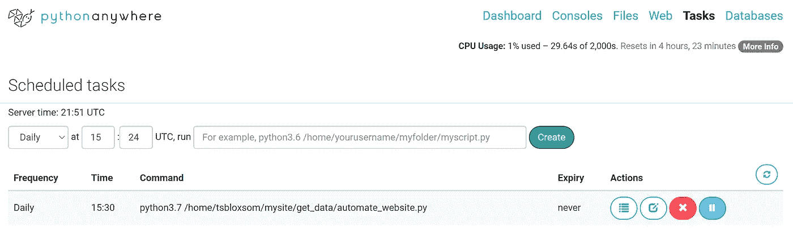

# 如何:使用 Python 将实时数据自动化到您的网站

> 原文：<https://towardsdatascience.com/how-to-automate-live-data-to-your-website-with-python-f22b76699674?source=collection_archive---------12----------------------->


图片来自 Unsplash

本教程将有助于那些拥有一个在云服务上托管实时数据的网站，但不确定如何完全自动更新实时数据以使网站变得无障碍的人。例如:我托管了一个[网站](http://tsbloxsom.pythonanywhere.com/)，它在一个交互式仪表板中显示了德克萨斯州 COVID 县的病例数，但我每天都必须运行一个脚本来从德克萨斯州 COVID 网站下载 excel 文件，清理数据，更新用于创建仪表板的 pandas 数据框，将更新的数据上传到我正在使用的云服务，并重新加载我的网站。这很烦人，所以我使用本教程中的步骤来展示我的实时数据网站现在是如何完全自动化的。

我将只介绍如何使用云服务 pythonanywhere 来实现这一点，但是这些步骤可以转移到其他云服务。另一件要注意的事情是，我是网站建设和维护的新手，所以请随时纠正我或给我建设性的反馈。我将假设你对 python、selenium for web scraping、bash 命令有基本的了解，并且你有自己的网站。让我们来看一下将实时数据自动化到您的网站的步骤:

1.  使用云服务的 selenium 网络抓取
2.  将. part 文件中的下载数据转换为。xlsx 文件
3.  使用操作系统 python 包重新加载您的网站
4.  安排 python 脚本在 pythonanywhere 中每天运行

我将不会浏览我将要展示的一些代码，因为我使用了上一篇教程中的许多相同的代码，这些代码是关于如何使用 python 创建和自动化交互式仪表盘的。我们开始吧！

1.  **使用云服务使用 selenium 进行网页抓取**

所以在你选择的云服务中(我的是 pythonanywhere)，打开一个 python3.7 控制台。我将展示代码块，但所有的代码可以合并成一个脚本，这就是我所做的。此外，代码中的所有文件路径都必须更改为您自己的路径，代码才能正常工作。

```
from pyvirtualdisplay import Display
from selenium import webdriver
import time
from selenium.webdriver.chrome.options import Optionswith Display():
    # we can now start Firefox and it will run inside the virtual display
    browser = webdriver.Firefox()# these options allow selenium to download files
    options = Options()
    options.add_experimental_option("browser.download.folderList",2)
    options.add_experimental_option("browser.download.manager.showWhenStarting", False)
    options.add_experimental_option("browser.helperApps.neverAsk.saveToDisk", "application/octet-stream,application/vnd.ms-excel")# put the rest of our selenium code in a try/finally
    # to make sure we always clean up at the end
    try:
        browser.get('[https://www.dshs.texas.gov/coronavirus/additionaldata/'](https://www.dshs.texas.gov/coronavirus/additionaldata/'))# initialize an object to the location on the html page and click on it to download
        link = browser.find_element_by_xpath('/html/body/form/div[4]/div/div[3]/div[2]/div/div/ul[1]/li[1]/a')
        link.click()# Wait for 30 seconds to allow chrome to download file
        time.sleep(30)print(browser.title)
    finally:
        browser.quit()
```

在上面的代码块中，我使用 pyvirtualdisplay 库在 pythonanywhere 中打开了一个 Firefox 浏览器。没有新的浏览器会在你的电脑上弹出，因为它运行在云上。这意味着您应该在没有 display()函数的情况下在您自己的计算机上测试这个脚本，因为在云服务器中很难进行错误处理。然后我下载了一个。xlsx 文件，并将其保存在 pythonanywhere 中的 my /tmp 文件中。要访问/tmp 文件，只需单击“文件”选项卡上的第一个“/”，然后点击“主页文件”按钮。这些都是在 try/finally 块中完成的，所以在脚本运行之后，我们关闭浏览器，这样我们就不会再使用服务器上的任何 cpu 时间。另外需要注意的是，pythonanywhere 只支持一个版本的 selenium: *2.53.6。*您可以使用下面的 bash 命令降级到 selenium 的这个版本:

```
pip3.7 install *--user selenium==2.53.6*
```

**2。** **将. part 文件中的下载数据转换为。xlsx 文件**

```
import shutil
import glob
import os# locating most recent .xlsx downloaded file
list_of_files = glob.glob('/tmp/*.xlsx.part')
latest_file = max(list_of_files, key=os.path.getmtime)
print(latest_file)# we need to locate the old .xlsx file(s) in the dir we want to store the new xlsx file in
list_of_files = glob.glob('/home/tsbloxsom/mysite/get_data/*.xlsx')
print(list_of_files)# need to delete old xlsx file(s) so if we download new xlsx file with same name we do not get an error while moving it
for file in list_of_files:
    print("deleting old xlsx file:", file)
    os.remove(file)# move new data into data dir
shutil.move("{}".format(latest_file), "/home/tsbloxsom/mysite/get_data/covid_dirty_data.xlsx")
```

当你下载时。在 pythonanywhere 中，xlsx 文件存储为. xlsx.part 文件。经过一些研究，这些。当您停止完成下载时，会产生零件文件。这些。零件文件不能用典型的工具打开，但是有一个简单的技巧可以解决这个问题。在上面的代码中，我在云目录中自动移动新数据和删除旧数据。需要注意的是，当我移动. xlsx.part 文件时，我将其保存为. xlsx 文件。这会神奇地转换它，当你打开这个新的。xlsx 文件，它有所有的实时数据，这意味着我的脚本下载完成。xlsx 文件，但是 pythonanywhere 在文件中添加了一个. part，这很奇怪，但是很有效。

**3。使用操作系统 python 包重新加载你的网站**

```
import pandas as pd
import relist_of_files = glob.glob('/home/tsbloxsom/mysite/get_data/*.xlsx')
latest_file = max(list_of_files, key=os.path.getctime)
print(latest_file)df = pd.read_excel("{}".format(latest_file),header=None)# print out latest COVID data datetime and notes
date = re.findall("- [0-9]+/[0-9]+/[0-9]+ .+", df.iloc[0, 0])
print("COVID cases latest update:", date[0][2:])
print(df.iloc[1, 0])
#print(str(df.iloc[262:266, 0]).lstrip().rstrip())#drop non-data rows
df2 = df.drop([0, 1, 258, 260, 261, 262, 263, 264, 265, 266, 267])# clean column names
df2.iloc[0,:] = df2.iloc[0,:].apply(lambda x: x.replace("\r", ""))
df2.iloc[0,:] = df2.iloc[0,:].apply(lambda x: x.replace("\n", ""))
df2.columns = df2.iloc[0]
clean_df = df2.drop(df2.index[0])
clean_df = clean_df.set_index("County Name")clean_df.to_csv("/home/tsbloxsom/mysite/get_data/Texas county COVID cases data clean.csv")df = pd.read_csv("Texas county COVID cases data clean.csv")# convert df into time series where rows are each date and clean up
df_t = df.T
df_t.columns = df_t.iloc[0]
df_t = df_t.iloc[1:]
df_t = df_t.iloc[:,:-2]# next lets convert the index to a date time, must clean up dates first
def clean_index(s):
    s = s.replace("*","")
    s = s[-5:]
    s = s + "-2020"
    #print(s)
    return sdf_t.index = df_t.index.map(clean_index)df_t.index = pd.to_datetime(df_t.index)# initalize df with three columns: Date, Case Count, and County
anderson = df_t.T.iloc[0,:]ts = anderson.to_frame().reset_index()ts["County"] = "Anderson"
ts = ts.rename(columns = {"Anderson": "Case Count", "index": "Date"})# This while loop adds all counties to the above ts so we can input it into plotly
x = 1
while x < 254:
    new_ts = df_t.T.iloc[x,:]
    new_ts = new_ts.to_frame().reset_index()
    new_ts["County"] = new_ts.columns[1]
    new_ts = new_ts.rename(columns = {new_ts.columns[1]: "Case Count", "index": "Date"})
    ts = pd.concat([ts, new_ts])
    x += 1ts.to_csv("/home/tsbloxsom/mysite/data/time_series_plotly.csv")time.sleep(5)#reload website with updated data
os.utime('/var/www/tsbloxsom_pythonanywhere_com_wsgi.py')
```

我在上一篇[帖子](/creating-and-automating-an-interactive-dashboard-using-python-5d9dfa170206)中解释了上面的大部分代码，这些代码使用熊猫来清理 excel 文件，以便输入到 plotly 仪表板中。本教程最重要的一行是最后一行。os.utime 函数显示文件或 python 脚本的访问和修改时间。但是当你调用 Web 服务器网关接口(WSGI)文件上的函数时，它会重新加载你的网站！

**4。在 pythonanywhere 中安排 python 脚本每天运行**



真实的你的形象

现在是最简单的部分！将上述代码合并成一个代码后。py 文件，您可以使用 pythonanywhere 的 Task 选项卡让它每天或每小时运行。您所要做的就是复制并粘贴 bash 命令，以及运行。py 文件到上面图片的栏中，点击创建按钮！现在您应该测试。py 文件，看看它是否正确运行。但是现在你有了一个完全自动化的数据抓取脚本，你的网站可以用它来显示每日或每小时更新的数据，而无需你按一个按钮！

如果你有任何问题或批评，请在评论中畅所欲言，如果你想在 LinkedIn 上关注我，你可以！