# 如何自动化多个 Excel 工作簿并执行分析

> 原文：<https://towardsdatascience.com/how-to-automate-multiple-excel-workbooks-and-perform-analysis-13e8aa5a2042?source=collection_archive---------5----------------------->

## 应用这个循序渐进的指南来解决问题，使用神奇的元数据注入 PDI。

假设您被分配了一项任务，研究微软或苹果的供应商，并进行分析以做出更好的决策。这意味着要研究数百个不同格式、结构、名称等的供应商。现在，整理来自不同供应商的信息、标准化并对其进行分析是一个非常耗时的过程，对吗？

此外，我们必须在一定的频率后执行相同的活动，以了解更新的趋势。

在 [Unsplash](https://unsplash.com?utm_source=medium&utm_medium=referral) 上由 [Carlos Muza](https://unsplash.com/@kmuza?utm_source=medium&utm_medium=referral) 拍摄的照片

这是我们自动化和构建数据管道的一个很好的用例。当今工业中使用了多种方法。有些人编写 python/java 程序，有些人使用 VBA 宏，有些人使用 ETL 工具等等。

我们将使用 Pentaho Data Integration (Kettle)这个强大的 ETL 工具来执行这个活动。如果你是这个工具的新手，那么我会推荐你浏览关于使用 PDI 构建第一个数据管道的帖子，这里有链接。

 [## 仅用 10 分钟构建您的第一条数据管道

### 通过使用 PDI 的真实用例，逐步构建您的第一个数据管道。

medium.com](https://medium.com/swlh/build-your-first-data-pipeline-in-just-ten-minutes-2a490867b901) 

## 用户故事——让我们定义我们的用例

让我们为上述用例编写我们的用户故事。使用简单的英语编写用户故事和创建故事板是跟踪状态或理解整个流程的好方法。这也有助于我们定义架构。

正如上一篇文章中提到的，用户故事是从用户的角度写的，下面是我们用例的实例。

*   我想读取多个供应商的 excel 文件。
*   我想在同一个流程中处理不同的结构和定制。
*   我想以一种单一的标准化格式(xlsx)存储输出。

这是三个简单的用户故事。然而，对于大多数程序来说，这并不是一个简单的用例。因此，让我们通过下面的分步指南来了解如何实现这一点。

## **输入数据**

让我们了解我们的各种供应商和输入数据。这将有助于我们设计数据管道流。

1.  **Supplier-1 -** 我们有一张来自 ABC 公司的 excel 格式的发票收据，其中数据从第 7 行开始，有 5 列。

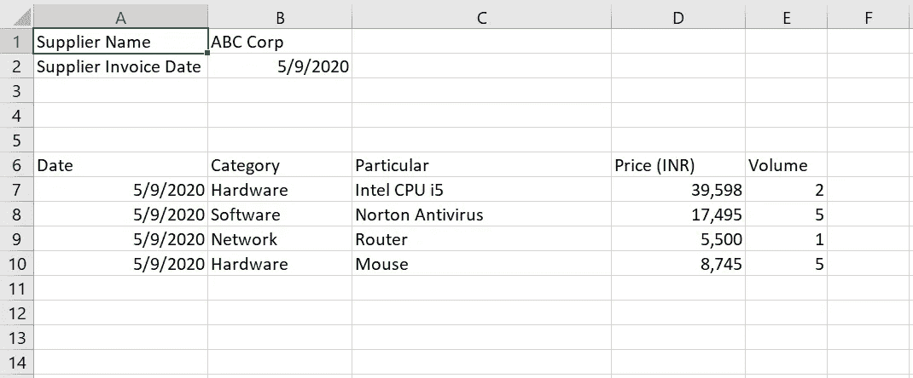

来自供应商-1 的假发票数据

1.  **供应商-2 -** 我们还有另一张来自 XYZ 公司的 excel 格式的发票收据，这里的数据从第 5 行开始，有 6 列。

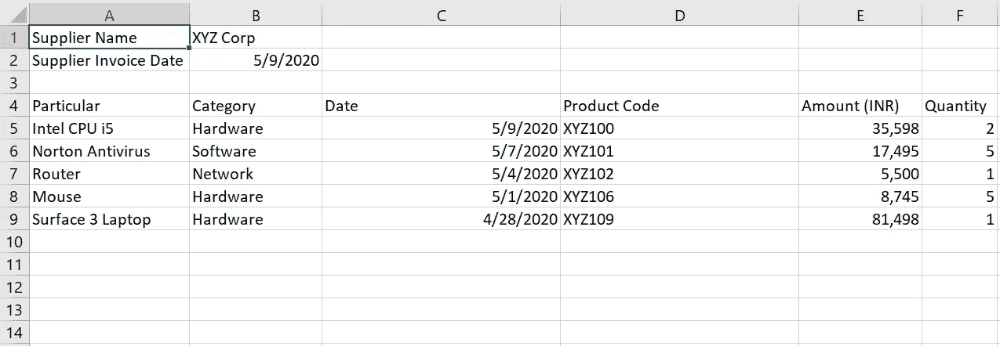

来自供应商-1 的假发票数据

你可以看到这两种数据结构，列顺序，命名规则是不同的。然而，两者都非常干净，在真实的场景中不会这样。

## 测试案例

让我们为这个管道定义我们的测试用例。

*   检查日志中的错误。
*   检查输出文件及其格式(xlsx)。
*   在标准化输出文件中交叉验证来自两家供应商的两个随机发票行项目。

# 步骤 1:项目设置

让我们为我们的项目创建一个框架。我们将创建以下文件夹和文件。我更喜欢将所有与工作相关的东西存放在一个名为 **Work 的普通文件夹中。**

1.  **输入-** 这是我们存储所有供应商文件的地方。我们可以在输入文件夹中创建两个子文件夹，即。**供应商 1** 和**供应商 2** (这是完全可选的)
2.  **输出-** 显然用于存储输出文件。
3.  **元数据-** 这是我们存储文件元数据(关于文件结构的信息)的地方。
4.  **转换-** 这是我们存储转换的地方，我们需要创建三个转换 **ReadInputFiles.ktr，InjectMetadata.ktr** 和**processeachinputfile . ktr**。
5.  **Main.kjb -** 我们的 PDI 作业文件，用于执行第 4 点中提到的所有转换。

所以，结构应该如下图所示。

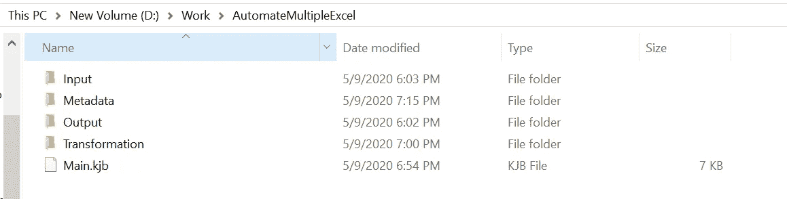

如果你有任何困难理解上述步骤或勺子(桌面应用程序)，然后要求你通过下面的链接。

 [## Pentaho 数据集成(Kettle)中的 PDI 客户端(勺子)是什么？

### 了解勺子- PDI 桌面应用程序的各种功能。拖放 UI 有助于减少…

medium.com](https://medium.com/ai-in-plain-english/what-is-the-pdi-client-spoon-in-pentaho-data-integration-kettle-df65b33879ac) 

# 步骤 2:让我们阅读输入文件

根据这个故事，我们已经阅读了多个文件夹中的多个文件。所以，我们也这样做吧。这个想法是循环遍历每个文件并在每个文件级别执行操作，有意义吗？

1.  我们需要在 Spoon(桌面应用程序)中打开转换 ReadInputFiles.ktr
2.  在**设计**选项卡中，搜索插件/库‘获取文件名’并将其拖到画布上。

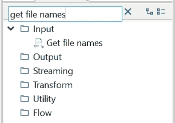

搜索“获取文件名”步骤

现在，双击小部件或右键单击并选择 edit 来添加我们的自定义属性。PDI 给了我们很多配置选项。

*   让我们把步骤名改成‘read _ input _ files’；遵守标准命名约定。
*   我们可以在**文件或目录**选项中浏览或直接粘贴输入文件夹路径(D:\ Work \ automatemuletipleexcel \ Input)。
*   因为我们必须阅读不同供应商的所有文件。我们将使用一个正则表达式。我将详细介绍相同的内容，但这是一种非常强大的文本搜索技术。在我们的**通配符(RegExp)** 字段中，我们将使用正则表达式' **a*。***；这意味着包括所有文本，然后点击**添加**按钮。
*   添加后，我们需要将**包含子文件夹**字段中的布尔值更改为‘Y’。

这个插件会给我们指定目录下的文件夹和文件列表；在我们的例子中**输入**目录。

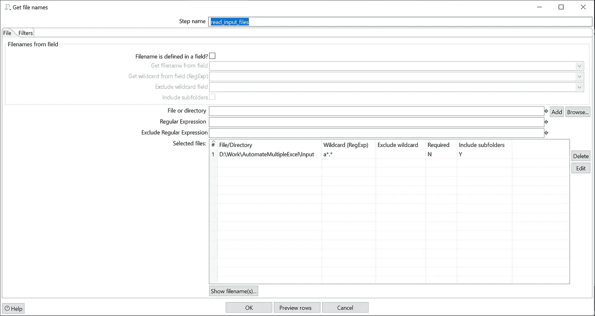

获取文件名配置

让我们通过点击**预览行**按钮来快速检查它是否给出期望的输出。您的预览行应该如下所示。如果匹配，那么您可以点击前几行的**关闭**和该步骤的**确定**来保存更改。

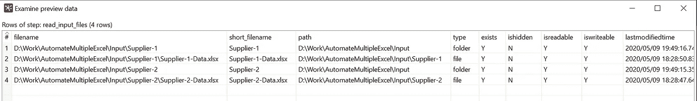

读取输入文件步骤的预览行

正如您可能已经观察到的，我们既可以看到文件，也可以看到文件夹。我们只需要文件进行进一步处理。因此，让我们使用“过滤行”插件进行过滤；再次相同的过程在**设计**选项卡中搜索相同的，双击直接创建跳转。

> PDI 用最好的方式给插件命名，这样就不会有歧义了。

“过滤行”是应用条件逻辑的一个步骤，在我们的例子中，我们只想通过文件而不是文件夹的行。如果您观察我们上一步(获取文件名)的**预览行**输出，PDI 会给我们每行的“类型”列；我们可以用同样的逻辑。

*   我们需要更改名称以匹配我们的命名约定“filter_only_files”
*   我们需要选择“type”列作为第一个变量，然后选择 equals(我们还有许多其他选项)，最后在 value 选项中键入硬编码单词“file ”,如下图所示。

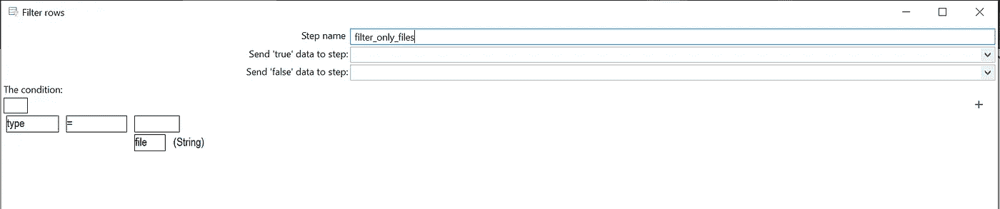

筛选行步骤配置

现在我们有了一个文件名列表，我们需要将它传递给另一个转换，在那里我们将进一步处理相同的内容。

这里，我们需要使用步骤'复制行到结果'插件/步骤来复制内存中的列表。搜索步骤名称并双击该名称。我们不需要添加任何进一步的配置。

我们现在可以保存并执行**单元测试**这个读取文件模块的转换。

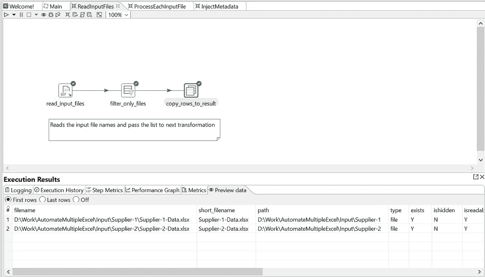

我们的阅读文件转换

# 步骤 3:创建模板

我们需要创建一个空白模板，包含我们想要用于数据操作的所有步骤/插件。因此，对于我们的用例，我们只需要两个步骤，一个是 excel 阅读器，另一个是 excel 编写器。我们需要在这里使用**processeeachinputfile . ktr**文件，并执行以下步骤。

我们将使用“Microsoft Excel input”、“Select value”和“Microsoft Excel writer”插件。

*   让我们将这些步骤分别重命名为 input、rename_and_remove 和 output，而不是 Microsoft Excel input、Select value 和 Microsoft Excel writer。
*   在“Microsoft Excel input”插件中，将**电子表格类型(引擎)**字段中的引擎更改为 **Excel 2007 XLSX (Apache POI)** 。在**附加输出字段**选项卡中，在**短文件名字段**中添加**供应商名称**。

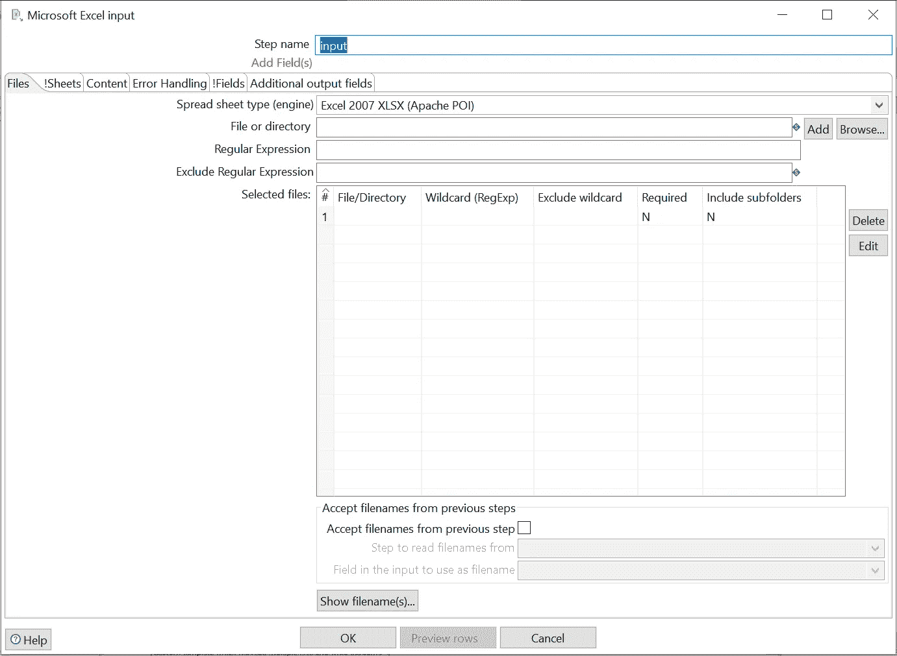

*   在“Microsoft Excel writer”插件和**文件&工作表标签**中，添加输出文件的文件路径(D:\ Work \ automatemulelexcel \ Output \ supplier Output File)，在**扩展名**字段中将扩展名更改为**xlsx【Excel 2007 及以上】**，如果输出文件存在字段，选择**使用现有文件写入**中的**，选择**写入现有文件****
*   在“Microsoft Excel writer”插件和**内容选项卡**中，选择**中的**在写入行**时将现有单元格下移**，勾选**在工作表末尾开始写入(追加行)**并勾选**省略标题**字段。
*   我们不需要触及“选择值”这一步。

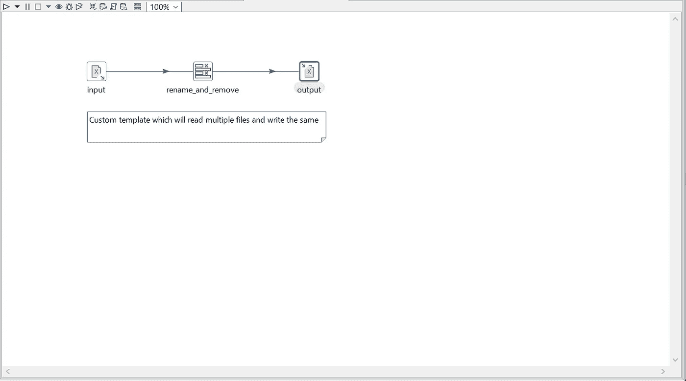

带有核心逻辑的空白模板文件

就这样，我们准备好了模板。我们不需要添加任何额外的属性，我们将在运行时注入文件路径、工作表名称、字段名称等属性。

> 请注意，所有的 PDI 插件都不支持元数据注入。你可以在这里查看支持[的插件/步骤。](https://help.pentaho.com/Documentation/7.1/0L0/0Y0/0K0/ETL_Metadata_Injection/Steps_Supporting_MDI)

# 步骤 4:创建元数据

我们需要创建元数据来读写文件。元数据是“描述其他数据的数据”，例如描述我们的 excel 输入和输出的信息。我们将在一个 excel 文件中存储所有可配置的属性(这也可以从数据库中获得)。

我们将在 Metadata 文件夹中创建 Metadata.xlsx 文件，它有两个选项卡，如下所述。

1.  Master -我们将在此存储所有的主信息，如文件格式起始行、工作表名称等。
2.  source file meta——我们将存储每个源文件的所有字段级信息。这些列与 Microsoft Excel 输入步骤中的**字段**选项卡有些匹配。
3.  TargetFileMeta -我们将存储所有需要的输出字段。

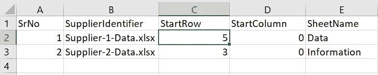

母版页信息

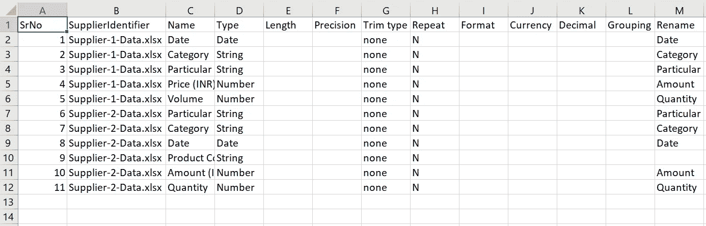

源文件元工作表信息

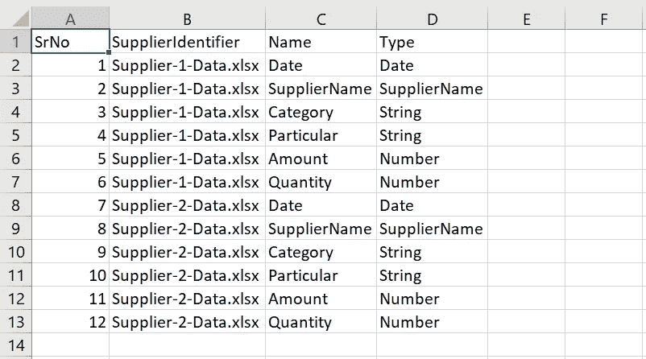

目标文件元工作表信息

> 请注意，PDI 从 0 开始按照行列索引读取文件。因此，我们需要确保元数据信息按照输入文件是正确的。

# 步骤 5:注入元数据

正如在我们的用户故事中提到的，我们将接收多种文件格式，但为了便于工作流维护；我们希望建立一个通用的数据管道来处理所有这样的场景。

在这里，我想介绍一下 PDI **极其强大的功能；ETL 元数据注入**。

元数据注入——顾名思义，将元数据/可配置属性注入到我们的核心逻辑步骤中。本质上，它有助于注入属性，如读取哪些文件(文件名)，从哪里读取(开始和结束行/列)，做什么(操作)，如何保存..如此等等。

我们将使用 InjectMetadata.ktr 文件来注入元信息，如下所示。

*   如果您还记得，我们传递了文件列表，但没有获取它。这里是我们每次获取每个文件信息的地方。因此，我们的第一个插件是“从结果中获取行”。让我们快速地将其重命名，以匹配我们的命名约定“get_file_information”。
*   我们需要添加两个字段，即。从结果中获取行步骤中的文件名和短文件名。

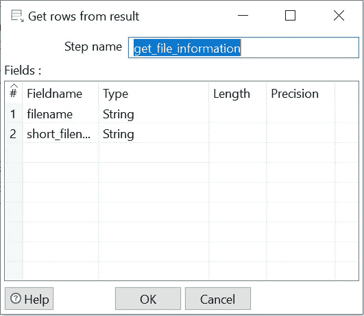

从结果中获取行将从上一步中获取信息

*   我们需要多个“Microsoft Excel 输入”和“连接行”步骤来读取元数据、主数据和输出数据。其思想是在执行过程中只从元数据 Excel 文件中获取相关信息。

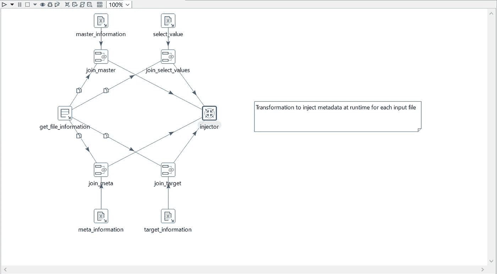

元数据注入器数据管道

*   我们需要在这里连接多跳。请观察跳跃的方向。另外，当从单步连接多跳时会给你下面的警告，请点击**复制**按钮。

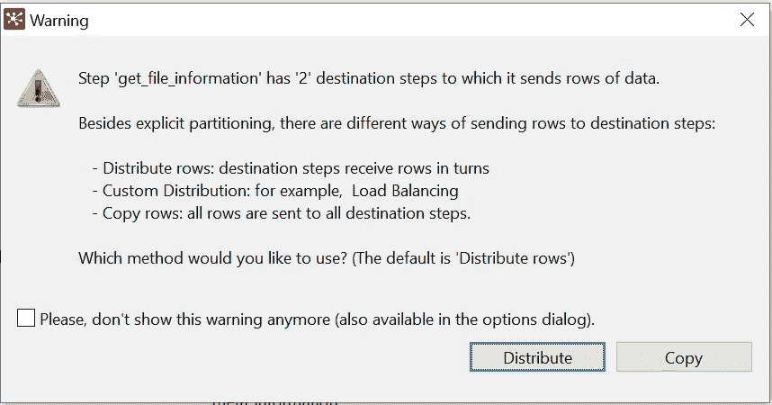

*   在 master_information 步骤中，我们需要在**文件或目录**中浏览 Metadata.xlsx。在**的**页签中，我们需要选择**主**作为我们的**页名**和 **0** 作为我们的**起始行**和**起始列。**在**字段**选项卡中，点击**从标题行获取字段..**按钮。

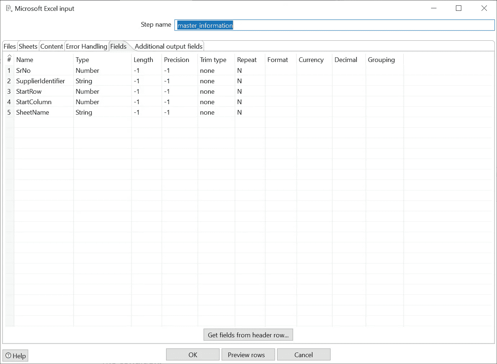

主信息的字段选项卡

*   在 meta_information 和 select_value excel 步骤中，我们需要再次浏览**文件或目录**中的 Metadata.xlsx。在**工作表**页签中，我们需要选择**源文件元数据**作为我们的**工作表名称**，并选择相同的 **0** 作为我们的**开始行**和**开始列。**在**字段**选项卡中，点击**从标题行获取字段..**按钮。

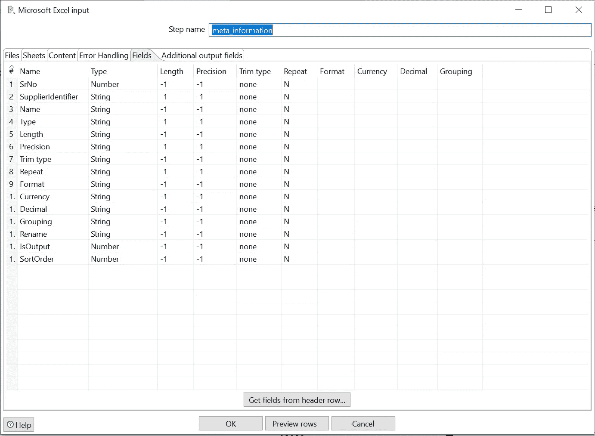

元信息和选择值将具有相同的字段

*   在 target_information excel 步骤中，我们需要再次浏览**文件或**目录中的 Metadata.xlsx。在**工作表**页签中，我们需要选择 **TargetFileMeta** 作为我们的**工作表名称**和相同的 **0** 作为我们的**开始行**和**开始列。**在**字段**选项卡中，点击**从标题行获取字段..**按钮。
*   我们将在所有步骤中使用**Excel 2007 XLSX(Apache POI)**作为我们的引擎。
*   在 **join_meta** 、 **join_select_values** 和 **join_master、**中，我们将添加以下条件。这是为了过滤 Metadata.xlsx 文件中的行。我们使用了 **short_filename** 作为我们的唯一标识符(在现实世界中我们不会得到这样的额外津贴)。

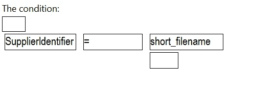

join_meta 和 join_master 联接行步骤条件

*   现在让我们搜索并拖动“ETL 元数据注入”插件到画布上。我们需要浏览我们的模板文件(D:\ Work \ automatemuletipleexcel \ Transformation \ processeeachinputfile . ktr)。
*   它将自动读取我们的模板转换并列出所有可配置的属性。现在，我们只需要用属性映射各自的元数据字段。下面是映射。

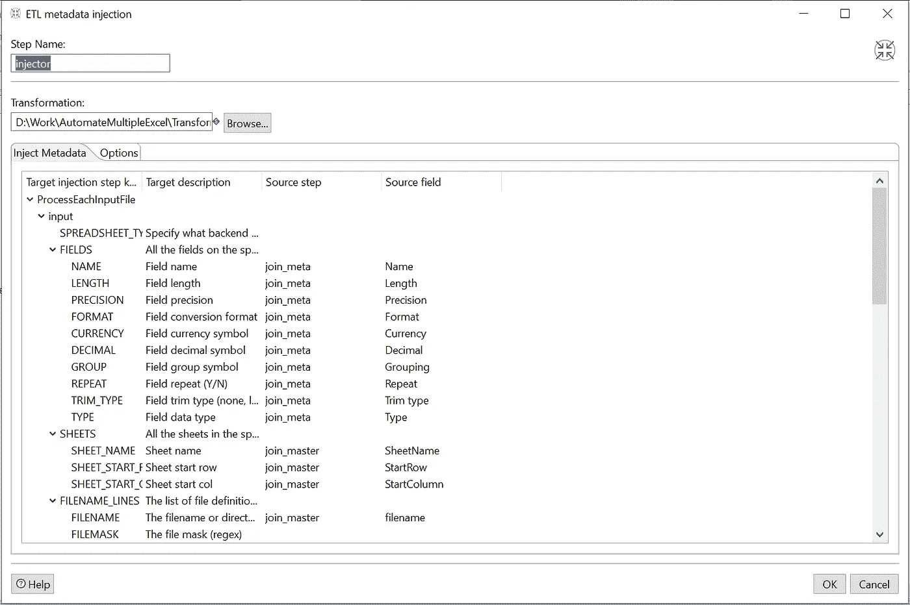

输入步骤映射

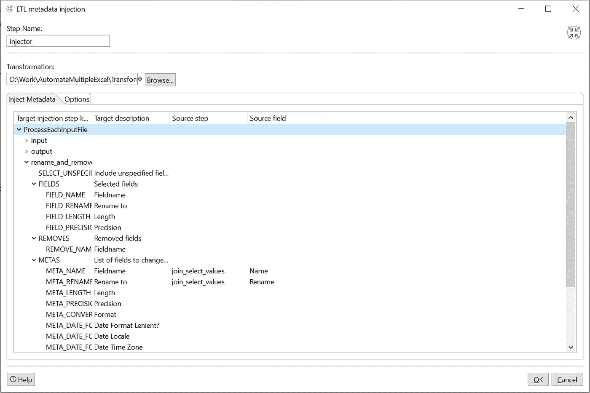

移除并重命名步骤映射

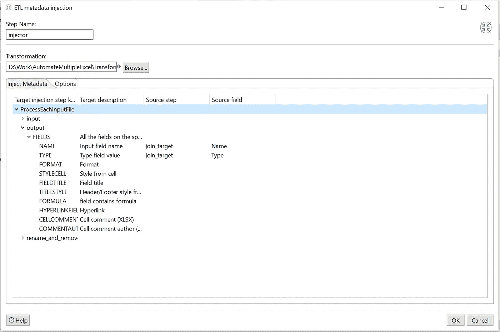

输出步骤映射

这应该是注射器改造。让我们巩固和执行相同的。

# 第六步:连接圆点，创建主循环

最后，我们到了连接各个部分和执行主要工作的最后一步。如上所示，我们将使用一个作业文件(Main.kjb)来做同样的事情。

作业应该总是以名为“开始”的步骤/插件开始，以“成功”步骤结束。让我们用两个“转换”步骤来拖动这些步骤；一个用于 ReadInputFiles.ktr，另一个用于 InjectMetadata.ktr(因为我们已经在 injector 步骤中使用了 ProcessEachInputFile.ktr)。哦是的！我现在可以联系关系了。

*   在第一个转换中，浏览我们的 ReadInputFiles(D:\ Work \ AutomateMultipleExcel \ Transformation \ ReadInputFiles . ktr)转换。
*   在第二个转换中，浏览我们的 inject metadata(D:\ Work \ automatemuletipleexcel \ Transformation \ inject metadata . ktr)转换，并检查**执行每个输入行。**

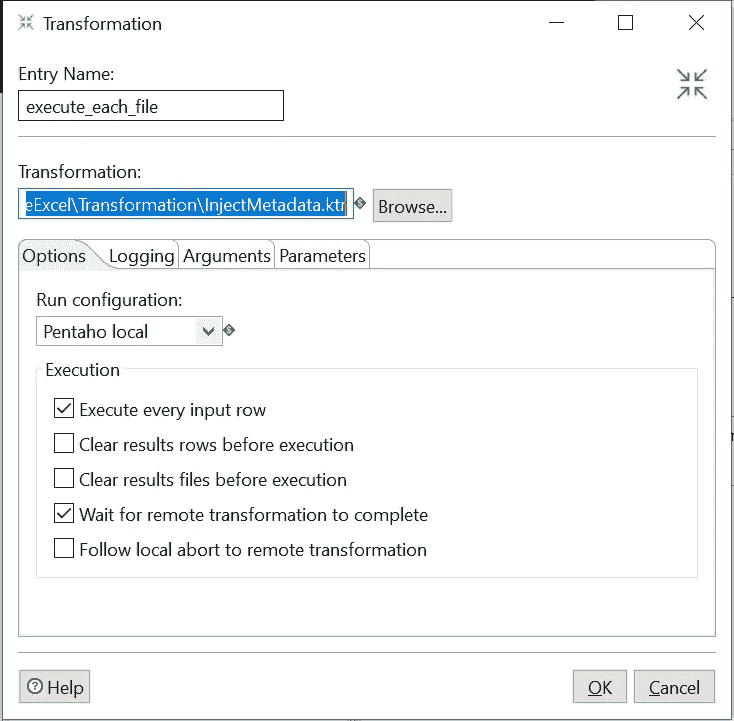

选中执行每个输入行以循环列表

执行每个输入行将为每个文件创建我们的主循环，注入元数据并进行相同的处理。

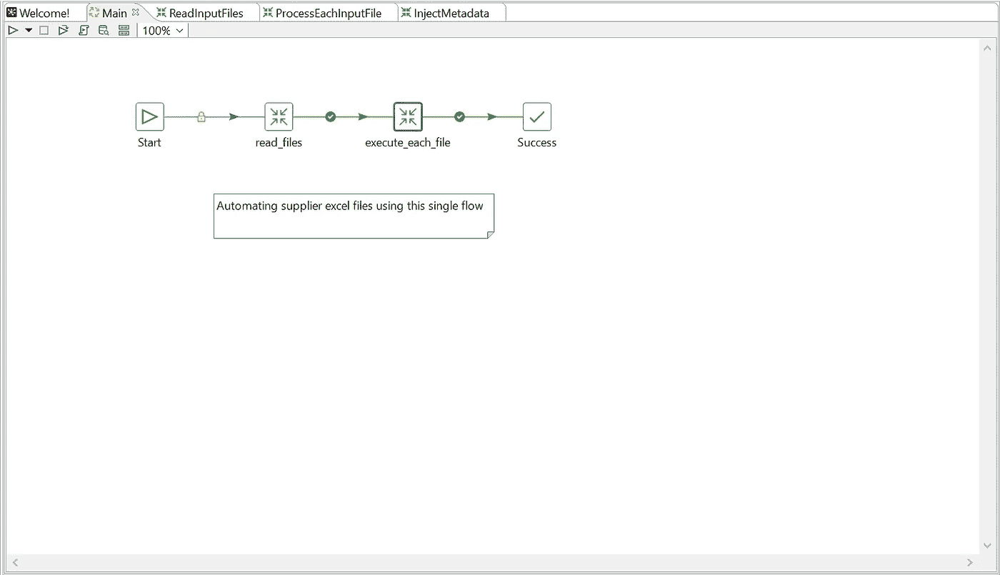

我们的主要工作是读取和执行文件

让我们开始行动，执行我们的数据管道。

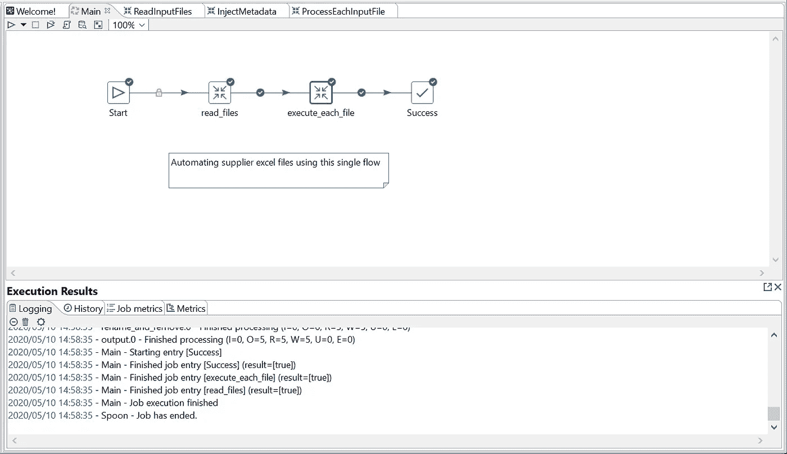

成功

我们现在可以在输出目录中检查我们的文件。让我们使用测试用例来执行测试。

我们现在可以根据我们的要求分析数据。

**结论**

自动化多个 excel 电子表格可能是一项有趣的活动。上述实现并不完美，但将解决我们的问题陈述。我们可以通过添加变量而不是硬编码的值来进一步推广这个管道。我们可以按照我们的要求类似地构建/定制这个管道，接下来我们将从电子邮件用例中下载数据。

# 下一篇文章再见。快乐的 ETL

如果你喜欢类似的内容，那么我会推荐你使用下面的链接订阅。

 [## WryteEx -开发、数据工程、项目管理等

### 我写的博客涉及数据工程、金融、Python、Python Django、项目管理、Web 开发等等

wryteex.com](https://wryteex.com/)