# 如何自动发送电子邮件任务-发送媒体故事到您的列表

> 原文：<https://towardsdatascience.com/how-to-automate-sending-email-task-send-medium-story-to-your-list-2424e68c04ca?source=collection_archive---------43----------------------->

## 使用 PDI，我们可以创建一个发送电子邮件的数据管道。

我读了很多作者的博客，他们都是关于创建一个邮件列表来成功地为你的故事创造一个读者群的。到目前为止，我还没有邮件列表，想有一个。我喜欢向多个接收者发送故事的想法，这可以成为我们数据管道系列的一个很好的用例。

我们将在这个故事中回答“如何”这个问题。现在，有多种方式来做这项活动；您将在下面看到的(使用 [PDI](https://medium.com/ai-in-plain-english/pentaho-data-integration-installation-guide-easy-yet-powerful-etl-tool-80930cff46c6) )不一定是市场上最好的方法。我们可以构建类似的用例，例如发送日志文件、发送通知、发送状态报告等等。


[安德鲁·尼尔](https://unsplash.com/@andrewtneel?utm_source=medium&utm_medium=referral)在 [Unsplash](https://unsplash.com?utm_source=medium&utm_medium=referral) 上拍照

如果你是第一次来 PDI，那么建议你看看下面的故事。

[](https://medium.com/ai-in-plain-english/getting-started-with-pentaho-data-integration-kettle-and-its-components-ef1e71101323) [## Pentaho 数据集成(Kettle)及其组件入门。

### 了解勺子、平底锅、厨房等关键部件将使我们对 PDI 工具有更好的了解

medium.com](https://medium.com/ai-in-plain-english/getting-started-with-pentaho-data-integration-kettle-and-its-components-ef1e71101323) 

# 用户故事——让我们定义我们的用例

这是一个非常简单的用例，下面是我们的故事。

1.  我想阅读多个带有最新博客和电子邮件列表的 CSV 文件。
2.  我想合并这些 CSV 文件并创建一个单独的数据框。
3.  我想给每个收件人分别发邮件。我想将变量传递给子作业。

最简单的用例

# 输入数据

执行此活动需要两种类型的数据。一个是我们的邮件列表主。第二，我们要求的是我们最近的博文[的网址](/how-to-automate-excels-received-on-email-increase-your-productivity-3d2f50ddc958)；我们想发送到电子邮件列表。同样，我们可以使用 RSS 提要服务获取这些信息。我会为此写一个单独的博客。

用下面提到的数据创建两个 CSV“EmailList”和“LatestPost”。

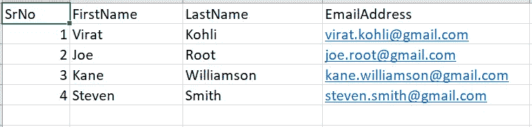

样本 CSV 和我们的邮件列表

> 请注意，这些都是顶级板球运动员，我用了假的电子邮件地址。这些人不在我的邮件列表中。

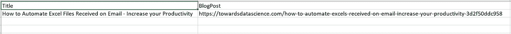

最新博客文章的链接和标题

# 测试案例

我更喜欢在构建数据管道之前定义我的测试用例。我强烈建议你也这样做。

*   测试向自己发送电子邮件
*   再次交叉验证内容和收件人详细信息

# 步骤 1:项目设置

像我以前所有的故事一样。我首先设置了项目文件夹，以匹配正确的命名约定。这有助于标准化过程，并最小化其他开发人员的学习曲线。

这里，我们需要输入、输出、转换文件夹。我们将为各种活动创建多个转换。

我们需要下面提到的结构。正如我所提到的，我更喜欢将所有与工作相关的东西存储在一个位置'**Work '**；帮助维护备份。(D:\Work\SendEmail)。

1.  **输入-** 这是我们下载报表的地方。
2.  **输出** -存储我们的输出文件
3.  这是我们将配置和集成多个转换的地方，用于遍历我们的邮件列表。
4.  在转换文件夹中，我们将创建这些文件。请注意，ReadFiles 是一个转换文件，SendEmail 是一个作业文件。

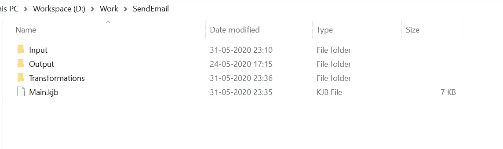

项目文件夹结构

# 第 2 步读取文件

我们需要在一个转换中读取两个工作表。这个想法是阅读整个邮件列表，遍历每个成员，并发送一封带有自定义消息的电子邮件。

打开勺子上的 transformation ReadFile.ktr(桌面应用)。我们需要在这个转换中读取输入文件。

我们需要执行下面提到的步骤。

1.  通过右键单击“新建注释”，为转换添加描述。文档在任何编程语言中都是非常重要的。
2.  将两个“文本文件输入”，一个“连接行(笛卡尔乘积)”和“将行复制到结果”插件从转换设计选项卡拖到画布上。
3.  分别重命名相同的“read_email_list”(文本输入 1)、“read_latest_post”(文本输入 1)、“merge”和“copy_result”。
4.  在 read_email_list 步骤中，在**文件或目录**字段和**文件**选项卡中浏览文件(D:\ Work \ send email \ Input \ email list . CSV)，在**内容**选项卡中，将**分隔符**字段改为逗号而不是半逗号，在字段选项卡中只需点击**获取字段**按钮。
5.  同样，在 read_latest_post 步骤中，在**文件或目录**字段和**文件**选项卡中浏览文件(D:\ Work \ send email \ Input \ latest post . CSV)，在**内容**选项卡中，将**分隔符**字段改为逗号而不是半逗号，在字段选项卡中只需点击**获取字段**按钮。
6.  就是这样，join rows 步骤将在不改变任何参数的情况下发挥它的魔力。这里，我想展示使用 join rows step 无缝合并两个文件的能力。如果需要，我们也可以提供条件。

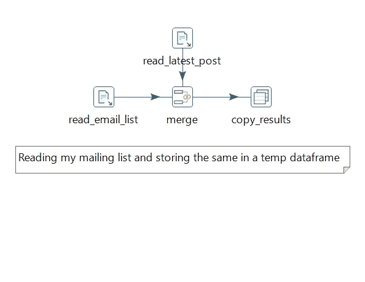

ReadFile 转换结构

我们可以通过运行转换和预览输出来测试这个单元。

# 步骤 3 传递变量

我们需要将变量传递给我们的子作业，以便逐个发送电子邮件。这将要求我们在配置 SendEmail 子作业文件之前设置父主作业文件。

在 PDI，传递变量是一个简单的过程。如果我们以“将行复制到结果”结束转换，那么在接下来的转换中，我们所有的变量都是可访问的。然而，我们将在作业级别以不同的方式传递变量。

我们需要执行下面的步骤来传递变量。

1.  在 Main.kjb 文件中，我们需要拖动'开始'，'转换'，'作业'和'成功'步骤。
2.  根据我们的命名惯例，将这些步骤重命名为“开始”、“读取文件”、“发送电子邮件”和“成功”。
3.  我们需要分别在 read_files 和 send_email 步骤中浏览我们的转换文件。
4.  在 send_email 作业步骤中，我们需要检查**选项**选项卡中的**执行每个输入行**字段。
5.  在**参数**选项卡中，我们需要添加四个参数，即。名字、电子邮件地址、头衔和博客帖子。现在，所有这些名称都应该与我们的输入文件字段相匹配。

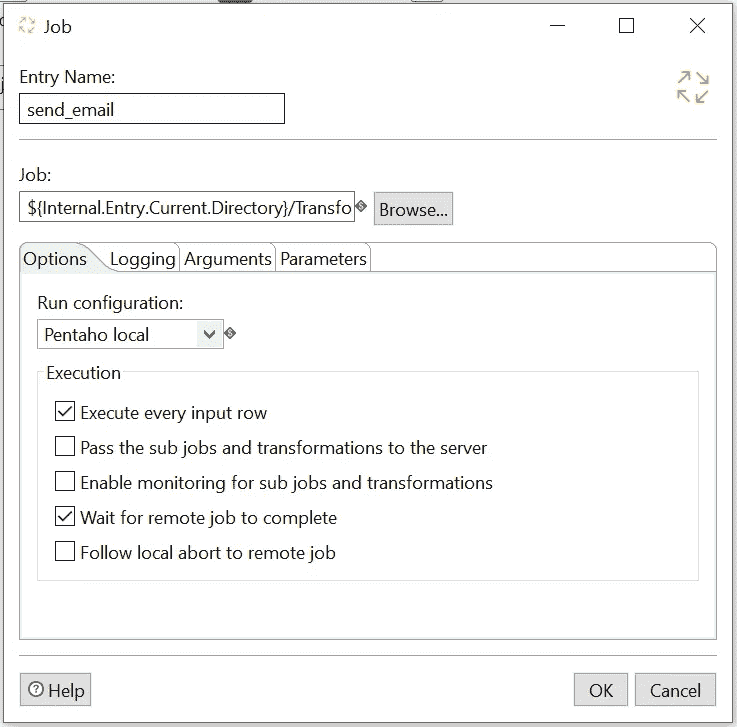

点击执行每一个输入行来循环列表

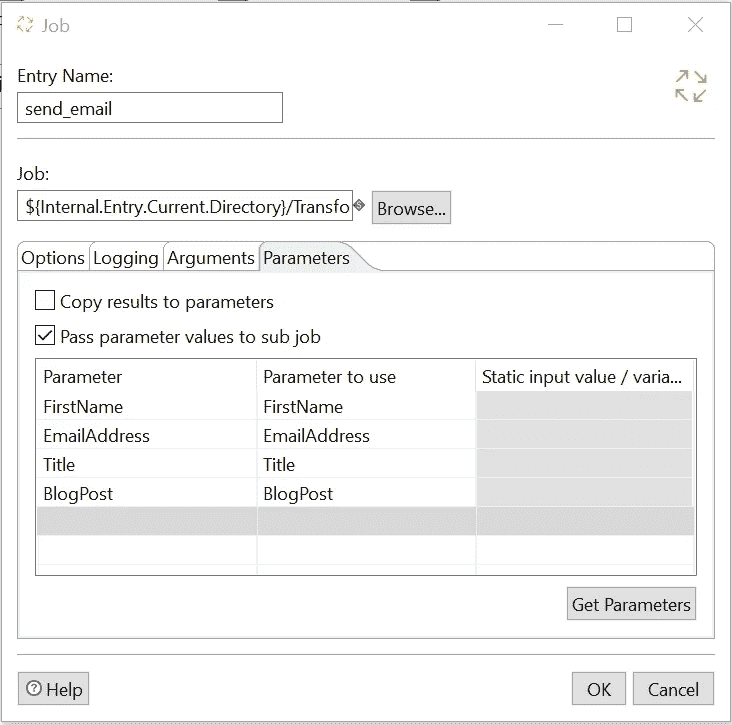

我们希望在子作业发送电子邮件中传递的参数/变量。

现在，我们需要获取子/子作业中的值。下面是步骤。

打开 SendEmail.kjb 文件，双击画布。Spoon 将打开作业属性窗口。我们还需要在**参数**选项卡中添加相同的字段。

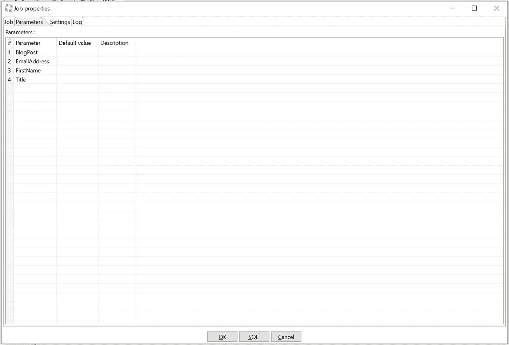

作业属性的参数选项卡

# 发送电子邮件

我们现在可以设置和发送自定义电子邮件到我们的邮件列表。我们需要[开放认证(OAuth)](https://docs.servicenow.com/bundle/orlando-servicenow-platform/page/administer/notification/concept/c_OAuthEmailAuthentication.html) 来发送电子邮件。要在您的 Gmail 帐户上设置 OAuth，请参考下面的故事- **步骤 2**；我不会在这篇文章中重复整个过程。

[](/how-to-automate-excels-received-on-email-increase-your-productivity-3d2f50ddc958) [## 如何自动接收电子邮件中的 Excel 文件-提高您的工作效率

### 从电子邮件下载文件并按照我们的要求进行处理的逐步指南

towardsdatascience.com](/how-to-automate-excels-received-on-email-increase-your-productivity-3d2f50ddc958) 

让我们快速设置我们的 SendEmail 作业。

1.  添加作业文件的描述。在这里，我们将使用该作业文件发送电子邮件。
2.  从“设计”标签的插件列表中拖动“开始”、“邮件”和“成功”。
3.  根据我们的命名惯例，分别为 start、email 和 success 进行重命名。
4.  在电子邮件步骤中，我们需要配置下面提到的属性。

*   在**目的地址**字段中，我们需要使用变量${EmailAddress},它是从我们之前的转换和父作业中传递过来的。
*   在**发件人姓名和地址**字段，我们需要提供发件人的姓名和电子邮件地址；即我们的信息。
*   在**服务器**选项卡中，我们需要提供 OAuth 信息进行认证。这是一个外发服务器，我们需要 [SMTP 细节](https://www.siteground.com/kb/google_free_smtp_server/)而不是 IMAP。
*   在**电子邮件消息**选项卡中，我们需要选中“在邮件正文中使用 HTML 格式”，在消息部分，我们的主题字段将是${Title},并为邮件正文编写您的自定义消息。下面我用过。

```
Hi ${FirstName},I have published a new blog on Medium. Here's link. ${BlogPost}I hope you like it. Please feel free to provide your suggestions. Thanks,
Shravankumar Suvarna
```

> 看，我们如何在多个领域使用变量。PDI 不支持在所有字段中使用变量。关键是在田地旁边寻找一个蓝色的小美元标志。如果它存在，那么它接受或者不接受。

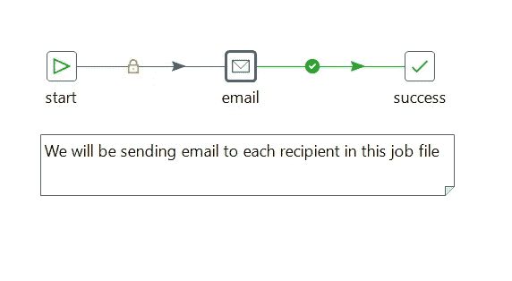

发送电子邮件作业流程

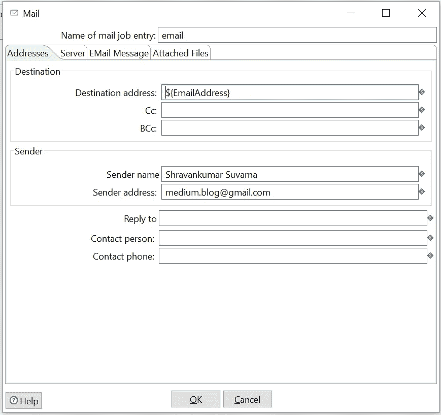

在目的地址中使用变量

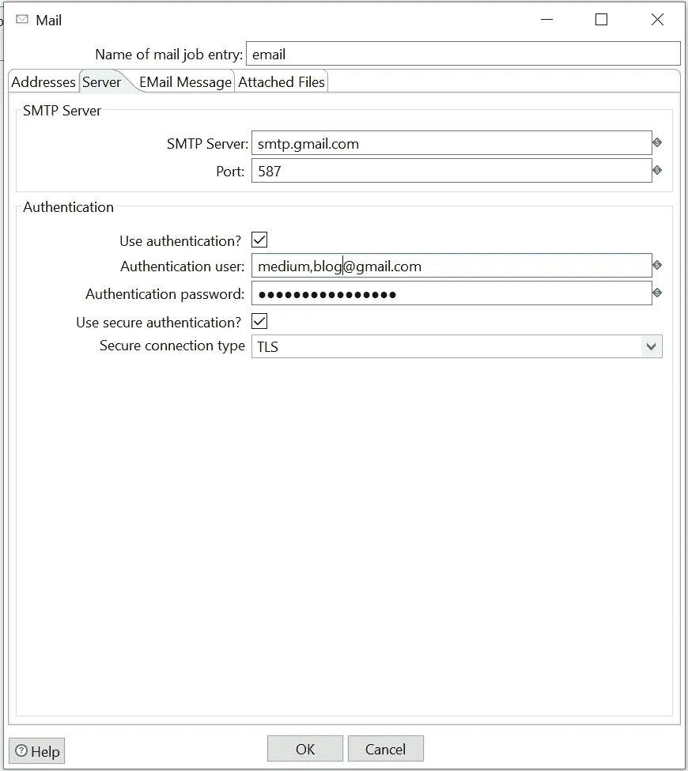

要验证的 OAuth 详细信息。请注意，medium.blog@gmail.com 是一个虚拟的电子邮件地址。

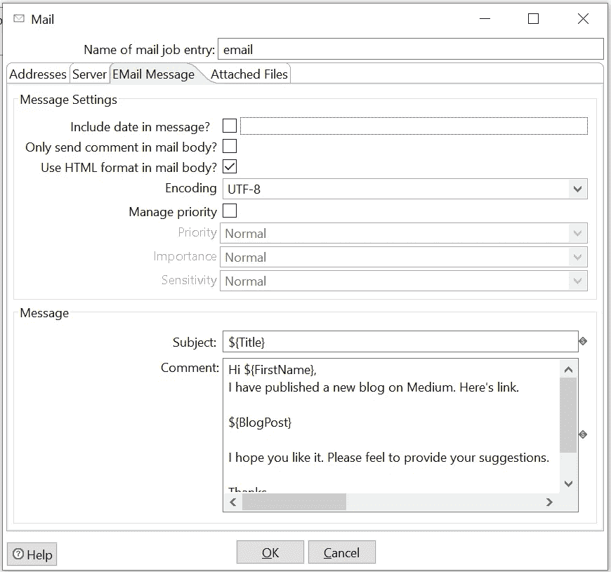

电子邮件选项卡—检查字段旁边的小美元符号

就这样，我们应该可以使用我们的自动化管道了。我们现在可以运行我们的主作业文件，并使用我们的测试用例对其进行测试。

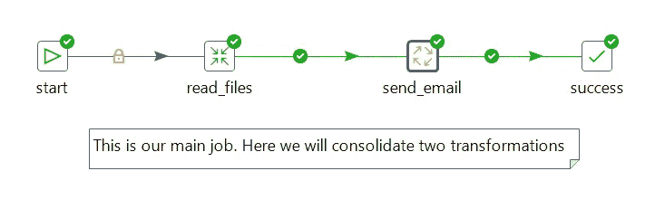

成功

**结论**

这是最简单的数据管道。这里，我们的想法不是使用这种方法将博客发送到邮件列表，而是根据我们的方便使用这个案例研究。我们可以构建类似的管道来发送日志文件、状态报告等。因为我们的大部分管道将在服务器上运行。这将是一个很好的功能，包括来自作业/转换管道的实时状态报告。

如果你喜欢类似的内容，那么我会推荐你使用下面的链接订阅。

[](https://wryteex.com/) [## WryteEx -开发、数据工程、项目管理等

### 我写的博客涉及数据工程、金融、Python、Python Django、项目管理、Web 开发等等

wryteex.com](https://wryteex.com/) 

欢迎在评论区提问。

# 下一篇文章再见。快乐的 ETL